# Topic #1: Advanced Programming Concepts

## Type annotations

**What is it ?**

Type annotations specify which type a variable is.

It‘s **optional**, but **very useful**!

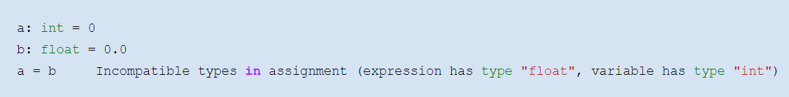

What is it good for ?

PEP 484 – Type Hints \(29\-Sep\-2014\):

 _“This _   _PEP aims to provide a standard syntax for type annotations\, opening up Python code to easier static analysis and refactoring\, potential runtime type checking\, and \(perhaps\, in some contexts\) code generation utilizing type information_   _\._ 

 _Of _   _these goals\, static analysis is the most important\. This includes support for off\-line type checkers such as _   _mypy_   _\, as well as providing a standard notation that can be used by IDEs for code completion and refactoring_   _\._ 

 _\[…\]_ 

 _It _   _should also be emphasized that Python will remain a dynamically typed language\, and the authors have no desire to ever make type hints mandatory\, even by convention_   _\.”_ 

David’s redefinition:

It is a part of your automatic documentation  \(like with meaningful variable names\)\. If another person gets your source code they understand it easier\.

Your editor might thank you \. Do to some new features in Python 3\.10\, the modern editors that do syntax highlighting and error checking have a harder time to infer what you mean\. The more it need to think about what you mean\, the slower your editor might get or even fail to show you syntax highlighting\.

Static  code analysis is really helpful \. It showed me any problems ahead that I would have figured out the hard way otherwise\.

Packages like the just\-in\-time compiler numba  can produce better results  if you can tell it what the variables are\.

When and how do we do it ?

…mostly when we introduce new variables or define functions or classes:

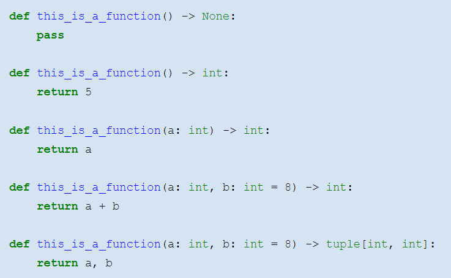

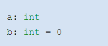

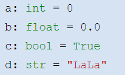

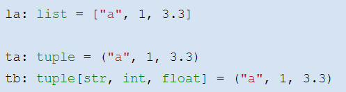

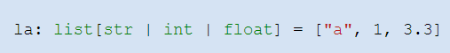

Variables with different types:

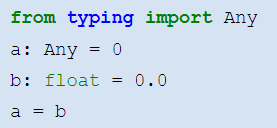

…could also be explicit list with ‚or‘ separators…

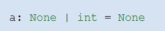

Functions \, more complex types …

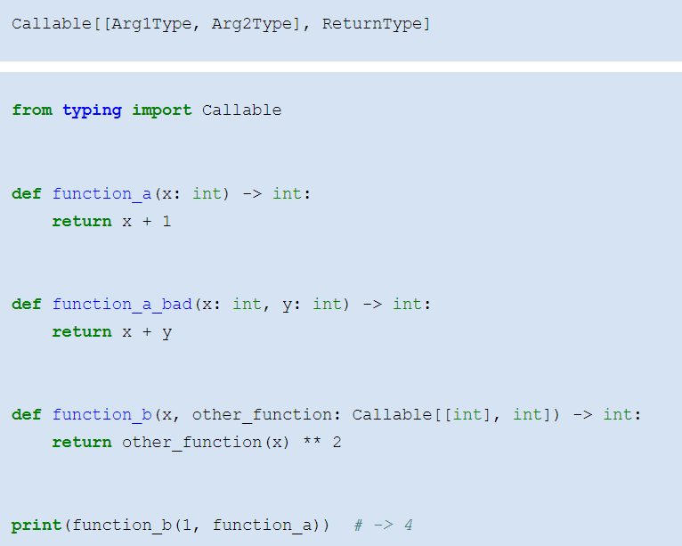

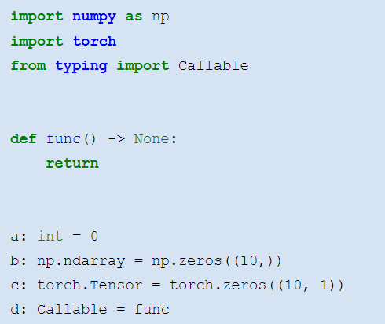

 More   information   : 

[https://davrot\.github\.io/pytutorial/python\_basics/python\_typing](https://davrot.github.io/pytutorial/python_basics/python_typing/)[/](https://davrot.github.io/pytutorial/python_basics/python_typing/)

What is a class ?

A class is a  container for data   \(   attributes   \)  and  functions   \(   methods   \)  \. They bundle properties of ‚objects‘ and actions that can be performed with/on them\.

Classes help to  modularize and organize your code    even more than functions\.

 Class   hierarchies    are useful for re\-using code which is common for different ‚objects‘

 Dataclasses    are specific classes in Python intended to represent data that ‚belongs together‘\.

Vehicle :

wheels :  int

speed :  float

accelerate \( speed :  float \)

stop \(\)

Bus\( Vehicle \):

passengers :  int

routenr :  int

intake :  float

board \( nrpass :  int \)

Car\( Vehicle \):

passengers :  int

board \( nrpass :  int \)

Truck\( Vehicle \):

company :  str

weight :  float

load \( weight :  float \)

 _parent_   _ _   _class_   _ / _   _superclass_ 

wheels :  int

speed :  float

passengers :  int

litres :  float

kwh :  float

accelerate \( speed :  float \)

stop \(\)

board \( nrpass :  int \)

fill \( litres :  float \)

charge \( kwh :  float \)

Electric \(Car\):

kwh :  float

charge \( kwh :  float \)

Petrol\(Car\):

litres :  float

fill \( litres :  float \)

 _child_   _ _   _class_   _ / _   _subclass_ 

Hybrid\(Petrol\, Electric \):

b\) Including and setting attributes \(variables\):

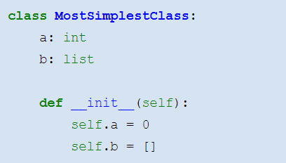

 please     don‘t     initialize   in   attribute     section   \! 

a\) Defining and instantiating a class:

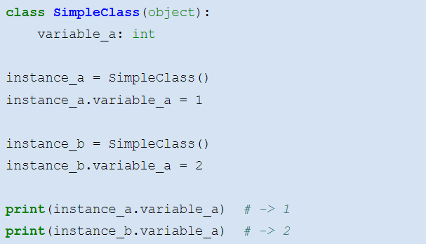

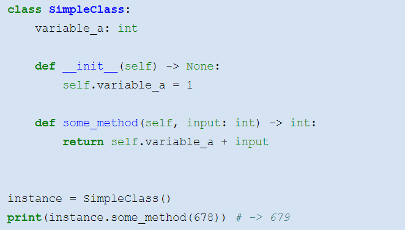

c\) Including and using methods \(functions\):

c\) multiple inheritance

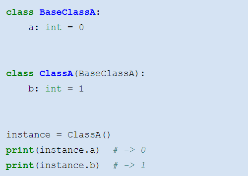

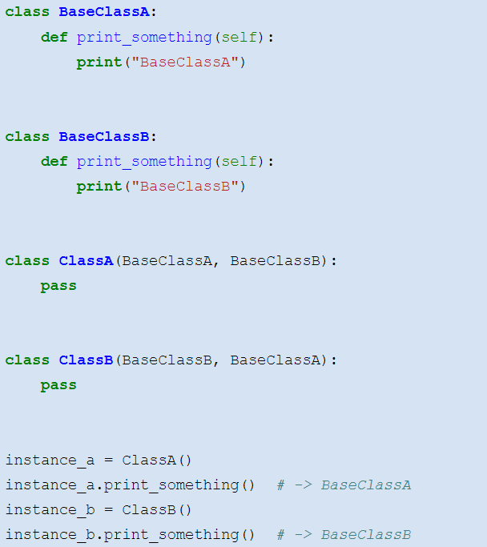

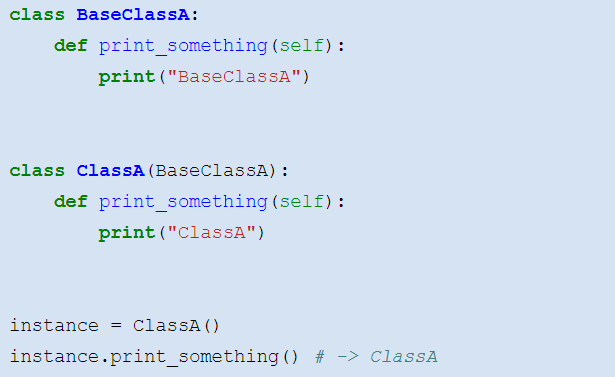

There are special methods for certain purposes:

 \_\_   init   \_\_:  called always when a class is instantiated\. Good for initalizing and setting up a meaningful state for a class instance\.

 \_\_   str   \_\_:  called by  str   \(object\)  and the built\-in functions  format\(\)  and  print\(\)  to compute the “informal” or nicely printable string representation of an object\. See also  \_\_   repr   \_\_  for the built\-in function  repr   \(\)  \.

 super\(\):  refers to the parent class\. Good to call functions from that class\. Example:

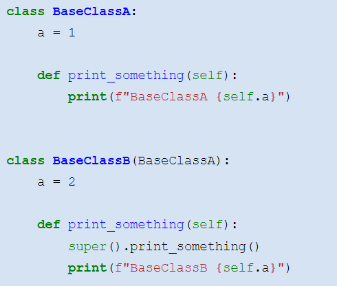

 More   information   : 

[https://davrot\.github\.io/pytutorial/python\_basics/class](https://davrot.github.io/pytutorial/python_basics/class/) [/](https://davrot.github.io/pytutorial/python_basics/class/)

The dat a class is very similar to normal classes\, but it requires type annotations thus serving a good programming style\. You have to  import from dataclasses    and use a decorator  @   dataclass    when you define a dataclass:

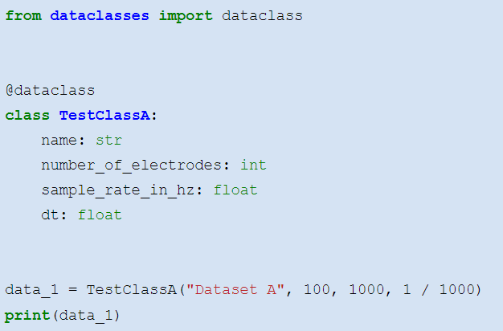

 there   will   be   an   error     without     these     annotations   \! 

A dataclass has an automatic \_\_ init \_\_\(\) method which can be used to populate the attributes …

Further Features I

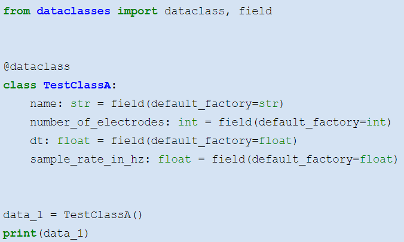

 default\_factory  can be used to specify automatic generation of default values\.

TestClassA\(name=''\, number\_of\_electrodes=0\, dt=0\.0\, sample\_rate\_in\_hz=0\.0\)

Further Features I

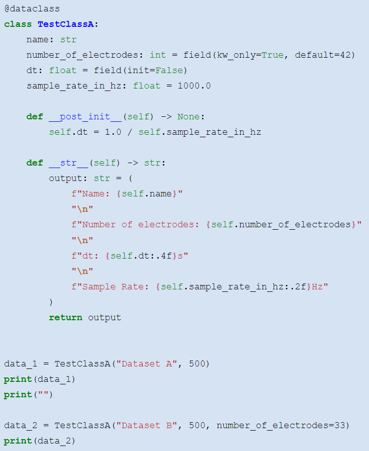

defaults   can  also  be   specified  in  the   class   definiton  \( please  do not do  this   to   mutables \!\)

attributes   can   be   spared   from   initialization

attributes   can   explicitly   be   specified   as   keywords

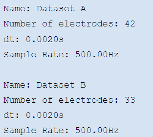

 \_\_   post\_init   \_\_\(\)  if you have to do some init of your own…

 \_\_   str   \_\_\(\)  for a nice printout\!

Why dataclasses ?

putting data together into meaningful containers…

appropriate type handling…

versatile and safe initialization methods…

makes comparing data sets easy…\!

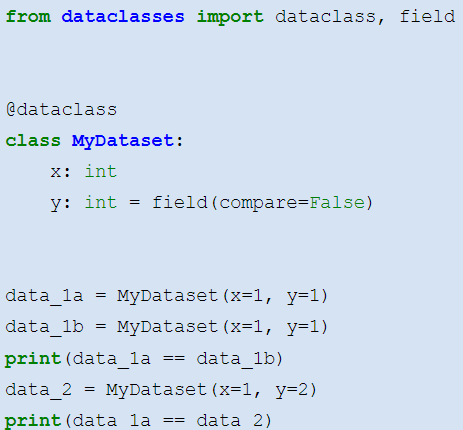

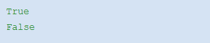

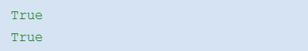

… compare everything

 More   information   : 

[https://davrot\.github\.io/pytutorial/python\_basics/dataclass](https://davrot.github.io/pytutorial/python_basics/dataclass/)[/](https://davrot.github.io/pytutorial/python_basics/dataclass/)

 Catch   me if you can   \! 

syntax errors

logical errors

data inconsistencies

exceptions

inadequate usage or user input

…

Assert checks if a condition is true\. If not\, it issues and error and stops program execution\. Example:

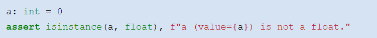

Use it often to make your code safe to use\, or to discover inconsistencies in input data\!

import  numpy  as  np

def  solve\_quadratic \( a :  float \,  b :  float \,  c :  float \) \->  tuple \[ float \,  float \]:

 assert  isinstance \( a \,  float \)\,  " argument  'a' must  be   float \!"

 assert  isinstance \( b \,  float \)\,  " argument  'b' must  be   float \!"

 assert  isinstance \( c \,  float \)\,  " argument  'c' must  be   float \!"

 assert  a  \!=  0 \,  " argument  a must  be  non\-zero\,  otherwise   it's  not a  quadratic   equation \!"

 sqrt\_arg  =  \- 4 \* a \* c \+ b \*\* 2

 assert  sqrt\_arg  >=  0 \,  " root   argument  must  be  positive  for  non\- imaginary   solutions \!"

 x1  = \( \+ np \. sqrt \( \- 4 \* a \* c \+ b \*\* 2 \) \- b \) / 2 \* a

 x2  = \( \- np \. sqrt \( \- 4 \* a \* c \+ b \*\* 2 \) \- b \) / 2 \* a

 return  x1 \,  x2

import  numpy  as  np

def  solve\_quadratic \( a :  float \,  b :  float \,  c :  float \) \->  tuple \[ float \,  float \]:

 x1  = \( \+ np \. sqrt \( \- 4 \* a \* c \+ b \*\* 2 \) \- b \) / 2 \* a

 x2  = \( \- np \. sqrt \( \- 4 \* a \* c \+ b \*\* 2 \) \- b \) / 2 \* a

 return  x1 \,  x2

solve\_quadratic \( "A" \,  "B" \,  "C" \)

---

Assert is better than if and exception thrown by hand, since ist shorter and ist immediately clear without adding a comment that some checking is performed…

Try … Except … Else … Finally …

Errors need not terminate your program\. Each error raises an exception\, and you can catch that exception and handle it properly\!

Example for different exceptions …

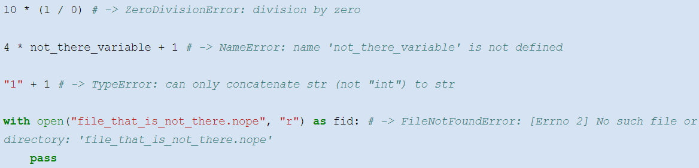

… and example for handling an exception nicely :

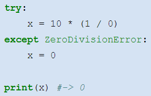

try this piece of code…

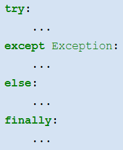

i  in  range \( n\_files \):

 try :

\# open file\[i\] for read

\# read neural activity into temp array

\# normalize temp array by its sum

 except  OSError :

\# assign None to data\[i\]

 else :

\# assign temp array to data\[i\] 

 finally :

\# close file if open

print \( "Successfully read existing data files\.\.\." \)

… if the specified exception occurred \, execute this piece of code \(‚ error handling ‘\) …

… otherwise \, execute this piece of code\. You can put code here which runs only correctly when the exception did not occur…

… in any case \, execute this piece of code\, irrespectively of errors having occurred/not occurred \(‚clean\- up ‘\) \. When an unhandled exception occurred\, execution stop after this code\!

 division     by     zero     occurs   \! 

 everything is   okay\! 

 file     does   not   exist   \,   or     is     corrupt   \! 

General form\, example :

i  in  range \( n\_files \):

 try :

\# open file\[i\] for read

\# read neural activity into temp array

\# normalize temp array by its sum

 except  OSError :

\# assign None to data\[i\]

 else :

\# assign temp array to data\[i\] 

 finally :

\# close file if open

print \( "Successfully read existing data files\.\.\." \)

Possible exceptions …

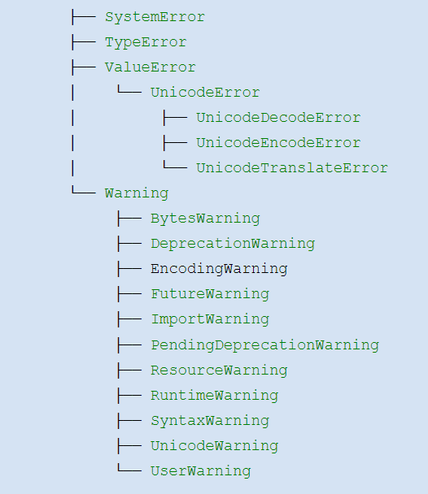

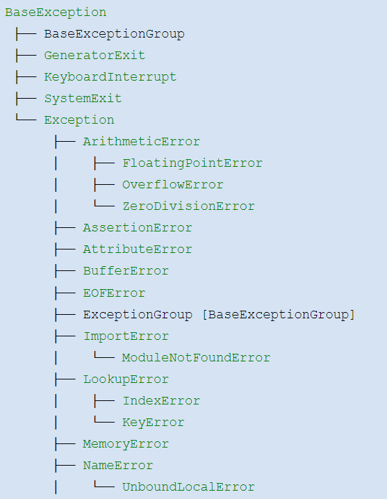

…and you can define your own\!

Exceptions have associated information in their attributes

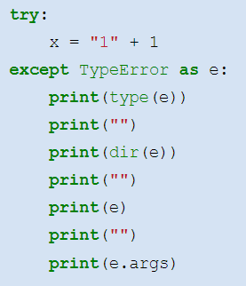

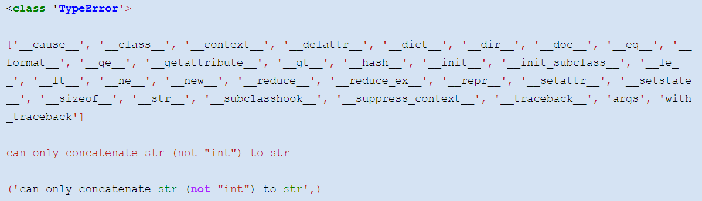

Raising exceptions

…or a newly defined exception …

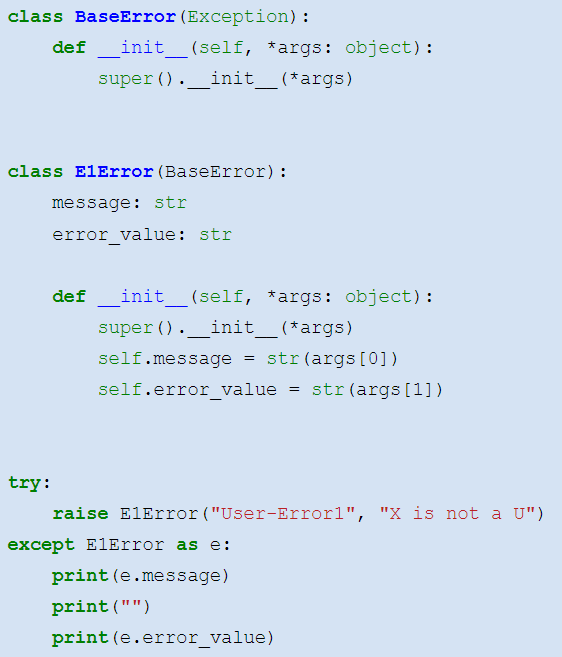

When you determine that something goes wrong\, you can yourself raise an exception…

…either a matching \, predefined one

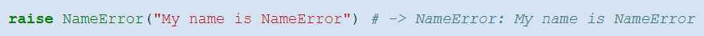

 Using the debugger 

The VSCode debugger lets you follow\, monitor\, and manipulate the execution of program code…

Examples of actions possible :

step over\, step in\, step out

continue

breakpoints\, conditional breakpoints\, function breakpoints

inspection and change of variables

monitoring

…

 Interactive   demonstration   … 

 More   information   : 

[https://davrot\.github\.io/pytutorial/workflow/vscode\_debug](https://davrot.github.io/pytutorial/workflow/vscode_debug/) [/](https://davrot.github.io/pytutorial/workflow/vscode_debug/)

[https://davrot\.github\.io/pytutorial/python\_basics/exceptions](https://davrot.github.io/pytutorial/python_basics/exceptions/) [/](https://davrot.github.io/pytutorial/python_basics/exceptions/)

[https://davrot\.github\.io/pytutorial/python\_basics/assert](https://davrot.github.io/pytutorial/python_basics/assert/) [/](https://davrot.github.io/pytutorial/python_basics/assert/)

