 __Topic \#2__    __Numerical__    __ __    __analysis__    __ __    __and__    __ __    __symbolic__    __ __    __computation__ 

__What__  __ __  __is__  __ __  __it__  __?__

Numerical analysis

Symbolic computation

__Which__  __ __  __tools__  __ __  __can__  __ __  __we__  __ __  __use__  __?__

 scipy

 sympy

__Background __  __info__  __ – __  __David‘s__  __ __  __compendium__  __ __  __reloaded__  __\!__

[https://davrot\.github\.io/pytutorial](https://davrot.github.io/pytutorial/)[/](https://davrot.github.io/pytutorial/)

__Topics:__

Sympy

Numerical Integration\, Differentiation\, and Differential Equations

__Which__  __ __  __mathematical__  __ __  __problems__  __ __  __are__  __ __  __we__  __ __  __interested__  __ in?__

Solving equations \(only symbolic\)

Integrals over functions

Derivatives of functions

Solving differential equations

__Numerical__  __ __  __solutions__  __ will \(__  __almost__  __\) __  __always__  __ __  __be__  __ __  __approximations__  __\! __

Precision is limited

Range is limited

Algorithm is approximating

Errors can accumulate dramatically \(stability of algorithms\)

__Examples__  __ __  __of__  __ __  __errors__  __:__

Multiplication\, one decimal place: 2\.5 \* 2\.5 = 6\.25

Addition\, 8\-bit unsigned int: 200\+200 = 400

Euler integration of ODE    __\(__    __ Whiteboard\)__ 

 __Integrals __    __over__    __ __    __functions__    __ \(‚__    __quadrature__    __‘\)__ 

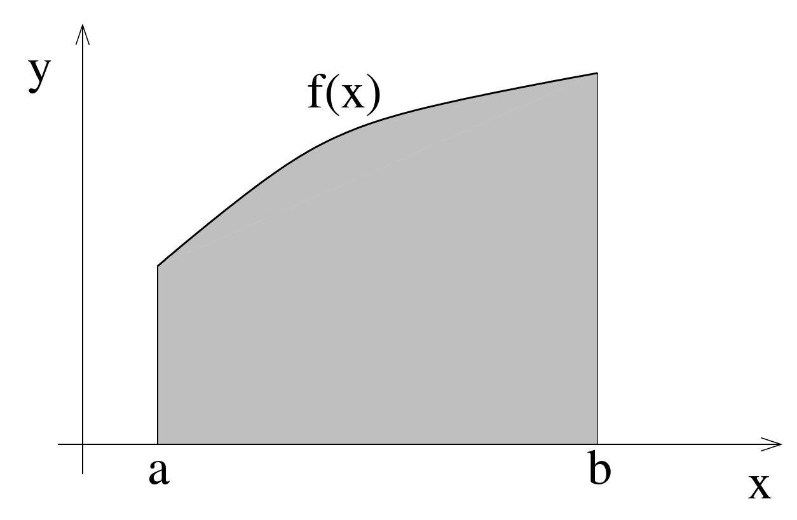

__Numerical__  __ __  __methods__

Integral = area under curve

Approximate area by many small boxes\, e\.g\. by  _midpoint_  _ _  _rule_ :

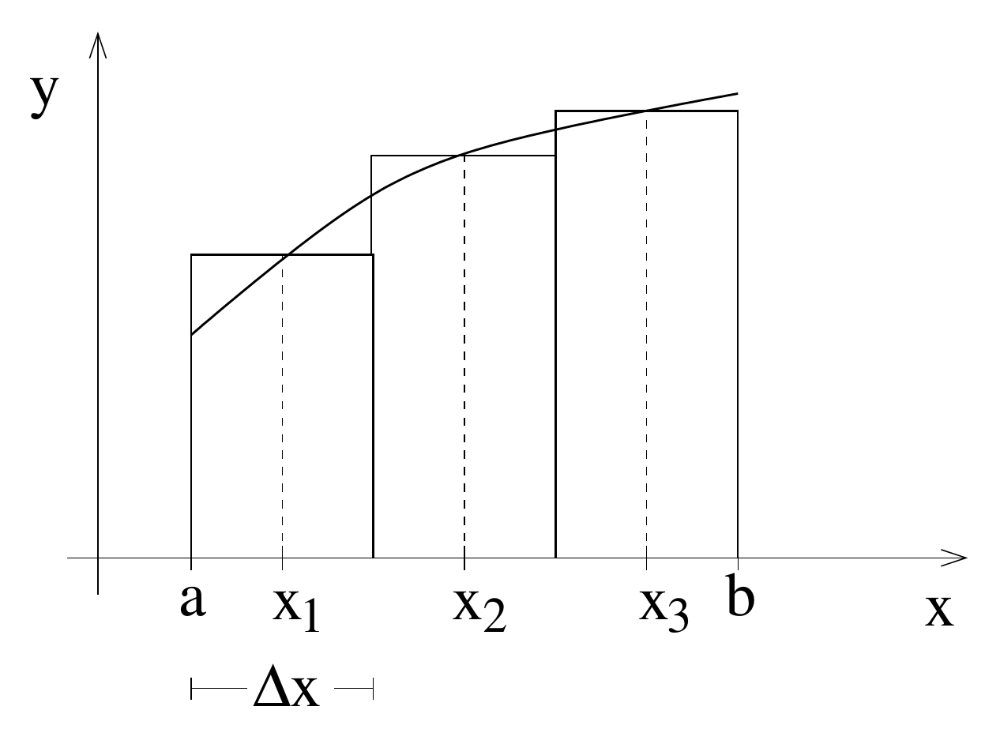

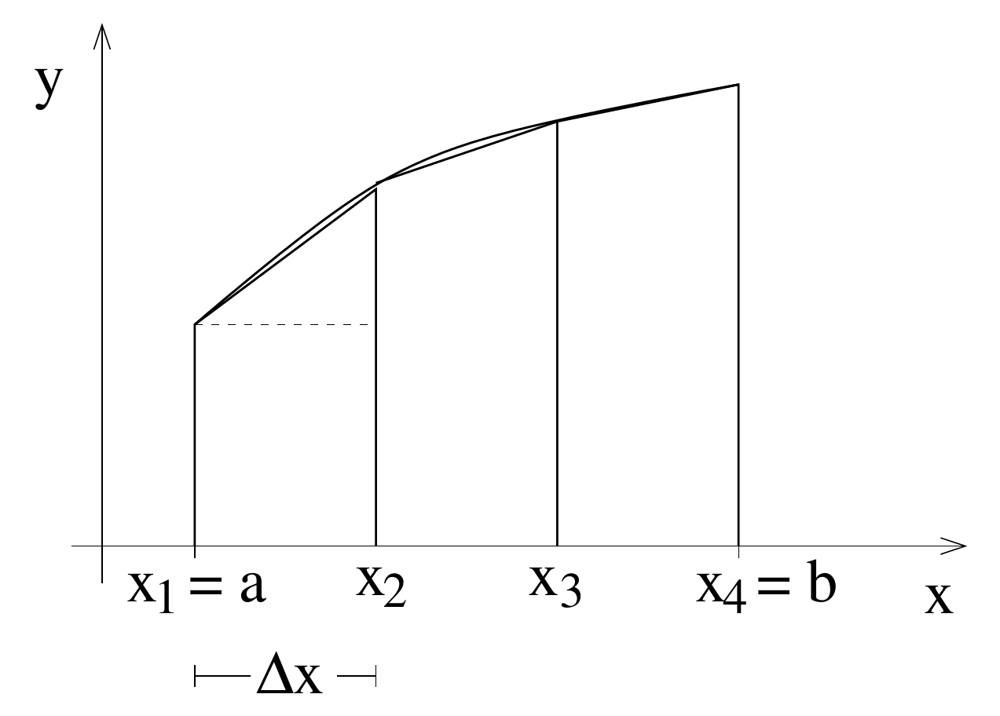

_Trapezoidal_  _ _  _rule_  _: _

 __worse__    __ __    __than__    __ __    __midpoint__    __\!__ 

approximate by parabolas

_Simpson‘s_  _ _  _rule_  _: _

__Numerical__  __ __  __methods__  __:__

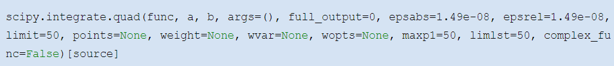

__Symbolic__  __ __  __Methods__

We will use module   __sympy__  \.

For symbolic operations \(i\.e\.\, without concrete numbers\)\, we have to  __declare__  __ variables/__  __symbols__  \(and later functions…\)\.

For  __mathematical__  __ __  __functions__  __ such __  __as__  __ cos\(…\)__ \, use the sympy equivalents \(not from math or numpy modules\!\)

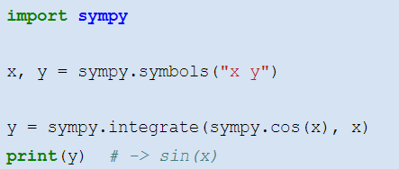

For  __definite __  __integrals__ \, we can specify boundaries a and b by  __creating__  __ a __  __tuple__    __\(x\, a\, b\)__   for the second argument\.

The solution can be  __evaluated__  by using the methods   __\.__    __subs__    __\(variable\, __    __value__    __\) __  to substitute a value for a variable and   __\.__    __evalf__    __\(\) __  to get a numerical output\.

 __„Genug für heute?“__ 

[https://davrot\.github\.io/pytutorial/sympy/intro](https://davrot.github.io/pytutorial/sympy/intro/)  [/](https://davrot.github.io/pytutorial/sympy/intro/)

[https://davrot\.github\.io/pytutorial/numpy/7](https://davrot.github.io/pytutorial/numpy/7/)  [/](https://davrot.github.io/pytutorial/numpy/7/)

[https://davrot\.github\.io/pytutorial/numpy/8](https://davrot.github.io/pytutorial/numpy/8/)  [/](https://davrot.github.io/pytutorial/numpy/8/)

 __Example__    __ live\-__    __coding__    __:__   integration     and     differentiation  \,   stability     and     instability

 __Differentiation __    __of__    __ __    __functions__ 

__Numerical__  __ __  __methods__  __:__

__centered__  __ __  __differentiation__

__right\-sided__  __ __  __differentiation__

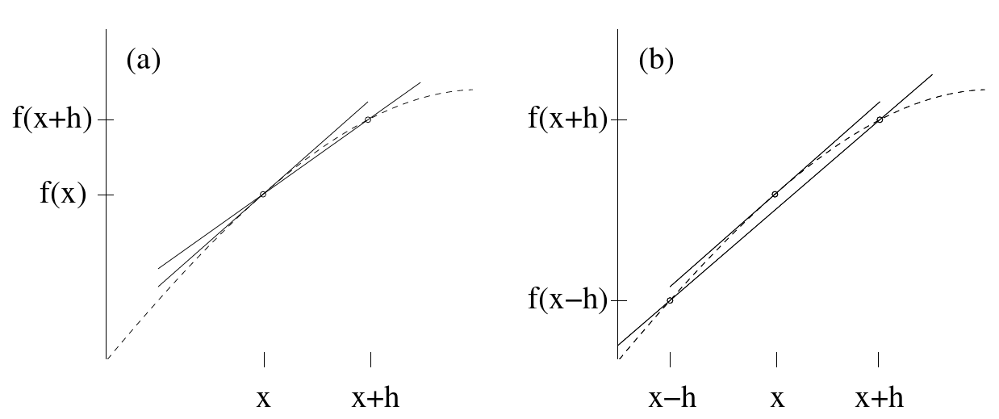

---

Note: also important for integration of DEQs, since differential approximated by the same equations

__Symbolic__  __ __  __methods__  __:__

For differentiation\, the corresponding command is   __diff__  :

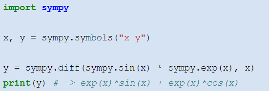

 __Integration __    __of__    __ differential __    __equations__ 

__Differential __  __quotient__  __ __  __approximated__  __ __  __by__  __ finite __  __difference__ \, like in previous example\. Solution constructed by considering the following aspects:

What do we want to know\, what is known?

Where do we start?   __Initial __  __value__  __ __  __problem__ …

How far do we step?  Smaller than fastest timescale implies  __maximum__  __ __  __step__  __ __  __size__

 __Warning__    __:__ 

differentiation  /  integration     of     functions     can     be     performed   in parallel\, 

differential   equations     require     an iterative   solution     which     can   not   be     parallelized  \!

 __What__    __ __    __about__    __ __    __systems__    __ __    __of__    __ differential __    __equations__    __?__ 

…just solve them in parallel \(see previous slide\)

__Higher\-order __  __methods__

Idea: approximate differential quotient more precisely…

__Solution \(Runge\-__  __Kutta__  __ 2nd __  __order__  __\):__

Go ahead with Euler by half of the stepsize…

…use slope at that position for an Euler with the full stepsize\.

__Numerical__  __ __  __methods__  __:__

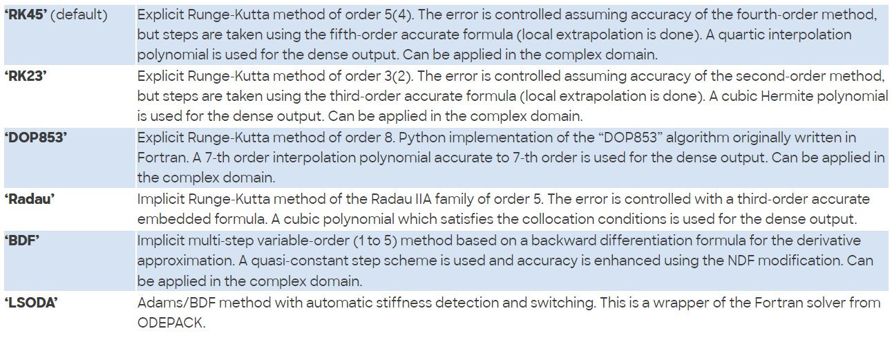

__Symbolic__  __ __  __methods__  __:__

In addition to declaring variables\, you need…

…to  __declare__  __ __  __functions__  \(for the solution we are looking for\)

…to  __define__  __ __  __the__  __ \(differential\) __  __equation__

…and the  __command__  __ __   __dsolve__   __ __ for \(trying to\) solve the DEQ:

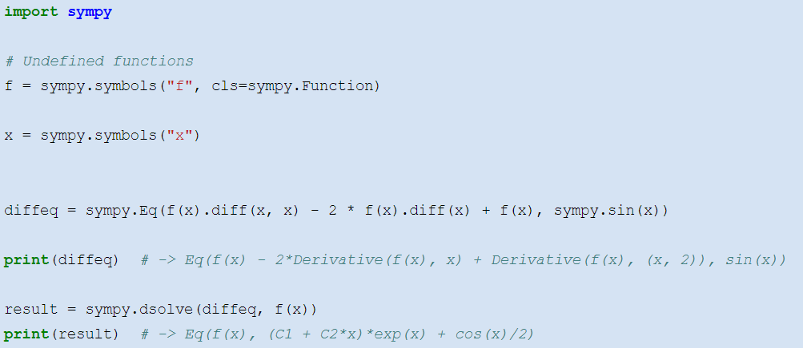

__Symbolic__  __ __  __methods__  __\, __  __cont‘d__  __…__

For including initial conditions\,   __dsolve__    __ __  has the  __optional __  __argument__  __ __   __ics__  \.

With  __ __    __lambdify__  \, You can  __convert__  __ __  __the__  __ RHS __  __of__  __ __  __the__  __ __  __solution__  __ __  __to__  __ a normal __  __numpy__  __ __  __function__ :

Query the new function as to  __which__  __ __  __arguments__  __ __  __it__  __ __  __takes__ \, and in which order \(  __import__    __ __    __inspect__    __ __  for that purpose\)

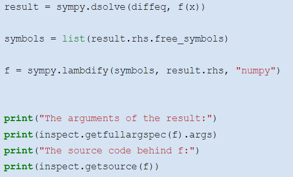

__What__  __ __  __about__  __ partial differential __  __equations__  __?__

For example\, the cable equation:

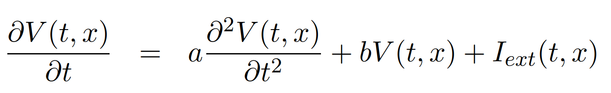

 __More __    __information__    __:__ 

[https://davrot\.github\.io/pytutorial/sympy/intro](https://davrot.github.io/pytutorial/sympy/intro/)  [/](https://davrot.github.io/pytutorial/sympy/intro/)

[https://davrot\.github\.io/pytutorial/numpy/7](https://davrot.github.io/pytutorial/numpy/7/)  [/](https://davrot.github.io/pytutorial/numpy/7/)

[https://davrot\.github\.io/pytutorial/numpy/8](https://davrot.github.io/pytutorial/numpy/8/)  [/](https://davrot.github.io/pytutorial/numpy/8/)

