 __Topic \#3__    __Data __    __analysis__ 

 __Fiddling__    __ __    __with__    __ __    __signals__    __ __    __and__    __ __    __frequencies__ 

sampling\, frequency space representations\, filters and filter properties\, convolution theorem

 __Spectral__    __ __    __analysis__ 

\(windowed\) Fourier\, Hilbert\, wavelets\, coherence measures

 __Multidimensional __    __representations__ 

PCA\, ICA\, SVD\, k\-means

 __Classification__ 

ROC\, k\-NN\, SVM

 __Fiddling__    __ __    __with__    __ __    __signals__    __ __    __and__    __ __    __frequencies__ 

frequency above Nyquist

__Sampling__

Sampled signals have a limited time resolution and a limited range and precision

2 bits range = 4 states

__Reminder__  __: __  __the__  __ Fourier __  __transform__

__Signals s\(t\)__  can also be represented in Fourier space as  __complex__  __ __  __coefficients__  __ S\(f\)__ \. Transform forth and back by \(inverse\)  __Fourier __  __transform__ \. Visualize a Fourier\-transformed signal as  __power __  __spectral__  __ __  __density__  \(remember lecture/exercise in Theo\. Neurosciences\):

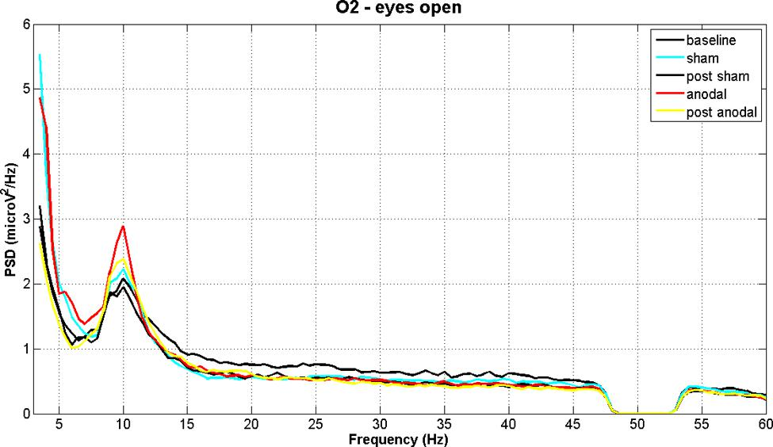

some interesting signal feature at f=10 Hz

…there‘s a hole in the bucket\, dear Liza\, dear Liza\!

_https://en\.wikipedia\.org/wiki/There%27s\_a\_Hole\_in\_My\_Bucket_

_source_  _: neuroimage\.usc\.edu_

__How__  __ __  __can__  __ __  __we__  __ __  __extract__  __ __  __signals__  __ at __  __frequency__  __ __  __ranges__  __ __  __of__  __ __  __interest__  __\, __  __or__  __ __  __put__  __ __  __holes__  __ in __  __the__  __ __  __spectrum__  __ __  __of__  __ __  __the__  __ __  __data__  __?__

Visualizing in frequency space what a filter does…

amplitude drops to ~70%

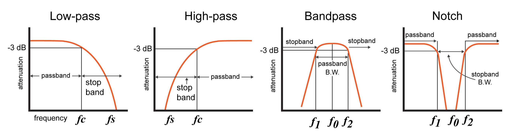

_https://www\.allaboutcircuits\.com/technical\-articles/an\-introduction\-to\-filters/_

__Quality __  __factor__ :

 __Q=f0/\(f2\-f1\)__ 

__dB = __  __decibel__  __: __ defined as   __10 log\(P2/P1\) dB __  for  __power __  __ratio__  P2 vs\. P1

…therefore\,   __20 log\(A2/A1\) dB __  for  __amplitude__  __ __  __ratios__ \!

\(note that mathematical „log“ is numpyically „log10“\!\)

__Filter __  __order__ :

 __~ __    __slope__    __ __    __of__    __ __    __decay__ 

__Filtering__  __ __  __with__  __ Python__

We like the butterworth filter provided by the   __scipy\.signal__    __ __  module\. One uses   __butter__   to construct the filter\, and   __filtfilt__   to apply the constructed filter to a time series:

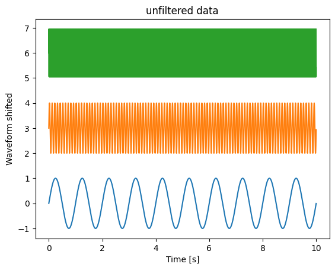

__Sample __  __signals__  __ __  __used__  __ in __  __the__  __ __  __following__  __ __  __slides__  __:__

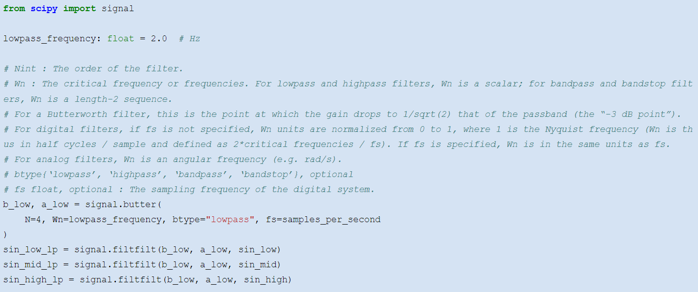

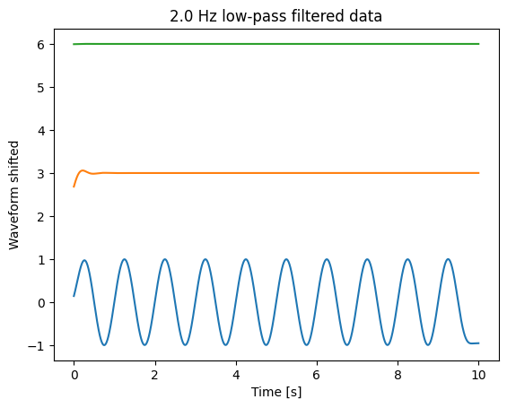

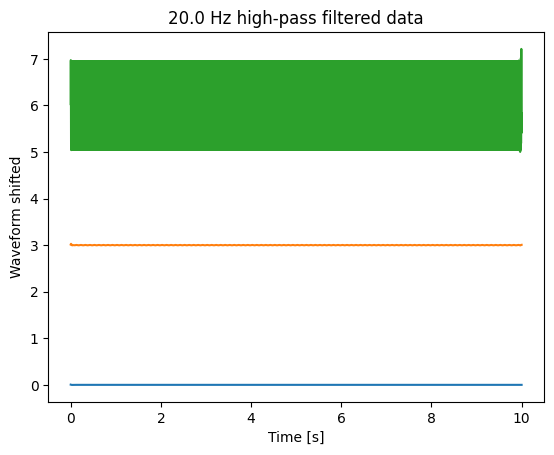

__High\-pass __  __and__  __ __  __bandpass__

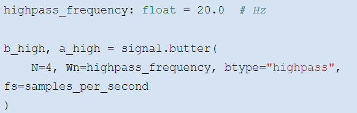

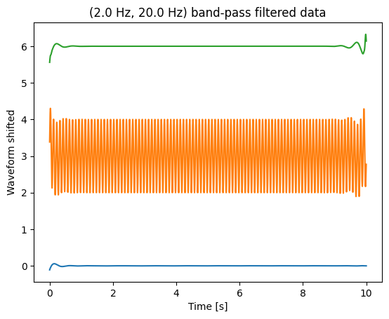

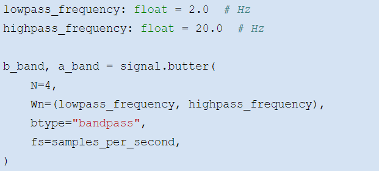

 __beware__    __\!__ 

 __transients__    __\!__ 

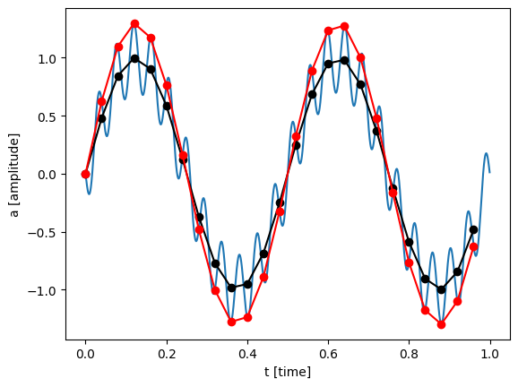

Filters imply phase shifts\. To compensate\, combine for\- and backward filtering\.

Filter first before downsampling \(see example\)\.

To inspect a filter\, filter a white noise signal and plot PSD\.

Take care\, transients at start and end of signal

The more parameter you specify\, the more difficult is it to design a filter

 __blue__    __: __   original   signal  \,   sampled   at 2500 Hz

 __red__    __: __   downsampled     to   25 Hz

__black__  __: __ first filtered\, then downsampled to 25 Hz

The convolution theorem states that  in Fourier   space  \,   convolutions     are     expressed     by     multiplication     of     the     transformed     signal     and     filter \.

If you transform a filter into Fourier space\, you can investigate its properties by considering it a ‚mask‘ for your time series representation\.

You can  use     the     convolution     theorem     to     perform     convolutions     efficiently \, using FFT\.

 __Example__    __: __    __low__    __\-pass __    __filter__ 

 __More __    __information__    __:__ 

[https://davrot\.github\.io/pytutorial/scipy/scipy\.signal\_butterworth](https://davrot.github.io/pytutorial/scipy/scipy.signal_butterworth/)  [/](https://davrot.github.io/pytutorial/scipy/scipy.signal_butterworth/)

 __Spectral__    __ __    __analysis__ 

__ __  __ANDA __  __tutorial__  __…__

Switch

presentations

__Wavelet Transform in Python__

One can use the   __pywt__   module\, and requires essentially only two commands for creating a ‚mother wavelet‘ and applying it to the time series of interest:

\# The wavelet we want to use\.\.\.

mother     =     pywt  \.ContinuousWavelet  \(  "cmor1\.5\-1\.0"  \)

\# \.\.\.applied with the parameters we want:

complex\_spectrum  \,   frequency\_axis     =     pywt  \.  cwt  \(

      data  =  test\_data  \,   scales  =  wave\_scales  \,   wavelet  =  mother  \,   sampling\_period  =  dt

\)

However\, working with the wavelet transform requires to think about the scales or frequency bands\, their spacing\, proper definition of time/frequency resolution\, taking care of the cone\-of\-interest etc…

Full code at: [https://davrot\.github\.io/pytutorial/pywavelet](https://davrot.github.io/pytutorial/pywavelet/)[/](https://davrot.github.io/pytutorial/pywavelet/)

 __More __    __information__    __:__ 

[https://davrot\.github\.io/pytutorial/pywavelet](https://davrot.github.io/pytutorial/pywavelet/)  [/](https://davrot.github.io/pytutorial/pywavelet/)

 __Multidimensional __    __representations__ 

Neural recordings often yield a large number of signals xi\(t\)\.

Typically\, these signals contain a mixture of \(internal and external\) sources sj\(t\)\.  __Example__  __: __ One EEG signal contains the activity of millions of neurons\.

__Goal: __ find the neural sources s\(t\) contained in the signals x\(t\)

__Also:__

Assessment of dimensionality of a representation

Dimensionality reduction\. Get the principal components\.

Remove common sources \(common reference\, line noise\, heartbeat artifacts\, etc\.\)

…

__PCA – __  __principal__  __ __  __component__  __ __  __analysis__

Find sources which are  uncorrelated     with     each     other \. Uncorrelated means that the  source     vectors   S will   be   orthogonal   to     each     other \.

PCA finds matrix WPCA such that X is explained by X = S WPCA\.

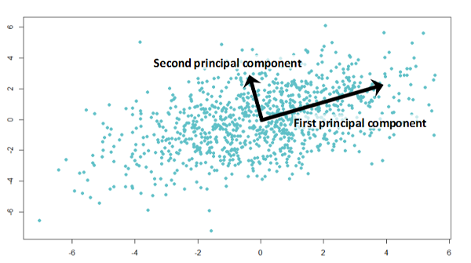

remove mean?

remove std?

W  PCA  \-1   = W  PCA  T  \, so S = X   W  PCA  T   

__Example__  __: n __  __signals__  __ __  __of__  __ __  __duration__  __ t: __

S: \(t x n\) – n source vectors

WPCA: \(n x n\) – mixture matrix

X: \(t x n\) – n observation vectors

 __Visualization__    __:__ 

W  PCA  \[k\, :\]   shows     how     the   k\-  th     component     contributes     to     the   n   observations  : 

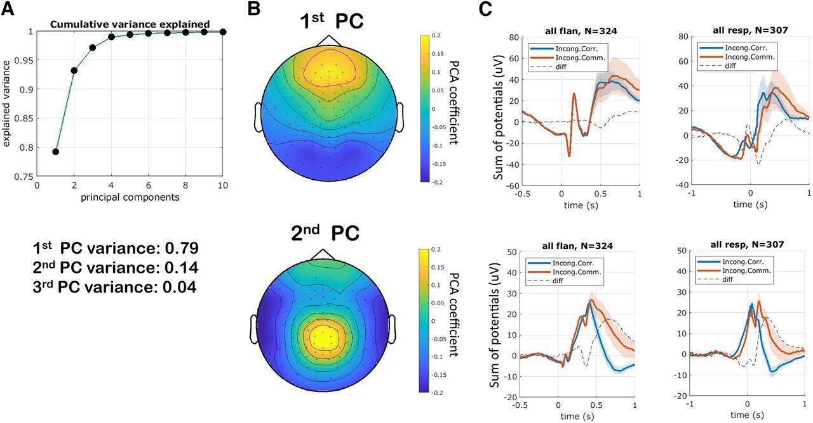

__PCA – __  __principal__  __ __  __component__  __ __  __analysis__  __: Python__

Use   __class__    __ PCA __  from   __sklearn\.decomposition__   module:

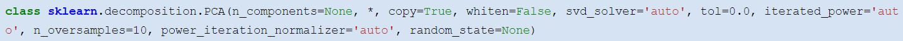

After defining an instance\, you can use   __fit__   for fitting a transform\, and   __transform__   for transforming X to S\.

 __fit\_transform__   combines these steps\, and   __inverse\_transform__    __ __  does the transfrom from S to X\.

The attribute   __components__    __\___   will contain the PCA transformation components

Components will be  sorted     with     descending   \(  explained  \)   variance \.

from     sklearn  \.  decomposition     import     PCA

\#   transform   x   to   s  pca     =     PCA  \(\)

s     =     pca  \.  fit\_transform  \(  x  \)

w\_pca     =     pca  \.  components  \_

\#   transform   s   to   x

x\_recover   =   pca\.  inverse\_transform  \(s\)

also\_x\_recover   =   s@w\_pca

W  PCA  \-1   = W  PCA  T  \, so S = X   W  PCA  T   

 __Take care\! __    __Instead__    __ __    __of__    __ X __    __= S __    __W__    __PCA__    __\, __    __the__    __ __    __transform__    __ __    __is__    __ also __    __often__    __ __    __defined__    __ __    __as__    __ X‘ __    __= __    __W__    __PCA__    __ S‘\. This __    __makes__    __ X‘\, S‘ \(n x t\) __    __instead__    __ __    __of__    __ \(t x n\) __    __matrices__    __\!__ 

__SVD – Singular Value __  __Decomposition__

The singular value decomposition decmposes a matrix  __M__  into two unitary matrices U and V\, and a diagonal matrix ∑:   __M = U__    __ __    __∑ V\* __ 

Assumptions are UTU = UUT = I\, and VTV = VVT = I with I being the unit matrix\.

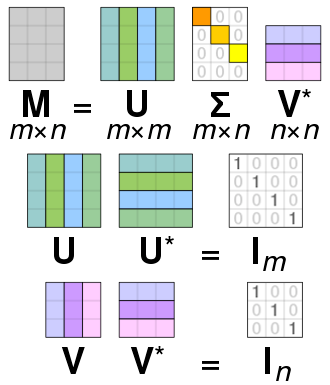

__Relation __  __to__  __ PCA: __ Consider m denotes ‚time‘ t\,and n <=t\. Then M are the observations X\, V\* will be WPCA\, and S = U ∑ the uncorrelated principal components\, related via:  __X = S W__  __PCA__ \.

__ICA – __  __independent__  __ __  __component__  __ __  __analysis__

ICA assumes also a  linear   mixture     of   ‚  sources  ‘ via X = S   W  ICA  \. However\, here the goal is to find sources which are  statistically     independent    to each other\.

__The ICA __  __transform__  __ __  __is__  __ not __  __unique__  __ __  __and__  __ __  __depends__  __ on __  __the__  __ __  __independence__  __ __  __criterion__  __\!__

remove mean?

remove std?

is STS trivially diagonal?

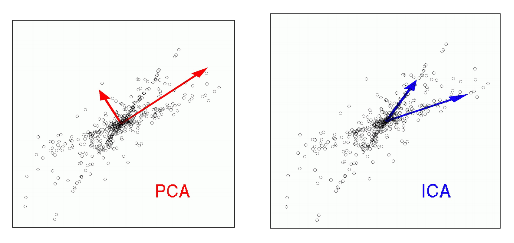

When might ICA be more appropriate than PCA?  __Example__  __:__  __ __

__Independence __  __criteria__  __:__

minimization of mutual information

maximization of non\-Gaussianity

__ICA – __  __independent__  __ __  __component__  __ __  __analysis__  __: Python__

Use   __class__    __ __    __FastICA__    __ __  from   __sklearn\.decomposition__   module\. The usage is very similar to   __PCA__  \.

from     sklearn  \.  decomposition     import     FastICA

\#   transform   x   to   s

ica     =     FastICA  \(\)

s     =     ica  \.  fit\_transform  \(  x  \)

w\_ica     =     ica  \.  components  \_

\#   transform   s   to   x

x\_recover     =     ica  \.  inverse\_transform  \(  s  \)

remove mean?

remove std?

is STS trivially diagonal?

We have  __multidimensional __  __samples__  __ X__  and expect that they stem from different ‚classes‘\, e\.g\. spike waveforms where spikes from one particular cell constitute one class\. Samples from a particular class should have smaller distance than samples stemming from different classes:

__The k\-__  __means__  __ Clustering __  __Algorithm__

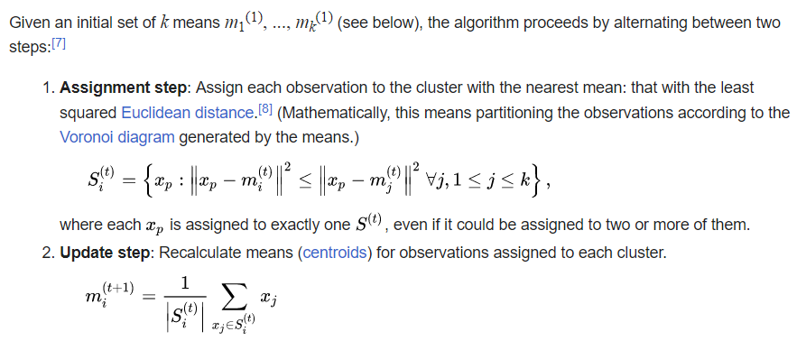

_description_  _ _  _and_  _ _  _animation_  _ _  _from_  _ Wikipedia_

__cluster\_centers__  __\___

__The k\-__  __means__  __ Clustering __  __Algorithm__  __: Python__

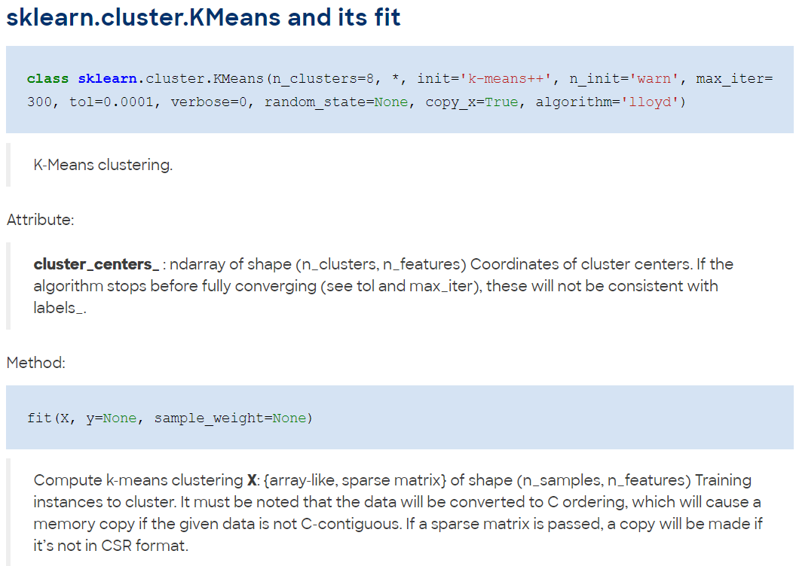

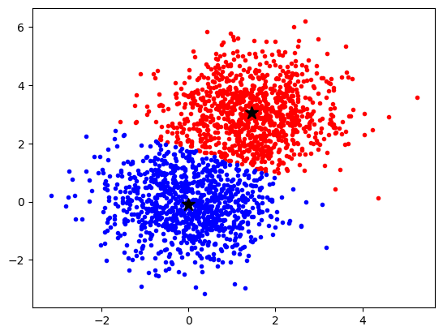

 __More __    __information__    __:__ 

[https://davrot\.github\.io/pytutorial/scikit\-learn/overview](https://davrot.github.io/pytutorial/scikit-learn/overview/)  [/](https://davrot.github.io/pytutorial/scikit-learn/overview/)

[https://davrot\.github\.io/pytutorial/scikit\-learn/pca](https://davrot.github.io/pytutorial/scikit-learn/pca/)  [/](https://davrot.github.io/pytutorial/scikit-learn/pca/)

[https://davrot\.github\.io/pytutorial/scikit\-learn/fast\_ica](https://davrot.github.io/pytutorial/scikit-learn/fast_ica/)  [/](https://davrot.github.io/pytutorial/scikit-learn/fast_ica/)

[https://davrot\.github\.io/pytutorial/scikit\-learn/kmeans](https://davrot.github.io/pytutorial/scikit-learn/kmeans/)  [/](https://davrot.github.io/pytutorial/scikit-learn/kmeans/)

__Classification__  __ __  __yields__  __ __  __information__  __ __  __about__  __ __  __information__  __ in __  __data__  __…__

__Receiver\-operator\-__  __characteristics__  __ \(ROC\): __ a simple tool for quick inspection for both simple and complex data sets

__K\-__  __nearest__  __\-__  __neighbor__  __ __  __classifier__  __ \(__  __kNN__  __\): __ easy to implement\, suited for a quick inspection

__Support __  __vector__  __ __  __machine__  __ \(SVM\): __ an almost state\-of\-the\-art tool for \(non\-\)linear classification of large data sets\. Very useful if you don‘t want to fire up your deep network and NVidia GPU for every almost trivial problem…

 __Important__    __: __   For     classification  \,   you     need   a    __training__    __ __    __data__    __ __    __set__   \,   and   a    __test__    __ __    __data__    __ __    __set__   \.   Each     data     set     contains   \(a large   number     of  \)    __samples__      together     with     their      __labels__   \.   You     are      __not __    __allowed__    __ __    __to__    __ __    __use__    __ __    __the__    __ __    __test__    __ __    __set__    __ __    __for__    __ __    __training__   \.

__Receiver\-Operator __  __Characteristics__

The situation: one recorded signal r\, two potential causes „\+“ or „\-“:

__radio__  __ __  __signal__  __ r=__  __enemy__  __ __  __plane __  __\(\-\) __  __or__  __ __  __swarm__  __ __  __of__  __ __  __birds__  __ \(\+\)?__

__How__  __ __  __can__  __ __  __we__  __ __  __distinguish__  __ __  __between__  __ „\+“ __  __and__  __ „\-“?__

Simplest estimator: use threshold z\, if sample r0 is smaller than z\, attribute to „\-“\, otherwise to „\+“

Can we find an  __optimal z__ ? Yes\, the idea is to plot the  __true__  __ positives \(__  __β__  __\) __ against the  __false__  __ positives \(__  __α__  __\)__  while changing z \(ROC curve\)\. Classification accuracy has a  __maximum__  __/__  __minimum__  __ __  __when__  __ __  __the__  __ __  __rates__  __ __  __of__  __ __  __change__  __ __  __are__  __ __  __equal__  __ __   __\(__    __slope__    __=1\)__  \.

__Summary: __  __ROC'n'Roll__

…it‘s a nice tool for quick inspection how well a scalar variable allows to discriminate between two situations\!

 __What's wrong if the ROC curve is under the diagonal?__ 

__Discriminability__  __: __ difference of means relative to std:

d‘ := \(r\+\-r\- \)/ σ

__k\-__  __Nearest__  __\-__  __Neighbour__  __ __  __Classifier__  __:__

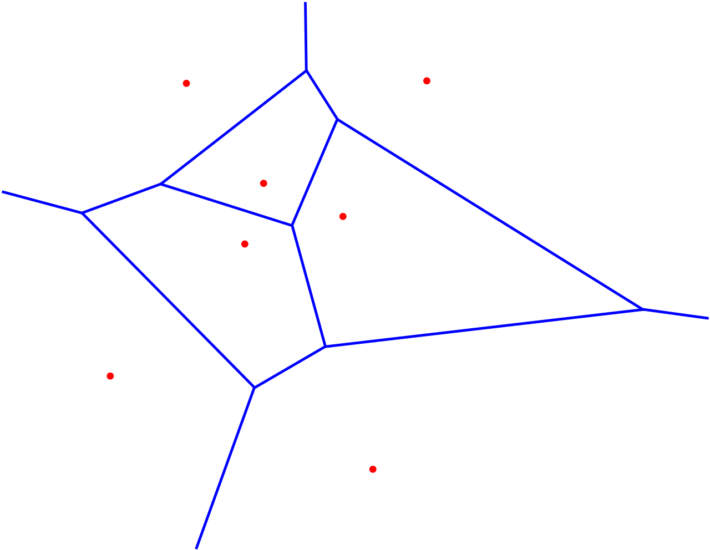

Super\-easy to explain\, super\-easy to implement\, super memory consuming\!

The   __x__    __i__   are samples of the training data set with labels   __y__    __i__  \.

Every sample from the test data set   __inside__    __ __    __the__    __ __    __neighborhood__    __ __    __of__    __ x__    __42__    __ \(__    __Voronoi__    __ __    __cell__    __\) __  gets assigned the label   __y__    __42__   \(k=1\)…

…or the majority vote/mixture of the   __labels__    __ __    __of__    __ __    __the__    __ k __    __nearest__    __ __    __neighbors__  \.

__The __  __support__  __ __  __vector__  __ __  __machine__  __ \(SVM\)__

You know how a simple perceptron works \(lecture Theoretical Neurosciences\)? The SVM is doing the same thing\, but   __transforms__    __ __    __the__    __ __    __data__    __ __    __into__    __ a __    __higher__    __\-dimensional __    __space__     before it performs a   __linear __    __classification__    __ __    __by__    __ __    __using__    __ an __    __appropriately__    __ __    __placed__    __ __    __separating__    __ hyperplane__  :

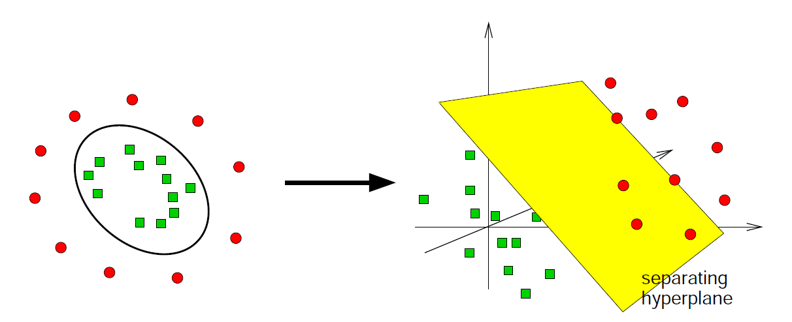

 __separating__ 

 __hyperplane__ 

__Python __  __tools__  __ __  __for__  __ __  __elementary__  __ __  __classification__  __ __  __tasks__  __:__

__ROC__  and  __kNN__  – easy to code on your own \(and a good training for you\!\)…

Learning an  __SVM__  is more tricky\.  __scikit\-learn__   provides you with a good tool:

 __More __    __information__    __:__ 

[https://davrot\.github\.io/pytutorial/numpy/roc](https://davrot.github.io/pytutorial/numpy/roc/)  [/](https://davrot.github.io/pytutorial/numpy/roc/)

[https://davrot\.github\.io/pytutorial/numpy/knn](https://davrot.github.io/pytutorial/numpy/knn/)  [/](https://davrot.github.io/pytutorial/numpy/knn/)

[https://davrot\.github\.io/pytutorial/scikit\-learn/svm](https://davrot.github.io/pytutorial/scikit-learn/svm/)  [/](https://davrot.github.io/pytutorial/scikit-learn/svm/)

