# 2

## leaky integrate-and-fire neuron (LIAF)
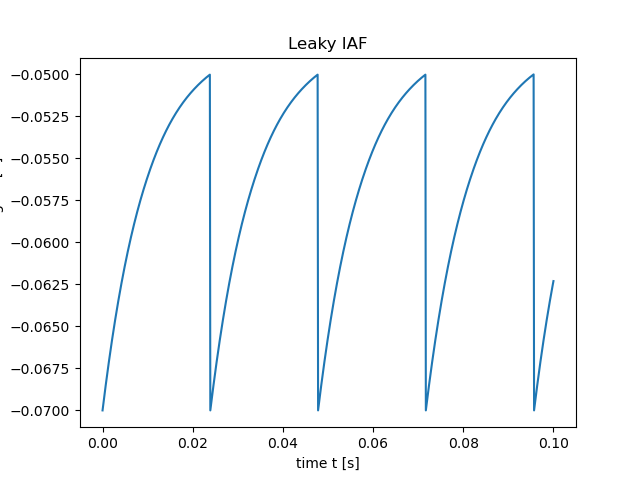

## quadratic integrate-and-fire neuron (QIAF)
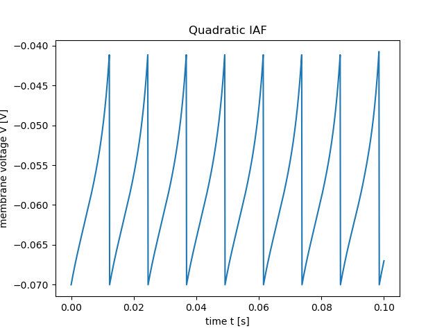

## the conductance-based Connor-Stevens neuron
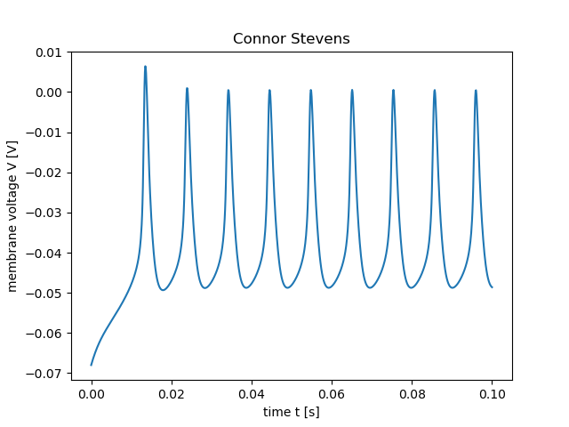

## exponential integrate-and-fire neuron (EIAF)
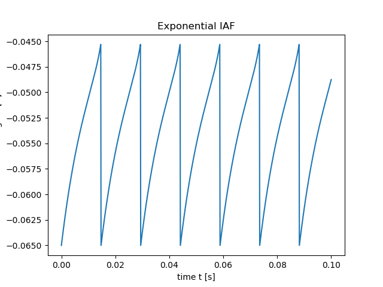

## rate-based MT neuron (DivInE model)
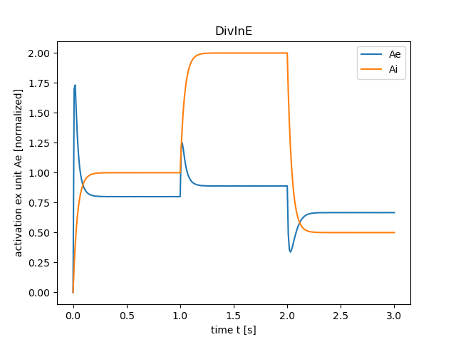

# 3

## Gain function LIAF, QIAF, and EIAF

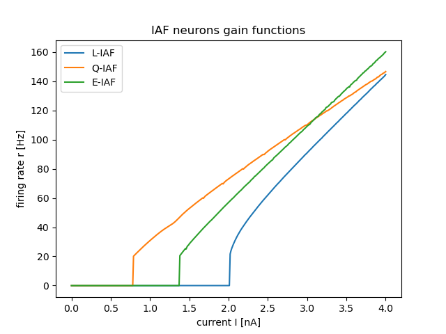

## Gain function Connor-Stevens neuron

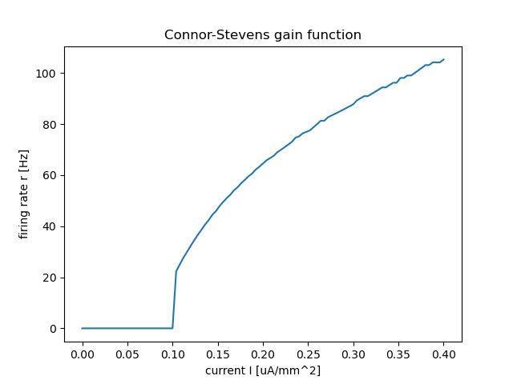

## Gain function rate-based MT neuron (DivInE model)

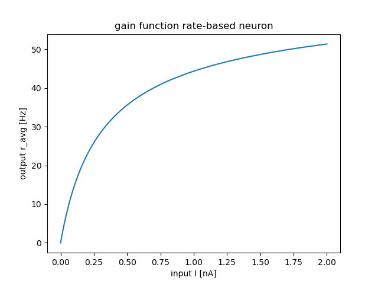

## Gain function LIAF analytically 

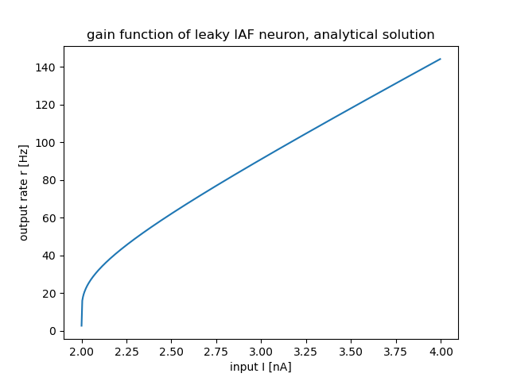

# 4

# 5

## Slope LIAF, QIAF, and EIAF

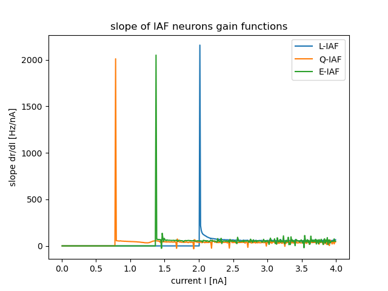

## Slope Connor-Stevens neuron

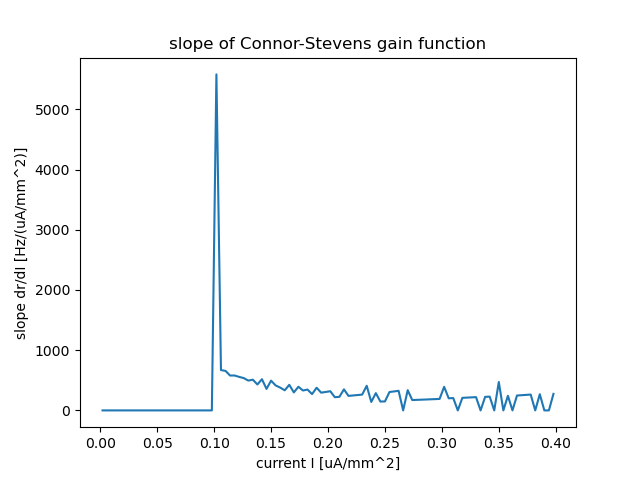

## Slope rate-based MT neuron (DivInE model)

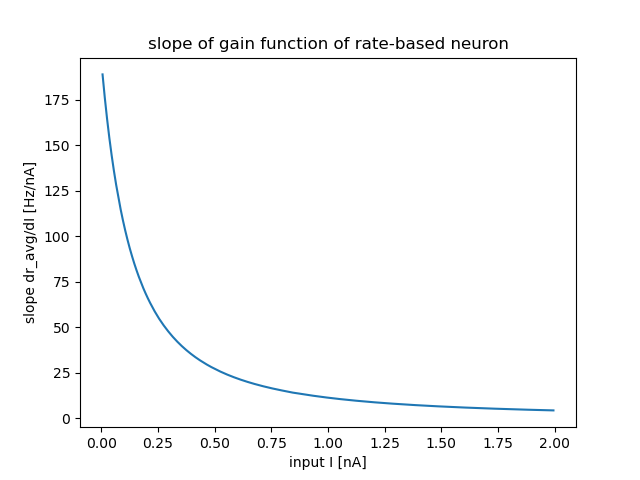
