Errors are an option... 

# Mandatory Tasks

## 2 

Basic: 

Scaled by divison max() for every individual frequency band:

## 3

without preparing the data via /= std: 

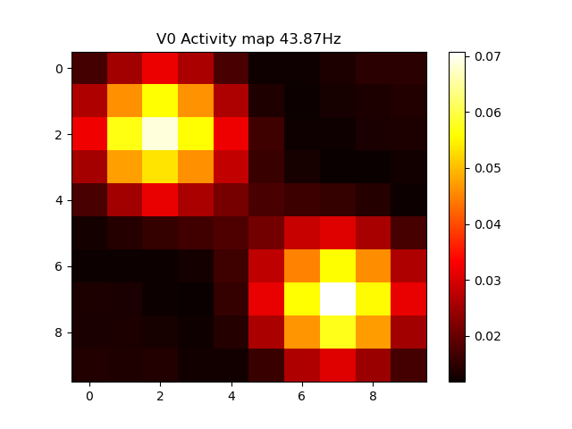

with equalizing the power via /= std (obviously not the best idea in this case):

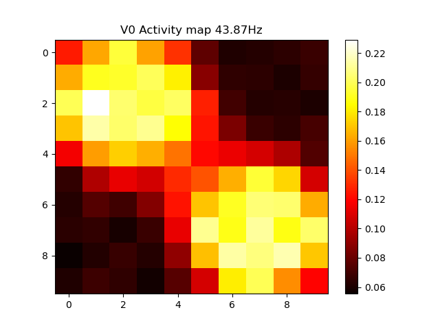

## 4

Phase Coherence

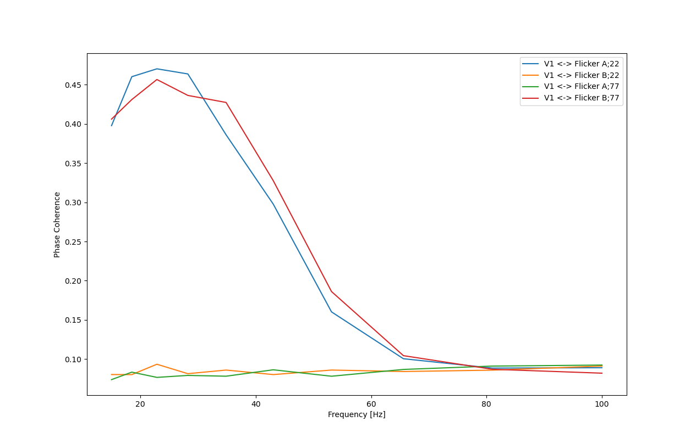

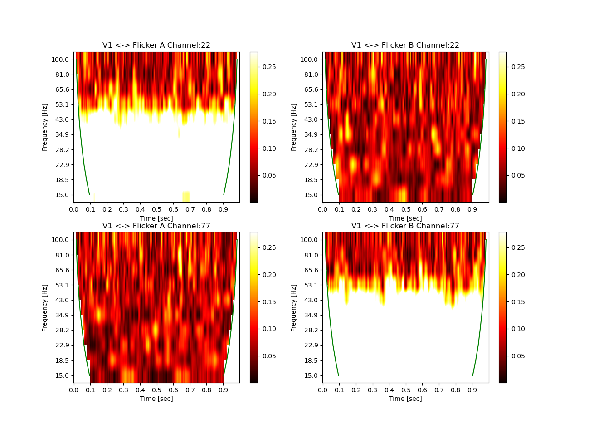

Spectral Coherence

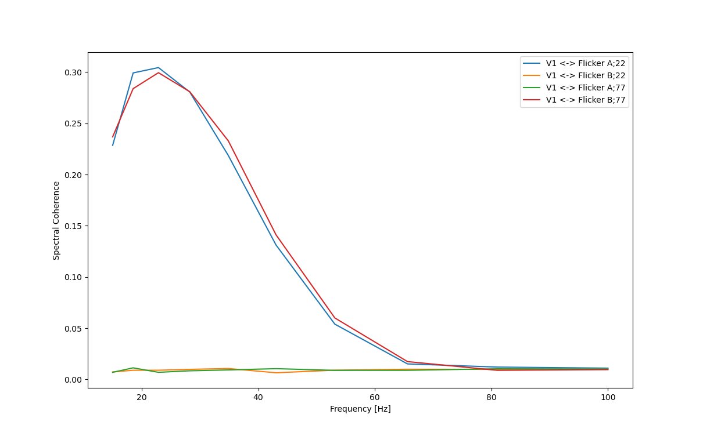

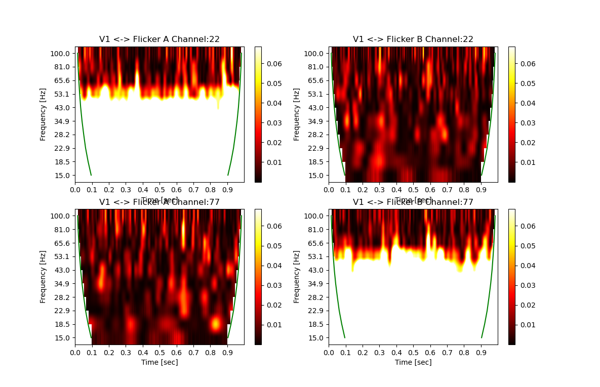

## 5

Phase Coherence

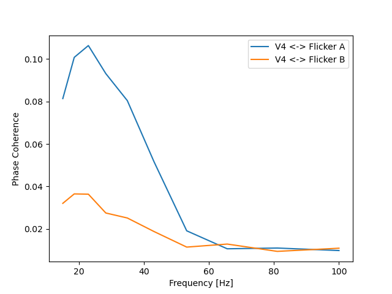

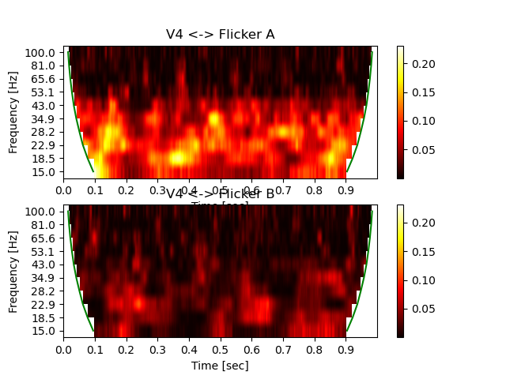

Spectral Coherence

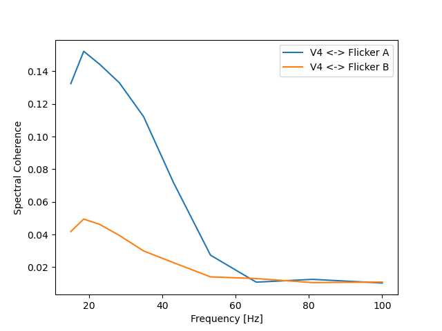

## 6

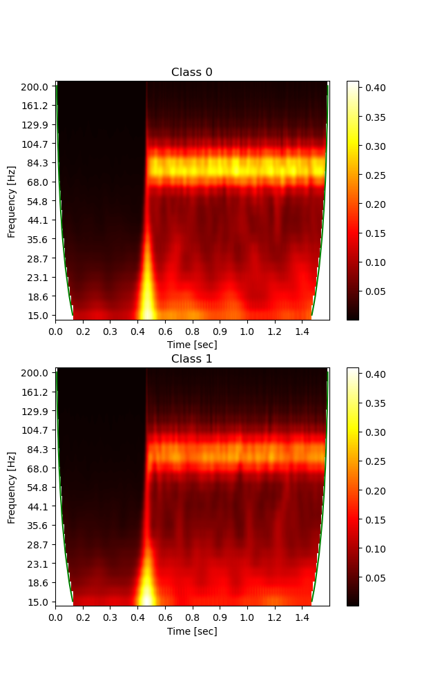

Scaled by divison max() for every individual frequency band (Bad times happen):

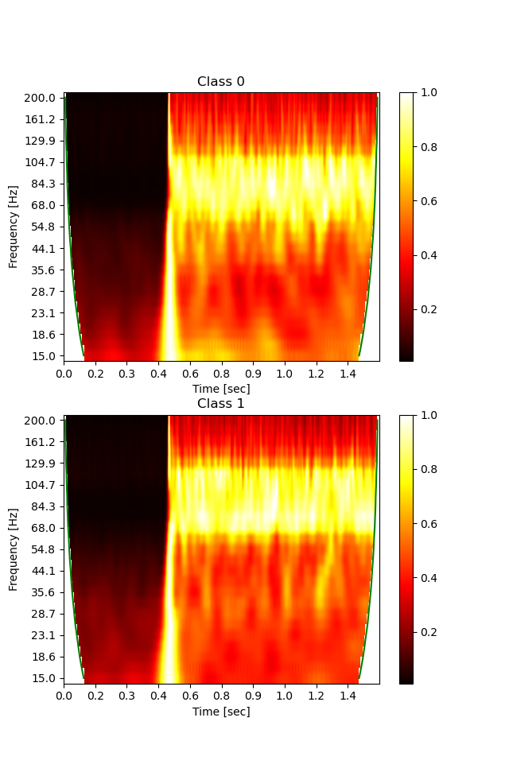

## 7

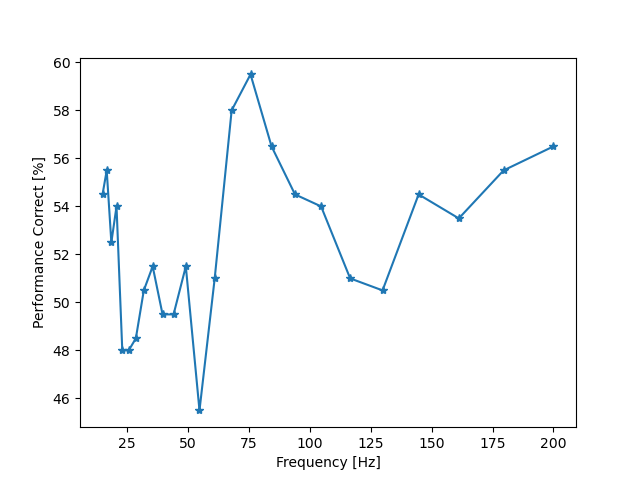

