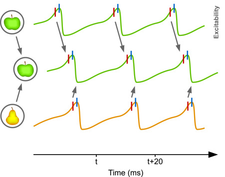
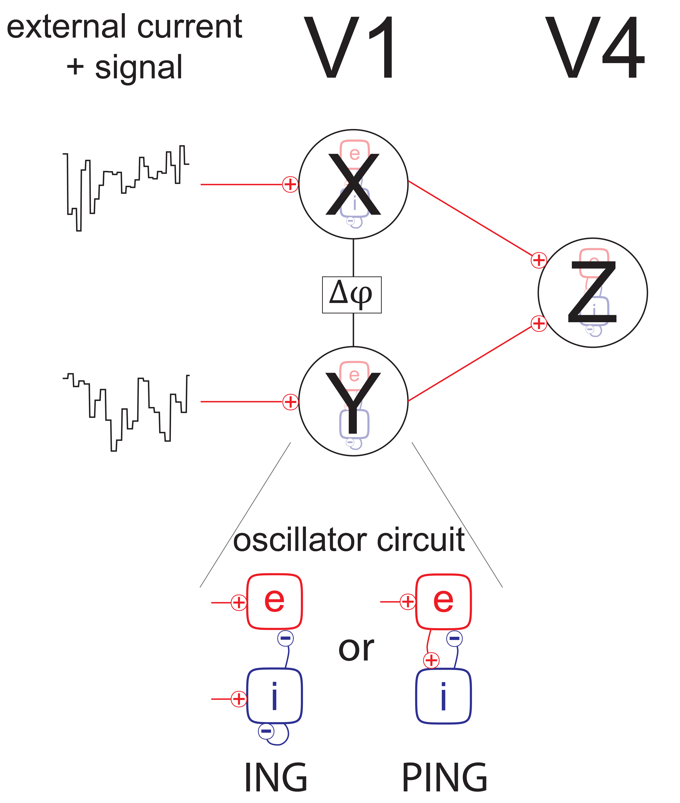

# Oscillations and information routing: CTC model

***Oscillatory activity is ubiquitous throughout the brain and has been hypothesized to carry out multiple crucial functional roles, for example, a basic information routing mechanism. One of the proposed mechanisms, communication through coherence (CTC), postulates that stimulus information transmission is enhanced between oscillating neural populations in a favorable phase relationship, and suppressed otherwise (see [6] for in-depth overview). In this mini-project, you will implement a simple network model which realizes gating of information by mutual synchronization (and de-synchronization) of neural populations.**

In support of CTC, an experimental study has shown that V1 and V4 neuron populations exhibit increased synchrony in their rhythmic activity in the gamma-band when performing a visual spatial attention task [4]. In this particular example, CTC poses that V1 spikes arriving to V4 during its excitability peaks should be much more likely to elicit further spikes, resulting in effective signal gating, whereas V1 spikes arriving during excitability troughs should fail or at least be less effective in evoking further activity. In this manner, by setting a proper phase relationship between the rhythmic activity of two neuron populations, CTC allows to either attend or ignore a stimulus.

Communication through coherence (Fries 2015)

In this project, you will eventually construct a simple model that recreates the basic neural activity from the experimental setup in [1,4]. Further, using the model, you will test the merits and plausibility of CTC, as well as make inferences about what the mechanism requires to function properly (and hence make predictions about what the brain's neural activity should look like if the CTC mechanism is truly employed).

In the experiment, two stimuli were shown simultaneously to the test subject, such that each stimulus was primarily driving its own distinct V1 population, while both were present in the V4 recording's receptive field. With this in mind, the final model consists of three populations - two V1 populations with feedforward connections to a single V4 population (Fig. 2 top). Each population consists of a group of excitatory and inhibitory neurons.

Model setup

The rhythmic behavior of local populations may stem from two basic circuits: ING and PING [3]. In the ING circuit, the rhythmic activity is realized exclusively by the inhibitory population, whereas in the PING mechanism the oscillations occur as pull-push dynamics between the excitatory and inhibitory groups of neurons (Fig. 2 bottom).

To simulate each population, you will use a Wilson Cowan dynamics with delays (meaning that it takes time for one population's activity to reach another). The Wilson Cowan dynamics are described by the following differential equations (DEQs) for the activity $A_e$ of the excitatory subpopulation and the activity $A_i$ for the inhibitory subpopulation:

$$\tau_e \frac{dA_e}{dt} = -A_e + S_e \left ( w_{ee}A_e(t-\tau_{ee}) - w_{ie}A_i(t-\tau_{ie}) + I_e\right )$$

$$\tau_i \frac{dA_i}{dt} = -A_i + S_i \left ( w_{ei}A_e(t-\tau_{ei}) - w_{ii}A_i(t-\tau_{ii}) + I_i\right )$$

Fortunately for you, the inclusion of the delay terms $\tau$ in the above equations makes them too unwieldy to solve analytically (although it's still possible under certain assumptions).

Your tutor will provide you with codes to calculate frequency and phase of a rhythmic signal, as well to calculate information routing between multiple signals.

## Constructing the model

### 1.
Utilizing the above Wilson Cowan equations, simulate the activity of a single V1 or V4 population separately for ING and PING circuits driven by a constant external current. Fiddle around with the parameters until you get oscillatory activity (ask your tutor for a good starting parameter set if you get stuck unable to get it oscillating). Which parameter plays the most significant role in determining the oscillation frequency? Once you get a good grasp on the parameters, modify them such that the network oscillates at gamma frequency (40-100Hz). Pick either ING or PING to use for the rest of the project.

### 2.
What happens to the circuits' activity if we remove the delays (set them to zero)?

### 3.
The activity of the network at the troughs of the oscillations should be completely suppressed (zero). Make sure your circuit's activity is appropriate.

### 4.
Update your code to simulate two V1 populations simultaneously: X and Y with independent external currents. The code should allow easy intra-population connectivity with delays (e.g. a connection from the inhibitory population in X to the inhibitory population in Y at a 5ms delay). Come up with an appropriate X--Y interpolation connectivity such that they oscillate at a phase offset. Which parameters affect the specific phase difference between the two oscillators? Set up the X--Y connectivity such that their activities are in anti-phase.

### 5.
Add a third population Z to the model, representing V4. Have Z be driven by a combination of its own external current, as well as the outputs from X and Y. Make sure that Z oscillates at (approximately) at the same frequency as X and Y.

## Meet

### 1.
Check in with your tutor, discuss your progress and thoughts.

### 2.
What is the phase relationship between the V4 and V1 populations? Are there steady states?

### 3.
Make a plot and explain the behaviour of the model. Which phase relationship between X and Z (or Y and Z) is favorable and which is unfavorable for information routing?

### 4. 
What happens when you increase the external current to X (but not Y) or Y (but not X)?

## Information routing

### 1.
Create two unique stimuli signals $S_X$ and $S_Y$, e.g. randn(1, maxT), and use them modulate the external currents into X and Y.

### 2.
Use the tools provided by your tutor to measure the overall information content of each signal throughout the network. Which signal does Z carry? Do the signals mix? What happens if you increase the magnitude of input current to X or Y?

## Literature

[1] Grothe, I., Rotermund, D., Neitzel, S. D., Mandon, S., Ernst, U. A., Kreiter, A. K., \& Pawelzik, K. R. (2015). **Attention selectively gates afferent signal transmission to area V4.** *bioRxiv*, 019547.

[2] Harnack, D., Ernst, U. A., \& Pawelzik, K. R. (2015). **A model for attentional information routing through coherence predicts biased competition and multistable perception.** *Journal of Neurophysiology*, 114(3), 1593-1605.

## Further Reading

[3] Tiesinga, P., \& Sejnowski, T. J. (2009). **Cortical enlightenment: are attentional gamma oscillations driven by ING or PING?** *Neuron*, 63(6), 727-732.

[4] Grothe, I., Neitzel, S. D., Mandon, S., \& Kreiter, A. K. (2012). **Switching neuronal inputs by differential modulations of gamma-band phase-coherence.** *Journal of Neuroscience*, 32(46), 16172-16180.

[5] Fries, P. (2005). **A mechanism for cognitive dynamics: neuronal communication through neuronal coherence.** *Trends in cognitive sciences*, 9(10), 474-480.

[6] Fries, P. (2015).**Rhythms for cognition: communication through coherence.** *Neuron*, 88(1), 220-235.

[7] Bosman, C.A., Schoffelen, J.M., Brunet, N., Oostenveld, R., Bastos, A.M., Womelsdorf, T., Rubehn, B., Stieglitz, T., De Weerd, P. \& Fries, P. (2012). **Attentional stimulus selection through selective synchronization between monkey visual areas.** *Neuron*, 75(5), 875-888.
