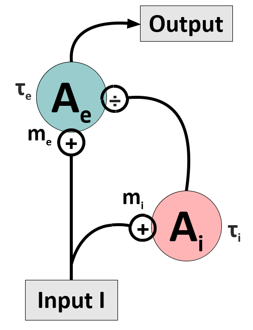

# Change detection: The DivInE-Model

***In natural environments, changes in the sensory input can signal behaviourally important events. Think of a tiger suddenly leaping from its hiding place: can your brain detect this change in a natural scene in time, or will you be a delicious meal just a few moments later?***

***Luckily, neural cirucits in the brain seem to have developed mechanisms which enhance changes in the sensory input thus allowing animals and humans to react more quickly. In this research project, we will study a simple feedforward network which provides a mechanism for enhancing input changes, and compare it to physiological data from the macaque visual system.***

The network to be investigated consists of an excitatory unit, which receives divisive input from an inhibitory unit (see Figure). Its dynamics is described by the following differential equations (DEQs):

$$ \tau_e \frac{dA_e(t)}{dt}  = 	-A_e(t) + g_e \left( \frac{c I(t)}{A_i(t)+B} \right)$$

$$ \tau_i \frac{dA_i(t)}{dt}  = 	-A_i(t) + g_i\left( I(t) \right)$$

Here $g_e$ and $g_i$ are gain functions which can be choosen as being piecewise linear:

$$g_e(I) = m_e(I-I^0_e) \quad \mbox{for $I>I^0_e$, and $0$ otherwise}$$

$$g_i(I) = m_i(I-I^0_i) \quad \mbox{for $I>I^0_i$, and $0$ otherwise}$$

$c$ is a constant which, for the moment, we assume to be $c=1$. You can also assume for your project that $I^0_e$ and $I^0_i$ are zero.

With the right set of parameters, this model is capable to reproduce physiological data from monkey area MT [2]. In particular, when subjected to abrupt changes in the input $I$, the circuit can respond with a huge overshoot or undershoot in its firing rate before settling into a stationary state. These dynamics are called 'transient responses', and they can nicely be seen in the graph on the right hand side (from [2]).

In this project, you will simulate this simple circuit and understand its dynamical properties analytically. You might then embed the circuit in a small network of similar units (a 'ring' model), and/or fit your model to physiological data recorded in monkey area MT.

### 1.
Assume the external input is always larger than zero, $I(t)>0$. How can you simplify the DEQs and get rid of the non-linearity?

### 2.
What are the fixed points of the two DEQs for a constant input current? Are these fixed points stable?

### 3.
Compute the maximum firing rate the excitatory unit can achieve.  

### 4.
Assume the input is a step function, $I(t)=I_0$ for $t<0$ and $I(t)=I_1$ for $t\geq0$. Solve the DEQ for the inhibitory unit.

### 5.
Now assume the excitatory unit's response is infinitely fast. What is the solution of the DEQ for the previous case?

### 6.
Compare the analytical solution you found in the previous step with a numerical solution of the full DEQ for different input steps.

## Simulation and Fitting

### 1.
Simulate the model and apply a constant input which abruptly increases/decreases after a certain time. How does the activation of the excitatory unit behave in response to the speed step? How do you have to choose the model's time constants such that the activity overshoots/undershoots before settling to a constant level?

### 2.
We can provide you with data from an experiment in which the response of an MT unit to stimulus changes has been recorded. You may assume that this situation corresponds to our model subjected to an input described by a step function. Think about how you could fit your model systematically to this data. How can you get rid of as many as possible model constants (which are of course unknown from the experiment...). Assume the only known data are the firing rate before and after an input change, and express the (simplified) DEQs in terms of these known and the remaining unknown variables. 

## Extension to a Ring Model

### 1.
The model provides a good fit for MT neurons that are driven with its preferred stimulus, i.e. with a grating moving into their preferred direction. Now we want to understand the dynamics of a population of MT neurons. Sketch a network circuit in which you replicate the DivInE-model and connect the units laterally, like in the ring model [1]. For the lateral connections, assume they implement a global divisive inhibition to the individual excitatory units.

### 2.
Implement the ring model and apply a 'tuned' input, i.e. an input which is maximal at the unit which has the same preferred direction as the current stimulus, and which falls off with distance between preferred direction and actual stimulus direction (you can assume a Gaussian dependence or take a von-Mises function). Simulate the network and characterize its behaviour to input steps with varying strength of the inhibitory feedback.

### 3.
If you wish, you can again compare the activation dynamics of your model to experimental data -- ask your tutor! 

## Literature

[1] Ben-Yishai, R., Bar-Or, R. L., and Sompolinsky, H. (1995). **Theory of orientation tuning in visual cortex.** *Proceedings of the National Academy of Sciences of the United States of America*, 92(9), 3844-3848.

[2] Traschütz A, Kreiter AK, and Wegener D (2015). **Transient activity in monkey area MT represents speed changes and is correlated with human behavioral performance.** *J Neurophysiol.* 113: 890-903.
