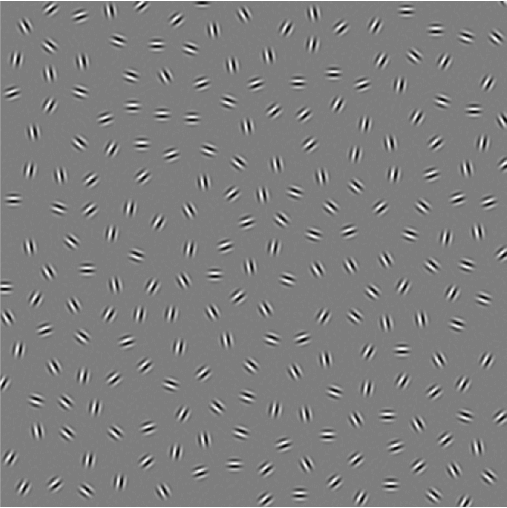
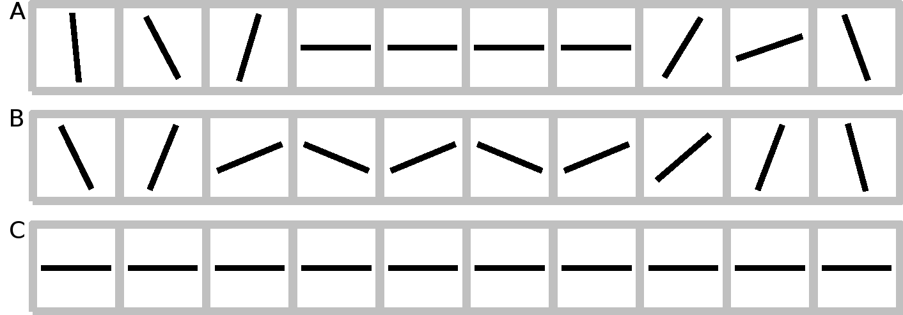
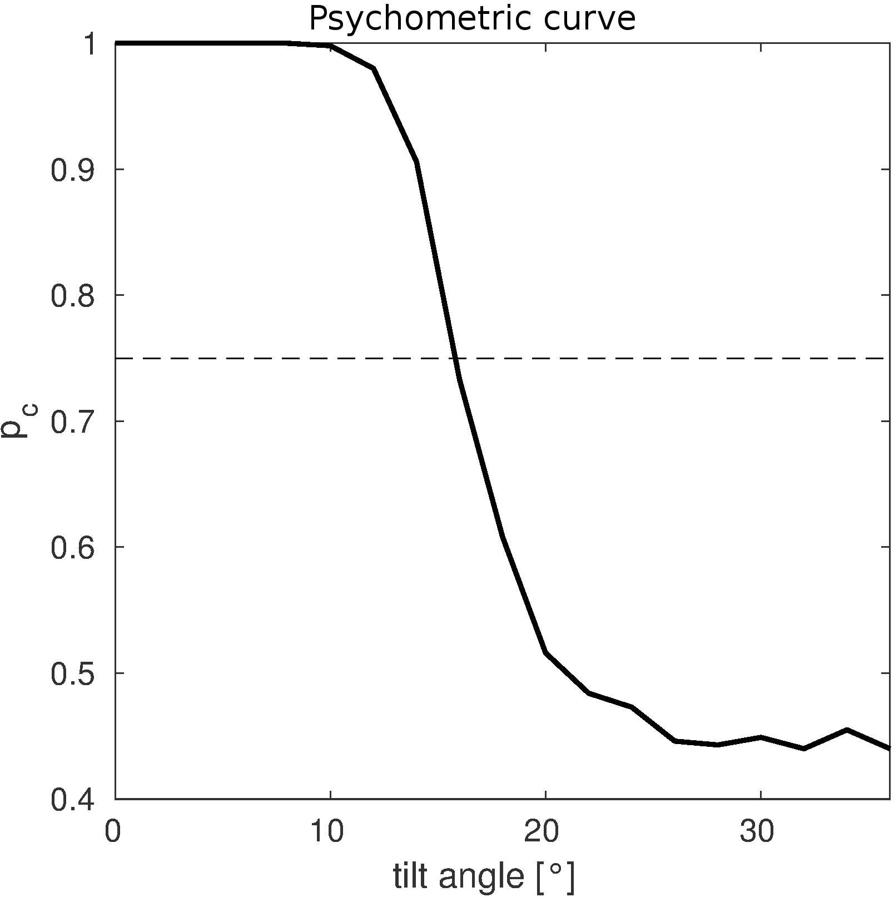

# Contour Integration

**The perception of visual scenes is a very important part in neural processing providing us with a multiplicity of information about our surroundings. For understanding the contents of complex scenes, the brain has to integrate simple local features into global and meaningful percepts. Identifying the computations necessary for building these percepts are a topic of ongoing scientific research. Moreover, the neural mechanisms underlying these computations are still largely unknown. Here we will focus on \emph{contour integration} as one of the fundamental processes in feature integration, and investigate a simple neural network performing this computation.**

**Caption: A contour integration stimulus in a psychophysical experiment might look like this. Can you spot the contour?**

In this mini-project you will implement a recurrent neuronal network performing contour integration in a one-dimensional (1-D) setting and compute the performance of contour detection for a 2-alternative forced choice (2-AFC) task. You will assess psychometric behaviour depending on stimulus parameters such as contour length and tilt angle. To exclude boundary effects, we will assume periodic boundary conditions (look it up on Wiki!). 

**Caption One-dimensional stimulus consisting of a number of line segments forming contours of different lengths, which are embedded into randomly oriented background elements.
A: Open contour, zero tilt angle; B: Open contour, non-zero tilt angle; C: 'Closed' contour, zero tilt angle.**

**Caption: This is what a model psychometric curve for performances($p_c$) in an 2-AFC test might look like.**

Your stimulus will consist of a set of line segments $\vec{e}_i = \{x_i, \phi_i\}$, $i = 1 ... N$.

To keep the model simple, at each line segment position only the neuronal populations maximally tuned to the orientation $\phi_i$ will be modeled. All other populations are assumed to be silent. Each neural population is characterized by an activity $A_{i}(t)$, and its dynamics are described by simplified Wilson-Cowan equations:

$$\tau \frac{d A_i(t)}{dt}  =  -A_i(t)+g[ J^{rec}_i(t) + J^{ext}_i(t)]$$

Here, $J^{ext}_i(t)$ is the external input provided by the stimulus,  $J^{rec}_i(t)$ is the recurrent input depending on the activities of the other populations,and $g(J_i(t))$ is a neural gain function. Recurrent interactions are defined by:

$$J^{rec}\_i(t) = \sum_k w\_{ik} A\_k(t)$$

with $w_{ik}$ denoting the interaction strength from neuronal population $k$ to neuronal population $i$.

## Set up your Model

### 1.
Stimuli: Create stimuli with periodic boundary conditions that can be parametrized by their total length, the length of the embedded contour, and the tilt angle between contour elements. Give a random orientation to the background elements. 
\item Neuronal Populations: Which populations are you supposed to model? What is the external input they should be getting and why?

Can you think of a different, more realistic way to represent the neural response to a localized bar? What would be the advantages and disadvantages?

### 2.
Recurrent Couplings: Think of how to choose the recurrent coupling weights, get inspired by your literature. As your model is one-dimensional, you might also come up with a simpler choice. On which factors should interaction strength depend? Also consider the notion of uni- and bi-directionality. 

### 3.
Gain function: What kind of functions would be useful as gain functions? Which function are you going to use?

### 4.
Activities: How should you initialize your neuronal activities? Think of a way to check if your model's activities converged after performing a given number of iteration steps. Plot the activities of your neuronal populations over time as well as the final activities to check if your model is working. Think of a good way to visualize your final activities together with your stimulus configuration.

## Two-Alternative forced choice
Now we use our model in a 2-AFC setting. Present two stimuli to your network, one containing a contour (the 'target'), and one containing only background elements (the 'distracter'). From the two activation patterns, you will have to decide which one of these two stimuli contained the contour.

### 1.
Distractor: Run your simulation also for stimuli which do not contain contours.

### 2.
Assessing Detection Performance: How might the neuronal population's activities differ for a stimulus with and without a contour? Think of different estimators for detecting the presence of a contour from the two activation patterns.

### 3.
ROC: Compute a Receiver Operator Characteristics on the distribution of the target and distractor activities over several trials.

## Simulation

### 1.
Psychometric curves: Create psychometric curves for different stimulus configurations. Try out different parameters on your weight function. How do parameter changes affect the performance?

### 2.
Optimal Detection: Compare your detection schemes. Which ones work better and why?

### 3.
Model vs. Experiment: Are your results plausible? You might ask your tutor for experimental results.

## Some ideas on how to continue

### 1.
Set up a different model (i.e., symmetry of couplings, spatial decay of coupling strengths, self-couplings vs. no self-couplings, incorporation of inhibitory couplings etc.) and compare the results. Which model works best?

### 2.
Think of what you learned about the visual cortex: In which ways are your neuronal connections plausible or implausible?

### 3.
Set up a model for contour integration on 2 dimensional stimuli. You can ask your tutor for help with the creation of stimuli.

## Literature

[1] U. A. Ernst, S. Mandon, N. Schinkel Bielefeld, S. D. Neitzel, A. K. Kreiter, and K. R. Pawelzik. **Optimality of human contour integration.** *PLOS Computational Biology*, 8(5):1-17, 05 2012.

[2] Z. Li. **A neural model of contour integration in the primary visual cortex.** *Neural Computation*, 10(4):903-940, May 1998.
