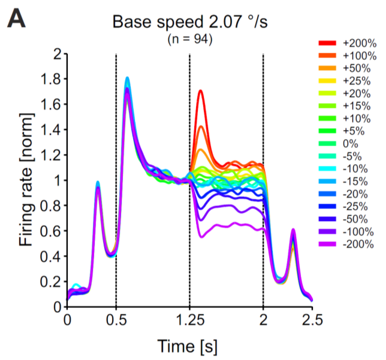

# Divisive inhibition: a dynamical circuit for change detection 

**Neural computation is highly flexible and adjusts the spatio-temporal context of external stimuli and to the current behavioral task. This flexibility is an important aspect why squishy brains are under the rapidly changing conditions in daily life still superior to machines. Divisive inhibition is a fundamental concept realizing an adaptive dynamics which has interesting functional consequences. For example, it can enhance changes in the sensory input:**

**Think of a monster suddenly leaping from its hiding place -- can your brain detect this change in a natural scene in time, or will you be a delicious meal just a few moments later?**

**In this mini-project, you will implement a divisive inhibition circuit, study its properties, and apply it for change detection in natural scenes.**

## Define your research programme (first week):

Dynamic divisive inhibition has been studied before, and applied to explain data from macaque monkey visual area MT. These ideas will help you to set up a circuit which exhibits a transient dynamics. Study the literature [1] and define a research plan: What questions will you focus on, what is your approach, which methods will you use, and which investigations will be carried out? Present your research plan together with the scientific background of your study to your fellow students and supervisors.

Dynamic divisive inhibition has been studied before, and applied to explain data from macaque monkey visual area MT. These ideas will help you to set up a circuit which exhibits a transient dynamics.

## Conduct research on your model (second \& third week):

Implement a divisive inhibition circuit, study its dynamics to different time-varying inputs, and apply it to movies captured from your webcam according to the following guidelines:

### a.
Set up a basic circuit consisting of an excitatory unit, which receives divisive input from an inhibitory unit. We will name this circuit the **Div**isive **In**hibition on **E**xcitation-model, short **DivInE**-model. Implement a convenient numerical integration scheme for solving the corresponding differential equations. Adjust DivInE's parameters such that it exhibits a similar response to step input currents as displayed on the right.

### b.
Analyze the transfer characteristics of the **DivInE**-model: It seems as if the DivInE-model 'likes' fast changes more than strong input currents You can investigate this property systematically by computing the transfer characteristics of the model, i.e. how well changes on a particular time scale (frequency) are transmitted by the circuit.

For this purpose, generate a white noise signal $I(t)$ and use it to probe how the inhibitory and excitatory units respond to such an input. Compare the amplitude spectra of the input and output signals, and interpret your result by relating the shape of the spectra to the model's time constants.

### c.
Let's detect changes in natural scenes: use your webcam and capture a short scene containing some movements. Construct a population of **DivInE**-circuits, where for each pixel in your movie you assign one circuit. Use as input to one circuit the brightness of one pixel in your movie. Compute the output of the **DivInE**-population and display how it changes over time (you can generate a movie from the output sequence.

## Into the unknown (optional):
If you still have time in your mini-project and/or want to go beyond established facts,you might focus on the following questions: 

### a.
How can you extend the model such that changes from bright to dark also generate positive transients...?

### b.
How could you use the circuit to normalize for visual contrast differences across the visual field? 	Think about including spatial interactions into the inhibitory interaction...

### c.
How would you implement either \emph{spatial} attention or attention to changes on particular **temporal** scales...?

## Literature

[1] Ernst, U., Chen, X., Bohnenkamp, L., Galashan, F. O., \& Wegener, D. (2021). **Dynamic divisive normalization circuits explain and predict change detection in monkey area MT.** *PLOS Computational Biology* 17(11): e1009595. [https://doi.org/10.1371/journal.pcbi.1009595](https://doi.org/10.1371/journal.pcbi.1009595)
