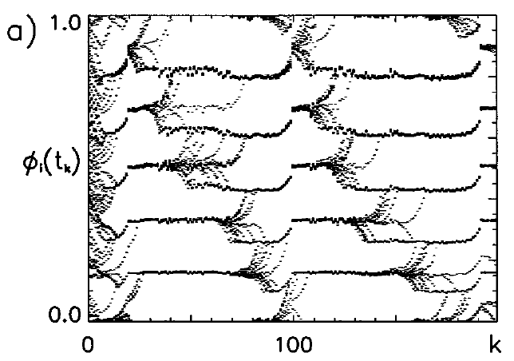

# Recurrent networks: Temporal dynamics and synchronization

**Synchronization and oscillations are collective phenomena which exist in many brain areas, and have been measured with a range of different recording techniques (EEG, MEG, intracortical recordings, optical imaging). It seems that precise temporal coordination is one of the key mechanisms underlying information processing in the brain. But how does synchronization emerge from the interplay of different neurons? How does the structure of the network enhance or suppress synchronization? How can two neurons establish synchronous activity if a spike needs to travel a certain time until arriving at the partner cell?**

In this project we will study a network of spiking neurons and characterize their synchronization behavior with and without synaptic conduction delays. You will learn how to build and to simulate a network from integrate-and-fire (IaF) neurons which you already know from the CNS-I lecture. Furthermore, you will be familiarized with tools for investigating collective behavior in these networks (and also in real data), allowing you to understand fundamental mechanisms of synchronization and functional consequences for information processing in the brain. In this project, one student could focus on the first task, while the second student would focus on the second task.

**Caption: Beautifully unstable: Synchronization in delay-coupled IaF neurons.**

## 1. Synchronization in constantly driven neural networks

### a.
**Setup:** Create a network of $N$ integrate-and-fire neurons, and implement global couplings with a coupling strength of $\epsilon$. Initialize the neurons in random phases, and drive all neurons with the same constant input current $I_{ext}$. For your simulation, you can use two alternative integration schemes:

* (a) Euler integration or Runge-Kutta integration via the routines provided by scipy, or
* (b) event-based integration using the analytical solution for the evolution of the membrane potential for constant input currents.

### b.
**Test and first simulations:** Test your simulation by setting $\epsilon = 0$ and by plotting the membrane potentials $V_i(t)$ for three neurons $i$ from your network. Then choose either excitatory ($\epsilon > 0$) or inhibitory ($\epsilon < 0$) couplings and run your simulation again. A good way todisplay the network activity is to create a spike-raster-plot, where the spike times (horizontal axis) are indicated by vertical lines for the corresponding neuron index (vertical axis). Creating such a plot is most conveniently performed by a separate function and not by your main simulation script.

* (a) For which values of $\epsilon$ do you observe synchronization between the neurons, and how does the time it needs until (almost) all neurons are synchronous depend on $\epsilon$?
* (b) On which features of the population do you base your estimation whether there is synchronization between neurons? Devise a mathematical measure of synchronization between two neurons, which should be close to zero if the neurons are not synchronized and which should be equal to $1$ if they are **perfectly** synchronized. 

### c.
**Introducing delays:** Introduce a global delay $\tau$ into your simulation. Again, investigate the collective behavior with excitatory and inhibitory couplings. What do you observe now? Compare to previous results!

### d.
**Phase space diagram:** Let us pick just two IaF neurons. The goal is to understand precisely under which conditions synchrony emerges. Assume that at time $t=0$ the first neuron just fired an action potential. The evolution of the system is completely specified by the coupling strength $\epsilon$ and the membrane potential $V_0$ of the second neuron at time $t=0$. Your task is to create \emph{phase space diagram}, with axes $\epsilon$ and $V_0$, which annotates the observed qualitative synchronization (in-phase, anti-phase, etc) for each point $(\epsilon, V_0)$.

### e.
**Stability and noise:** By now it should be obvious to you that it is almost impossible to prevent pulse-coupled neurons from not synchronizing - but the stability of steady states becomes apparent as soon as some noise is included into the simulation. Extend your program(s) to include noise, and again observe synchronization behavior with and without delays, with positive and negative couplings. Does synchronization still take place? How many different clusters of neurons with in-phase synchronization emerge?

### f.
**Model neurons:** Linear integrate and fire neurons are mathematically simple, but lack biophysical detail. Nonlinear integrate and fire models, while still being simple to simulate, are able to account for a larger portion of the dynamics of biological neurons. In order to investigate if (some of) your results are just artefacts of the chosen neuron model, redo the previous tasks with (a) the quadratic IaF and (b) the exponential IaF model and compare the results. Are there qualitative and/or quantitative changes in the synchronization dynamics?

## 2. Collective dynamics of randomly driven neurons

There are only few conditions under which neurons in the brain receive an approximately constant and homogeneous external input like in the previous task. More generally, neurons are driven by barrages of action potentials from other neurons, which appear quite random and can be modeled as stochastic processes.

### a.
**Setup:** Instead of using a global coupling, link your integrate and fire neurons randomly to $K$ other neurons ($K \ll N$) and drive your system stochastically with a strong noisy input, e.g. a Poissonian process. Choose $N_E$ excitatory and $N_I$ inhibitory neurons with excitatory coupling strengths $J > 0$ and inhibitory coupling strenghts $-gJ$, $g > 0$.

### b.
**Collective dynamics:** Quantify the resulting population dynamics in dependence of the model parameters. Use your neurobiological knowledge to choose realistic values for the parameters! In dependence of the parameter values, do you observe qualitatively different dynamics? Are you observing a synchronous or an asynchronous population dynamics, are individual neurons firing regularly? Use mathematical measures such as mean firing rates, the CV or interspike-intervals to quantify these states.

### c.
**Phase space diagram:** Use your classification from the previous task to create a phase space diagram for the population dynamics in dependence of the rate of external input and relative strengths of excitatory and inhibitory couplings.

### d.
**Neural avalanches:** Theory predicts that neuronal networks achieve maximal computational capabilities at the transition point between an asynchronous and synchronous population dynamics [4]. Find an order parameter that governs the transition from an asynchronous (sub-critical) to synchronous (critical) population dynamics. What is the (critical) value of the order parameter at the transition point? You can quantify the critical point by the existence of a large valley of action potentials which are elicited by a single spike, termed neuronal avalanches. At the critical point, the avalanche size probability distribution is expected to scale like a power law, $p(s) \sim s^{-\gamma}$, $\gamma > 0$. Which value of $\gamma$ do you find at the critical point?

### e.
**Different model neurons:** As in task 1., do you observe qualitative and/or quantitative changes in the population dynamics for the biologically more plausible quadratic and exponential integrate and fire models? 

## Literature
[1] Ernst, U., Pawelzik, K., \& Geisel, T. (1995). **Synchronization induced by temporal delays in pulse-coupled oscillators.** *Physical review letters*, 74(9), 1570

[2] Buck, J., \& Buck, E. (1968). **Mechanism of Rhythmic Synchronous Flashing of Fireflies: Fireflies of Southeast Asia may use anticipatory time-measuring in synchronizing their flashing.** *Science*, 159(3821), 1319-1327.  
  
[3] Brunel, N. (2000). **Phase diagrams of sparsely connected networks of excitatory and inhibitory spiking neurons.** *Neurocomputing*, 32, 307-312.

[4] Shew, W. L., Yang, H., Petermann, T., Roy, R., \& Plenz, D. (2009). **Neuronal avalanches imply maximum dynamic range in cortical networks at criticality.** *Journal of neuroscience*, 29(49), 15595-15600.x
