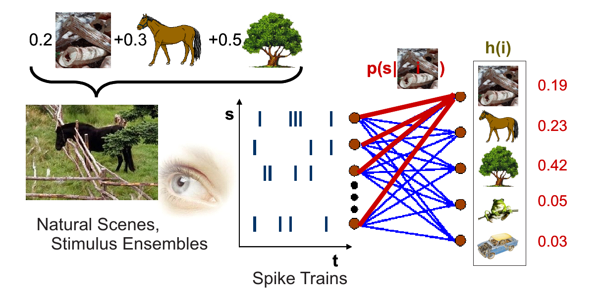
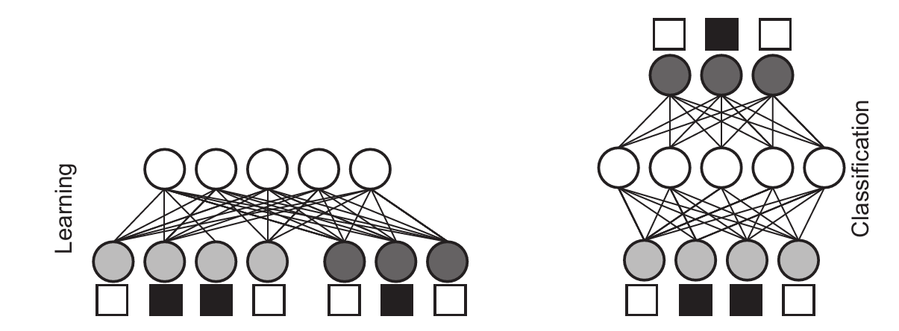

# Computation Spike by Spike

**Perception is fast and accurate, despite the apparent stochasticity of neuronal activities in cortex. As an example, Thorpe and coworkers have shown that natural images are classified within less than 130 msec, thus requiring as few as only one spike per processing stage. In this project, you will investigate a novel generative model which is driven by stochastic spike trains. It can perform non-linear computations, solve typical classification problems, and represent images on the basis of only a few single spikes [1].**

Generative models represent a framework that is well suited for describing probabilistic computation. In technical contexts, generative models have been used successfully, for example, for deconvolution of noisy, blurred images. Since information processing in the brain, too, seems to be stochastic in nature, generative models are also promising candidates for modelling neural computation. In many practical applications and - because firing rates are positive - possibly also in the brain, generative models are subject to nonnegativity constraints on their parameters and variables. The subcategory of update algorithms for these constrained models was termed nonnegative matrix factorization (NNMF) [2]. The objective of NNMF is to iteratively factorize scenes (images) $V_µ$ into a linear additive superposition $H_µ$ of elementary features $W$ such that $V_µ \approx W H_µ$. The Spike-by-Spike (SbS) network, which you will use, is a variant that works on single spikes [1]. 

**Caption: Example scheme of the general framework you will investigate. A scene $V$ (left) composed as a superposition of different features or objects is coded into stochastic spike trains $S$ by the sensory system (middle). In this example, the scene comprises a fence, a tree, and a horse. With each incoming spike at one input channel $s$, the model updates the internal variables $h(i)$ of the hidden nodes $i$ (left). The generative network uses the likelihoods $p(s|i)$ to evolve its internal representation $H$ toward the best explanation, which maximizes the likelihood of the observation $S$. An alternative application of a generative model can be used to infer functional dependencies in its input.**

The SbS framework is universal because it can learn Boolean functions and perform computations on the basis of single stochastic spikes. Furthermore, it can be extended to hierarchical structures, which in case of Boolean functions leads to a reduction of the required neuronal resources. To demonstrate its performance you will apply it to classification tasks (e.g. the USPS data base with pictures of handwritten digits). You can also investigate the algorithm as an implementation with integrate-and-fire model neurons. Learning in this neurophsyiologically realistic framework corresponds to a Hebbian rule. When trained on natural images, the algorithm generates oriented and localized receptive fields, and the algorithm allows to reconstruct natural scenes from spike trains with few spikes per input neuron.

**Caption: (left) Spike-by-spike network for training a classification task (binary input / output shown as empty = 0 and filled = 1 boxes). The training patterns with $S_p$ components (here the first 4 neurons; depicted by the less dark filled circles), together with their correct classification into one of $S_c$ classes (the other 3 neurons; depicted by the darker filled circles), are presented as randomly drawn spike trains to $S = S_p + S_c$ input nodes during learning. The network thereby finds a suitable representation $p(s|i)$ of the input ensemble and estimates an internal state $h(i)$ for each input pattern according to the Spike-by-Spike learning algorithm. (right) Spike-by-spike network for classification of patterns. The test patterns are presented to the $S_p$ input nodes (now the 4 neurons on the lowest layer), and an appropriate internal state $h(i)$ explaining the actual pattern is estimated by the SbS algorithm. From the internal state, a classification is inferred (highest layer) and compared to the correct classification.**

## Boolean Functions

Boolean functions are nice toy models because in many cases they allow us to deduce the correct parameters $p(s|i)$ (i.e., the 'weights') of the generative model just by looking at them. Thus we can check if the network stored the correct information in its weights during learning. 

### 1.
Set up a network for a Boolean function (e.g. XOR) where you can guess the network structure. Provide a meaningful input and update the internal representation $\vec{h}$ with each incoming spike. Observe the dynamics of the internal variables and quantify how computation performance evolves over time.

### 2.
Learn the weights with one of the two learning rules (batch learning or the single spike learning rule) and compare them with your weights. 

### 3.
Extend your program to randomly chosen $N$-bit Boolean functions which you can generate with e.g. rand(2\^{}N,1) < 0.5. 

### 4.
(Advanced challenge) For the XOR case, replace the neurons by integrate-and-fire neurons. More information will be provided if this challenge will be tackled.  

## Classifying handwritten digits

Such a network can be used to classify handwritten digits like they are available in the USPS benchmark database. 

### 1.
Learn the weights for performing such a classification via batch learning.

### 2.
Parallelize the learning procedure in Matlab, avoiding as many for-loops as possible.

### 3.
Investigate how the parameters of the network (i.e., the update constants $\epsilon$ and $\gamma$, weighting $\lambda$, or number of hidden nodes) change the classification performance.

## Boolean functions -- more layers

It is possible to reformulate Boolean functions in a hierarchical tree structure. This can allow to save a significant number of neurons. For the example of a 16-bit XOR function, the number of required neurons can be reduced from 65570 neurons down to 94. 

### 1.
Design your own Spike-by-Spike Boolean hierarchical network, e.g. for a 4-bit XOR function or any other Boolean function for which you can deduce the network structure and required weights by thinking. Implement the network and investigate its dynamics. 

### 2.
(Advanced challenge) Use the new learning rules for a recurrent hierarchical Spike-by-Spike network, which are currently under development. 

## Literature

[1] Ernst, UA, Rotermund, D, Pawelzik, KR (2007). **Efficient computation based on stochastic spikes.** *Neural Computation* 19 (5): 243-257 

[2] Lee, Daniel D. and H. Sebastian Seung (1999). **Learning the parts of objects by non-negative matrix factorization.** *Nature* 401.6755: 788-791. 
