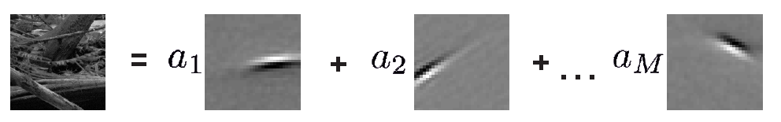

# Natural scenes and sparse coding in visual cortex

**Visual scenes are more than just a bunch of colored pixels: they are composed of numerous elementary components in complex arrangements, thus creating image patterns with a rich structure. How can our brain make sense of such a complex visual input and perform a meaningful computation such as recognizing objects or segregating a scene into foreground and background?**

**One central hypothesis in Computational Neuroscience is that the visual system decomposes visual scenes into a set of elementary components or features such as oriented edges which could form the boundary of an object -- but how does the brain perform such a computation? Moreover, how does the brain 'know' about the elementary components a visual scene is composed of? To investigate these questions, you will simulate a simple neural network that decomposes a visual scene into its elementary features. If time allows, you can also train your network to find the most appropriate features for describing visual scenes.**

In this mini-project, you will focus on the neural network model described in [2]. This model implements a biologically inspired version of what is known as the \emph{sparse coding} hypothesis ([1]), which conjectures an optimal sensory coding approach where a neural population uses \emph{as few active units as possible} to represent a stimulus.

Sparse coding assumes that an image $\vec{x}$ with $N$ pixels can be written as a linear superposition of $M$ fundamental features $\vec{\varphi}_j$

**Equation (1)** 
$$\vec{x} = \sum_{j=1}^M a_j \vec{\varphi}_{j},$$ 

where actually just a very small number of coefficients $a_j$ is different from zero.

Both the features $\vec{\varphi}_j$ and the coefficients $a_j$ can be found by simultaneously minimizing two quantities: 

(i) the error made by the linear estimate in approximating the real image and 

(ii) the cost of having many non-zero coefficients (i.e. many active neurons). 

This optimization problem can be expressed as minimization of an energy function $E$ via

**Equation (2)**
$$\min\_{a_j,  \vec{\varphi}\_j} \left\\{ E(a\_j, \vec{\varphi}\_j) \right\\}$$

with:

**Equation (3)**
$$E(a\_j, \vec{\varphi}\_j) := \sum\_{k=1}^N \sum_{j=1}^M \big(x\_k - \varphi\_{kj}a\_j \big)^2 + \lambda \sum_{j=1}^M |a\_j|$$

and can be solved in several ways. Interestingly, the result one gets is that the features will look like localized oriented filters of different spatial frequencies as shown above.

This naturally suggest to interpret the quantities $\vec{\varphi}_{j}$ as (classical) receptive fields of V1 cells and the coefficients $a_j$ as the firing rates of these neurons.

Now, assume that you already know a complete feature set 

$${\vec{\varphi}\_{j}}\_{j=1,\ldots,M}$$

(this is often called 'dictionary' in the literature). What you will implement is a dynamical system that gives as output the coefficients needed to represent a visual input. It is described by two simple equations: 

**Equation (4)**
$$\tau \frac{du_j}{dt} = -u_j + \sum_{k=1}^N x_k(t) \varphi_{kj} - \sum_{k=1}^N \sum_{\substack{i=1,\ldots, M\\ i\neq j}}\varphi_{ki}\varphi_{kj}a_i(t)$$

**Equation (5)**
$$a_j(t) = [u_j(t) - \lambda]^{+}$$

Each of the $M$ internal units is characterized by a 'membrane potential' $u_j$ and receives a feed-forward input 

$$\sum_{k=1}^N x_k(t) \varphi_{kj}$$

from a visual stimulus $\vec{x}$, and a recurrent input 

$$-\sum_{k=1}^N \sum_{\substack{i=1,\ldots, M\\ i\neq j}}\varphi_{ki}\varphi_{kj}a_i(t)$$ 

from other units; the output or 'firing rate' $a_j(t)$ is a thresholded version of $u_j(t)$.

## Analysis

### 1.
Sketch the network with circles representing the neurons and arrows representing the feedforward and recurrent input contributions. Annotate your sketch with the mathematical symbols introduced above. 

### 2.
Rewrite the model (equations (4)-(5)) in a vectorized form: 
it will be extremely helpful for your Matlab implementation.

### 3.
Prove that the dynamics proposed by the model (equations (4) and (5)) 
indeed solves the optimization problem defined by expression (2). For this, you have to use the definition for the energy $E$ (3) and show that $$\dot{a}_m \propto -\frac{\partial E}{\partial a_m}$$

## Simulations

## 1.
write a function that takes as input an image $\vec{x}$ and a matrix containing the $N$ features and gives as output the coefficients $a_j(t)$.

To help you build it and debug it, we provide you with a data set of ten pre-processed natural images (see matlab variable *images*)
and various collections of features (see Matlab variabes *Dict\_Npix\_Mfeat*).

Take a look at these variables, find a way to visualize them and explore their content. 
Think of how to extract an input $\vec{x}$ from the image dataset (maybe write a function that does this for you!)

## 2.
Take the dictionaries provided by us and test your function by computing the coefficients needed to represent an image of your choice. 
How many coefficients are non-zero? How well can you recover the image? How does this depend on the parameter $\lambda$?

## 3.
Neurons in the primary visual cortex (V1) are selective for the size, orientation and frequency of a stimulus falling within a restricted portion of the visual space known as the receptive field. However, many electrophysiological studies show that stimuli placed *outside* the classical receptive field (CRF) can influence the response of V1 cells, causing the emergence of non linear behaviours. These contextual modulations and non linear response properties are commonly referred to as non-classical receptive field (nCRF) effects. Surprisingly, the model you are investigating can reproduce many of these effects -- check out how your model behaves with respect to the nCRF experiments mentioned in the paper. For this purpose, choose one (or more) nCRF effect(s) described in [2] and reproduce them!

## Extras

So far you didn't have to worry about how to obtain a dictionary~--~you worked with a variable that was learned from natural images, stored and given to you.

## 1.
Think of an algorithm to learn from real data the coefficients together with a dictionary. 

**Hint:** The model you implemented already does half of the work for you. 

How would you optimize the function $E(a\_j,  \mathbf{\varphi}\_{j})$ with respect to $\mathbf{\varphi}\_{j}$?
Write it down on paper and, if you have time, go ahead and implement it!

## 2.
Another option to obtain a dictionary is to create an artificial one: 
this might be useful, for example, if you want to have control over the specific features that determine the connectivity of the network.

A choice that doesn't bring you too far from the features learned from natural images is to define $\mathbf{\varphi}_{j}$ as a gabor filter

$$\mathbf{\varphi}_{j}(x_0,y_0,\theta,f,\psi) = \exp{\Big( -\frac{(x^{\prime}-x_0)^2}{2\sigma_x^2} - \frac{(y^{\prime}-y_0)^2}{2\sigma_y^2} \Big)} \cdot \cos(2\pi f y^{\prime} + \psi)$$

which is the product of a sinusoidal wave and a gaussian function. 
Here $(x_0, y_0)$ is the center of the gaussian, $\sigma_x, \sigma_y$ are the standard deviation along the axis, 
% $x^{\prime}$ and $y^{\prime}$ are the rotated axis 

$$x^{\prime} = x \cos(\theta) + y\sin(\theta)$$

$$y^{\prime} = -x \sin(\theta) + y\cos(\theta)$$

$\theta$ is the orientation of the filter, $f$ its spatial frequency and $\psi$ its phase.

Write a function that, given all the above parameters, outputs a gabor filter.

Set a number $N_{\theta}$ of orientations, a number $N_{f}$ of spatial frequencies and a number $N_{\psi}$ of phase offsets and create a dictionary
and create a collection of $N=N_{\theta} N_{f} N_{\psi}$ features with different orientations, spatial frequencies and phases.

Repeat all the tasks with this new dictionary.

## Literature:

[1] Olshausen, Bruno A., and Field David J. (1996). **Emergence of simple-cell receptive field properties by learning a sparse code for natural images.** *Nature* 381.6583: 607.

[2] Zhu, Mengchen, and Rozell Christopher J. (2013). **Visual nonclassical receptive field effects emerge from sparse coding in a dynamical system.** *PLoS Comput Biol* 9.8: e1003191.
