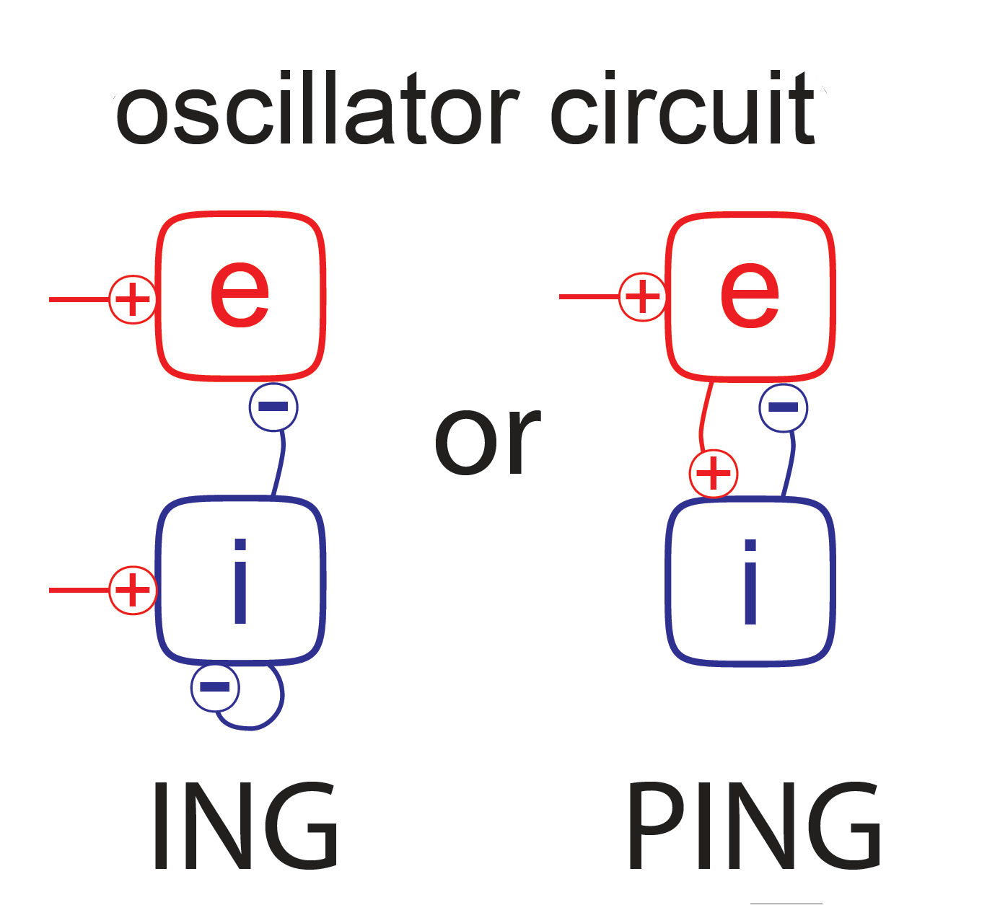

# Synchronization and dynamic oscillations in the visual system 

**Oscillatory activity is ubiquitous throughout the cortex and has been hypothesized to play a central role for brain function, for example, in realizing selective information routing under attention. Fundamental for establishing oscillatory activity are recurrently coupled neural circuits which engage in a collective dynamics when driven externally. In this mini-project, you will implement a simple network model which is capable to generate gamma-frequency oscillations and investigate its behaviour under different stimulation conditions.**

In the visual system, neurons in areas such as V1 and V4 can engage in Gamma oscillations with a center frequency around 50-90 Hz. It has been a central question for modelers to understand under which conditions such oscillations emerge, what the underlying network mechanisms are, and how their dynamical characteristics depends on system and stimulation parameters. 

More recently, scientists noticed that these gamma oscillations are not stable over time -- their amplitude and duration varies considerably, dividing neural activity into spindles of well-defined oscillations, separated by periods of unstructured activity. It is an unsolved puzzle how the emergence of spindles can be explained or even linked to aspects of visual information processing.

## Define your research programme (first week)

Gamma oscillations have been studied before, and proposals how they are generated in recurrent networks have been put forward. These ideas will help you to set up a network which exhibits gamma oscillations. Study the literature [1] and define a research plan: What questions will you focus on, what is your approach, which methods will you use, and which investigations will be carried out? Present your research plan together with the scientific background of your study to your fellow students and supervisors.

## Conduct research on your model (second \& third week)

Implement a neural network simulation and study the emergence of gamma oscillations according to the following guidelines:

### a.
Use exponential integrate-and-fire neurons for your network. Implement a convenient numerical integration scheme for solving the corresponding differential equations. Adjust the neuron's parameters such that it exhibits a realistic gain function for a constant input current.

### b.
Realize a stochastic external drive whose noise level and average input are independently adjustable, for example using a Poisson process. Quantify the neuron's rate and its variability in dependence on noise level and average input strength.

### c.
Extend the single-neuron simulation to an uncoupled population. Initialize the population such that the neurons are not synchronized. Plot the average population rate in dependence on input drive.

### d.
Implement suitable couplings between the neurons for generating gamma oscillations. For synaptic transmission, you may use $\delta$-pulses or $\alpha$-functions. Think about how to implement conduction delays which might be necessary to establish gamma oscillations.

### e.
Using a low-noise input drive, adjust parameters until the circuit exhibits Gamma oscillations according to one of the fundamental principles proposed in the literature. Confirm the emergence of Gamma oscillations by a spectral analysis. Quantify how Gamma oscillations depend on system parameters (for example, for two parameters of interest). Compute a local field potential by low-pass filtering of population activity, and find a parameter regime in which you will observe intermittent Gamma oscillations (spindles).

## Into the unknown (optional):
If you still have time in your mini-project and/or want to go beyond established facts, you might focus on the following question: Under which conditions do spindles emerge, and how does their statistics depend on model and stimulation parameters?

To address these questions, you might consider the following steps to further investigate your model:

### a.
Characterize Gamma-oscillations by computing Wavelet power spectra...

### b.
Bandpass-filter LFPs in a suitable range to extract Gamma activity from 'noise'...

### c.
Apply the Hilbert-transform to obtain the time-varying amplitude of Gamma oscillations...

### d.
Develop a method to quantify spindle statistics, i.e. on- and offset of spindles, and their magnitude...

### e.
Quantify which effect external drive, noise, internal couplings and neuron parameters do have on the spindle statistics...

## Literature

[1] Gyorgy Buzsaki and Xiao-Jing Wang, **Mechanisms of Gamma Oscillations**, *Annu. Rev. Neurosci.* 2012. 35:203–25
