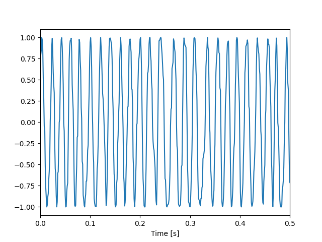
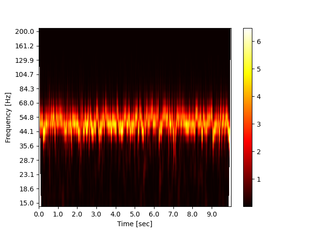
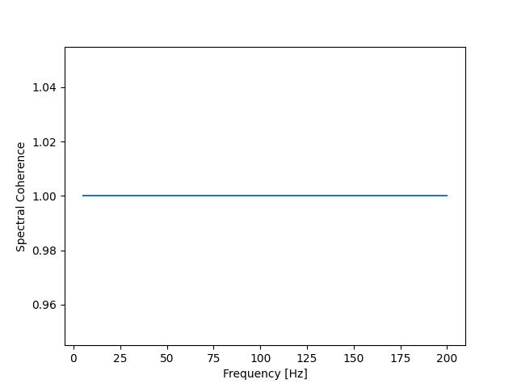

# Spectral Coherence
{:.no_toc}

<nav markdown="1" class="toc-class">
* TOC
{:toc}
</nav>

## Top

Questions to [David Rotermund](mailto:davrot@uni-bremen.de)

## Test data

```python
import numpy as np
import matplotlib.pyplot as plt

f_base: float = 50
f_delta: float = 50

rng = np.random.default_rng(1)
n: int = 10000
dt: float = 1.0 / 1000.0
amplitude: float = 2.0
t: np.ndarray = np.arange(0, n) * dt
y: np.ndarray = np.sin(2.0 * np.pi * f_delta * t) + amplitude * rng.random(t.shape)


np.savez("testdata.npz", y=y, t=t)

plt.plot(t, y)
plt.xlabel("Time [s]")
plt.xlim(0, 0.5)
plt.show()

```


Let us look at wavelet power of the time series:

```python
import numpy as np
import matplotlib.pyplot as plt
import pywt


# Calculate the wavelet scales we requested
def calculate_wavelet_scale(
    number_of_frequences: int,
    frequency_range_min: float,
    frequency_range_max: float,
    dt: float,
) -> np.ndarray:
    s_spacing: np.ndarray = (1.0 / (number_of_frequences - 1)) * np.log2(
        frequency_range_max / frequency_range_min
    )
    scale: np.ndarray = np.power(2, np.arange(0, number_of_frequences) * s_spacing)
    frequency_axis_request: np.ndarray = frequency_range_min * np.flip(scale)
    return 1.0 / (frequency_axis_request * dt)


def get_y_ticks(
    reduction_to_ticks: int, frequency_axis: np.ndarray, round: int
) -> tuple[np.ndarray, np.ndarray]:
    output_ticks = np.arange(
        0,
        frequency_axis.shape[0],
        int(np.floor(frequency_axis.shape[0] / reduction_to_ticks)),
    )
    if round < 0:
        output_freq = frequency_axis[output_ticks]
    else:
        output_freq = np.round(frequency_axis[output_ticks], round)
    return output_ticks, output_freq


def get_x_ticks(
    reduction_to_ticks: int, dt: float, number_of_timesteps: int, round: int
) -> tuple[np.ndarray, np.ndarray]:
    time_axis = dt * np.arange(0, number_of_timesteps)
    output_ticks = np.arange(
        0, time_axis.shape[0], int(np.floor(time_axis.shape[0] / reduction_to_ticks))
    )
    if round < 0:
        output_time_axis = time_axis[output_ticks]
    else:
        output_time_axis = np.round(time_axis[output_ticks], round)
    return output_ticks, output_time_axis


def calculate_cone_of_influence(dt: float, frequency_axis: np.ndarray):
    wave_scales = 1.0 / (frequency_axis * dt)
    cone_of_influence: np.ndarray = np.ceil(np.sqrt(2) * wave_scales).astype(np.int64)
    return cone_of_influence


def mask_cone_of_influence(
    complex_spectrum: np.ndarray,
    cone_of_influence: np.ndarray,
    fill_value: float = np.NaN,
) -> np.ndarray:
    assert complex_spectrum.shape[0] == cone_of_influence.shape[0]

    for frequency_id in range(0, cone_of_influence.shape[0]):
        # Front side
        start_id: int = 0
        end_id: int = int(
            np.min((cone_of_influence[frequency_id], complex_spectrum.shape[1]))
        )
        complex_spectrum[frequency_id, start_id:end_id] = fill_value

        start_id = np.max(
            (
                complex_spectrum.shape[1] - cone_of_influence[frequency_id] - 1,
                0,
            )
        )
        end_id = complex_spectrum.shape[1]
        complex_spectrum[frequency_id, start_id:end_id] = fill_value

    return complex_spectrum


t = np.load("testdata.npz")["t"]
y = np.load("testdata.npz")["y"]
dt = t[1] - t[0]

# The wavelet we want to use
mother = pywt.ContinuousWavelet("cmor1.5-1.0")

# Parameters for the wavelet transform
number_of_frequences: int = 25  # frequency bands
frequency_range_min: float = 5  # Hz
frequency_range_max: float = 200  # Hz

wave_scales = calculate_wavelet_scale(
    number_of_frequences=number_of_frequences,
    frequency_range_min=frequency_range_min,
    frequency_range_max=frequency_range_max,
    dt=dt,
)

complex_spectrum, frequency_axis = pywt.cwt(
    data=y, scales=wave_scales, wavelet=mother, sampling_period=dt
)

cone_of_influence = calculate_cone_of_influence(dt, frequency_axis)

complex_spectrum = mask_cone_of_influence(
    complex_spectrum=complex_spectrum,
    cone_of_influence=cone_of_influence,
    fill_value=np.NaN,
)

plt.imshow(abs(complex_spectrum) ** 2, cmap="hot", aspect="auto")
plt.colorbar()

y_ticks, y_labels = get_y_ticks(
    reduction_to_ticks=10, frequency_axis=frequency_axis, round=1
)

x_ticks, x_labels = get_x_ticks(
    reduction_to_ticks=10, dt=dt, number_of_timesteps=complex_spectrum.shape[1], round=2
)

plt.yticks(y_ticks, y_labels)
plt.xticks(x_ticks, x_labels)

plt.xlabel("Time [sec]")
plt.ylabel("Frequency [Hz]")
plt.show()
```



## Instantanious Spectral Coherence

```python
import numpy as np
import matplotlib.pyplot as plt
import pywt


# Calculate the wavelet scales we requested
def calculate_wavelet_scale(
    number_of_frequences: int,
    frequency_range_min: float,
    frequency_range_max: float,
    dt: float,
) -> np.ndarray:
    s_spacing: np.ndarray = (1.0 / (number_of_frequences - 1)) * np.log2(
        frequency_range_max / frequency_range_min
    )
    scale: np.ndarray = np.power(2, np.arange(0, number_of_frequences) * s_spacing)
    frequency_axis_request: np.ndarray = frequency_range_min * np.flip(scale)
    return 1.0 / (frequency_axis_request * dt)


def get_y_ticks(
    reduction_to_ticks: int, frequency_axis: np.ndarray, round: int
) -> tuple[np.ndarray, np.ndarray]:
    output_ticks = np.arange(
        0,
        frequency_axis.shape[0],
        int(np.floor(frequency_axis.shape[0] / reduction_to_ticks)),
    )
    if round < 0:
        output_freq = frequency_axis[output_ticks]
    else:
        output_freq = np.round(frequency_axis[output_ticks], round)
    return output_ticks, output_freq


def get_x_ticks(
    reduction_to_ticks: int, dt: float, number_of_timesteps: int, round: int
) -> tuple[np.ndarray, np.ndarray]:
    time_axis = dt * np.arange(0, number_of_timesteps)
    output_ticks = np.arange(
        0, time_axis.shape[0], int(np.floor(time_axis.shape[0] / reduction_to_ticks))
    )
    if round < 0:
        output_time_axis = time_axis[output_ticks]
    else:
        output_time_axis = np.round(time_axis[output_ticks], round)
    return output_ticks, output_time_axis


def calculate_cone_of_influence(dt: float, frequency_axis: np.ndarray):
    wave_scales = 1.0 / (frequency_axis * dt)
    cone_of_influence: np.ndarray = np.ceil(np.sqrt(2) * wave_scales).astype(np.int64)
    return cone_of_influence


def mask_cone_of_influence(
    complex_spectrum: np.ndarray,
    cone_of_influence: np.ndarray,
    fill_value: float = np.NaN,
) -> np.ndarray:
    assert complex_spectrum.shape[0] == cone_of_influence.shape[0]

    for frequency_id in range(0, cone_of_influence.shape[0]):
        # Front side
        start_id: int = 0
        end_id: int = int(
            np.min((cone_of_influence[frequency_id], complex_spectrum.shape[1]))
        )
        complex_spectrum[frequency_id, start_id:end_id] = fill_value

        start_id = np.max(
            (
                complex_spectrum.shape[1] - cone_of_influence[frequency_id] - 1,
                0,
            )
        )
        end_id = complex_spectrum.shape[1]
        complex_spectrum[frequency_id, start_id:end_id] = fill_value

    return complex_spectrum


def calculate_wavelet_tf_complex_coeffs(
    data: np.ndarray,
    number_of_frequences: int = 25,
    frequency_range_min: float = 15,
    frequency_range_max: float = 200,
    dt: float = 1.0 / 1000,
) -> tuple[np.ndarray, np.ndarray, np.ndarray]:

    assert data.ndim == 1
    t: np.ndarray = np.arange(0, data.shape[0]) * dt

    # The wavelet we want to use
    mother = pywt.ContinuousWavelet("cmor1.5-1.0")

    wave_scales = calculate_wavelet_scale(
        number_of_frequences=number_of_frequences,
        frequency_range_min=frequency_range_min,
        frequency_range_max=frequency_range_max,
        dt=dt,
    )

    complex_spectrum, frequency_axis = pywt.cwt(
        data=data, scales=wave_scales, wavelet=mother, sampling_period=dt
    )

    return (complex_spectrum, frequency_axis, t)


# Parameters for the wavelet transform
number_of_frequences: int = 25  # frequency bands
frequency_range_min: float = 5  # Hz
frequency_range_max: float = 200  # Hz
dt: float = 1.0 / 1000.0

# I want more trials
f_base: float = 50
f_delta: float = 50

# Test data ->
rng = np.random.default_rng(1)
n_t: int = 10000
n_trials: int = 100
t: np.ndarray = np.arange(0, n_t) * dt
amplitude: float = 2.0

y_a: np.ndarray = np.sin(
    2.0 * np.pi * f_delta * t[:, np.newaxis]
) + amplitude * rng.random((n_t, n_trials))

y_a -= y_a.mean(axis=0, keepdims=True)
y_a /= y_a.std(axis=0, keepdims=True)
# <- Test data

y_b: np.ndarray = y_a.copy()


for trial_id in range(0, n_trials):
    wave_data_a, frequency_axis, t = calculate_wavelet_tf_complex_coeffs(
        data=y_a[..., trial_id],
        number_of_frequences=number_of_frequences,
        frequency_range_min=frequency_range_min,
        frequency_range_max=frequency_range_max,
        dt=dt,
    )

    wave_data_b, frequency_axis, t = calculate_wavelet_tf_complex_coeffs(
        data=y_b[..., trial_id],
        number_of_frequences=number_of_frequences,
        frequency_range_min=frequency_range_min,
        frequency_range_max=frequency_range_max,
        dt=dt,
    )

    cone_of_influence = calculate_cone_of_influence(dt, frequency_axis)

    wave_data_a = mask_cone_of_influence(
        complex_spectrum=wave_data_a,
        cone_of_influence=cone_of_influence,
        fill_value=np.NaN,
    )

    wave_data_b = mask_cone_of_influence(
        complex_spectrum=wave_data_b,
        cone_of_influence=cone_of_influence,
        fill_value=np.NaN,
    )

    if trial_id == 0:
        calculation = wave_data_a * wave_data_b
        norm_data_a = np.abs(wave_data_a) ** 2
        norm_data_b = np.abs(wave_data_b) ** 2

    else:
        calculation += wave_data_a * wave_data_b
        norm_data_a += np.abs(wave_data_a) ** 2
        norm_data_b += np.abs(wave_data_b) ** 2

calculation /= float(n_trials)
norm_data_a /= float(n_trials)
norm_data_b /= float(n_trials)

coherence = np.abs(calculation) ** 2 / (norm_data_a * norm_data_b)

y_reduction_to_ticks: int = 10
x_reduction_to_ticks: int = 10
y_round: int = 1
x_round: int = 1

freq_ticks, freq_values = get_y_ticks(
    reduction_to_ticks=y_reduction_to_ticks,
    frequency_axis=frequency_axis,
    round=y_round,
)

time_ticks, time_values = get_x_ticks(
    reduction_to_ticks=x_reduction_to_ticks,
    dt=dt,
    number_of_timesteps=t.shape[0],
    round=x_round,
)

plt.plot(frequency_axis, np.nanmean(coherence, axis=-1))
plt.ylabel("Spectral Coherence")
plt.xlabel("Frequency [Hz]")
plt.show()
```


