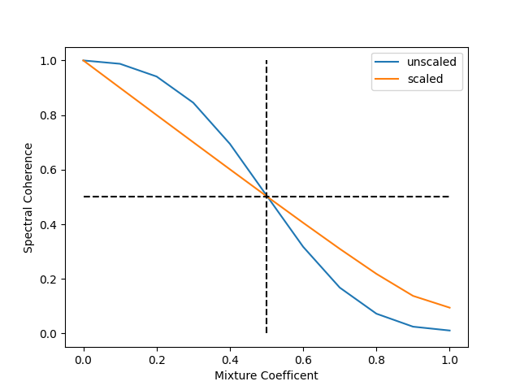

# Linearize the spectral coherence 
{:.no_toc}

<nav markdown="1" class="toc-class">
* TOC
{:toc}
</nav>

## Top

Questions to [David Rotermund](mailto:davrot@uni-bremen.de)

Let us assume we have two time series (white in spectrum) $x_1(t)$ and $x_2(t)$. Both are linearly mixed together via a mixing coefficent $\alpha$:

$$y(t) = (1- \alpha) x_1(t) + \alpha * x_2(t)$$

Wouldn't it to be nice if the spectral coherence would be $\alpha$?

For white times series with the length of infinity this can be achived via the transformation

```python
coherence_scaled = 1.0 / (1.0 + np.sqrt((1.0 / coherence) - 1.0))
```
see [Attention Selectively Gates Afferent Signal Transmission to Area V4](https://www.jneurosci.org/content/38/14/3441) for details 

The emphesis lies on infinity and a white spectrum. For shorter time series the results might vary. 



```python
import numpy as np
import matplotlib.pyplot as plt
import pywt  # type: ignore
from tqdm import trange  # type: ignore


# Calculate the wavelet scales we requested
def calculate_wavelet_scale(
    number_of_frequences: int,
    frequency_range_min: float,
    frequency_range_max: float,
    dt: float,
) -> np.ndarray:
    s_spacing: np.ndarray = (1.0 / (number_of_frequences - 1)) * np.log2(
        frequency_range_max / frequency_range_min
    )
    scale: np.ndarray = np.power(2, np.arange(0, number_of_frequences) * s_spacing)
    frequency_axis_request: np.ndarray = frequency_range_min * np.flip(scale)
    return 1.0 / (frequency_axis_request * dt)


def get_y_ticks(
    reduction_to_ticks: int, frequency_axis: np.ndarray, round: int
) -> tuple[np.ndarray, np.ndarray]:
    output_ticks = np.arange(
        0,
        frequency_axis.shape[0],
        int(np.floor(frequency_axis.shape[0] / reduction_to_ticks)),
    )
    if round < 0:
        output_freq = frequency_axis[output_ticks]
    else:
        output_freq = np.round(frequency_axis[output_ticks], round)
    return output_ticks, output_freq


def get_x_ticks(
    reduction_to_ticks: int, dt: float, number_of_timesteps: int, round: int
) -> tuple[np.ndarray, np.ndarray]:
    time_axis = dt * np.arange(0, number_of_timesteps)
    output_ticks = np.arange(
        0, time_axis.shape[0], int(np.floor(time_axis.shape[0] / reduction_to_ticks))
    )
    if round < 0:
        output_time_axis = time_axis[output_ticks]
    else:
        output_time_axis = np.round(time_axis[output_ticks], round)
    return output_ticks, output_time_axis


def calculate_cone_of_influence(dt: float, frequency_axis: np.ndarray):
    wave_scales = 1.0 / (frequency_axis * dt)
    cone_of_influence: np.ndarray = np.ceil(np.sqrt(2) * wave_scales).astype(np.int64)
    return cone_of_influence


def mask_cone_of_influence(
    complex_spectrum: np.ndarray,
    cone_of_influence: np.ndarray,
    fill_value: float = np.NaN,
) -> np.ndarray:
    assert complex_spectrum.shape[0] == cone_of_influence.shape[0]

    for frequency_id in range(0, cone_of_influence.shape[0]):
        # Front side
        start_id: int = 0
        end_id: int = int(
            np.min((cone_of_influence[frequency_id], complex_spectrum.shape[1]))
        )
        complex_spectrum[frequency_id, start_id:end_id] = fill_value

        start_id = np.max(
            (
                complex_spectrum.shape[1] - cone_of_influence[frequency_id] - 1,
                0,
            )
        )
        end_id = complex_spectrum.shape[1]
        complex_spectrum[frequency_id, start_id:end_id] = fill_value

    return complex_spectrum


def calculate_wavelet_tf_complex_coeffs(
    data: np.ndarray,
    number_of_frequences: int = 25,
    frequency_range_min: float = 15,
    frequency_range_max: float = 200,
    dt: float = 1.0 / 1000,
) -> tuple[np.ndarray, np.ndarray, np.ndarray]:

    assert data.ndim == 1
    t: np.ndarray = np.arange(0, data.shape[0]) * dt

    # The wavelet we want to use
    mother = pywt.ContinuousWavelet("cmor1.5-1.0")

    wave_scales = calculate_wavelet_scale(
        number_of_frequences=number_of_frequences,
        frequency_range_min=frequency_range_min,
        frequency_range_max=frequency_range_max,
        dt=dt,
    )

    complex_spectrum, frequency_axis = pywt.cwt(
        data=data, scales=wave_scales, wavelet=mother, sampling_period=dt
    )

    return (complex_spectrum, frequency_axis, t)


def calculate_spectral_coherence(
    n_trials: int,
    y_a: np.ndarray,
    y_b: np.ndarray,
    number_of_frequences: int,
    frequency_range_min: float,
    frequency_range_max: float,
    dt: float,
) -> tuple[np.ndarray, np.ndarray, np.ndarray]:

    for trial_id in range(0, n_trials):
        wave_data_a, frequency_axis, t = calculate_wavelet_tf_complex_coeffs(
            data=y_a[..., trial_id],
            number_of_frequences=number_of_frequences,
            frequency_range_min=frequency_range_min,
            frequency_range_max=frequency_range_max,
            dt=dt,
        )

        wave_data_b, frequency_axis, t = calculate_wavelet_tf_complex_coeffs(
            data=y_b[..., trial_id],
            number_of_frequences=number_of_frequences,
            frequency_range_min=frequency_range_min,
            frequency_range_max=frequency_range_max,
            dt=dt,
        )

        cone_of_influence = calculate_cone_of_influence(dt, frequency_axis)

        wave_data_a = mask_cone_of_influence(
            complex_spectrum=wave_data_a,
            cone_of_influence=cone_of_influence,
            fill_value=np.NaN,
        )

        wave_data_b = mask_cone_of_influence(
            complex_spectrum=wave_data_b,
            cone_of_influence=cone_of_influence,
            fill_value=np.NaN,
        )

        if trial_id == 0:
            calculation = wave_data_a * np.conj(wave_data_b)
            norm_data_a = np.abs(wave_data_a) ** 2
            norm_data_b = np.abs(wave_data_b) ** 2

        else:
            calculation += wave_data_a * np.conj(wave_data_b)
            norm_data_a += np.abs(wave_data_a) ** 2
            norm_data_b += np.abs(wave_data_b) ** 2

    calculation /= float(n_trials)
    norm_data_a /= float(n_trials)
    norm_data_b /= float(n_trials)

    coherence = np.abs(calculation) ** 2 / ((norm_data_a * norm_data_b) + 1e-20)

    return np.nanmean(coherence, axis=-1), frequency_axis, t


# Parameters for the wavelet transform
number_of_frequences: int = 3  # frequency bands
frequency_range_min: float = 5  # Hz
frequency_range_max: float = 200  # Hz
dt: float = 1.0 / 1000.0

# Test data ->
n_t: int = 10000
n_trials: int = 100

# We select one frequency because all look the same for this white random signal
frequency_select: int = 1

rng = np.random.default_rng(1)
mother_time_series_a: np.ndarray = rng.random((n_t, n_trials))
mother_time_series_a -= mother_time_series_a.mean(axis=0, keepdims=True)
mother_time_series_a /= mother_time_series_a.std(axis=0, keepdims=True)

mother_time_series_b: np.ndarray = rng.random((n_t, n_trials))
mother_time_series_b -= mother_time_series_b.mean(axis=0, keepdims=True)
mother_time_series_b /= mother_time_series_b.std(axis=0, keepdims=True)
# <- Test data

alpha_vector: np.ndarray = np.linspace(0.0, 1.0, 11, endpoint=True)


for alpha_id in trange(0, alpha_vector.shape[0]):

    alpha: float = alpha_vector[alpha_id]

    y_a = mother_time_series_a.copy()
    y_b = (1.0 - alpha) * mother_time_series_a + alpha * mother_time_series_b

    y_b -= y_b.mean(axis=0, keepdims=True)
    y_b /= y_b.std(axis=0, keepdims=True)

    temp, frequency_axis, t = calculate_spectral_coherence(
        n_trials=n_trials,
        y_a=y_a,
        y_b=y_b,
        number_of_frequences=number_of_frequences,
        frequency_range_min=frequency_range_min,
        frequency_range_max=frequency_range_max,
        dt=dt,
    )

    if alpha_id == 0:
        coherence: np.ndarray = np.zeros((temp.shape[0], alpha_vector.shape[0]))
    coherence[:, alpha_id] = temp


coherence_scaled = 1.0 / (1.0 + np.sqrt((1.0 / coherence) - 1.0))

plt.plot(alpha_vector, coherence[frequency_select, :], label="unscaled")
plt.plot(alpha_vector, coherence_scaled[frequency_select, :], label="scaled")
plt.plot([0.5, 0.5], [0, 1], "k--")
plt.plot([0, 1], [0.5, 0.5], "k--")
plt.ylabel("Spectral Coherence")
plt.xlabel("Mixture Coefficent")
plt.legend()
plt.show()
```


