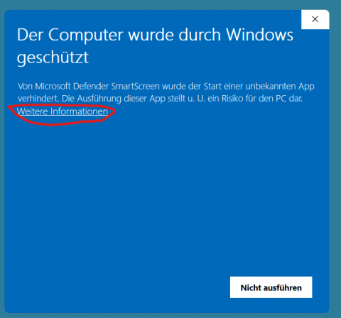
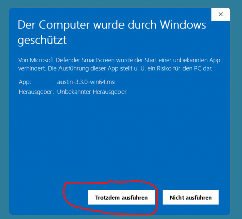
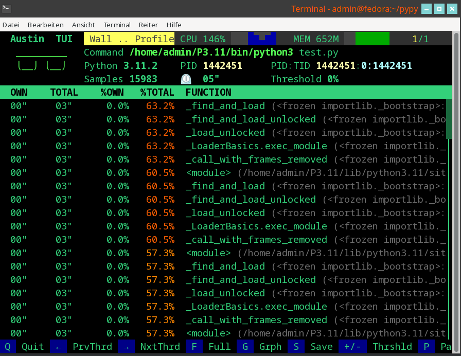
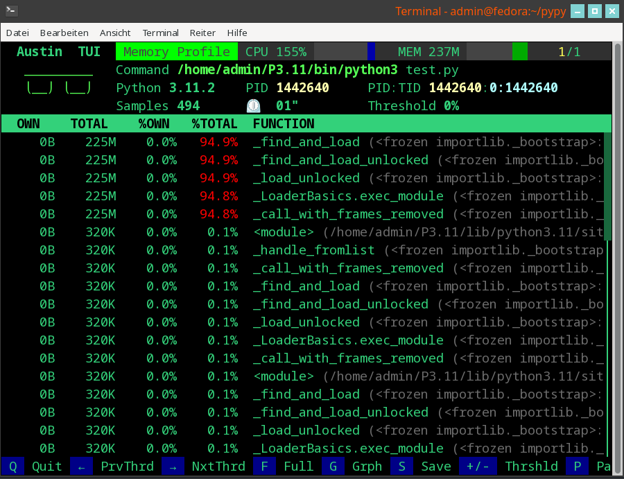

# Austin -- Time and memory profiling
{:.no_toc}

<nav markdown="1" class="toc-class">
* TOC
{:toc}
</nav>

## Top

We want to see where your Python program requires the most processing time and memory. For this we will use a time- and memory profiler called Austin. 

Questions to [David Rotermund](mailto:davrot@uni-bremen.de)

## Installing Austin

Obviously, first we need to get [Austin](https://github.com/p403n1x87/austin). On the Austin website, there a several methods described how to install it. 

### Linux as user

Compiling

```shell
git clone --depth=1 https://github.com/P403n1x87/austin.git
cd austin
autoreconf --install
./configure
make
```

Adding it to the Python3 bin directory, e.g.

```shell
cp src/austin ~/P3.11/bin/
```

### Windows

Go [here](https://github.com/P403n1x87/austin/releases/latest) and download the latest Windows64 msi installer. And don't let Windows intimidate you: 





## Installing [Austin TUI](https://github.com/P403n1x87/austin-tui)

```shell
pip install austin-tui
```

Under Windows you might need (not tested yet):

```shell
pip install windows-curses
```

## Installing VS Code Austin extension

You need to install this extension:


## Using austin-tui

This is how it looks like under Linux. I haven't tested it under Windows yet.

I am using the PyTorch MNIST network example. 

### Without memory profiling

```shell
austin-tui ~/P3.9/bin/python3 network.py
```



### With memory profiling

```shell
austin-tui -m ~/P3.9/bin/python3 network.py
```




