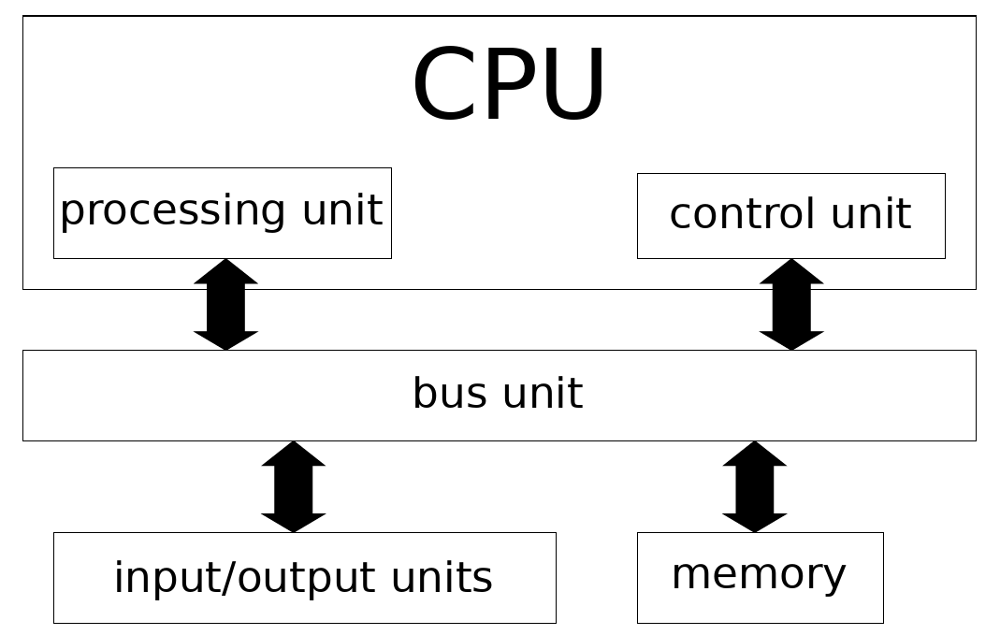

# Basic Structure of a Computer
{:.no_toc}

<nav markdown="1" class="toc-class">
* TOC
{:toc}
</nav>

Questions to [David Rotermund](mailto:davrot@uni-bremen.de)

*By Jan Wiersig, modified by Udo Ernst and translated into English by Daniel Harnack.*

## Hardware Architecture
The nowadays generally applied principle, termed **Von-Neumann-architecture** following its first description by John von Neumann in 1946, defines the main components of a computer, which are illustrated in figure 1.1.

Figure 1.1.: Schematic illustration of the Von-Neumann-architecture.

The task of the processing unit consists, as the name suggests, in the processing of the data, especially the application of arithmetic and logic operations. Among the most important functions of the control unit is the timely coordination of the sequences in the computer. For this, the control unit has to retrieve commands from the memory, decode them and control their execution. In today's computers, the processing unit and the control unit are typically integrated in the same component: the CPU (Central Processing Unit).

Within the computer, data is processed in various hardware components. The transfer of the data between the components is mediated by the bus unit.

The Memory consists of an numbered array of cells, in which every cell is capable of storing a small amount of information. This information is stored as a binary number, i.e. sequence of ones and zeros (yes/no information), in the memory cells.

Input and output units connect the computer with the outside world. Examples for input units are keyboard, mouse or joystick. Output units are for example screen and printer.

## Software
The term **Software** encompasses both computer programs and the data used by these programs. We define three types:

* System software, that is needed for the proper functioning of the computer. Among this is especially the operating system (e.g. Unix, Linux and Windows) and also supplementary software such as hardware drivers, etc.
* Programming languages
* Application software (e.g. text editor, browser, ...)
* Games!

## Programming Languages

A programming language subserves the function of transmitting commands to the computer and providing a well defined sequence in which these commands are to be executed.

At this point, we want to distinguish between three generations of programming languages. The first generation consists of the machine languages. A machine language is made up of simple commands that are represented as binary numbers. For every computer type, more precisely for its CPU, a special code is necessary. The direct programming in a machine language is nowadays rarely done any more.

The second generation are the assembler languages. Inspite of binary numbers, coding is done by symbols. An assembler directive is translated 1:1 to a machine command. Thus, also assembler programs are specific to the type of processor.

The third generation of programming languages is machine independent, i.e. can be executed on every CPU. These **higher programming languages** utilize more complex commands and program structures, allowing for problem-oriented working and reducing possible errors and lack of clarity to which machine oriented languages are prone. However, also programs written in such higher programming languages have to be ultimately translated to machine language. The programs supplying the translation are called compiler respectively interpreter. Examples for higher programming languages are Pascal, Fortran, C and C++. An interpreter, on the other hand, interprets and directly executes every command. Here, examples are Basic and Lisp. Interpreter programs are easier to write, since debugging is more straight forward. However, the execution of these programs is slower.

The higher programming languages have developed in various directions. Especially for the natural sciences, an interesting branch are the interactive calculation tools, like for example Matlab, Maple and Mathematica. These tools facilitate the computer based work on scientific problems and questions by providing mathematical partial solutions and graphical representation. It is distinguished between numerical (Matlab) and symbolic (Maple and Mathematica) calculation tools. The latter are also termed 'computer-algebra systems'.
