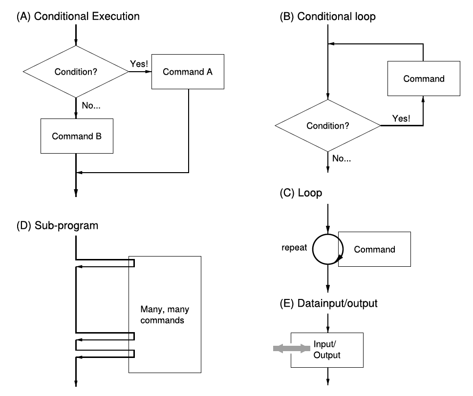
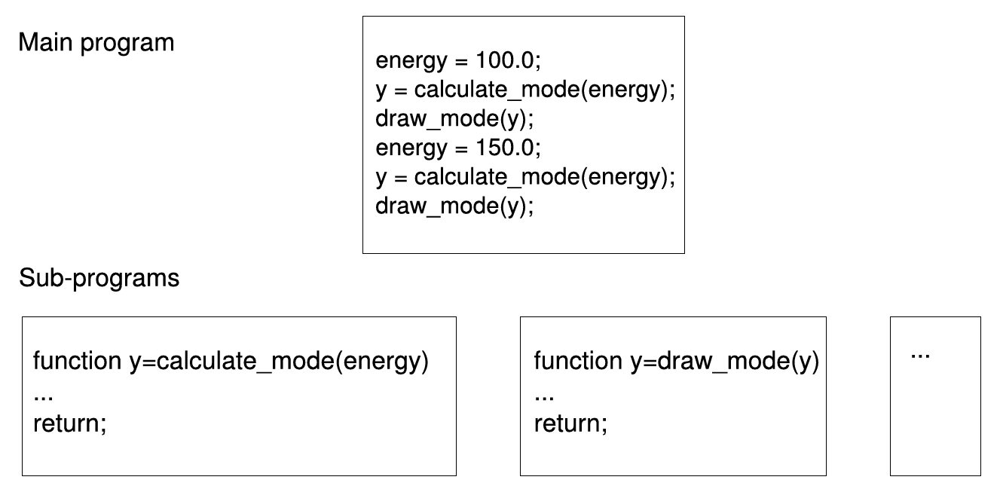

# Basic Commands and Variables
{:.no_toc}

<nav markdown="1" class="toc-class">
* TOC
{:toc}
</nav>

Questions to [David Rotermund](mailto:davrot@uni-bremen.de)

*By Jan Wiersig, modified by Udo Ernst and translated into English by Daniel Harnack.*

Matlab is an interactive system used for numerical calculations and visualization in almost every field of technical and scientific research. Matlab excels in its ease of use, good graphics and high efficiency.

This introduction explains the basics mandatory to perform simple numerical calculations. First, we use Matlab as a command line interpreter. Entering of single commands will follow a prompt, here `>>`. An important command is `help`. This command returns descriptions and syntax for functions and commands. For example


`help sin`

shows information regarding the sine function. Also a link to the detailed documentations can be found, that can directly be called alternatively with the command `doc`. Short descriptions of commands, that match certain search pattern, can be obtained by `lookfor`.

Further useful commands include `quit` and `exit`, with which the Matlab session is terminated.

## Variables
Variables are introduced by assignment and do not have to be declared or defined. Names of the variables can be chosen freely. The only forbidden things are the use of special characters and digits at the beginning of the name. A distinction between uppercase and lowercase letters is not made. Examples:

| | |
| ------------- |:-------------:|
|`a = 3;`|	3 is assigned to a (no output)|
|`a`|	result output|
|`b = -2.5`	|-2,5 is assigned to b (with output)|


Note that Matlab uses a point to separate pre-decimal places and post-decimal places, following the conventions of the English language.

A major advantage of Matlab in comparison to a conventional programming language is the possibility to directly work with vectors. This concept shall only be touched briefly here, since it will be extensively treated in a separate chapter:

| | | |
| ------------- |:-------------:|:-------------:|
| `a = [3;1];`	| defines a column vector	| $\vec{a} = \left(\begin{array}{c}3 & 1 \end{array}\right)$ |
| `a(k)`	| means the vector component	| $a_k$ |
| `b = [0,3,-4];` |	defines a row vector	| $\vec{b} = (0,3,-4)$ |

The commas in square brackets can also be replaced by blank spaces.

Matlab cannot only calculate with vectors, but also with matrices. Thus, linear system of equations, such as

$x+2y = 3$

$3x+y = 1 $

can be formulated elegantly:

$$ \left(\begin{array}{cc} 1 & 2 \\ 3 & 1 \end{array}\right) \left(\begin{array}{c} x & y \end{array}\right) = \left(\begin{array}{c} 3 & 1 \end{array}\right) $$

respectively

$$D\,\vec{x} = \vec{b} $$

with the $2\times 2$ matrix

$$ D = \left(\begin{array}{cc}1 & 2 \\ 3 & 1 \end{array}\right) \begin{array}{c}\leftarrow\;\;\mbox{1. line} \\ \leftarrow\;\;\mbox{2. line} \\ \end{array}$$

$$\nearrow \nwarrow$$

1. line 2. line

and the column vectors

$$ \vec{x} = \left(\begin{array}{c}x & y \end{array}\right) \quad\mbox{and}\quad \vec{b} = \left(\begin{array}{c}3 & 1 \end{array}\right) $$

Here, $\vec{x}$ is the solution vector being sought.

The formal solution of the equation $D\,\vec{x} = \vec{b}$ is given by

$$\vec{x} = D^{-1}\, \vec{b} \, ,$$

where $D^{-1}$ denotes the inverse of the matrix $D$.

Matrices are introduced in Matlab as the following

`C = [1,1;0,1];`	defines the $2\times 2$ matrix	$C = \left(\begin{array}{ccc}1 & 1\\0 & 1\\\end{array}\right)$
`D = [1,2;3,1];`	defines the $2\times 2$ matrix	$D = \left(\begin{array}{ccc}1 & 2\\3 & 1\\\end{array}\right)$ 

The single elements $C_{kl}$ of a matrix $C$ can be accessed by C(k,l). Here, $k$ denotes the $k$-th row and $l$ the $l$-th column of the matrix.

Interestingly, all variables that are used by Matlab are matrices, which is how the name is derived ("Matrix Laboratory").

The following table lists useful commands to manage variables.

|||
|---|---|
|`who`|	List of all used variables|
|`whos`|	List of all used variables with respective size|
|`clear`| Variable	Delete a variable|
|`clear all`|	Delete all variables|
|`load 'filename'`|	Load variable(s) from a file|
|`save 'filename'`| variable	Save variable to a file|
|`!`|	execute a Linux/MSDOS-command|

Some specific variables are predefined:

|||
|---|---|
|`ans`|	Last result|
|`pi`|	$\pi$|
|`i`|	Imaginary unit $\sqrt{-1}$|
|`Inf`|	Infinity (z.B. $1/0$)|
|`NaN`|	"Not-a-Number" (e.g. $0/0$)|

Note that the predefined variable can also be overwritten. Sometimes this happens unintendedly and leads to unpredictable results.

## Operations
The basic arithmetic operations like addition (+), subtraction (-), multiplication (*), division (/) and powers (^) are defined in a natural manner. Examples using the earlier defined variables are

`z = 10-8;`	assigns the value $2$ to $z$
`t = b*[1;2;3];`	assigns the scalar product $-6 = 0+6-12$ to $t$
`F = C+D;`	assigns the matrix to $F$ $ \left(\begin{array}{ccc}2 & 3\\3 & 2\\\end{array}\right) = \left(\begin{array}{ccc}1 & 1\\0 & 1\\\end{array}\right) \left(\begin{array}{ccc}1 & 2\\3 & 1\\\end{array}\right)\;\mbox{to} $
`x = z^3;`	assigns the value $8 = 2^3$ to $x$

## The Colon-Operator

The colon is used in Matlab to generate sequences of numbers, e.g

```matlab
x=1:10;
```

generates a row vector $\vec{x} = (1,2,\ldots,10)$, which holds the numbers from 1 to 10 in increments of 1. The increment can be set between the start and the end value:

```matlab
x=0:0.1:1;
```

The result is a row vector $\vec{x} = (0,0.1,\ldots,1)$.

The colon-operator is especially handy to access defined elements of vectors, e.g.

```matlab
x(3:6)
```

gives the elements $(0.2,0.3,0.4,0.5)$. When the colon-operator stands on its own, e.g. $\texttt{x(:)}$, all elements of the vector are referenced. This becomes especially interesting in the case of matrices. As a case in point we consider the matrix

$$ A = \left(\begin{array}{ccc} 1 & -1 & 2\\ 3 & 0 & 1\\\end{array}\right) \, ,$$

from which we want to determine the first and the third column.

```matlab
A = [1,-1,2;3,0,1];
a = A(:,1);
b = A(:,3);
```

The result is $\vec{a} = \left(\begin{array}{c}1\\ 3\\\end{array}\right)$ and $\vec{b} = \left(\begin{array}{c}2\\ 1\\\end{array}\right)$.

## Mathematical Functions
Matlab provides a wealth of mathematical and numerical functions. All functions are applied to the whole vector respectively matrix. The following tables summarize the basic functions.

|||
|---|---|
|`abs(x)`|	absolute value|
|`sqrt(x)`|	square root|
|`sin(x)`, `cos(x)`, `tan(x)`|	sine, cosine, tangent|
|`atan2(y,x)`|	arc tangent of $y/x$ in the interval $[0,2\pi)$|
|`exp(x)`|	exponential function|
|`log(x)`|, log10(x)	natural logarithm, logarithm to the basis 10|
|`besselj(n,x)`|	Bessel function $n$-th order|
|`rem(x,y)`|	rest after division (z.B. rem(10.3,4) = 2.3)|
|`round(x)`|	rounding (z.B. round(3.2) = 3)|
|`floor(x)`|	round down (z.B. floor(3.2) = 3)|
|`ceil(x)`|	round up (z.B. ceil(3.2) = 4)|
|`norm(x)`|	norm (length) of a vector|
|`sum(x)`|	sum over vector elements|
|`prod(x)`|	product over vector elements|
|`max(x)`, `min(x)`|	maximum, minimum of vector elements|
|`length(x)`|	dimension of a vector|
|`mean(x)`|	mean|
|`std(x)`|	standard deviation|
|`size(A)`|	dimension of the matrix $A$|
|`det(A)`|	determinant of the matrix $A$|
|`rank(A)`|	rank of the matrix $A$|
|`rand(N)`|	uniformly distributed random numbers between $[0,1)$. $N\times N$ matrix|
|`randn(N)`|	Gaussian distributed random numbers with mean = 0 and variance = 1.|


## Complex Numbers
An important feature of Matlab is that it provides a variable type for complex numbers. As long as it is not already used in another context, like a loop, the variable i is predefined as the complex unit. In general, complex numbers can be defined by invoking the command complex with two arguments, that represent the real- respectively the imaginary part of the number, e.g.:

```matlab
i = complex(0, 1);
```

Computations with complex numbers can be carried out just like with normal, real values. Hence, the following to lines

```matlab
c = complex(17, 42);
c = 17+i*42;
```

give the same results.

In the imaginary plane, the complex number can be represented as a vector with a length amp, that starts in the origin and points in the direction phi. These quantities can be derived from the complex numbers through the commands abs and angle. The commands

```matlab
amp = abs(c)
phi = ange(c)
```

give the output 45.3100 and 1.1862. Conversely, a complex number can be defined by a length and an angle in the complex plane:

```matlab
c = amp*exp(i*phi);
```

The real and imaginary part of a complex number can then be extracted by the command real and imag:

```matlab
real(c), imag(c)
```

for example returns the output 17 and 42.

The command complex can also handle matrices and arrays as input. Thus

```matlab
c_array = complex(zeros(42, 1), rand(42, 1));
```

defines a a $42$x$1$-matrix filled with complex numbers, that have a random imaginary part between $0$ and $1$.

## Program Control Commands and Function Definition

Programming in Matlab is carried out via script files and function files. The filenames end in ".m", which is why these files are also named "M-files". You should not use blank spaces, umlauts or mathematical operators (e.g. -) in the file names. One should also avoid naming the files after a build-in Matlab command, since this command will then be overwritten.

Simply put, script and function files contain a list of commands. These commands will then simply be executed in succession. More complex program structures are realized with loops and bifurcations. Essentially, there are the following possibilities to control the flow of a program -- These constructs are found in every programming language, not only in Matlab.


Figure 3.1.: Different possibilities to control the flow of a program, respectively the succession of commands contained in a program.


### Loops ('for'-Loops)

Reoccurring operations are executed within loops. If it is desired to execute a specific set of commands $n$-times in a row, the use of a so called for-loop is advisable. As an example, we want to create a vector $\vec{p} = (p_1,p_2,p_3,p_4,p_5)$ with $p_k = k^2$, where $k=1,2,3,4,5$. The symbol $\texttt{\%}$ induces commentaries:

```matlab
for k=1:5 % begin of the loop
    p(k) = k^2; % entries in the row vector
end % end of the loop
```

The result is a row vector $\vec{p} = (1,4,9,16,25)$.

Note that frequently, loops in Matlab can be replaced by the use of the colon-operator, here p = [1:5].^ 2. The latter is definitely preferable, since the execution is faster. In analogy to the colon-operator, an increment different form 1 can be set, e.g.

```matlab
for k=1:2:5
```

### Conditional Loops ('while'-Loops)
The difference between the the while-loop and the for-loop, where the number of times which the body of the loop is executed has to be known beforehand, is that the execution of the commands in the while-loop is tied to a condition: prior to every iteration this condition is tested. If the test turn out positive, the loop will be run through. Otherwise the loop will be left (or not even entered in the first place), and the commands following the loop will be executed. Example:

```matlab
x=5;

while(x>1) % begin of the loop (infinite loop possible)
    x=x/2;
end % end of the loop
```

The result is $x = 5/8 = 0.625$.

### Bifurcations/Conditional Execution ('if'-Expressions)

Conditional execution of commands is also mediated by if-expressions. The result of the bifurcation depends on the result of the result of the if-statement.

Example:
```matlab
if (x>5)
    z = 1;
end
```

Provided the relation $x > 5$ is fulfilled, set $z = 1$. The following operators are available to construct relations:

|||
|---|---|
|>	|greater|
|<	|smaller|
|>=	|greater or equal|
|<=	|smaller or equal|
|==	|equal|
|~=	|unequal|
|&	|logical 'and'|
|\|	|logical 'or'|
|~	|logical 'not'|

The command if comes with the command else. Example:

```matlab
if (0 < x & x < 1)
    status = 1;
else
    status = 0;
end
```

If $0 < x$ and $x < 1$, then set status = 1, else set status = 0. The command else thus allows to react to a unfulfilled condition. If this shall be coupled to a further condition, the command elseif (has to be written as one word) can be used.

## Data Input and Output

### Keyboard and Screen
For input from the keyboard, the command input is provided:

```matlab
x = input('Input x: ');
```

The command disp displays text and values of variables on the screen:

```matlab
disp('The value of x is ');
disp(x);
```

Formatted output is achieved by the command fprintf, e.g.

```matlab
fprintf('The value of x is %g \n',x);
```

In this connection, %g is a placeholder for the variable x. The symbol \n forces the following output to begin in a new line. Another Example is

```matlab
fprintf('x = %6.2f \n',x);
```

Here, the first number after the percent symbol sets the minimal total number of digits or characters that shall be printed. The second number is the desired number of post-decimal places.

### Storage Media
The output to the hard disk or other storage media takes place in a similar way.

Prior to writing to or reading from a file, this file has to be opened. This is done with the command fopen.

Example:

```matlab
fp = fopen('example.dat', 'w');
```

example.dat is the name of the data being opened and 'w' indicates that we want to write something into the data (=write). Upon successful execution of the command, Matlab returns a so called file handle. This can be understood as a pointer when writing into the file, which tells the computer where the data is supposed to go.

Similar to printing to the screen, data can now be written into the file:

```matlab
fprintf(fp, 'x = %6.2f \n',x);
```

Note that the 'file handle' fp is passed as the first argument to the fprintf-command.

After writing of the data, the file is closed by the command fclose. In the same manner, the file handle has to be passed to the command:

```matlab
fclose(fp);
```

The read-in of formatted text works along the same lines; However, when using fopen, the option 'r' for reading of data (=read) has to be set, and for read-in, the command fscanf has to be utilized with a suitable format.

Data can also be written and read in a binary format. Here, the data of the computer is written into a file in its internal binary representation. An advantage of this type of data storage is its usually low memory demand. A drawback is that the files produced in this manner can not be opened and the contents inspected by a conventional text editor. In addition, it can occur that the data transfer between two computers with different machine architecture is hampered, in case they utilize different representations of floating-point numbers and integers.

The respective commands to read and write binary data are fread and fwrite. The files are opened and closed as usual via fopen and fclose.

Additionally, Matlab provides a third possibility to store data: the commands save and load. The syntax of these commands is

```matlab
load('filename.mat', 'var1', 'var2', ..., 'varN');
```

and

```matlab
save('filename.mat', 'var1', 'var2', ..., 'varN');
```


The variables with the names var1, var2 until varN are saved respectively loaded. The suffix of a Matlab-file should always be .mat. Loss-free compression and system-wide compatibility are the advantages of this method. Unfortunately, files created by different Matlab versions are sometimes incompatible.

Note: if no variable names are specified, all variables that momentarily reside in the working memory will be saved.

### Example of a Simple Program: Orthogonality of Two Vectors

The following script file probes the orthogonality of two vectors $\vec{a}$ and $\vec{b}$, i.e. it is tested whether the scalar product of the two vectors is zero. Please try to understand the program with the help of the given commentaries.

```matlab
% orthog - program to test the orthogonality of two vectors (3D)

clear all;	% delete all variables

% initalize the vectors a and b
a = input('give 1. vector: ');
b = input('give 2. vector: ');

% evaluate the scalar product
ab = 0;
for i=1:3
	ab = ab+a(i)*b(i);
end

% tell whether the vectors are orthogonal
if (abs(ab) < 1.0e-8)
	disp('vectors are orthogonal');
else
	disp('vectors are not orthogonal');
	fprintf('scalar product = %g \n', ab);
end
```

Matlab provides an own editor, that facilitates the writing of programs. In our case, the script file would be named'orthog.m'. Given that the file is in the correct folder, the program can be invoked with the command orthog.

## Self-defined Functions and Sub-programs
New, own functions can be defined as a function file. In the same way it is possible to superimpose existing implementations of Matlab-functions with own functions. Assuming that we want to implement the Gaussian bell-curve

$f_\sigma(x) = \frac{1}{\sqrt{2\pi}\sigma}e^{-\frac{x^2}{2\sigma^2}} .$

For this end we write the following file 'gauss.m':

```matlab
function y = gauss(x,sigma)

% function to calculate the Gaussian bell-curve

y = exp(-x.^2/(2*sigma^2))/(sqrt(2*pi)*sigma);

return;
```

The parameter $y$ is an output parameter, while $x$ and $\sigma$ are input parameters. Note that the respective file name only differs from the name of the function the file defines by the suffix '.m'. The function gauss is thus to be defined in 'gauss.m', nowhere else.

The self-defined function gauss will hence be used just like a built-in Matlab-function. For example with

```matlab
x = -4:0.01:4;

plot(x,gauss(x,1));
```

the function can be plotted. Even the help functions help gauss and lookfor gauss work. Printed on the screen are in this case the comment lines preceding the first command in the file 'gauss.m'.

Naturally, new functions can also be provided with several output parameters. For this a vector-valued output parameter is used, which components hold the actual output parameters.

Self-defined functions can also be called within any script or function file. This can be used to structure programs into a main program and sub-program to increase the clarity and the readability of the code ( see e.g. fig.3.2. Conveniently, variables defined within a function are always local, i.e. unknown to other program parts. Hereby, unwanted 'side effects' are avoided.


Figure 3.2.: Schematic example of the subdivision of a program (Calculation and illustration of two oscillation modes of a physical system) into a main program and various sub-programs.


### Functions as Input Arguments
In many applications, one may want to not only give parameters to sub-programs, but also functions. The evaluation of the function passed to the sub-program is done with the command feval. Consider an example of a sub-program which plots a given function in a predefined interval including annotation of the axes, etc:

```matlab
function plotfunction(f,a,b) % no output parameter

x = a:0.01:b;

y = feval(f,x);

plot(x,y);

xlabel('x');

ylabel('y');

return;
```

This sub-program is invoked for example by

```matlab
plotfunction('sin',0,2*pi);
```

or

```matlab
plotfunction(@(x)sin(x),0,2*pi);
```

### Recursive Functions
Recursive functions constitute an elegant method to integrate iterative calculations in a simple function expression, that is capable of solving complex tasks. A recursive function calls itself during the sequence of execution of its program code. As can easily be guessed, programming recursive functions involves the risk that a function calls itself over and over again, but never returns to the calling program. Thus, a suiting termination criterion has to be provided, that ensures that after a specific iteration, no further recursion is initiated.

As an example we consider a program implementing a nested intervals method to evaluate the square root of a number x. We begin with an interval in which the sought for square root will certainly be, thus for example $[0,x]$. Now we divide the interval in half and check in which half the square root has to be. This half we take as the new interval and call the function anew. The procedure is repeated until the interval is smaller than a given numerical accuracy and the square root is thus determined with sufficient precision:

```matlab
%   recursion_eng.m
%   ===========
%   calculates the square root of a variable x
%   using a recursive nested intervals method.
%
%   Invoke: x_sqrt = recursion_eng(x);
%

function x_sqrt = recursion_eng(x, x_low, x_high)

% no boundaries set? Then set plausible boundaries!
if ~exist('x_low')
	x_low = 0;
	x_high = x;
end

% Interval bigger than the accuracy of Matlab?
if (abs(x_low.^2-x) > 4*eps)

	% yes, find the midpoint of the inteval
	x_mid = (x_high+x_low)/2;
	if (x_mid^2 > x)

		% the square root is in the lower half...
		x_sqrt = recursion_eng(x, x_low, x_mid);
	else

		% the square root is in the upper half...
		x_sqrt = recursion_eng(x, x_mid, x_high);
	end
else

	% ...no, square root is found!
	x_sqrt = x_low;
end
```
