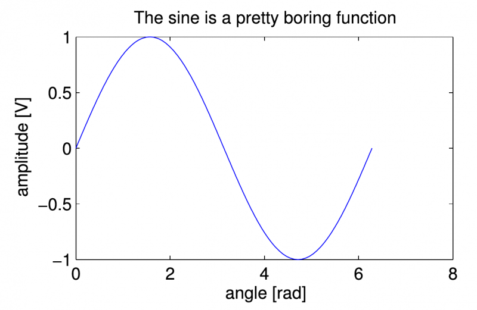
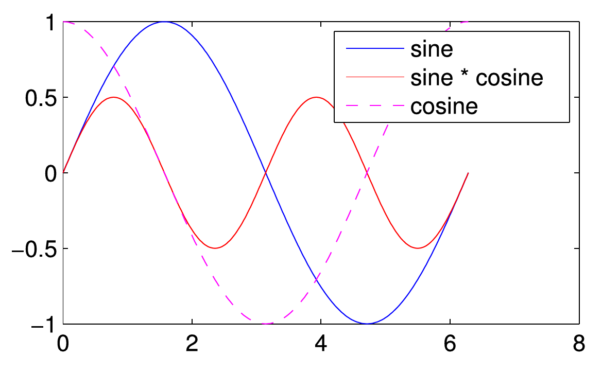
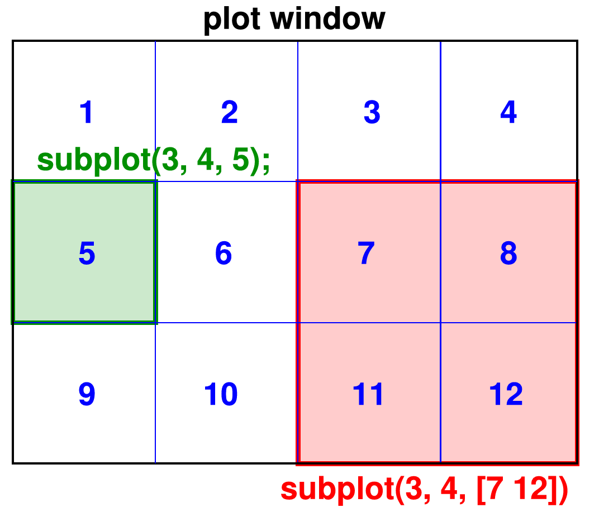
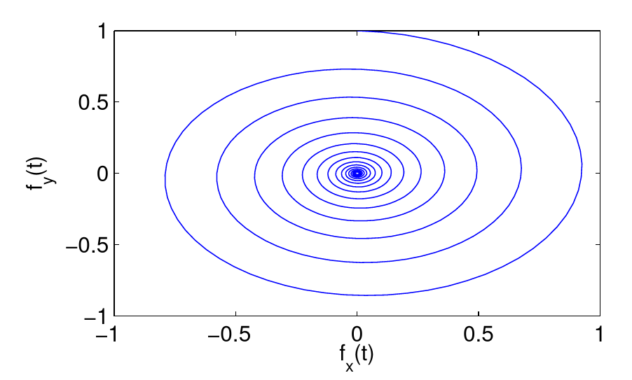
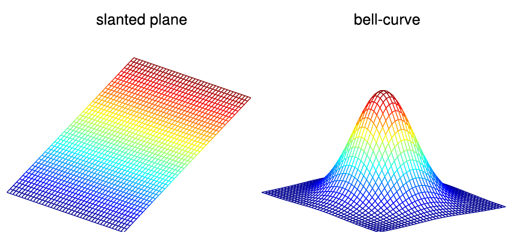

# Graphics
{:.no_toc}

<nav markdown="1" class="toc-class">
* TOC
{:toc}
</nav>

Questions to [David Rotermund](mailto:davrot@uni-bremen.de)

*By Jan Wiersig, modified by Udo Ernst and translated into English by Daniel Harnack.*


## Simple Plotting Functions
In order to represent data graphically, there exist numerous possibilities of visualization. The simplest realizations are $x$-$y$-plots, where data points $(x,y)$ are plotted in a Cartesian coordinate system. Examples:

```matlab
t = 0:0.01:2*pi;
plot(t, sin(t));

x = 0:0.01:1;
plot(x, x.^2);
```

The result of the last two commands is the graph of the function $f(x) = x^2$ in the interval $x \in [0,1]$. Note the point in front of the power ^, which ensures that the operation is performed element-wise.

You can even omit the last argument of plot, in which case one vector with $N$ single function values vector will be plotted dependent on the set of indices $1, 2, \ldots, N$:

```matlab
plot(vector);
```

Generally, one would avoid the short syntax for small test programs and rather give the $x$-axis explicitly.

The correct depiction of a function also needs clear annotation of the axes with the physical units of the plotted quantities. The $x$-axis is annotated with the command xlabel(string);, the $y$-axis with ylabel(string);.

As the name suggests, string is a string, i.e. a sequence of characters , special characters and numbers, that has to be given in between quotation marks. By title(string);, the graph can be given a title. Examples for this are:

```matlab
t = 0:pi/120:2*pi;

plot(t, sin(t));

xlabel('angle [rad]');

ylabel('amplitude [V]');

title('The sine is a pretty boring function');
```


Figure 4.1.: Simple example plot.

If one desires to plot more than one function into the same graph, Matlab can be advised to do so by the keyword hold on; after plotting the first function. This command prevents Matlab from drawing new axes for the following plots. All further plotting commands now add functions to the already existing graphs, until the command hold off; is given:

```matlab
plot(t, sin(t));

hold on;

plot(t, cos(t).*sin(t), 'r');

...

(further plotting commands)

...

hold off;
```

When several function are plotted into the same graph, optical means of discrimination between the functions is important. The main possibilities are changing the line style (continuous, dotted, dashed, ...) or the color of the plot symbols. Matlab accepts these options as a combined string following the function values as a further argument in the plotting command. Some possibilities of constructing this sting are the following:

|||
|--|---|
|Colors|	'k', 'r', 'g', 'm', 'y',...|
|Line styles|	'-', '--', '.', '-.',...|
|Plot symbols|	'o', 'x', '.', 'd',...|

As an example we consider the addition of a cosine function as a violet, dashed line to the previous example plot:

```matlab
plot(t, cos(t), 'm--');
```


Three functions in one graph.

Since multiple annotation of an axis is not possible, a legend can be produced when several functions are displayed in one graph. The command syntax for this is

```matlab
legend({string1 string2 ... });
```

An example for the three functions in the previous example plot is:

```matlab
legend({'sine' 'sine * cosine' 'cosine'});
```

Among further options, extensively listed by help plot;,

are the manipulation of the line width and the size of plotting symbols.

These have to be give as a pair of arguments to the plot function: first a string, that unambiguously states which plot parameter is to be set, and second the value that is to be assigned to this parameter. The line width is set via 'LineWidth', and the string addressing the size of plot symbols is 'MarkerSize'. Assuming we would also like to depict the exponential function by a yellow continuous line of line width $4$ and circles of the size $10$ as plot symbols, we would have to write:

```matlab
hold on;

plot(t, exp(-t), 'yo-', 'LineWidth', 4, 'MarkerSize', 10);

hold off;
```

The intervals of the axes shown in the graph can be set by axis([x_min x_max y_min y_max]);. The option tight tells axis to choose the intervals such that the plot window circumscribes the plotted functions as close as possible. axis off; hides the axes of the plot. Examples:

```matlab
axis tight;

axis([-5 15 -2 2]);
```

Did the function turn out nicely and is sought to be saved, the currently active plot window can be written to a pixel or vector graphics file by print. The syntax for this command is `print(string, 'dFORMAT', '-rRESOLUTION');`. Here, string should be replaced by a file name (without suffix, Matlab will append it automatically!), FORMAT by the desired format and RESOLUTION by the desired resolution in pixel per inch. Examples for supported formats (all others can be found by the help function) are:

FORMAT: ps, psc, eps, epsc, tiff, jpeg, png,...

## Multiple Graphs

Multiple functions do not have to be plotted in the same graph, Matlab also allows to open several plot windows. A new plot window is created by figure. The windows are numbered by Matlab. Thus, if one wants to access a specific plot window $n$ (for example to add a graph or annotation), the window is addressed by figure(n);. If the designated window does not exist yet, a new window will be opened.

A window can be closed by `close(n);`

`close all;` closes all windows at the same time.

Furthermore the possibility exist to position several graphs next to each other in the same plot window. For this, Matlab internally subdivides the window into $nx$ times $ny$ rectangles, that are numbered in ascending order from $1$ to $nx$*$ny$ from left to right and from top to bottom. A new graph is created in one such rectangle by the command subplot(ny, nx, k);. The output of the following plotting command will then be shown in the rectangle with number $k$. It is also possible to extend graphs across several rectangles that together form a bigger rectangle. To achieve this, a vector with two components has to be given as the third argument to subplot, which holds the index of the upper left rectangle and the one of the lower right of the area where the graph is supposed to go.


Figure 4.3.: Example of the denition of two plotting region in a 3x4 raster.


Other useful functions are:

|||
|---|---|
|`grid on, grid off;`|	activate/deactivate grid in the background of the current plot|
|`loglog(x, y);`|plotting in logarithmic representation|
|`semilogx(x, y);`|plotting in semilogarithmic representation|
|`semilogy(x, y);`|plotting in semilogarithmic representation|
|`polar(angle, radius);`|	plotting in polar coordinates (important for polar bears and penguins!).|

## Parametric Functions
Parametric functions are also easily plotted. First, an independent variable, on which components of the function depend, has to be defined as a sufficiently finely discretized vector. Second, the components of the function have to be calculated in dependency on this quantity and are plotted against it.

An example is the harmonic oscillator in two dimensions (2D pendulum), that, due to friction, slowly comes to a halt (note that Matlab, when creating annotations, even understands a bit of TeX, which comes in handy for example to set indices or Greek symbols!):


Figure 4.4.: Parametric function.

```matlab
t = 0:0.1:100;

fx = exp(-t/20).*sin(t);

fy = exp(-t/20).*cos(t);

plot(fx, fy);

xlabel('f_x(t)');

ylabel('f_y(t)');
```

You can also animate plots nicely by drawing a sequence of graphs in quick succession. Attention! Following every complete plotting command, you should then use the directive drawnow;, to make Matlab display the plot immediately. Otherwise, Matlab will hold back the display of the plot until the command interpreter is no longer busy and waits for new user input. The plot that then appears will thus only be the last of the intended animation...

Example, based on the previous function definition:

```matlab
for i=1:numel(t);

    plot(fx(i), fy(i), 'ko');

    axis([-1 1 -1 1]);

    drawnow;

end
```

## Three-dimensional and Color-coded Displays (Images)

Three-dimensional trajectories can be drawn with the plot3-command:

```matlab
plot3(fx, fy, t);
```

Two-dimensional functions or surfaces can be depicted as a mesh grid:

```matlab
[x_grid, y_grid] = meshgrid(-20:20, -20:20);


figure(1);

mesh(x_grid);

title('slanted plane');

axis off;


z = exp(-(x_grid.^2+y_grid.^2)/100);

figure(2);

mesh(z);

title('bell-curve');

axis off;
```


Figure 4.5.: Examples for grid functions.

A useful command is `set(gca, 'DataAspectRatio', [1 1 1]);`, which scales all axes such that their size relationship on the screen is approximately equal.

The command `imagesc(array);` depicts the two-dimensional function or matrix array as a color-coded top-view. The color code can be displayed next to the plot by the additional command `colorbar;`:

```matlab
imagesc(z);

title('Bell-curve, top-view');

colorbar;

axis off;
```

`imagesc` is a handy tool to display images, that are saved as arrays. If the array has a third dimension of size $3$, the entries of the array will be interpreted as color components according to the Red-Green-Blue (RGB) system. Attention: the $y$-axis will be reversed, which can be fixed with the command `set(gca, 'YDir', 'normal')`.

Instead of a color-coded illustration also contour lines can be used. The correspondent command is `contour(array);`. Optionally, in a second argument the number of contour lines used for the plot can be set:


Figure 4.6.: Examples for a top-view and a contour plot.

```matlab
contour(z, 100);

title('bell-curve, contour');

axis off;
```

The following table summarizes the most important graphics commands.

|||
|---|---|
|`plot(x, y)`|	graph of the vectors $x$ and $y$|
|`loglog(x, y)`|	logarithmic depiction|
|`semilogx(x,y)`, `semilogy(x,y)`|	semi-logarithmic depiction|
|`polar(theta, rho)`|	graph in polar coordinates|
|`contour(z)`|	2D contour line plot of matrix z|
|`mesh(z)`|	3D grid plot of matrix z|
|`title('text')`|	set figure title|
|`xlabel('x')`, `ylabel('y')`|	annotation of the axes|
|`grid on`, `grid off`|	grid lines on/off|
|`legend(text1, text2,...)`|	legend|
|`axis([xmin, xmax, ymin, ymax])`|	scaling of the $x$- and $y$-axis|
|`subplot(m, n, p)`|	division in $m\times n$ subplots|
|`clf`|	delete current plotting window|
|`figure(n)`|	create plot with number $n$|
|`hold on`, `hold off`|	keep/let go of previous graph|
|`print('filename')`|	print/save figure|
 
