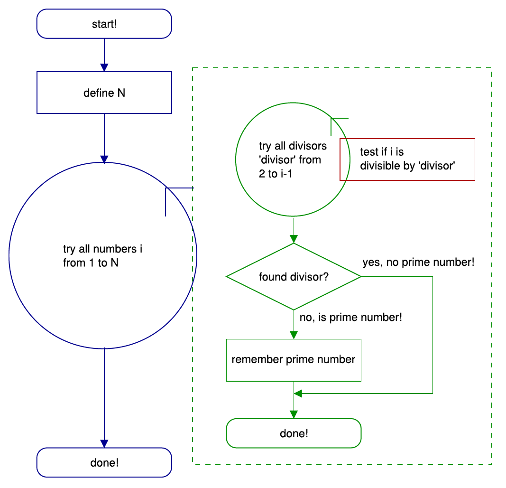
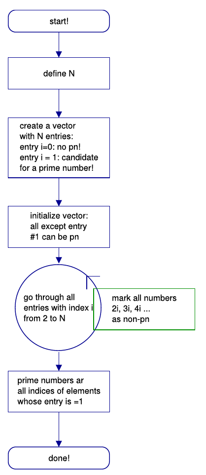
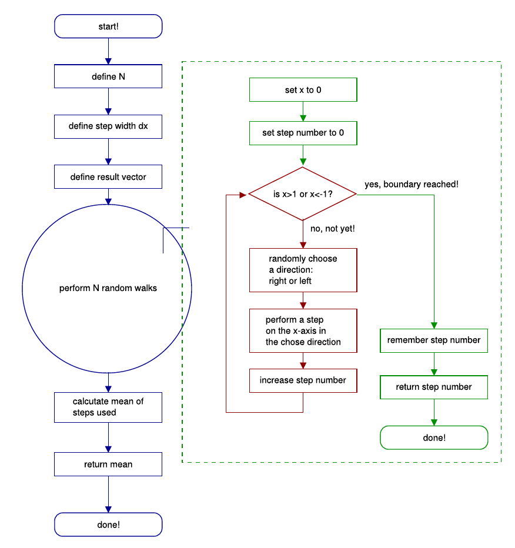

# Systematic Programming
{:.no_toc}

<nav markdown="1" class="toc-class">
* TOC
{:toc}
</nav>

Questions to [David Rotermund](mailto:davrot@uni-bremen.de)

*By Jan Wiersig, modified by Udo Ernst and translated into English by Daniel Harnack.*


Computers are at the same time incredibly fast and incredibly stupid. They will do exactly what they were told, but usually not what you want. To change this or even prevent it from happening, second to the thorough knowledge of the syntax of a programming language and the available commands, a careful planning is mandatory -- this becomes more and more important the bigger the programs and the more complex the problems in question become.

Simply put, programming is similar to building a model with Lego bricks. From small pieces something is put together, the final appearance of which has a wholly different character than the pieces it is made from. In analogy to building Lego models, one has to think about which pieces to use fist, and which to use later... and of course it has to be the correct pieces!

In the following, the systematic path form a problem to the final program is outlined. Two examples, finding prime numbers and simulating a diffusion process, complete this chapter.

Planning the Program

The following steps are reasonable to plan and finally write a program.

### (a) Problem definition and solution

The first step is the exact definition of the program, the computer is supposed to solve. It should be clarified, which quantities constitute the input the computer has to process and which output quantities the computer should return. Also one should be aware by which means or methods the problem shall be solved (In most cases, an arbitrary amount of thought and time can be used up by this step. However, for this course, this aspect is regarded secondary, since in most given problems the ansatz for the solution is already lined out. We want to focus on programming per se).

As a simple Example we consider the simple conversion of a monetary amount from Euro to US-Dollar. Input quantities are the amount in Euro as well as the exchange rate. The output quantity is the amount in US-Dollar. This simple problem of conversion can be solved by trivial multiplication.

### (b) Division into sub-steps

In the second step, the (calculation-)problem is divided into individual and clearly arranged sub-steps. These sub-steps should be chosen and organized according to the following aspects:

* Which steps have to be executed first, which later?
The order of commands in a program is always important. For example, before executing a command, all variables the command uses need to be known and a valid value assigned to them. Complex calculation on partial solutions can only be carried out if the partial solutions were computed before. In our simple case, the amount in Dollar can only be calculated, if the exchange rate has been assigned to a specific variable beforehand.

* Which steps have to be iterated several times resp. applied in a similar manner on different quantities? 
If steps are to be executed several times, loops are a good solution.

If similar tasks occur at different places during the solution of the problem, it is advisable to use a function in the program code.

* Which steps have to be carried out dependent on a specific condition?
Always when a distinction of cases is due, program code will be executed only under certain conditions. For example the absolute value of a number $x$ is found by multiplying it with $-1$ -- but only if x is negative! Another example: the e-mail client on your computer will only retrieve emails from a mail-server in case they do not already exist as local copies on your hard drive (avoiding unnecessary operation).

* Which steps demand user interaction or an informative feedback?
Some steps might need the confirmation of the user prior to their execution. For example a program that formats your hard disk should ask you before it starts running.

Feedback is also important if errors occur during the execution of the program -- for example when dividing a number by $0$.

* Make sure that the solution can be found in finite steps.
This is also a very important point for the success of the problem solution: The computer should be done after a finite number of steps, ergo in finite time. If this is not given, a different solution procedure has to be found.

### (c) Creating a flow chart (optional)

In addition to the division in sub-steps, you can also create a flow chart of your program, where the individual sub-steps are connected by directed arrows.

Flow charts may be very helpful to review more complex program logics. Often problem become apparent when creating a flow chart, that you were not aware of when mentally dividing into sub-steps. For the creation of this diagrams, even a DIN norm exists (DIN 66001). In the following an illustration will be used that is close to this norm and uses the flow control elements and boxes introduced in the previous chapter(s).

### (d) Transformation of sub-steps into program commands

Only now the carefully structured problem is translated to a specific programming language. Here, also some guidelines exist that should be adhered to:

* How are data, data structures and intermediary results represented?
Not every mathematical algorithm is portable 1:1 to the computer. Complex numbers, for example are unknown to many programming languages -- these will be represented by a real part and an imaginary part in two floating-point numbers. When working with Matlab is is important to consider when to use scalar quantities, vectors, two dimensional arrays or higher dimensional arrays. Important is also which type of data is used. A floating-point number for example is unsuitable to represent a string. Also one should always be aware of the memory consumption of the program.

* Replace every sub-step by at least one program command
* Unexpectedly complex sub-steps should be further broken down
* Adhere to the syntax of commands and expressions

For this, it is mandatory to use the help function! -- especially for beginners or when changing to another programming language. Every command has to be unambiguous, so the computer can understand what you want it to do.

After finalizing your program, it needs to be tested: Does the code perform as intended? If not, that is it back to the drawing board: First, all the syntax errors are eliminated (somewhere is a comma instead of a dot, in a comparison the double equality sign was not used, an intermediate result was not assigned to a variable, etc), and then the logic of the program is checked -- are the results plausible?

Assistance for this step -- the so called 'debugging' -- provides the debugger, which is part of many programming languages. Matlab also offers a debugging functions, however, many errors can be solved by command line based interaction with the (with an error message) aborting program. A good idea is to test the program with a reduced data set or problem, for example to run a search for prime numbers first until $n=17$ before making the program return all prime numbers between one and one trillion.

A lot of the aforementioned steps are not always clearly separable in practice. Most likely, while breaking up a problem in smaller steps, you will already think about useful commands you know and how these might help. Program development is thus a constant interaction between these different levels of planning.


## Examples of Program Development

### Finding Prime Numbers


Figure 5.1.: Flow chart of a ’brute-force’ prime number finder

The task our example program has to solve is the calculation of all prime numbers in the interval from $1$ to $N$. Reminder: a prime number is a natural number that is only divisible without remainder by itself and by $1$. $1$ itself is no prime number.


The simplest method to determine whether $i$ is a prime number is the following: One tries every divisor from 2 to $i-1$. If a divisor is found that divides without remainder, then $i$ is no prime number. This so called 'brute-force'-ansatz (leads to an end, but is not very smart) can be easily implemented in a program. We check, in a loop, whether for a particular number $i$ a divisor can be found. If this is the case, a so-called flag is set (a variable, that is either $0$ or $1$ and signal, whether a certain event occurred). If the flag is not set after the loop is finished, no divisor has been found and the number is remembered as a prime number. If the flag is not set, the program does nothing. After this, the next number $i+1$ is scrutinized and so forth until all natural numbers until $N$ have been tested. The latter will also be done in a loop. Figure 5.1 shows the flow chart, the following gives the correspondent Matlab code:

```matlab
%%% TASK:
%%% ========
%%% find all prime numbers between 1 and N and save them
%%% in a vector 'prime_numbers'
%%%
%%% solution: brute force

%%% until which natural number shall be calculated?
n = 10000;

%%% there are maximally m<=n-1 prime numbers for all natural
%%% numbers until n
prime_numbers = zeros([1 n-1]);

%%% The next prime number shall be saved in the vector component
%%% with the index idx_prime_number
idx_prime_number = 1;

%%% check all numbers
for i=2:n
	
	%%% try all divisors from 2 to i-1
	found = 0;
	for divisor=2:i-1
		
		%%% is the number i divisable by divisor without remainder?
		if (i/divisor == fix(i/divisor))
			found = 1;

			%%% terminate the loop, one divisor is enough!
			break;	%%%WITH OPTIMIZATION			
		end

	end

	%%% No divisor found? Then the number i is a prime number!
	if (gefunden == 0)

		%%% remember prime number, go to next index
		prime_numbers(idx_prime_number) = i;
		idx_prime_number = idx_prime_number+1;
	
	end
end

%%% shorten the result vector,
%%% only keep the found prime numbers
prime_numbers = prime_numbers(1:idx_prime_number-1);
```


Figure 5.2.: Flow chart for the ’Sieve of Eratosthenes’.

For large $N$ this code will run for a long time, that is to say (running Matlab 6.1, Intel DualCore processor, $n=10000$) approximately 141 seconds.

When scrutinizing the program code, a point can be found at which the code can be optimized: As soon as one divisor is found, it does not make any sense to further execute the inner loop. It can be left with break. This is especially sensible for large $i$: If $i$ is already divisible by $2$, the divisors from $3$ to $i-1$ do not have to be tested any more! By this, the execution time of the program reduces itself to 16 seconds.

A much more sophisticated method to find prime numbers is the 'Sieve of Eratosthenes'. The principle is easy to grasp: First a list of all natural numbers is generated from $1$ bis $n$, from which successively all non-prime numbers are deleted. Except for $1$ at first all numbers are candidates form prime numbers. Now every number $i$ from $2$ to $n$ is checked. If $i$ is already marked as a non-prime number, it is skipped. If it is not marked (like for example $2$ at the beginning of the procedure), all multiples of this number are marked as non-prime numbers, i.e. $2i$, $3i$, $4i$ until $n$. Left over will only be the prime numbers!

See the flow chart of the correspondent program (figure 5.2) and the Matlab code:

```matlab
%%% TASK:
%%% ========
%%% find all prime numbers between 1 and N and save them
%%% in a vector 'prime_numbers'
%%%
%%% solution: sieve of Eratosthenes

%%% until which natural number shall be calculated?
n = 10000;

%%% define so called flags for all natural numbers
%%% until n. Is the flag equal to 1 at the end of the program
%%% the number is a prime number
flag_prime_number = ones([1 n]);

%%% by definitioin, 1 is not a prime number
flag_prime_number(1) = 0;

for i=2:n

	%%% is the current number i a prime number?
	if (flag_prime_number(i) == 1)

		%%% yes, mark all multiples as non-prime numbers
		for j=i+i:i:n						% WITHOUT OPTIMIZATION
			flag_prime_number(j) = 0;			% WITHOUT OPTIMIZATION
		end							% WITHOUT OPTIMIZATION
%%%		flag_prime_number(i+i:i:n) = 0;				% WITH OPTIMIZATION
	end

end

%%% find the indices of all entries=1 in the vector
%%% the indices are the sought prime numbers
prime_numbers = find(flag_prime_number);
```

The run time underlines the ingenuity of the sieve-idea: 0.22 seconds instead of 16 seconds! Additionally, the program code can even be optimized by replacing the inner loop by a vectorized command (comment all lines marked with WITHOUT OPTIMIZATION and uncomment all lines marked with WITH OPTIMIZATION): 0.05 seconds!

With this, in comparison to the first attempt at this program, the execution time could be shortened by a factor of $6400$! Important to note is that both programs are completely correct and yield identical results, depite their different appearance and run time.

### Simulation of Diffusion
A second example is a simulation of a so-called 'random walk'. A random walk describes a movement of a particle (e.g. molecule, protein) that is determined by a random process. In our case the particle starts at the location $x=0$ and moves in every time step by a distance of $dx$ either to the left or to the right. Both possibilities have the same probability of happening. The task for the computer is to simulate $n=1000$ trials with the particle and stop the simulation each time the particle crosses a barrier at $x=-1$ or $x=1$. The output of our program shall be the mean number of steps needed to reach one barrier, calculated from the $n$ iterations.

This is the flow chart (figure 5.3) and the program code:

```matlab
%%% TASK:
%%% ========
%%% perform a random walk with step width dx starting at
%%% x=0 until x crosses either -1 or +1
%%%

%%% perform this many trials:
n_trials = 1000;

%%% elementary step width
dx = 0.5;

%%% initialize result vector
steps = zeros([1 n_trials]);

for i=1:n_trials

	%%% start random walk at x=0
	x = 0;

	%%% initialize counting variable
	n_steps = 0;

	%%% perform random walk until +1 or -1 is reached
	while abs(x) <= 1

		%%% draw random number.
		%%% choose direction with equal probability
		if (rand >= 0.5) 

			%%% to the left...
			direction = -1;
		else

			%%% to the right...
			direction = 1;
		end

		%%% update position and number of steps
		x = x+direction*dx;
		n_steps = n_steps+1;
	end

	%%% return number of steps
	fprintf(['In the %i-th trial, %i steps needed ' ...
		'until boundary!\n'], i, n_steps);

	%%% remember number of steps for trial i
	steps(i) = n_steps;

end

%%% evaluate the mean of the steps and return the value
fprintf('the mean number of steps used is %f ...\n', ...
	sum(steps)/n_trials);
```


Figure 5.3.: Flow chart for the simulation of a diffusion process.

 
