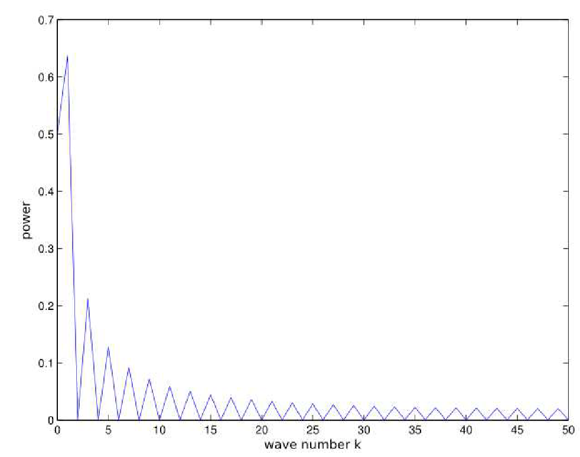
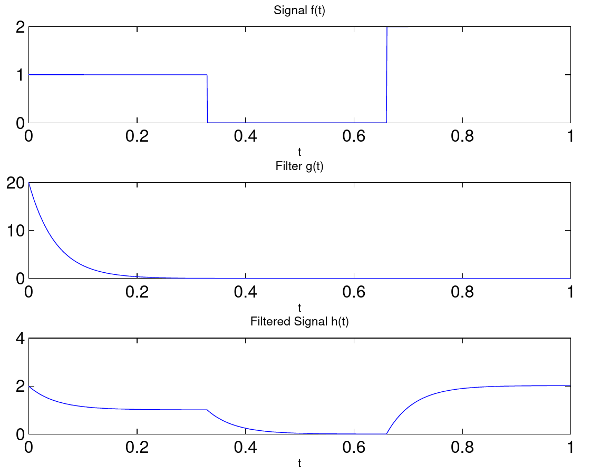
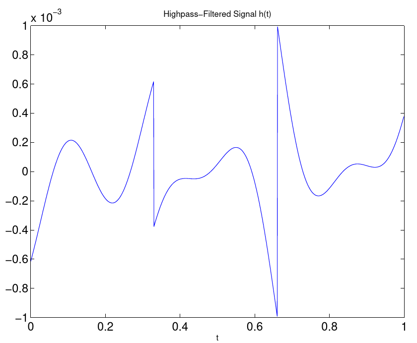
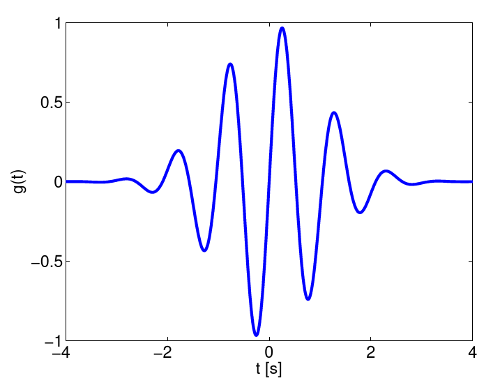
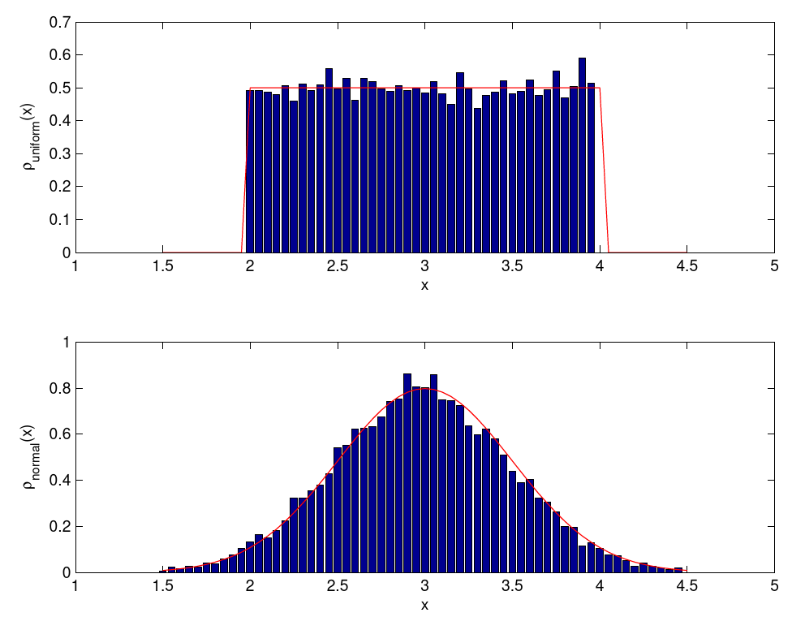
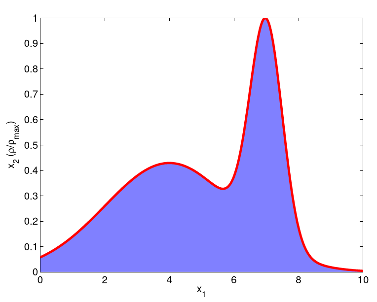
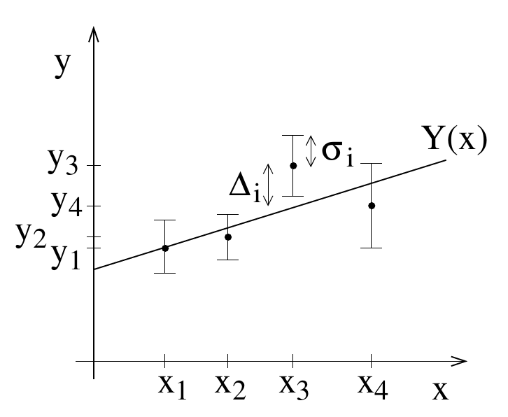
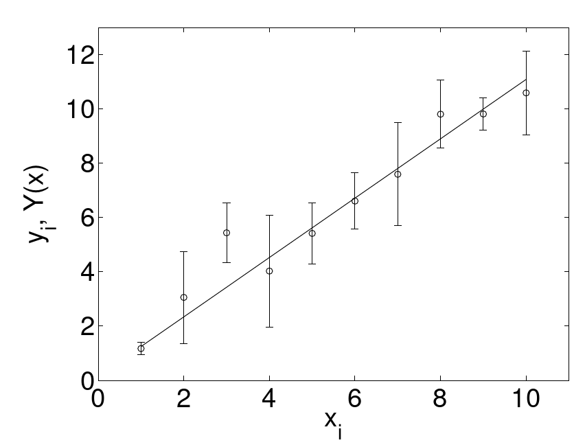

# Data Analysis
{:.no_toc}

<nav markdown="1" class="toc-class">
* TOC
{:toc}
</nav>

Questions to [David Rotermund](mailto:davrot@uni-bremen.de)

*By Jan Wiersig, modified by Udo Ernst and translated into English by Daniel Harnack.*

Three aspects of data analysis shall be covered in this chapter: spectral analysis via the Fourier transformation, generation of random numbers and working with probability distributions, and the elementary methods to fit models to measured data.

## Fourier Analysis and Filter Operations
The Fourier analysis is the most important integral transformation in physics. It not only allows to find the frequency content of a temporally varying signal, it also comes in handy to simplify the calculation of convolutions and thus applying filters efficiently to data. In every programming language, thus also in Matlab, the Fourier transformation is implemented as the so called 'Fast Fourier Transform' (FFT) to optimize calculation time and to spare the user the effort to program it themselves.

### Fourier Transformation
It has to be distinguished between the discrete Fourier transformation and the continuous Fourier integral. First, we will define the Fourier integral and then introduce the discrete version. Although the computer, due to the discretization of any function $x(t)$, always has to use the discrete Fourier transformation, we will use the integral notation to better understand some basic properties.

### Fourier Integral
The Fourier integral can be defined as follows:

$$\hat{x}(\omega) =  \frac{1}{2\pi} \int_{-\infty}^{+\infty} x(t) \exp\left( -i\omega t \right) \, dt$$ 

Attention: in the literature sometimes a pre-factor of $1/\sqrt{2\pi}$ is used. The factor in our definition is chosen such that it is compatible with the normalization of the Matlab-FFT which is described later on. The Fourier transformation is reversible; the correspondent reverse transformation is

$$x(t)  = \int_{-\infty}^{+\infty} \hat{x}(\omega) \exp\left( i\omega t \right) \, d\omega $$ .

If $x(t)$ is a real valued function, the transform $\hat{x}(\omega)$ is usually complex. For the existence of the Fourier transformation it is sufficient that $x(t)$ is absolutely integrable, i.e. $\int_{-\infty}^{+\infty} | x(t) | dt \, < \, \infty$ .

The Fourier transformation of a function is a representation of that function as a superposition of harmonic oscillations with angular frequency $\omega=2\pi f$ and coefficients $\hat{x}(\omega)$ . It is thus nicely suited for frequency analysis of temporal signals. The complex coefficients $\hat{x}$ contain information about phase $\phi$ and amplitude $A$ of the oscillation, and yield by using Euler's identity:

$$\hat{x} = \Re(\hat{x}) + i \Im(\hat{x})$$ 

$$\hat{x} = A\exp( i\phi )$$

$$\hat{x} = A\cos(\phi)+iA\sin(\phi)$$ 

Here, $i$ is the imaginary unit and $\Re$ and $\Im$ denote the real respectively the imaginary part of the complex number.

If $x(t)$ is periodic, for example in $2\pi$, or if $x(t)$ is only defined in the interval $[0, 2\pi]$, this can be expressed as the Fourier series with coefficients $\hat{x}_k$:

$$\hat{x}_k = \frac{1}{2\pi} \int_{0}^{2\pi} x(t) \exp\left( -ikt \right) \, dt$$ . (9.1)

The reverse transformation is written as an infinite sum:

$$x(t) = \sum_{k=-\infty}^{+\infty} \hat{x}(t) \exp\left( ikt \right)$$ . 

By rescaling of the t-axis by $t'=2\pi t/T$, a function $a(t)$ defined on an interval $[0, T]$ can always be mapped on a function $x(t')$ in the interval $[0, 2\pi]$, and thus can be transformed by equation (9.1).

For further properties of the Fourier transformation you may consult the instructive Wikipedia article.

### Discrete Fourier Transformation
In the computer, functions are defined on discrete sampling points in a finite interval. Let us assume a function $a(t)$ is sampled at $N$ equidistant points $t_n=Tn/N$, and the values at these points are $a_n=a(t_n)$. By the transformation $t'=(2\pi/T) t$ we transfer $a(t)$ to a function $x(t')$ in the interval $[0, 2\pi]$ and approximate the integral from equation (9.1) with the midpoint rule (see chapter Integration an Differentiation):

$$\hat{x}_k = \frac{1}{2\pi} \int_{0}^{2\pi} x(t') \exp\left( -ikt' \right) \, dt'  \approx {\frac{1}{2\pi}} \sum_{n=0}^{N-1} a_n \exp\left( -ik 2\pi t_n/T \right) \Delta t'$$ .

Here, $\Delta t'$ is given by $(2\pi/T)(T/N)=2\pi/N$, which means that

$$\hat{x}_k \approx A_k = \frac{1}{N} \sum_{n=0}^{N-1} a_n \exp\left( -i 2\pi nk/N \right)$$ . (9.2)

This equation describes the discrete Fourier transformation, the implementation of which we will discuss more extensively in the following paragraph. The corresponding reverse transformation is:

$$a_n = \sum_{k=0}^{N-1} A_k \exp\left( i 2\pi nk/N \right)$$ .

### Fast Fourier Transform (FFT)
The discrete Fourier transformation is invoked in Matlab by the command a_trans = fft(a);, where $a$ is a function or time series. The fast Fourier transform is an algorithm that is optimized for a fast execution of the transformation. It is based on the idea to first divide a function of $N$ sampling points into two function of $N/2$ sampling points, and then to compute two Fourier transformations on the partial functions and combining the two results to the sought transformation of the full function. This procedure can be iteratively extended: further partial function then have $N/4$, $N/8$, $\ldots$ sampling points. The reverse transformation, the inverse Fourier transformation, is invoked by the command ifft.

Calling help fft shows that the Matlab-implementation of the FFT does unfortunately not divide the result by the number of sampling points, which is the number of element of a vector a. This has to be done 'manually'.

The performance gain of the FFT in comparison to a non-optimized, brute force algorithm is impressive: the execution time of the FFT is already faster by 4 orders of magnitude(!) for $N=2^{16}$ sampling points:

```matlab
n_power = 12;
t = zeros([n_power 2]);
for power=1:n_power
    
    fprintf('N=2^%i...\n', power);
    
    n = 2^power;
    a = rand([n 1]);

	%%% Calculates FFT of signal 'a'
    tic;
    a_fast = fft(a);
    t(power, 1) = toc;

	%%% Calculate Fourier transform by 'brute force'
    tic;
    a_slow = zeros([n 1]);
    a_slow(1) = sum(a);
    exp_k1 = exp(-complex(0, 1)*2*pi*(0:(n-1))'/n);
    exp_k = 1;
    for k=1:n-1
        exp_k = exp_k.*exp_k1;
        a_slow(k+1) = sum(a.*exp_k);
    end
    t(power, 2) = toc;
    
end

%%% Plot execution times and the
%%% acceleration factor
figure(1);
subplot(2, 1, 1);
plot(1:n_power, t);
legend({'FFT' 'Fourier brute force'});
xlabel('power of two'); ylabel('t [s]');
subplot(2, 1, 2);
plot(1:n_power, t(:, 2)./t(:, 1));
xlabel('power of two'); ylabel('factor');
```

### Application: The Power Spectrum#

This paragraph deals with the question of how the FFT is applied to a signal $a(t)$ , and the interpretation of the result. For this we consider a sine wave with frequency $f$ and a step function as possible signals.

```matlab
n = 100; dt = 0.01; f = 5;

a_sine = 42*sin((0:(n-1))*dt*2*pi*f);

a_step = (0:(n-1)) >= n/2;
```

The signals are sampled with a frequency of $1/dt$ for $T=1 s$ , i.e. the discretization of the functions has the step width $dt$ . The FFT is calculated by the following:

```matlab
fft_a_sine = 1/n*fft(a_sine);

fft_a_step = 1/n*fft(a_step);
```

Now we want to investigate how much energy is contained in the different frequency bands. For this we calculate the so called power spectrum $\Phi(f)$, i.e the square of the sum of oscillation amplitudes for a specific frequency $f$. Here one has to be aware of two possible stumbling blocks:

* In the first place we have to make sure, how Matlab stores the calculated coefficients $A_k$ in the result vector: The first entry, e.g. a_sine(1) contains $A_0$ , i.e. the mean of the function $a(t)$ . The $k$-th entry then holds the coefficient $A_{k-1}$ , for example a_sine(17) would be $A_{16}$ .
* Which frequency does the coefficient $A_k$ correspond to? $A_k$ corresponds to the harmonic oscillation, for which exactly $k$ periods fit into the time interval of length $T$. The frequency is thus $f_k = k/T$ .
* Let us now look at the coefficients $A_k$ and $A_{N-k}$ . From equation (9.2) we can see that $\exp(-i2\pi (N-k)n/N)) = \exp(i2\pi kn/N)\exp(-i2\pi n) = \exp(i2\pi kn/N)$ . Hence, $A_{N-k}$ is equivalent to the coefficient $A_{-k}$ with negative wave number $-k$ and thus corresponds to the same frequency than $A_k$ .

If we want to know the amplitude of the oscillation with frequency $f=5 Hz$ , we have to look at the coefficient with the wave number $k = T f_k = 5$ and $k = -5$ . The correspondent value $\Phi(f)$ is found in Matlab-notation as:

```matlab
phi_5Hz = (abs(fft_a_sine(1+5))+abs(fft_a_sine(n-5)))
```

The output 1.7640e+03 is indeed the square of the amplitude 42.

A signal with $n$ samples can maximally represent oscillations with $n/2$ periods. Oscillations of higher frequencies are reduced by sampling to oscillations of lower frequencies with negative wave number. This insight is known as the Nyquist-Theorem. When calculating the power spectrum, one can thus ignore all coefficients from $k=n/2$ upwards and double all amplitudes of the low frequency components (except for $A_0$, $|A_k|=|A_{-k}|$ holds). A corresponding Matlab command plots the power spectrum for a step function, which has, as expected, a broad band spectrum:

```matlab
plot(0:(n/2), [fft_a_step(1) 2*abs(fft_a_step(2:(n/2)+1))]);

xlabel('wave number k'); 
ylabel('power');
```



Figure 9.1.: Power spectrum of a step function.

## The Convolution Theorem

The fast Fourier transform is not only useful to determine the frequency content of temporal signals, but also to perform so called 'convolutions'. A convolution of two functions $f(t)$ and $g(t)$ is defined by the following equation:

$$h(t) = \int_{-\infty}^{+\infty} f(t') g(t-t') \, dt'$$ (9.3)

Here, $g$ is often referred to as convolution kernel. The procedure of a convolution can be visualized as follows: We interpret $f$ as a arbitrary function, that is compared to a template function $g$. To account for possible shifts on the time axis, the template is shifted between $t=+\infty$ and $t=-\infty$ and the comparison is made at every position $t$. If both functions match perfectly, the result $h(t)$ is big. If the shifted $g$ does not match with $f$, the result is small.

Applications of this equation are numerous in physics, and reach from simple filter operations to timely resolved frequency analysis (examples will be discussed later). First, we want to understand the connection between convolutions and the Fourier transformation. As a short notation of the application of the Fourier transform $F$ to a function $f$ (resp. its reverse transformation $F^{-1}$) we introduce:

$$\hat{f}(k) = F\left.\left.\left[ f(t) \right]\right( k \right)$$

$$f(t) = F^{-1}\left.\left.\left[ \hat{f}(k) \right]\right( t \right)$$

Now we apply the Fourier transform to both the left and the right side of the Definition (9.3) and gain after short computation,

$$\hat{h}(k) = 2\pi \hat{f}(k) \hat{g}(k)$$

or, in short notation, $\hat{h} = 2\pi F[f] F[g]$. To get the sought result $h(t)$, we apply the inverse Fourier transform to the equation, which results in

$$h  =  F^{-1}\left[ 2\pi F[f] \cdot F[g] \right]$$ (9.4)

The advantage of equation (9.4) over (9.3) lies in the computation speed of FFT: despite a three-fold transformation, calculating equation (9.4) is faster than computing the integral in (9.3), since the convolution integral corresponds to an element-wise multiplication of the Fourier coefficients in the Fourier space $k$ -- try to verify!

### Non-periodic Functions

The discrete Fourier transformation can be applied to any arbitrary function $f$, periodicity is not required. The convolution theorem, on the other hand, does strictly speaking only apply for the Fourier integral. It thus demands either a definition of the function in $[-\infty, +\infty]$ , or a periodic function on a finite interval. Only in the latter case, fft / ifft can be directly used, i.e. without 'post-treatment', to evaluate a convolution integral.

Still, the FFT can be used with non-periodic functions, provided the convolution kernel $g$ is sufficiently narrow, i.e. its absolute value almost vanishes within $m << n$ sampling points around $t=0$. This is for example given for exponentially decaying functions or Gaussian distributions. Unwanted boundary effects can be suppressed by simply discarding the first and last $m$ elements of the result vector. Another possibility is the continuation of a function above its borders by concatenating a vector of $k$ zeros. The command is fft(f, n+k), where $n$ is the length of the vector $f$. The extension of $f$ by zeros is only sensible in specific situations (see also remarks further down), for example if signal was 0 before and after a period of data acquisition, or when a filter is successively 'inserted' into a beginning signal.

### Application: Filtering of a Time Series
Let us consider the filtering of a temporal signal as an example for the application of the convolution theorem. The signal is chosen to be a rectangle function, that is 1 in the first third of the data acquisition period, then jumps to 0 and increases to 2 in the last third. The filter shall be an exponentially decaying function $\exp(-t/\tau)$, which realizes a low pass with time constant $\tau$. The following program generates the signal and the filter, applies the filter operation and displays the result. Border effects caused by the assumed periodicity of the signals are clearly discernible.

```matlab
% parameter
n = 1000;
t = (0:(n-1))/n;
tau = 0.05;

% rectangle signal
f_signal = (t < 0.33)+2*(t > 0.66);
g_filter = 1/tau*exp(-t/tau);
f_filtered = real(ifft(1/n*fft(f_signal).*fft(g_filter)));

% plot
figure(1);
subplot(3, 1, 1);
plot(t, f_signal); xlabel('t'); title('Signal f(t)');
subplot(3, 1, 2);
plot(t, g_filter); xlabel('t'); title('Filter g(t)');
subplot(3, 1, 3);
plot(t, f_filtered); xlabel('t'); title('Filtered Signal h(t)');
```


Figure 9.2.: Low pass filtering


Equation 9.4 reveals a further, interesting possibility to apply filter operations: The term $F[g]$, the transform of the filter kernel, acts through the multiplication with $F[f]$ similar to a 'switch', that only allows passage of 'permitted' frequencies and suppresses 'unwanted' frequencies. This properties can be used to directly design filters with the sought properties in the frequency space. As an example, we could set all frequency components of a signal to 0 below a threshold frequency. This transformation realizes a high pass on $f$:

```matlab
% construct high pass filter
k_min = 5;
g_filter_highpass = zeros([1 n]);
g_filter_highpass(1+k_min:end-(k_min-1)) = 1;
f_filtered_highpass = real(ifft(1/n*fft(f_signal).*g_filter_highpass));

% plot
figure(2);
plot(t, f_filtered_highpass); xlabel('t');
title('Highpass-Filtered Signal h(t)');
```


Figure 9.3.: high pass filtering


When defining own filters in frequency space, one has to be cautious: most of these filter are acausal and change the phase of $f$ also in the not suppressed frequency bands.

To conclude, two technical remarks shall be made. First, the FFT is also defined for higher dimensional functions. The Matlab-commands are `(i)fft2`, `(i)fft3` and `(i)fftn`. This is useful for example to filter digital images. Second, the FFT can be applied to a specific dimension $n$ of an $N$-dimensional array. The syntax is `fft(a, [ ], n)`, where the empty brackets indicate that a 'zero-padding', as described earlier, shall not be made. This form of the FFT is worth considering, when several functions, that are stored in the columns or rows of a matrix, shall be transformed in one go.

### Application: Examples for Convolution Operations
To end this section, some further examples for the application of the convolution theorem in physics and data analysis shall be mentioned:

#### Wavelet Transformations. 
Fourier transformations are ill suited for signals, whose spectrum changes over time. This also includes signals which do contain periodic oscillations, but where the frequency is subject to fluctuations. In wavelet transformations, a signals is convoluted with a filter $g$, that only contains few oscillations of a specific period and decays to 0 outside of this range. An example is depicted in the following picture:



Figure 9.4.: Wavelet filter $g(t)$ for the frequency analysis of non-stationary signals
 

A spectrum is obtained that not only depends on the frequency, but also from time. A much used wavelet is the Morlet-wavelet, which is a harmonic oscillation multiplied with a Gaussian curve.

#### Correlation Functions.

The cross correlation $C(\tau)$ between signals $f(t)$ and $g(t)$ is defined by the following equation:

$$C(\tau) = \int f(t) g(t+\tau) dt$$ (9.5)

Here, $\tau$ denotes the delay between the 'leading' signal $f$ and the for $\tau > 0$ 'lagging' signal $g$. For $f(t)=g(t)$, $C$ is referred to as the auto-correlation.

Equation (9.5) is not directly a convolution, this means one has to be careful when applying the convolution theorem. Utilizing that $F[f(-t)](k) = \hat{f}(-k)$ it holds:

$$C(\tau) = F^{-1}\left[\left.\left. 2\pi F[ f(t) ](k) F[ g(t) ](-k) \right]\right(-\tau\right)$$

 

The following examples come from the theoretical neurophysics:

#### Reverse Correlation.
A simple model for the response properties of neurons in the visual system assumes that the response $r(t)$ of a neuron is constructed by a linear superposition of a stimulus $s(x, y, t)$ at the location $(x, y)$ on the retina, multiplied with a weight function $w(x, y, \tau)$ . $\tau$ is the delay between stimulus and neuronal response, and $g[\,\,\,]$ an additional point-non-linearity:

$$r(t) \propto g\left[ \int_x dx \int_y dy \int_\tau d\tau w(x, y, \tau) s(x, y, t-\tau) \right]$$

Again, $w$ can be interpreted as a filter. With this insight, the inner integral over $\tau$ is best numerically solved via the convolution theorem.

When the stimulus $s(x, y, t)$ and the response $r(t)$ is known, the unknown filter $w$ can be determined under special conditions. This becomes specifically easy, when the stimulus is uncorrelated white noise:

$$w(x, y, \tau) \propto \int r(t) s(x, y, t-\tau) dt$$

After application of the convolution theorem, we get:

$$w(x, y, \tau) = F^{-1}\left[\left.\left. 2\pi F[ r(t) ](k) F[ s(x, y, t) ](-k) \right]\right(\tau\right)$$

#### Recurrent Networks.
Neuronal networks usually have a one- or two-dimensional topology, where a neuron at position $x$ is coupled to a neuron at position $x'$ by a weight of magnitude $w(x, x')$. The dynamics of such a network are usually described as a differential equation for the neuronal activities $A(x, t)$ in the following form:

$$\tau\dot{A}(x, t) = -A(x, t)+g[ I(x, t) ]$$

$I(x, t)$ denotes the incoming current of the neuron at position $x$ ; this is a sum across the weighted activities of all other neurons:

$$I(x, t) = \int w(x, x') A(x', t) dx'$$

If the weight are invariant to translation via $w(x, x') = w(x-x')$ , the solution of this integral is again a case for the well known convolution theorem.

## Probabilities and Distribution Functions
### Distributions
Often the problem arises to estimate an underlying distribution $\rho(x)$ from a sample $\{x_i\}$ of cardinality $N$ ($i=1,\ldots,N$). The simplest possibility is to create a histogram of the values $x_i$. For this, a range of the $x$-axis between $[x_{min}, x_{max}]$ is divided into $M$ intervals $I_j$ of size $\Delta x = (x_{max}-x_{min})/M$. An approximation of $\rho$ is now given by finding the number of elements $x_i$ that fall within a specific interval $I_j=[x_{min}+(j-1)\Delta x, x_{min}+j\Delta x[$ :

$$h_j = \int_{x_{min}+(j-1)\Delta x}^{x_{min}+j\Delta x} \sum_i^N \delta(x-x_i) dx$$

It thus holds $\hat{\rho}(x) = h_j / (N \Delta x)$ for $x$ in $I_j$. For a good approximation, $N >> M$ should be given.

Matlab provide the function histc, that calculates distributions from samples. The syntax is:

```matlab
h = histc(x_samples, x_min:Delta_x:x_max{, dim});
```

The vector h contains the number of samples that lie in the intervals determined by the second argument (the intervals do not have to be equidistant!).

Histograms can also be calculated from multi-dimensional distributions of $\vec{x}$. However, one needs an extremely large number of samples, or the approximated distribution has to be smoothed to obtain a sufficiently good estimation. A different problem pose distributions that unevenly stretch out across big intervals of $x$ -- here one should think about dynamically adapting the binning width $\Delta x$.

#### Random Numbers
Creating random numbers is a often required function of a programming language. There are numerous algorithms to create numbers that are distributed 'as random as possible', these will however not be covered here. Instead we will concern ourselves with creating random numbers from arbitrary given distributions.

#### Uniformly Distributed Random Numbers
For uniformly distributed random numbers, Matlab provides the command rand. It creates random numbers in the interval $[0, 1[$ and can be used in different ways:

```matlab
a = rand;

b = rand([n 1]);

c = rand(n);

d = rand(size(array));
```

The first command gives exactly one random number, the second one a vector of $n$ random numbers. Attention: the third command directly gives a $n$ x $n$ matrix or random numbers. The fourth variant gives an array of random numbers with the same size of the array array. An example of the usage see the following paragraph.

It might be a good idea to generate the same sequence of random numbers when restarting a program. In this way, faulty code can be tested more effectively or different numerical procedures can be compared with the same realization of a random process. To accomplish this in Matlab, the 'seed', i.e. the starting value of an internal random number generator, can be set to a fixed value by

```matlab
rand('state', start_value);
```

#### Normally Distributed Random Numbers
Normally distributed random numbers are created by the command randn. The syntax is analogue to rand. The distribution has the mean $0$ and the variance $1$.

To generate other uniform or normal distributions, it is best to scale and move the numbers generated by rand and randn. The following Matlab code for example draws samples from a uniform distribution in the interval $[2, 4[$ and a normal distribution with mean $3$ and standard deviation $0.5$, and plots the corresponding distributions via histc:

```matlab
%%% number of samples
n_samples = 12345;

%%% draw random numbers and rescale
x_uniform = 2+2*rand([n_samples 1]);
x_normal = 3+0.5*randn([n_samples 1]);

%%% estimate distributions
x_axis = 1.5:0.05:4.5;
rho_uniform = histc(x_uniform, x_axis)/n_samples/0.05;
rho_normal = histc(x_normal, x_axis)/n_samples/0.05;

%%% plot exact and estimated distriutions
figure(1);

subplot(2, 1, 1);
bar(x_axis, rho_uniform);
hold on;
plot(x_axis, (x_axis >= 2).*(x_axis <= 4)/2, 'r-');
hold off;
xlabel('x'); ylabel('\rho_{uniform}(x)');

subplot(2, 1, 2);
bar(x_axis, rho_normal);
hold on;
plot(x_axis, 1/sqrt(2*pi)/0.5*exp(-0.5*(x_axis-3).^2/0.5^2), 'r-');
hold off;
xlabel('x'); ylabel('\rho_{normal}(x)');
```



Figure 9.5.: Uniform and normal distribution.


#### Random Numbers from Arbitrary Distributions
To generate random numbers from arbitrary distributions $\rho(x)$, we will schematically introduce 3 procedures:

##### The Hit-and-Miss Method.
Let $\rho_{max}$ be the maximum of the distribution $\rho$. To generate random numbers from $\rho(x)$, we have to make sure that the value $x$ occurs with the relative frequency $\rho(x)/\rho_{max}$. This can be assured by a simple procedure that uses the random number generator for uniformly distributed random numbers: we first draw a candidate $x_1$ for a random number from the area of definition of $\rho(x)$. Then we draw a second number $x_2$ from $[0, 1[$. If this one is smaller than $\rho(x_1)/\rho_{max}$, the first number is accepted, otherwise the procedure is repeated. See also the following picture: only pairs of numbers $(x_1, x_2)$ are accepted, that fall into the area under the renormalized distribution $\rho$.



Figure 9.6.: Hit-and-miss method: draw two uniformly distributed random numbers $x_1$ and $x_2$, and accept $x_1$ if both numbers fall into the blue area. By this, the probability distribution marked by the red line.


The hit-and-miss method can be very time consuming. It is easier if the inverse function of the primitive $F$ of $\rho$ can be calculated. The idea is to start out with a uniformly distributed random number $y$ and find a transformation $x = g(y)$ such that the probabilities $\rho_u(y)\,dy$ and $\rho(x)\,dx$ are equal. With $\rho_u(y)=1$ one can derive

$$y  = F(x) = \int_{-\infty}^x \rho(x') \, dx'$$ , 

and thus $x = g(y) = F^{-1}(y)$. Is $F^{-1}$ known, one simply draws the uniformly distributed random numbers $y$ and calculates the sought random numbers $x$ from the inverse function. If $F^{-1}$ can not be found analytically, there are two possibilities:

##### Interval Nesting.
The primitive $F$ can be numerically approximated as the integral of $\rho$ with one of the numerical methods introduced in an earlier chapter for an arbitrary $x$. By nesting of intervals, the value of $x$, that corresponds to a specific random number $y$, can now be confined. This procedure is not particularly fast, but can yield a good precision.

##### Tabulation.
If many random number have to be drawn, the inverse function $F^{-1}(y)$ can first be tabulated. For this one is advised to use equidistant sampling points $y_j$. In order to then draw a random number $x$ from $\rho(x)$, again first a random number $y_1$ is taken from a uniform distribution, and then the neighboring values $y_j$ and $y_{j+1}$ are found, for which $y_j \leq y_1 < y_{j+1}$. With another random number $y_2$ from a uniform distribution in the interval $[0, 1[$ the random number $x$ is:

$$x  =  y_2 (F^{-1}(y_{j+1})-F^{-1}(y_j)) + F^{-1}(y_j)$$ .

## Regression Analysis
Analysis of measured data is an important part in evaluating physical theories and models. Usually, some parameters of the physical models have to be fitted to the data and then the adapted model shall be scrutinized whether it describes the data well. The mandatory techniques of parameter fitting as well as the evaluation of the goodness of a fit will be discussed in the following.

### General Theory
Let us assume that data is provided as pairs of values $(x_i,y_i)$, $i=1,\ldots,N$. The model that is to be fitted predicts a functional correlation of the form $Y(x;a_1,\ldots,a_M)$ between the quantities $x$ and $y$; $a_1,\ldots,a_M$ are here the parameters that have to be found. Of course there should be much more data points than parameters, mathematically speaking: $N \gg M$. One example, that is commonly encountered in the practical courses, is the fitting of a straight line

$$Y(x;a_1,a_2) = a_1+a_2 x$$

to a data set.



Figure 9.7.: Fitting a curve to data points.

It is the aim to adjust the values of these parameters such that the function $Y(x;a_1,\ldots,a_M)$ represents the date as well as possible. Intuitively we would assume that in case a fit is good, the graph of the function $Y(x;a_1,\ldots,a_M)$ will lie close to the points $(x_i,y_i)$ (see figure 9.7). We can quantify this statement by measuring the deviations between the data points and the function

$$\Delta_i = Y(x_i;a_1,\ldots,a_M)-y_i$$ .

We choose our fitting criterion such that the sum of the squares of the deviations becomes minimal. This means that we have to tune our parameter values $a_1,\ldots,a_M$ such that the "cost function"

$$\chi^2(a_1,\ldots,a_M) = \sum_{i=1}^N\Delta_i^2 = \sum_{i=1}^N[Y(x_i;a_1,\ldots,a_M)-y_i]^2$$

is minimized. This method is dubbed least squares method. It is not the only possible method, but the one that is most commonly used.

Usually the data points have an estimated error bar (the confidence interval), that we denote as $y_i\pm \sigma_i$. In this case we should change our fitting criterion such that points with bigger error bars have a smaller weight. Following this logic we define

$$\chi^2(a_1,\ldots,a_M) = \sum_{i=1}^N\left(\frac{\Delta_i}{\sigma_i}\right)^2 = \sum_{i=1}^N\frac{[Y(x_i;a_1,\ldots,a_M)-y_i]^2}{\sigma_i^2}$$ .

### Linear Regression
We now want to fit a straight line to the data points,
 
$$Y(x;a_1,a_2) = a_1+a_2 x$$ .

This type of fitting is called linear regression. The two parameters $a_1$ and $a_2$ have to be chosen such that

$$\chi^2(a_1,a_2) = \sum_{i=1}^N\frac{[a_1+a_2 x_i-y_i]^2}{\sigma_i^2}$$

becomes minimal. The minimum can be found by taking the derivation of the equation and setting it to zero

$$\frac{\partial \chi^2}{\partial a_1}  =  2\sum_{i=1}^N\frac{a_1+a_2 x_i-y_i}{\sigma_i^2} = 0$$

$$\frac{\partial \chi^2}{\partial a_2} = 2\sum_{i=1}^Nx_i \frac{a_1+a_2 x_i-y_i}{\sigma_i^2} = 0$$

We now introduce the following quantities

$$\Sigma = \sum_{i=1}^N \frac{1}{\sigma_i^2}, \quad \Sigma_x = \sum_{i=1}^N\frac{x_i}{\sigma_i^2}, \quad \Sigma_y = \sum_{i=1}^N\frac{y_i}{\sigma_i^2},$$

$$\Sigma_{x^2} = \sum_{i=1}^N\frac{x_i^2}{\sigma_i^2}, \quad \Sigma_{xy} = \sum_{i=1}^N\frac{x_iy_i}{\sigma_i^2}$$

These sums are calculated directly from the data points, are thus known constants. Hence we can rewrite the previous system of equations as

$$a_1\Sigma + a_2\Sigma_x-\Sigma_y = 0$$

$$a_1\Sigma_x+a_2\Sigma_{x^2}-\Sigma_{xy}  =  0$$

This is a system of linear equations with two unknowns $a_1$ and $a_2$. The solutions are

$$a_1 = \frac{\Sigma_y\Sigma_{x^2}- \Sigma_x\Sigma_{xy}}{\Sigma\Sigma_{x^2}-(\Sigma_x)^2}, \quad a_2 = \frac{\Sigma\Sigma_{xy}-\Sigma_y\Sigma_{x}}{\Sigma\Sigma_{x^2}-(\Sigma_x)^2}$$ (9.6)

In a second step we want to estimate the error bars for the parameters $a_1$ and $a_2$. We use the law of error propagation

$$\sigma_{a_j}^2 = \sum_{i=1}^N\left(\frac{\partial a_j}{\partial y_i}\right)^2\sigma_i^2$$

Insertion of the equations (9.6) yields

$$\sigma_{a_1} = \sqrt{\frac{\Sigma_{x^2}}{\Sigma\Sigma_{x^2}-(\Sigma_x)^2}} , \quad \sigma_{a_2} = \sqrt{\frac{\Sigma}{\Sigma\Sigma_{x^2}-(\Sigma_x)^2}}$$ .

As an example we consider:

$$\hat{x}_k = \frac{1}{2\pi} \int_{0}^{2\pi} x(t') \exp\left( -ikt' \right) \, dt' \approx frac{1}{2\pi} \sum_{n=0}^{N-1} a_n \exp\left( -ik 2\pi t_n/T \right) \Delta t'$$

Here the fit parameters are $a_1 = 0.1529 \pm 0.2633$ and $a_2 = 1.0939\pm 0.0670$. Note that the error bars $\sigma_{a_j}$ do not depend on the $y_i$. These error bars are thus no quantifier of the goodness of the fit.



Figure 9.8.: An example of linear regression. A straight line $Y(x)$ is fitted to the data points $(x_i,y_i)$.

### Goodness of the Fit
It is clear that the fit is locally good, if the deviation of the function is smaller or approximately equal to the error bar. We consider the upper boundary

$$|y_i-Y(x_i)| \approx \sigma_i \, .$$

Insertion into the definition of $\chi^2$ in

$$\chi^2(a_1,\ldots,a_M) = \sum_{i=1}^N\left(\frac{\Delta_i}{\sigma_i}\right)^2 = \sum_{i=1}^N\frac{[Y(x_i;a_1,\ldots,a_M)-y_i]^2}{\sigma_i^2}$$ .

yields $\chi^2 \approx N$. The more parameters are used, the better the fit will be. For the case of $N=M$, the fit will be exact. For the case of the straight line, this simply means that to $N=2$ points, we can always exactly fit a straight line ($M=2$). Thus, a good criterion for the goodness of the fit is

$$\chi^2 \approx N-M$$ .

As an example we again refer to fig. 9.8. Here, $\chi^2 \approx 4.5$ and $N-M = 8$. The goodness of the fit is thus quite high.

### Non-linear Regression
In many cases, the fitting of a non-linear function can be broken down through a clever variable transformation to the fitting of a linear function. As the first example, the commonly occurring case

$$Z(x;\alpha,\beta) = \alpha e^{\beta x}$$

shall be observed. One thinks for example of exponential decays. With the variable transformation

$$Y = \ln{Z}, \quad a_1 = \ln{\alpha}, \quad a_2 = \beta$$

we get the linear function

$$Y(x;a_1,a_2) = a_1+a_2 x$$.

A second example are power laws of the type

$$Z(t;\alpha,\beta) = \alpha t^\beta$$ .

the variable transformation

$$Y = \ln{Z}, \quad x = \ln{t}, \quad a_1 = \ln{\alpha}, \quad a_2 = \beta$$

also gives a linear function.

