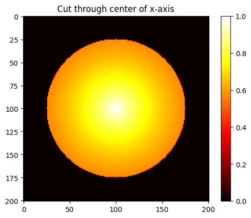
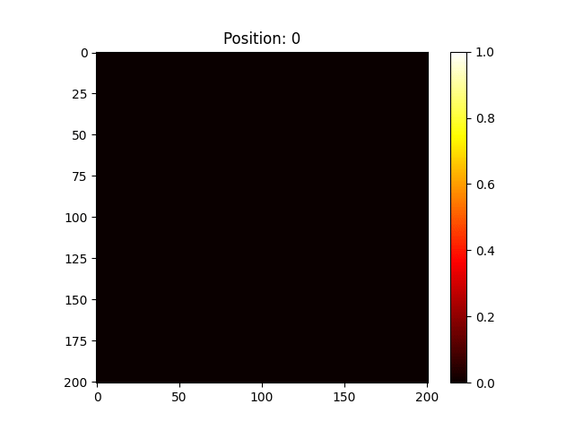

# Animation and Slider
{:.no_toc}

<nav markdown="1" class="toc-class">
* TOC
{:toc}
</nav>

## The goal

Sometimes a static picture is not enough. Here we will produce an animation from data as well as make data interactively inspectable.

Questions to [David Rotermund](mailto:davrot@uni-bremen.de)


## Test data

```python
import numpy as np
import matplotlib.pyplot as plt

axis = np.arange(-100, 101) / 100.0

x = axis[:, np.newaxis, np.newaxis].copy()
y = axis[np.newaxis, :, np.newaxis].copy()
z = axis[np.newaxis, np.newaxis, :].copy()

r = np.sqrt(x**2 + y**2 + z**2)

mask_0 = r > 0.75
r = 1.0 / (r + 1.0)
r[mask_0] = 0

plt.imshow(r[100, :, :], cmap="hot")
plt.colorbar()
plt.title("Cut through center of x-axis")
plt.show()
```



## Animation

### [functools.partial](https://docs.python.org/3/library/functools.html#functools.partial)

```python
functools.partial(func, /, *args, **keywords)
```

> Return a new partial object which when called will behave like func called with the positional arguments args and keyword arguments keywords. If more arguments are supplied to the call, they are appended to args. If additional keyword arguments are supplied, they extend and override keywords. 

### [matplotlib.animation.FuncAnimation](https://matplotlib.org/stable/api/_as_gen/matplotlib.animation.FuncAnimation.html#matplotlib-animation-funcanimation)

```python
class matplotlib.animation.FuncAnimation(fig, func, frames=None, init_func=None, fargs=None, save_count=None, *, cache_frame_data=True, **kwargs)
```

> **fig**: Figure
> 
> The figure object used to get needed events, such as draw or resize.
> 
> **func**: callable
> 
> The function to call at each frame. The first argument will be the next value in frames. Any additional positional arguments can be supplied using functools.partial or via the fargs parameter.
>
> 
> It is often more convenient to provide the arguments using functools.partial. In this way it is also possible to pass keyword arguments. To pass a function with both positional and keyword arguments, set all arguments as keyword arguments, just leaving the frame argument unset:

```python
def func(frame, art, *, y=None):
    ...

ani = FuncAnimation(fig, partial(func, art=ln, y='foo'))
```

> **frames** : iterable, int, generator function, or None, optional
> 
> Source of data to pass func and each frame of the animation
> 
> If an iterable, then simply use the values provided. If the iterable has a length, it will override the save_count kwarg.
> 
> **If an integer, then equivalent to passing range(frames)**
> 
> If a generator function, then must have the signature:

```python
def gen_function() -> obj
```

> If None, then equivalent to passing itertools.count.
> 
> In all of these cases, the values in frames is simply passed through to the user-supplied func and thus can be of any type.
>
> **interval** : int, default: 200
> Delay between frames in milliseconds.
> 
> **repeat_delay** : int, default: 0
> The delay in milliseconds between consecutive animation runs, if repeat is True.
> 
> **repeat** : bool, default: True
> Whether the animation repeats when the sequence of frames is completed.


### Example

```python
import numpy as np
import matplotlib.pyplot as plt
import matplotlib.animation
from functools import partial


def next_frame(
    i: int, images: np.ndarray, image_handle: matplotlib.image.AxesImage
) -> None:
    image_handle.set_data(images[i, :, :])
    plt.title(f"Position: {i}")
    return


axis = np.arange(-100, 101) / 100.0

x = axis[:, np.newaxis, np.newaxis].copy()
y = axis[np.newaxis, :, np.newaxis].copy()
z = axis[np.newaxis, np.newaxis, :].copy()

r = np.sqrt(x**2 + y**2 + z**2)

mask_0 = r > 0.75
r = 1.0 / (r + 1.0)
r[mask_0] = 0

number_of_frames: int = r.shape[0]
repeat_movie: bool = False
interval_between_frames_in_ms: int = 100

fig: matplotlib.figure.Figure = plt.figure()
# Generate the initial image
# and set the value range for the whole images array
image_handle = plt.imshow(r[0, :, :], vmin=r.min(), vmax=r.max(), cmap="hot")
plt.colorbar()

animation = matplotlib.animation.FuncAnimation(
    fig,
    partial(next_frame, images=r, image_handle=image_handle),
    frames=number_of_frames,
    interval=interval_between_frames_in_ms,
    repeat=repeat_movie,
)

plt.show()
```

## Save the animation

```python
save(filename[, writer, fps, dpi, codec, ...])
```

> Save the animation as a movie file by drawing every frame.

You need to add the save-method between **animation = matplotlib.animation.FuncAnimation(...)** and **plt.show()**.

```python
movie_filename: str | None = "movie.mp4"

if movie_filename is not None:
    animation.save(movie_filename)
```

Please note that you may need the [ffmpeg binaries](https://www.ffmpeg.org/download.html) for MP4. The ffmpeg files need to be accessable by Python. i.e. Python needs to know where they are. Under Windows it is helpful to place the three exe files in the binary directory of Python. Under Linux, the distribution package manager should take care of it.  

There are other options than MP4!

This is how it looks like a gif:



## Interactive Python session

There are several options if you don't run it from VS Code interactively. One options is this: 

```python
# %%
%matplotlib widget
```

Another one is this: 

```python
# %%
%matplotlib tk
```

Please check yourself which suits your setup best. 

## Slider

### [matplotlib.widgets.Slider](https://matplotlib.org/stable/api/widgets_api.html#matplotlib.widgets.Slider)

```python
class matplotlib.widgets.Slider(ax, label, valmin, valmax, *, valinit=0.5, valfmt=None, closedmin=True, closedmax=True, slidermin=None, slidermax=None, dragging=True, valstep=None, orientation='horizontal', initcolor='r', track_color='lightgrey', handle_style=None, **kwargs)
```

> A slider representing a floating point range.
> 
> Create a slider from valmin to valmax in Axes ax. For the slider to remain responsive you must maintain a reference to it. Call on_changed() to connect to the slider event.
> 
> **ax** : Axes
> 
> The Axes to put the slider in.
>
> **label** : str
> 
> Slider label.
> 
> **valmin** : float
> 
> The minimum value of the slider.
> 
> **valmax** : float
> 
> The maximum value of the slider.
> 
> **valinit** : float, default: 0.5
> The slider initial position.
> 
> **valstep** : float or array-like, default: None
> 
> If a float, the slider will snap to multiples of valstep. If an array the slider will snap to the values in the array.
> 
> **orientation** : {'horizontal', 'vertical'}, default: 'horizontal'
> 
> The orientation of the slider.

### [matplotlib.figure.add_axes](https://matplotlib.org/stable/api/figure_api.html#matplotlib.figure.Figure.add_axes)

```python
add_axes(*args, **kwargs)
```

> Add an Axes to the figure.
> 
> **rect**: tuple (left, bottom, width, height)
> 
> The dimensions (left, bottom, width, height) of the new Axes. All quantities are in fractions of figure width and height.
> 
> **projection** : {None, 'aitoff', 'hammer', 'lambert', 'mollweide', 'polar', 'rectilinear', str}, optional
> 
> The projection type of the Axes. str is the name of a custom projection, see projections. The default None results in a 'rectilinear' projection.
> 
> **polar** : bool, default: False
> 
> If True, equivalent to projection='polar'.
> 
> **axes_class** : subclass type of Axes, optional
> 
> The axes.Axes subclass that is instantiated. This parameter is incompatible with projection and polar. See axisartist for examples.
> 
> **sharex**, **sharey** : Axes, optional
> 
> Share the x or y axis with sharex and/or sharey. The axis will have the same limits, ticks, and scale as the axis of the shared axes.
> 
> **label** : str
> 
> A label for the returned Axes.

### [on_changed](https://matplotlib.org/stable/api/widgets_api.html#matplotlib.widgets.Slider.on_changed)

```python
on_changed(func)
```

> Connect func as callback function to changes of the slider value.
>
> **func** : callable
> 
> Function to call when slider is changed. The function must accept a single float as its arguments.

### Example

```python
import numpy as np
import matplotlib.pyplot as plt
import matplotlib
from matplotlib.widgets import Slider
from functools import partial


def next_frame(
    i: int, images: np.ndarray, image_handle: matplotlib.image.AxesImage
) -> None:
    image_handle.set_data(images[i, :, :])
    plt.title(f"Position: {i}")
    return


axis = np.arange(-100, 101) / 100.0

x = axis[:, np.newaxis, np.newaxis].copy()
y = axis[np.newaxis, :, np.newaxis].copy()
z = axis[np.newaxis, np.newaxis, :].copy()

r = np.sqrt(x**2 + y**2 + z**2)

mask_0 = r > 0.75
r = 1.0 / (r + 1.0)
r[mask_0] = 0

number_of_frames: int = r.shape[0]
repeat_movie: bool = False
interval_between_frames_in_ms: int = 100

fig: matplotlib.figure.Figure = plt.figure()
# Generate the initial image
# and set the value range for the whole images array
image_handle = plt.imshow(r[0, :, :], vmin=r.min(), vmax=r.max(), cmap="hot")
plt.colorbar()

axfreq = fig.add_axes([0.4, 0.9, 0.3, 0.03])
slice_slider = Slider(
    ax=axfreq, label="Slice", valmin=0, valmax=r.shape[0] - 1, valinit=0, valstep=1
)

slice_slider.on_changed(partial(next_frame, images=r, image_handle=image_handle))

plt.show()
```
