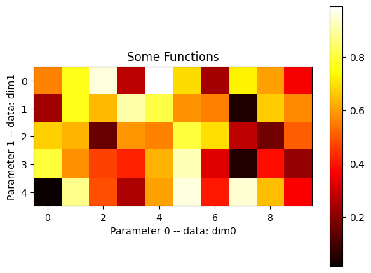

# Basics of matplotlib.pyplot
{:.no_toc}

<nav markdown="1" class="toc-class">
* TOC
{:toc}
</nav>

## The goal


Questions to [David Rotermund](mailto:davrot@uni-bremen.de)


> **pylab** is a historic interface and **its use is strongly discouraged**. The equivalent replacement is matplotlib.pyplot

## Simple example with plot


```python
import numpy as np
import matplotlib.pyplot as plt  # type: ignore

f: float = 10
t = np.linspace(0, 1.0, 10000)
y = np.sin(t * 2 * np.pi * f)
z = np.cos(t * 2 * np.pi * f)

plt.figure(1)
plt.plot(t, y, label="Sin")
plt.plot(t, z, label="Cos")
plt.xlabel("t")
plt.ylabel("f(t)")
plt.title("Some Functions")
plt.legend()
plt.savefig("Test.pdf")

plt.show()  # This is optinal in Interactive Cell mode
```

### [plt.figure()](https://matplotlib.org/stable/api/_as_gen/matplotlib.pyplot.figure.html)

```python
matplotlib.pyplot.figure(num=None, figsize=None, dpi=None, *, facecolor=None, edgecolor=None, frameon=True, FigureClass=<class 'matplotlib.figure.Figure'>, clear=False, **kwargs)
```

> Create a new figure, or activate an existing figure.

### [plt.plot()](https://matplotlib.org/stable/api/_as_gen/matplotlib.pyplot.plot.html)


```python
matplotlib.pyplot.plot(*args, scalex=True, scaley=True, data=None, **kwargs)
```

Well, this function definition is not very helpful. 


> Plot y versus x as lines and/or markers.

```python
plot([x], y, [fmt], *, data=None, **kwargs)
plot([x], y, [fmt], [x2], y2, [fmt2], ..., **kwargs)
```

Some examples:

```python
plot(x, y)        # plot x and y using default line style and color
plot(x, y, 'bo')  # plot x and y using blue circle markers
plot(y)           # plot y using x as index array 0..N-1
plot(y, 'r+')     # ditto, but with red plusses
plot(x, y, 'go--', linewidth=2, markersize=12)
plot(x, y, color='green', marker='o', linestyle='dashed',linewidth=2, markersize=12)
```

#### Plotting multiple sets of data

> The most straight forward way is just to call plot multiple times. Example:

```python
plot(x1, y1, 'bo')
plot(x2, y2, 'go')
```

> By default, each line is assigned a different style specified by a 'style cycle'. The fmt and line property parameters are only necessary if you want explicit deviations from these defaults. Alternatively, you can also change the style cycle using rcParams["axes.prop_cycle"] (default: cycler('color', ['#1f77b4', '#ff7f0e', '#2ca02c', '#d62728', '#9467bd', '#8c564b', '#e377c2', '#7f7f7f', '#bcbd22', '#17becf'])).

#### Main parameter

**x, y** : array-like or scalar
    The horizontal / vertical coordinates of the data points. x values are optional and default to range(len(y)).
    Commonly, these parameters are 1D arrays.
    They can also be scalars, or two-dimensional (in that case, the columns represent separate data sets).
    These arguments cannot be passed as keywords.

**fmt** : str, optional
    A format string, e.g. 'ro' for red circles. See the Notes section for a full description of the format strings.
    Format strings are just an abbreviation for quickly setting basic line properties. All of these and more can also be controlled by keyword arguments.
    This argument cannot be passed as keyword.


#### Format Strings

> A format string consists of a part for color, marker and line:

```python
fmt = '[marker][line][color]'
```

> Each of them is optional. If not provided, the value from the style cycle is used. Exception: If line is given, but no marker, the data will be a line without markers.
>
> Other combinations such as [color][marker][line] are also supported, but note that their parsing may be ambiguous.

##### Markers

|character|description|
|---|---|
|'.'||point marker|
|','||pixel marker|
|'o'|circle marker|
|'v'|triangle_down marker|
|'^'|triangle_up marker|
|'<'|triangle_left marker|
|'>'|triangle_right marker|
|'1'|tri_down marker|
|'2'|tri_up marker|
|'3'|tri_left marker|
|'4'|tri_right marker|
|'8'|octagon marker|
|'s'|square marker|
|'p'|pentagon marker|
|'P'|plus (filled) marker|
|'*'|star marker|
|'h'|hexagon1 marker|
|'H'|hexagon2 marker|
|'+'|plus marker|
|'x'|x marker|
|'X'|x (filled) marker|
|'D'|diamond marker|
|'d'|thin_diamond marker|
|'\|'|vline marker|
|'_'|hline marker|


##### Line Styles

|character|description|
|---|---|
|'-'|solid line style|
|'--'|dashed line style|
|'-.'|dash-dot line style|
|':'|dotted line style|


##### Colors

> The supported color abbreviations are the single letter codes

|character|color|
|---|---|
|'b'|blue|
|'g'|green|
|'r'|red|
|'c'|cyan|
|'m'|magenta|
|'y'|yellow|
|'k'|black|
|'w'|white|

> and the **'CN'** colors that index into the default property cycle.

> If the color is the only part of the format string, you can additionally use any matplotlib.colors spec, e.g. full names ('green') or hex strings ('#008000').

#### Other parameters

[there are more parameters](https://matplotlib.org/stable/api/_as_gen/matplotlib.pyplot.plot.html)

|||
|---|---|
|[alpha](https://matplotlib.org/stable/api/_as_gen/matplotlib.artist.Artist.set_alpha.html#matplotlib.artist.Artist.set_alpha) | Set the alpha value used for blending - not supported on all backends.|
|[antialiased or aa](https://matplotlib.org/stable/api/_as_gen/matplotlib.lines.Line2D.html#matplotlib.lines.Line2D.set_antialiased)|bool|
|[clip_box](https://matplotlib.org/stable/api/_as_gen/matplotlib.artist.Artist.set_clip_box.html#matplotlib.artist.Artist.set_clip_box)|BboxBase or None|
|[clip_on](https://matplotlib.org/stable/api/_as_gen/matplotlib.artist.Artist.set_clip_on.html#matplotlib.artist.Artist.set_clip_on)|bool|
|[color or c](https://matplotlib.org/stable/api/_as_gen/matplotlib.lines.Line2D.html#matplotlib.lines.Line2D.set_color)|color|
|[dash_capstyle](https://matplotlib.org/stable/api/_as_gen/matplotlib.lines.Line2D.html#matplotlib.lines.Line2D.set_dash_capstyle)|CapStyle or {'butt', 'projecting', 'round'}|
|[dash_joinstyle](https://matplotlib.org/stable/api/_as_gen/matplotlib.lines.Line2D.html#matplotlib.lines.Line2D.set_dash_joinstyle)|JoinStyle or {'miter', 'round', 'bevel'}|
|[dashes](https://matplotlib.org/stable/api/_as_gen/matplotlib.lines.Line2D.html#matplotlib.lines.Line2D.set_dashes)|sequence of floats (on/off ink in points) or (None, None)|
|[drawstyle or ds](https://matplotlib.org/stable/api/_as_gen/matplotlib.lines.Line2D.html#matplotlib.lines.Line2D.set_drawstyle)|{'default', 'steps', 'steps-pre', 'steps-mid', 'steps-post'}, default: 'default'|
|[figure](https://matplotlib.org/stable/api/_as_gen/matplotlib.artist.Artist.set_figure.html#matplotlib.artist.Artist.set_figure)|Figure|
|[fillstyle](https://matplotlib.org/stable/api/_as_gen/matplotlib.lines.Line2D.html#matplotlib.lines.Line2D.set_fillstyle)|{'full', 'left', 'right', 'bottom', 'top', 'none'}|
|[gapcolor](https://matplotlib.org/stable/api/_as_gen/matplotlib.lines.Line2D.html#matplotlib.lines.Line2D.set_gapcolor)|color or None|
|[label](https://matplotlib.org/stable/api/_as_gen/matplotlib.artist.Artist.set_label.html#matplotlib.artist.Artist.set_label)|object|
|[linestyle or ls](https://matplotlib.org/stable/api/_as_gen/matplotlib.lines.Line2D.html#matplotlib.lines.Line2D.set_linestyle)|{'-', '--', '-.', ':', '', (offset, on-off-seq), ...}|
|[linewidth or lw](https://matplotlib.org/stable/api/_as_gen/matplotlib.lines.Line2D.html#matplotlib.lines.Line2D.set_linewidth)|float|
|[marker](https://matplotlib.org/stable/api/_as_gen/matplotlib.lines.Line2D.html#matplotlib.lines.Line2D.set_marker)|marker style string, Path or MarkerStyle|
|[markeredgecolor or mec](https://matplotlib.org/stable/api/_as_gen/matplotlib.lines.Line2D.html#matplotlib.lines.Line2D.set_markeredgecolor)|color|
|[markeredgewidth or mew](https://matplotlib.org/stable/api/_as_gen/matplotlib.lines.Line2D.html#matplotlib.lines.Line2D.set_markeredgewidth)|float|
|[markerfacecolor or mfc](https://matplotlib.org/stable/api/_as_gen/matplotlib.lines.Line2D.html#matplotlib.lines.Line2D.set_markerfacecolor)|color|
|[markerfacecoloralt or mfcalt](https://matplotlib.org/stable/api/_as_gen/matplotlib.lines.Line2D.html#matplotlib.lines.Line2D.set_markerfacecoloralt)|color|
|[markersize or ms](https://matplotlib.org/stable/api/_as_gen/matplotlib.lines.Line2D.html#matplotlib.lines.Line2D.set_markersize)|float|
|[rasterized](https://matplotlib.org/stable/api/_as_gen/matplotlib.artist.Artist.set_rasterized.html#matplotlib.artist.Artist.set_rasterized)|Force rasterized (bitmap) drawing for vector graphics output.|
|[solid_capstyle](https://matplotlib.org/stable/api/_as_gen/matplotlib.lines.Line2D.html#matplotlib.lines.Line2D.set_solid_capstyle)|CapStyle or {'butt', 'projecting', 'round'}|
|[solid_joinstyle](https://matplotlib.org/stable/api/_as_gen/matplotlib.lines.Line2D.html#matplotlib.lines.Line2D.set_solid_joinstyle)|JoinStyle or {'miter', 'round', 'bevel'}|
|[url](https://matplotlib.org/stable/api/_as_gen/matplotlib.artist.Artist.set_url.html#matplotlib.artist.Artist.set_url)|str|
|[visible](https://matplotlib.org/stable/api/_as_gen/matplotlib.artist.Artist.set_visible.html#matplotlib.artist.Artist.set_visible)|bool|

### [plt.xlabel()](https://matplotlib.org/stable/api/_as_gen/matplotlib.pyplot.xlabel.html)

```python
matplotlib.pyplot.xlabel(xlabel, fontdict=None, labelpad=None, *, loc=None, **kwargs)
```

> Set the label for the x-axis.

### [plt.ylabel()](https://matplotlib.org/stable/api/_as_gen/matplotlib.pyplot.ylabel.html)

```python
matplotlib.pyplot.ylabel(ylabel, fontdict=None, labelpad=None, *, loc=None, **kwargs)
```

> Set the label for the y-axis.


### [plt.title()](https://matplotlib.org/stable/api/_as_gen/matplotlib.pyplot.title.html)

```python
matplotlib.pyplot.title(label, fontdict=None, loc=None, pad=None, *, y=None, **kwargs)
```

> Set a title for the Axes.
>
> Set one of the three available Axes titles. The available titles are positioned above the Axes in the center, flush with the left edge, and flush with the right edge.

### [plt.legend()](https://matplotlib.org/stable/api/_as_gen/matplotlib.pyplot.legend.html)

```python
matplotlib.pyplot.legend(*args, **kwargs)
```

> Place a legend on the Axes.

```python
legend()
legend(handles, labels)
legend(handles=handles)
legend(labels)
```

[There are parameters](https://matplotlib.org/stable/api/_as_gen/matplotlib.pyplot.legend.html). A lot. However, you mainly need loc for locations of the legend. 

#### Location String

**loc** : str or pair of floats, default: rcParams["legend.loc"] (default: 'best')

|Location| Code|
|---|---|
|'best' (Axes only)|0|
|'upper right'|1|
|'upper left'|2|
|'lower left'|3|
|'lower right'|4|
|'right'|5|
|'center left'|6|
|'center right'|7|
|'lower center'|8|
|'upper center'|9|
|'center'|10|

### [plt.savefig()]()

```python
matplotlib.pyplot.savefig(*args, **kwargs)
```

> Save the current figure.

```python
savefig(fname, *, transparent=None, dpi='figure', format=None,
        metadata=None, bbox_inches=None, pad_inches=0.1,
        facecolor='auto', edgecolor='auto', backend=None,
        **kwargs
       )
```

> The available output formats depend on the backend being used.

**Note: savefig has to be done before show, otherwise the exported image will be empty.**

### [plt.show()](https://matplotlib.org/stable/api/_as_gen/matplotlib.pyplot.show.html)

```python
matplotlib.pyplot.show(*, block=None)
```

> Display all open figures.

## Simple example with imshow



```python
import numpy as np
import matplotlib.pyplot as plt  # type: ignore

rng = np.random.default_rng()
data = rng.random((5, 10))

plt.figure(1)
plt.imshow(data, cmap="hot")
plt.colorbar()

plt.xlabel("Parameter 0 -- data: dim0")
plt.ylabel("Parameter 1 -- data: dim1")
plt.title("Some Functions")

plt.show()  # This is optinal in Interactive Cell mode
```

### [plt.imshow()](https://matplotlib.org/stable/api/_as_gen/matplotlib.pyplot.imshow.html)

```python
matplotlib.pyplot.imshow(X, cmap=None, norm=None, *, aspect=None, interpolation=None, alpha=None, vmin=None, vmax=None, origin=None, extent=None, interpolation_stage=None, filternorm=True, filterrad=4.0, resample=None, url=None, data=None, **kwargs)
```

> Display data as an image, i.e., on a 2D regular raster.
> 
> The input may either be actual RGB(A) data, or 2D scalar data, which will be rendered as a pseudocolor image. For displaying a grayscale image, set up the colormapping using the parameters cmap='gray', vmin=0, vmax=255.

There is a collection of [arguments](https://matplotlib.org/stable/api/_as_gen/matplotlib.pyplot.imshow.html) available. Here are the most important ones: 


> **X**: array-like or PIL image
>     The image data. Supported array shapes are:
> 
>     (M, N): an image with scalar data. The values are mapped to colors using normalization and a colormap. See parameters norm, cmap, vmin, vmax.
> 
>     (M, N, 3): an image with RGB values (0-1 float or 0-255 int).
> 
>     (M, N, 4): an image with RGBA values (0-1 float or 0-255 int), i.e. including transparency.
> 
>     The first two dimensions (M, N) define the rows and columns of the image.
> 
>     Out-of-range RGB(A) values are clipped.

> **cmap** : str or Colormap, default: rcParams["image.cmap"] (default: 'viridis')
>    The Colormap instance or registered colormap name used to map scalar data to colors.
> 
>    This parameter is ignored if X is RGB(A).


> **vmin**, **vmax** : float, optional
>    When using scalar data and no explicit norm, vmin and vmax define the data range that the colormap covers. By default, the colormap covers the complete value range of the supplied data. It is an error to use vmin/vmax when a norm instance is given (but using a str norm name together with vmin/vmax is acceptable).
> 
>     This parameter is ignored if X is RGB(A).

> *aspect* : {'equal', 'auto'} or float or None, default: None
>     The aspect ratio of the Axes. This parameter is particularly relevant for images since it determines whether data pixels are square.
> 
>    This parameter is a shortcut for explicitly calling Axes.set_aspect. See there for further details.
>    
>    'equal': Ensures an aspect ratio of 1. Pixels will be square (unless pixel sizes are explicitly made non-square in data coordinates using extent).
>    
>    'auto': The Axes is kept fixed and the aspect is adjusted so that the data fit in the Axes. In general, this will result in non-square pixels.
>    
>    Normally, None (the default) means to use rcParams["image.aspect"] (default: 'equal'). However, if the image uses a transform that does not contain the axes data transform, then None means to not modify the axes aspect at all (in that case, directly call Axes.set_aspect if desired).

> **interpolation** : str, default: rcParams["image.interpolation"] (default: 'antialiased')

#### [Colormaps](https://matplotlib.org/stable/users/explain/colors/colormaps.html)

There are a lot of [colormaps](https://matplotlib.org/stable/users/explain/colors/colormaps.html).

```python
plot_color_gradients('Perceptually Uniform Sequential',
                     ['viridis', 'plasma', 'inferno', 'magma', 'cividis'])

plot_color_gradients('Sequential',
                     ['Greys', 'Purples', 'Blues', 'Greens', 'Oranges', 'Reds',
                      'YlOrBr', 'YlOrRd', 'OrRd', 'PuRd', 'RdPu', 'BuPu',
                      'GnBu', 'PuBu', 'YlGnBu', 'PuBuGn', 'BuGn', 'YlGn'])                     

plot_color_gradients('Sequential (2)',
                     ['binary', 'gist_yarg', 'gist_gray', 'gray', 'bone',
                      'pink', 'spring', 'summer', 'autumn', 'winter', 'cool',
                      'Wistia', 'hot', 'afmhot', 'gist_heat', 'copper'])

plot_color_gradients('Diverging',
                     ['PiYG', 'PRGn', 'BrBG', 'PuOr', 'RdGy', 'RdBu', 'RdYlBu',
                      'RdYlGn', 'Spectral', 'coolwarm', 'bwr', 'seismic'])

plot_color_gradients('Cyclic', ['twilight', 'twilight_shifted', 'hsv'])

plot_color_gradients('Qualitative',
                     ['Pastel1', 'Pastel2', 'Paired', 'Accent', 'Dark2',
                      'Set1', 'Set2', 'Set3', 'tab10', 'tab20', 'tab20b',
                      'tab20c'])

plot_color_gradients('Miscellaneous',
                     ['flag', 'prism', 'ocean', 'gist_earth', 'terrain',
                      'gist_stern', 'gnuplot', 'gnuplot2', 'CMRmap',
                      'cubehelix', 'brg', 'gist_rainbow', 'rainbow', 'jet',
                      'turbo', 'nipy_spectral', 'gist_ncar'])

```
                      
### [plt.colorbar()](https://matplotlib.org/stable/api/_as_gen/matplotlib.pyplot.colorbar.html)

```python
matplotlib.pyplot.colorbar(mappable=None, cax=None, ax=None, **kwargs)
```

> Add a colorbar to a plot.

#### Other Parameters:

A selecton of the important [parameters](https://matplotlib.org/stable/api/_as_gen/matplotlib.pyplot.colorbar.html):

> **location** : None or {'left', 'right', 'top', 'bottom'}
>     The location, relative to the parent axes, where the colorbar axes is created. It also determines the orientation of the colorbar (colorbars on the left and right are vertical, colorbars at the top and bottom are horizontal). If None, the location will come from the orientation if it is set (vertical colorbars on the right, horizontal ones at the bottom), or default to 'right' if orientation is unset.

> **orientation** : None or {'vertical', 'horizontal'}
>    The orientation of the colorbar. It is preferable to set the location of the colorbar, as that also determines the orientation; passing incompatible values for location and orientation raises an exception.

> **fraction** : float, default: 0.15
>     Fraction of original axes to use for colorbar.

> **shrink** : float, default: 1.0
>    Fraction by which to multiply the size of the colorbar.

> **aspect** : float, default: 20
>     Ratio of long to short dimensions.

> **pad** : float, default: 0.05 if vertical, 0.15 if horizontal
>     Fraction of original axes between colorbar and new image axes.

> **anchor** : (float, float), optional
>    The anchor point of the colorbar axes. Defaults to (0.0, 0.5) if vertical; (0.5, 1.0) if horizontal.

> **ticks** : None or list of ticks or Locator
>    If None, ticks are determined automatically from the input.

> **label** : str
>     The label on the colorbar's long axis.


