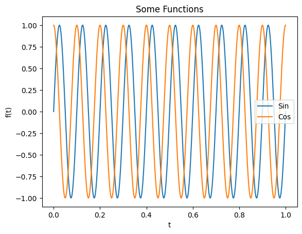

# Basics of matplotlib.pyplot
{:.no_toc}

<nav markdown="1" class="toc-class">
* TOC
{:toc}
</nav>

## The goal


Questions to [David Rotermund](mailto:davrot@uni-bremen.de)


> **pylab** is a historic interface and **its use is strongly discouraged**. The equivalent replacement is matplotlib.pyplot

## Simple example with plot




```python
import numpy as np
import matplotlib.pyplot as plt  # type: ignore

f: float = 10
t = np.linspace(0, 1.0, 10000)
y = np.sin(t * 2 * np.pi * f)
z = np.cos(t * 2 * np.pi * f)

plt.figure(1)
plt.plot(t, y, label="Sin")
plt.plot(t, z, label="Cos")
plt.xlabel("t")
plt.ylabel("f(t)")
plt.title("Some Functions")
plt.legend()
plt.savefig("Test.pdf")

plt.show()  # This is optinal in Interactive Cell mode
```

### [plt.plot()](https://matplotlib.org/stable/api/_as_gen/matplotlib.pyplot.plot.html)


```python
matplotlib.pyplot.plot(*args, scalex=True, scaley=True, data=None, **kwargs)
```

> Plot y versus x as lines and/or markers.

This function definition is not very helpful. 

Some examples:

```python
plot(x, y)        # plot x and y using default line style and color
plot(x, y, 'bo')  # plot x and y using blue circle markers
plot(y)           # plot y using x as index array 0..N-1
plot(y, 'r+')     # ditto, but with red plusses
plot(x, y, 'go--', linewidth=2, markersize=12)
plot(x, y, color='green', marker='o', linestyle='dashed',linewidth=2, markersize=12)
```

#### Plotting multiple sets of data

> The most straight forward way is just to call plot multiple times. Example:

```python
plot(x1, y1, 'bo')
plot(x2, y2, 'go')
```

> By default, each line is assigned a different style specified by a 'style cycle'. The fmt and line property parameters are only necessary if you want explicit deviations from these defaults. Alternatively, you can also change the style cycle using rcParams["axes.prop_cycle"] (default: cycler('color', ['#1f77b4', '#ff7f0e', '#2ca02c', '#d62728', '#9467bd', '#8c564b', '#e377c2', '#7f7f7f', '#bcbd22', '#17becf'])).

#### Main parameter

**x, y** : array-like or scalar
    The horizontal / vertical coordinates of the data points. x values are optional and default to range(len(y)).
    Commonly, these parameters are 1D arrays.
    They can also be scalars, or two-dimensional (in that case, the columns represent separate data sets).
    These arguments cannot be passed as keywords.

**fmt** : str, optional
    A format string, e.g. 'ro' for red circles. See the Notes section for a full description of the format strings.
    Format strings are just an abbreviation for quickly setting basic line properties. All of these and more can also be controlled by keyword arguments.
    This argument cannot be passed as keyword.


#### Format Strings

> A format string consists of a part for color, marker and line:

```python
fmt = '[marker][line][color]'
```

> Each of them is optional. If not provided, the value from the style cycle is used. Exception: If line is given, but no marker, the data will be a line without markers.
>
> Other combinations such as [color][marker][line] are also supported, but note that their parsing may be ambiguous.

##### Markers

|character|description|
|---|---|
|'.'||point marker|
|','||pixel marker|
|'o'|circle marker|
|'v'|triangle_down marker|
|'^'|triangle_up marker|
|'<'|triangle_left marker|
|'>'|triangle_right marker|
|'1'|tri_down marker|
|'2'|tri_up marker|
|'3'|tri_left marker|
|'4'|tri_right marker|
|'8'|octagon marker|
|'s'|square marker|
|'p'|pentagon marker|
|'P'|plus (filled) marker|
|'*'|star marker|
|'h'|hexagon1 marker|
|'H'|hexagon2 marker|
|'+'|plus marker|
|'x'|x marker|
|'X'|x (filled) marker|
|'D'|diamond marker|
|'d'|thin_diamond marker|
|'\|'|vline marker|
|'_'|hline marker|


##### Line Styles

|character|description|
|---|---|
|'-'|solid line style|
|'--'|dashed line style|
|'-.'|dash-dot line style|
|':'|dotted line style|


##### Colors

> The supported color abbreviations are the single letter codes

|character|color|
|---|---|
|'b'|blue|
|'g'|green|
|'r'|red|
|'c'|cyan|
|'m'|magenta|
|'y'|yellow|
|'k'|black|
|'w'|white|

> and the **'CN'** colors that index into the default property cycle.

> If the color is the only part of the format string, you can additionally use any matplotlib.colors spec, e.g. full names ('green') or hex strings ('#008000').

#### Other parameters

[there are more parameters](https://matplotlib.org/stable/api/_as_gen/matplotlib.pyplot.plot.html)

|||
|---|---|
|[alpha](https://matplotlib.org/stable/api/_as_gen/matplotlib.artist.Artist.set_alpha.html#matplotlib.artist.Artist.set_alpha) | Set the alpha value used for blending - not supported on all backends.|
|[antialiased or aa](https://matplotlib.org/stable/api/_as_gen/matplotlib.lines.Line2D.html#matplotlib.lines.Line2D.set_antialiased)|bool|
|[clip_box](https://matplotlib.org/stable/api/_as_gen/matplotlib.artist.Artist.set_clip_box.html#matplotlib.artist.Artist.set_clip_box)|BboxBase or None|
|[clip_on](https://matplotlib.org/stable/api/_as_gen/matplotlib.artist.Artist.set_clip_on.html#matplotlib.artist.Artist.set_clip_on)|bool|
|[color or c](https://matplotlib.org/stable/api/_as_gen/matplotlib.lines.Line2D.html#matplotlib.lines.Line2D.set_color)|color|
|[dash_capstyle](https://matplotlib.org/stable/api/_as_gen/matplotlib.lines.Line2D.html#matplotlib.lines.Line2D.set_dash_capstyle)|CapStyle or {'butt', 'projecting', 'round'}|
|[dash_joinstyle](https://matplotlib.org/stable/api/_as_gen/matplotlib.lines.Line2D.html#matplotlib.lines.Line2D.set_dash_joinstyle)|JoinStyle or {'miter', 'round', 'bevel'}|
|[dashes](https://matplotlib.org/stable/api/_as_gen/matplotlib.lines.Line2D.html#matplotlib.lines.Line2D.set_dashes)|sequence of floats (on/off ink in points) or (None, None)|
|[drawstyle or ds](https://matplotlib.org/stable/api/_as_gen/matplotlib.lines.Line2D.html#matplotlib.lines.Line2D.set_drawstyle)|{'default', 'steps', 'steps-pre', 'steps-mid', 'steps-post'}, default: 'default'|
|[figure](https://matplotlib.org/stable/api/_as_gen/matplotlib.artist.Artist.set_figure.html#matplotlib.artist.Artist.set_figure)|Figure|
|[fillstyle](https://matplotlib.org/stable/api/_as_gen/matplotlib.lines.Line2D.html#matplotlib.lines.Line2D.set_fillstyle)|{'full', 'left', 'right', 'bottom', 'top', 'none'}|
|[gapcolor](https://matplotlib.org/stable/api/_as_gen/matplotlib.lines.Line2D.html#matplotlib.lines.Line2D.set_gapcolor)|color or None|
|[label](https://matplotlib.org/stable/api/_as_gen/matplotlib.artist.Artist.set_label.html#matplotlib.artist.Artist.set_label)|object|
|[linestyle or ls](https://matplotlib.org/stable/api/_as_gen/matplotlib.lines.Line2D.html#matplotlib.lines.Line2D.set_linestyle)|{'-', '--', '-.', ':', '', (offset, on-off-seq), ...}|
|[linewidth or lw](https://matplotlib.org/stable/api/_as_gen/matplotlib.lines.Line2D.html#matplotlib.lines.Line2D.set_linewidth)|float|
|[marker](https://matplotlib.org/stable/api/_as_gen/matplotlib.lines.Line2D.html#matplotlib.lines.Line2D.set_marker)|marker style string, Path or MarkerStyle|
|[markeredgecolor or mec](https://matplotlib.org/stable/api/_as_gen/matplotlib.lines.Line2D.html#matplotlib.lines.Line2D.set_markeredgecolor)|color|
|[markeredgewidth or mew](https://matplotlib.org/stable/api/_as_gen/matplotlib.lines.Line2D.html#matplotlib.lines.Line2D.set_markeredgewidth)|float|
|[markerfacecolor or mfc](https://matplotlib.org/stable/api/_as_gen/matplotlib.lines.Line2D.html#matplotlib.lines.Line2D.set_markerfacecolor)|color|
|[markerfacecoloralt or mfcalt](https://matplotlib.org/stable/api/_as_gen/matplotlib.lines.Line2D.html#matplotlib.lines.Line2D.set_markerfacecoloralt)|color|
|[markersize or ms](https://matplotlib.org/stable/api/_as_gen/matplotlib.lines.Line2D.html#matplotlib.lines.Line2D.set_markersize)|float|
|[rasterized](https://matplotlib.org/stable/api/_as_gen/matplotlib.artist.Artist.set_rasterized.html#matplotlib.artist.Artist.set_rasterized)|Force rasterized (bitmap) drawing for vector graphics output.|
|[solid_capstyle](https://matplotlib.org/stable/api/_as_gen/matplotlib.lines.Line2D.html#matplotlib.lines.Line2D.set_solid_capstyle)|CapStyle or {'butt', 'projecting', 'round'}|
|[solid_joinstyle](https://matplotlib.org/stable/api/_as_gen/matplotlib.lines.Line2D.html#matplotlib.lines.Line2D.set_solid_joinstyle)|JoinStyle or {'miter', 'round', 'bevel'}|
|[url](https://matplotlib.org/stable/api/_as_gen/matplotlib.artist.Artist.set_url.html#matplotlib.artist.Artist.set_url)|str|
|[visible](https://matplotlib.org/stable/api/_as_gen/matplotlib.artist.Artist.set_visible.html#matplotlib.artist.Artist.set_visible)|bool|

## [Managing Figure and Axes](https://matplotlib.org/stable/api/pyplot_summary.html#managing-figure-and-axes)

|||
|---|---|
|[axes](https://matplotlib.org/stable/api/_as_gen/matplotlib.pyplot.axes.html#matplotlib.pyplot.axes)|Add an Axes to the current figure and make it the current Axes.|
|[cla](https://matplotlib.org/stable/api/_as_gen/matplotlib.pyplot.cla.html#matplotlib.pyplot.cla)|Clear the current axes.|
|[clf](https://matplotlib.org/stable/api/_as_gen/matplotlib.pyplot.clf.html#matplotlib.pyplot.clf)|Clear the current figure.|
|[close](https://matplotlib.org/stable/api/_as_gen/matplotlib.pyplot.close.html#matplotlib.pyplot.close)|Close a figure window.|
|[delaxes](https://matplotlib.org/stable/api/_as_gen/matplotlib.pyplot.delaxes.html#matplotlib.pyplot.delaxes)|Remove an Axes (defaulting to the current axes) from its figure.|
|[fignum_exists](https://matplotlib.org/stable/api/_as_gen/matplotlib.pyplot.fignum_exists.html#matplotlib.pyplot.fignum_exists)|Return whether the figure with the given id exists.|
|[figure](https://matplotlib.org/stable/api/_as_gen/matplotlib.pyplot.figure.html#matplotlib.pyplot.figure)|Create a new figure, or activate an existing figure.|
|[gca](https://matplotlib.org/stable/api/_as_gen/matplotlib.pyplot.gca.html#matplotlib.pyplot.gca)|Get the current Axes.|
|[gcf](https://matplotlib.org/stable/api/_as_gen/matplotlib.pyplot.gcf.html#matplotlib.pyplot.gcf)|Get the current figure.|
|[get_figlabels](https://matplotlib.org/stable/api/_as_gen/matplotlib.pyplot.get_figlabels.html#matplotlib.pyplot.get_figlabels)|Return a list of existing figure labels.|
|[get_fignums](https://matplotlib.org/stable/api/_as_gen/matplotlib.pyplot.get_fignums.html#matplotlib.pyplot.get_fignums)|Return a list of existing figure numbers.|
|[sca](https://matplotlib.org/stable/api/_as_gen/matplotlib.pyplot.sca.html#matplotlib.pyplot.sca)|Set the current Axes to ax and the current Figure to the parent of ax.|
|[subplot](https://matplotlib.org/stable/api/_as_gen/matplotlib.pyplot.subplot.html#matplotlib.pyplot.subplot)|Add an Axes to the current figure or retrieve an existing Axes.|
|[subplot2grid](https://matplotlib.org/stable/api/_as_gen/matplotlib.pyplot.subplot2grid.html#matplotlib.pyplot.subplot2grid)|Create a subplot at a specific location inside a regular grid.|
|[subplot_mosaic](https://matplotlib.org/stable/api/_as_gen/matplotlib.pyplot.subplot_mosaic.html#matplotlib.pyplot.subplot_mosaic)|Build a layout of Axes based on ASCII art or nested lists.|
|[subplots](https://matplotlib.org/stable/api/_as_gen/matplotlib.pyplot.subplots.html#matplotlib.pyplot.subplots)|Create a figure and a set of subplots.|
|[twinx](https://matplotlib.org/stable/api/_as_gen/matplotlib.pyplot.twinx.html#matplotlib.pyplot.twinx)| Make and return a second axes that shares the x-axis.|
|[twiny](https://matplotlib.org/stable/api/_as_gen/matplotlib.pyplot.twiny.html#matplotlib.pyplot.twiny)| Make and return a second axes that shares the y-axis.|

## [Basic](https://matplotlib.org/stable/api/pyplot_summary.html#basic)

more [Basic](https://matplotlib.org/stable/api/pyplot_summary.html#basic)

|||
|---|---|
|[plot](https://matplotlib.org/stable/api/_as_gen/matplotlib.pyplot.plot.html#matplotlib.pyplot.plot)|Plot y versus x as lines and/or markers.|
|[errorbar](https://matplotlib.org/stable/api/_as_gen/matplotlib.pyplot.errorbar.html#matplotlib.pyplot.errorbar)|Plot y versus x as lines and/or markers with attached errorbars.|
|[scatter](https://matplotlib.org/stable/api/_as_gen/matplotlib.pyplot.scatter.html#matplotlib.pyplot.scatter)|A scatter plot of y vs.|
|[step](https://matplotlib.org/stable/api/_as_gen/matplotlib.pyplot.step.html#matplotlib.pyplot.step)|Make a step plot.|
|[loglog](https://matplotlib.org/stable/api/_as_gen/matplotlib.pyplot.loglog.html#matplotlib.pyplot.loglog)|Make a plot with log scaling on both the x- and y-axis.|
|[semilogx](https://matplotlib.org/stable/api/_as_gen/matplotlib.pyplot.semilogx.html#matplotlib.pyplot.semilogx)|Make a plot with log scaling on the x-axis.|
|[semilogy](https://matplotlib.org/stable/api/_as_gen/matplotlib.pyplot.semilogy.html#matplotlib.pyplot.semilogy)|Make a plot with log scaling on the y-axis.|
|[bar](https://matplotlib.org/stable/api/_as_gen/matplotlib.pyplot.bar.html#matplotlib.pyplot.bar)|Make a bar plot.|
|[barh](https://matplotlib.org/stable/api/_as_gen/matplotlib.pyplot.barh.html#matplotlib.pyplot.barh)|Make a horizontal bar plot.|
|[bar_label](https://matplotlib.org/stable/api/_as_gen/matplotlib.pyplot.bar_label.html#matplotlib.pyplot.bar_label)|Label a bar plot.|
|[pie](https://matplotlib.org/stable/api/_as_gen/matplotlib.pyplot.pie.html#matplotlib.pyplot.pie)|Plot a pie chart.|
|[vlines](https://matplotlib.org/stable/api/_as_gen/matplotlib.pyplot.vlines.html#matplotlib.pyplot.vlines)|Plot vertical lines at each x from ymin to ymax.|
|[hlines](https://matplotlib.org/stable/api/_as_gen/matplotlib.pyplot.hlines.html#matplotlib.pyplot.hlines)|Plot horizontal lines at each y from xmin to xmax.|
|[fill](https://matplotlib.org/stable/api/_as_gen/matplotlib.pyplot.fill.html#matplotlib.pyplot.fill)|Plot filled polygons.|
|[polar](https://matplotlib.org/stable/api/_as_gen/matplotlib.pyplot.polar.html#matplotlib.pyplot.polar)|Make a polar plot.|

## [Spans](https://matplotlib.org/stable/api/pyplot_summary.html#spans)
[Spans](https://matplotlib.org/stable/api/pyplot_summary.html#spans)


## [Spectral](https://matplotlib.org/stable/api/pyplot_summary.html#spectral)
[Spectral](https://matplotlib.org/stable/api/pyplot_summary.html#spectral)

## [Binned](https://matplotlib.org/stable/api/pyplot_summary.html#spectral)

more [Binned](https://matplotlib.org/stable/api/pyplot_summary.html#spectral)

|||
|---|---|
|[hist](https://matplotlib.org/stable/api/_as_gen/matplotlib.pyplot.hist.html#matplotlib.pyplot.hist)|Compute and plot a histogram.|
|[hist2d](https://matplotlib.org/stable/api/_as_gen/matplotlib.pyplot.hist2d.html#matplotlib.pyplot.hist2d)|Make a 2D histogram plot.|

## [Contours](https://matplotlib.org/stable/api/pyplot_summary.html#contours)

|||
|---|---|
|[clabel](https://matplotlib.org/stable/api/_as_gen/matplotlib.pyplot.clabel.html#matplotlib.pyplot.clabel)|Label a contour plot.|
|[contour](https://matplotlib.org/stable/api/_as_gen/matplotlib.pyplot.contour.html#matplotlib.pyplot.contour)|Plot contour lines.|
|[contourf](https://matplotlib.org/stable/api/_as_gen/matplotlib.pyplot.contourf.html#matplotlib.pyplot.contourf)|Plot filled contours.|

## [2D arrays](https://matplotlib.org/stable/api/pyplot_summary.html#d-arrays)

more [2D arrays](https://matplotlib.org/stable/api/pyplot_summary.html#d-arrays)

|||
|---|---|
|[imshow](https://matplotlib.org/stable/api/_as_gen/matplotlib.pyplot.imshow.html#matplotlib.pyplot.imshow)|Display data as an image, i.e., on a 2D regular raster.|

## [Unstructured triangles](https://matplotlib.org/stable/api/pyplot_summary.html#unstructured-triangles)
[Unstructured triangles](https://matplotlib.org/stable/api/pyplot_summary.html#unstructured-triangles)

## [Text and annotations](https://matplotlib.org/stable/api/pyplot_summary.html#unstructured-triangles)

|||
|---|---|
|[annotate](https://matplotlib.org/stable/api/_as_gen/matplotlib.pyplot.annotate.html#matplotlib.pyplot.annotate)|Annotate the point xy with text text.|
|[text](https://matplotlib.org/stable/api/_as_gen/matplotlib.pyplot.text.html#matplotlib.pyplot.text)|Add text to the Axes.|
|[figtext](https://matplotlib.org/stable/api/_as_gen/matplotlib.pyplot.figtext.html#matplotlib.pyplot.figtext)|Add text to figure.|
|[table](https://matplotlib.org/stable/api/_as_gen/matplotlib.pyplot.table.html#matplotlib.pyplot.table)|Add a table to an Axes.|
|[arrow](https://matplotlib.org/stable/api/_as_gen/matplotlib.pyplot.arrow.html#matplotlib.pyplot.arrow)|Add an arrow to the Axes.|
|[figlegend](https://matplotlib.org/stable/api/_as_gen/matplotlib.pyplot.figlegend.html#matplotlib.pyplot.figlegend)|Place a legend on the figure.|
|[legend](https://matplotlib.org/stable/api/_as_gen/matplotlib.pyplot.legend.html#matplotlib.pyplot.legend)|Place a legend on the Axes.|

## [Vector fields](https://matplotlib.org/stable/api/pyplot_summary.html#vector-fields)
[Vector fields](https://matplotlib.org/stable/api/pyplot_summary.html#vector-fields)

## [Axis configuration](https://matplotlib.org/stable/api/pyplot_summary.html#axis-configuration)

|||
|---|---|
|[autoscale](https://matplotlib.org/stable/api/_as_gen/matplotlib.pyplot.autoscale.html#matplotlib.pyplot.autoscale)|Autoscale the axis view to the data (toggle).|
|[axis](https://matplotlib.org/stable/api/_as_gen/matplotlib.pyplot.axis.html#matplotlib.pyplot.axis)|Convenience method to get or set some axis properties.|
|[box](https://matplotlib.org/stable/api/_as_gen/matplotlib.pyplot.box.html#matplotlib.pyplot.box)|Turn the axes box on or off on the current axes.|
|[grid](https://matplotlib.org/stable/api/_as_gen/matplotlib.pyplot.grid.html#matplotlib.pyplot.grid)|Configure the grid lines.|
|[locator_params](https://matplotlib.org/stable/api/_as_gen/matplotlib.pyplot.locator_params.html#matplotlib.pyplot.locator_params)|Control behavior of major tick locators.|
|[minorticks_off](https://matplotlib.org/stable/api/_as_gen/matplotlib.pyplot.minorticks_off.html#matplotlib.pyplot.minorticks_off)|Remove minor ticks from the Axes.|
|[minorticks_on](https://matplotlib.org/stable/api/_as_gen/matplotlib.pyplot.minorticks_on.html#matplotlib.pyplot.minorticks_on)|Display minor ticks on the Axes.|
|[rgrids](https://matplotlib.org/stable/api/_as_gen/matplotlib.pyplot.rgrids.html#matplotlib.pyplot.rgrids)|Get or set the radial gridlines on the current polar plot.|
|[thetagrids](https://matplotlib.org/stable/api/_as_gen/matplotlib.pyplot.thetagrids.html#matplotlib.pyplot.thetagrids)|Get or set the theta gridlines on the current polar plot.|
|[tick_params](https://matplotlib.org/stable/api/_as_gen/matplotlib.pyplot.tick_params.html#matplotlib.pyplot.tick_params)|Change the appearance of ticks, tick labels, and gridlines.|
|[ticklabel_format](https://matplotlib.org/stable/api/_as_gen/matplotlib.pyplot.ticklabel_format.html#matplotlib.pyplot.ticklabel_format)|Configure the ScalarFormatter used by default for linear Axes.|
|[xlabel](https://matplotlib.org/stable/api/_as_gen/matplotlib.pyplot.xlabel.html#matplotlib.pyplot.xlabel)|Set the label for the x-axis.|
|[xlim](https://matplotlib.org/stable/api/_as_gen/matplotlib.pyplot.xlim.html#matplotlib.pyplot.xlim)|Get or set the x limits of the current axes.|
|[xscale](https://matplotlib.org/stable/api/_as_gen/matplotlib.pyplot.xscale.html#matplotlib.pyplot.xscale)|Set the xaxis' scale.|
|[xticks](https://matplotlib.org/stable/api/_as_gen/matplotlib.pyplot.xticks.html#matplotlib.pyplot.xticks)|Get or set the current tick locations and labels of the x-axis.|
|[ylabel](https://matplotlib.org/stable/api/_as_gen/matplotlib.pyplot.ylabel.html#matplotlib.pyplot.ylabel)|Set the label for the y-axis.|
|[ylim](https://matplotlib.org/stable/api/_as_gen/matplotlib.pyplot.ylim.html#matplotlib.pyplot.ylim)|Get or set the y-limits of the current axes.|
|[yscale](https://matplotlib.org/stable/api/_as_gen/matplotlib.pyplot.yscale.html#matplotlib.pyplot.yscale)|Set the yaxis' scale.|
|[yticks](https://matplotlib.org/stable/api/_as_gen/matplotlib.pyplot.yticks.html#matplotlib.pyplot.yticks)|Get or set the current tick locations and labels of the y-axis.|
|[title](https://matplotlib.org/stable/api/_as_gen/matplotlib.pyplot.title.html#matplotlib.pyplot.title)|Set a title for the Axes.|

## [Layout](https://matplotlib.org/stable/api/pyplot_summary.html#layout)

more [Layout](https://matplotlib.org/stable/api/pyplot_summary.html#layout)

|||
|---|---|
|[margins](https://matplotlib.org/stable/api/_as_gen/matplotlib.pyplot.margins.html#matplotlib.pyplot.margins)|Set or retrieve autoscaling margins.|
|[subplots_adjust](https://matplotlib.org/stable/api/_as_gen/matplotlib.pyplot.subplots_adjust.html#matplotlib.pyplot.subplots_adjust)|Adjust the subplot layout parameters.|
|[tight_layout](https://matplotlib.org/stable/api/_as_gen/matplotlib.pyplot.tight_layout.html#matplotlib.pyplot.tight_layout)|Adjust the padding between and around subplots.|

## [Colormapping](https://matplotlib.org/stable/api/pyplot_summary.html#colormapping)

more [Colormapping](https://matplotlib.org/stable/api/pyplot_summary.html#colormapping)

|||
|---|---|
|[clim]()|Set the color limits of the current image.|
|[colorbar]()|Add a colorbar to a plot.|
|[sci]()|Set the current image.|
|[get_cmap]()|Get a colormap instance, defaulting to rc values if name is None.|
|[set_cmap]()|Set the default colormap, and applies it to the current image if any.|
|[imread]()|Read an image from a file into an array.|
|[imsave]()|Colormap and save an array as an image file.|

## [Configuration](https://matplotlib.org/stable/api/pyplot_summary.html#configuration)

more [Configuration](https://matplotlib.org/stable/api/pyplot_summary.html#configuration)

|||
|---|---|
|[rc](https://matplotlib.org/stable/api/_as_gen/matplotlib.pyplot.rc.html#matplotlib.pyplot.rc)|Set the current rcParams. group is the grouping for the rc, e.g., for lines.linewidth the group is lines, for axes.facecolor, the group is axes, and so on. Group may also be a list or tuple of group names, e.g., (xtick, ytick). kwargs is a dictionary attribute name/value pairs, e.g.,::.|
|[rcdefaults](https://matplotlib.org/stable/api/_as_gen/matplotlib.pyplot.rcdefaults.html#matplotlib.pyplot.rcdefaults)|Restore the rcParams from Matplotlib's internal default style.|

## [Output](https://matplotlib.org/stable/api/pyplot_summary.html#output)

more [Output](https://matplotlib.org/stable/api/pyplot_summary.html#output)

|||
|---|---|
|[draw](https://matplotlib.org/stable/api/_as_gen/matplotlib.pyplot.draw.html#matplotlib.pyplot.draw)|Redraw the current figure.|
|[ioff](https://matplotlib.org/stable/api/_as_gen/matplotlib.pyplot.ioff.html#matplotlib.pyplot.ioff)|Disable interactive mode.|
|[ion](https://matplotlib.org/stable/api/_as_gen/matplotlib.pyplot.ion.html#matplotlib.pyplot.ion)|Enable interactive mode.|
|[pause](https://matplotlib.org/stable/api/_as_gen/matplotlib.pyplot.pause.html#matplotlib.pyplot.pause)|Run the GUI event loop for interval seconds.|
|[savefig](https://matplotlib.org/stable/api/_as_gen/matplotlib.pyplot.savefig.html#matplotlib.pyplot.savefig)|Save the current figure.|
|[show](https://matplotlib.org/stable/api/_as_gen/matplotlib.pyplot.show.html#matplotlib.pyplot.show)|Display all open figures.|

## [Other](https://matplotlib.org/stable/api/pyplot_summary.html#other)

more [Other](https://matplotlib.org/stable/api/pyplot_summary.html#other)

|||
|---|---|
|[waitforbuttonpress](https://matplotlib.org/stable/api/_as_gen/matplotlib.pyplot.waitforbuttonpress.html#matplotlib.pyplot.waitforbuttonpress)|Blocking call to interact with the figure.|

