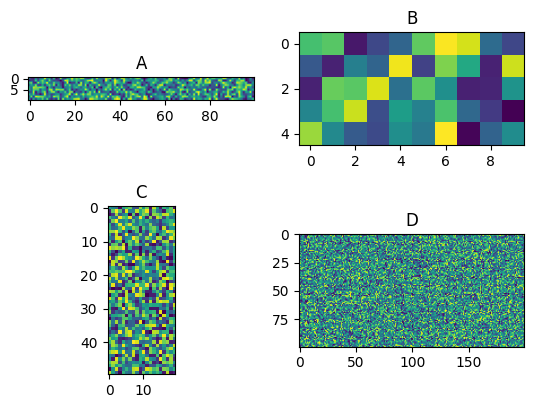
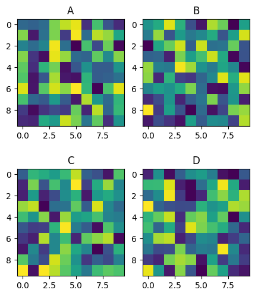

# subplot
{:.no_toc}

<nav markdown="1" class="toc-class">
* TOC
{:toc}
</nav>

## The goal


Questions to [David Rotermund](mailto:davrot@uni-bremen.de)


## [matplotlib.pyplot.subplot](https://matplotlib.org/stable/api/_as_gen/matplotlib.pyplot.subplot.html)

```python
matplotlib.pyplot.subplot(*args, **kwargs)
```

> Add an Axes to the current figure or retrieve an existing Axes.
>
> This is a wrapper of Figure.add_subplot which provides additional behavior when working with the implicit API (see the notes section).

> ***args** : int, (int, int, index), or SubplotSpec, default: (1, 1, 1)
> 
> The position of the subplot described by one of
> * Three integers (nrows, ncols, index). The subplot will take the index position on a grid with nrows rows and ncols columns. index starts at 1 in the upper left corner and increases to the right. index can also be a two-tuple specifying the (first, last) indices (1-based, and including last) of the subplot, e.g., fig.add_subplot(3, 1, (1, 2)) makes a subplot that spans the upper 2/3 of the figure.
> * A 3-digit integer. The digits are interpreted as if given separately as three single-digit integers, i.e. fig.add_subplot(235) is the same as fig.add_subplot(2, 3, 5). Note that this can only be used if there are no more than 9 subplots.


```python
import numpy as np

import matplotlib.pyplot as plt

rng = np.random.default_rng()

plt.figure(1)
plt.subplot(2, 2, 1)
plt.imshow(rng.random((10, 100)))
plt.title("A")
plt.subplot(2, 2, 2)
plt.imshow(rng.random((5, 10)))
plt.title("B")
plt.subplot(2, 2, 3)
plt.imshow(rng.random((50, 20)))
plt.title("C")
plt.subplot(2, 2, 4)
plt.imshow(rng.random((100, 200)))
plt.title("D")
plt.show()
```



## [matplotlib.pyplot.subplots_adjust](https://matplotlib.org/stable/api/_as_gen/matplotlib.pyplot.subplots_adjust.html)

```python
matplotlib.pyplot.subplots_adjust(left=None, bottom=None, right=None, top=None, wspace=None, hspace=None)
```

> Adjust the subplot layout parameters.
> 
> Unset parameters are left unmodified; initial values are given by **rcParams["figure.subplot.[name]"]**.
>

> **left** : float, optional
> 
> The position of the left edge of the subplots, as a fraction of the figure width.
> 
> **right** : float, optional
> 
> The position of the right edge of the subplots, as a fraction of the figure width.
> 
> **bottom** : float, optional
> 
> The position of the bottom edge of the subplots, as a fraction of the figure height.
> 
> **top** : float, optional
> 
> The position of the top edge of the subplots, as a fraction of the figure height.
> 
> **wspace** : float, optional
> 
> The width of the padding between subplots, as a fraction of the average Axes width.
>
> **hspace** : float, optional
> 
> The height of the padding between subplots, as a fraction of the average Axes height.

The parameter meanings (and suggested defaults) are:​

```python
left = 0.125  # the left side of the subplots of the figure​
right = 0.9   # the right side of the subplots of the figure​
bottom = 0.1  # the bottom of the subplots of the figure​
top = 0.9     # the top of the subplots of the figure​
wspace = 0.2  # the amount of width reserved for space between subplots,​
              # expressed as a fraction of the average axis width​
hspace = 0.2  # the amount of height reserved for space between subplots,​
              # expressed as a fraction of the average axis height
```

```python
import numpy as np

import matplotlib.pyplot as plt

rng = np.random.default_rng()

plt.figure(1)
plt.subplot(2, 2, 1)
plt.imshow(rng.random((10, 10)))
plt.title("A")
plt.subplot(2, 2, 2)
plt.imshow(rng.random((10, 10)))
plt.title("B")
plt.subplot(2, 2, 3)
plt.imshow(rng.random((10, 10)))
plt.title("C")
plt.subplot(2, 2, 4)
plt.imshow(rng.random((10, 10)))
plt.title("D")

plt.subplots_adjust(left=0.01, right=1.0, bottom=0.1, top=1.0, wspace=-0.5, hspace=0.4)

plt.show()
```


