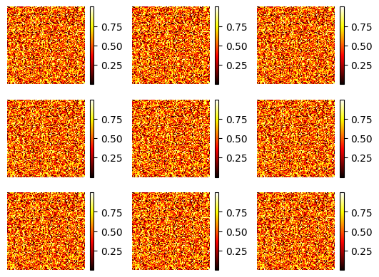
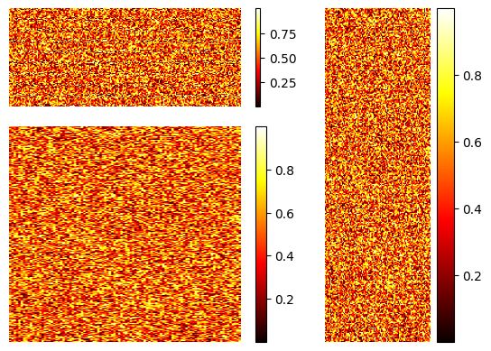
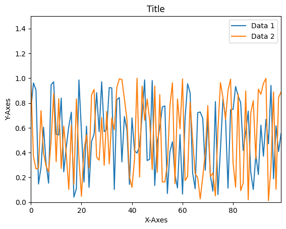

# subplots and gridspec
{:.no_toc}

<nav markdown="1" class="toc-class">
* TOC
{:toc}
</nav>

## Top

Questions to [David Rotermund](mailto:davrot@uni-bremen.de)


## Example 1 (2d regular grid)

**subplots with s at the end!!!**

```python
import numpy as np
import matplotlib.pylab as plt

rng = np.random.default_rng()

a = rng.random((100, 100))

fig, axs = plt.subplots(nrows=3, ncols=3)
print(axs.shape)  # -> (3, 3)

for x in range(0, axs.shape[0]):
    for y in range(0, axs.shape[1]):
        im = axs[x, y].imshow(a, cmap="hot")
        axs[x, y].set_axis_off()
        fig.colorbar(im, ax=axs[x, y], orientation="vertical")
plt.show()
```



## Example 2 (2d)

**subplot without s at the end!!!**

```python
## Example 1 (2d regular grid)

import numpy as np
import matplotlib.pylab as plt
import matplotlib.gridspec as gridspec

rng = np.random.default_rng()

a = rng.random((100, 200))
b = rng.random((300, 100))
c = rng.random((200, 200))

fig = plt.figure()
gs = gridspec.GridSpec(3, 3)


ax1 = plt.subplot(gs[0, 0:2])
im = ax1.imshow(a, cmap="hot", aspect="auto")
ax1.set_axis_off()
fig.colorbar(im, ax=ax1, orientation="vertical")

ax2 = plt.subplot(gs[0:3, 2])
im = ax2.imshow(b, cmap="hot", aspect="auto")
ax2.set_axis_off()
fig.colorbar(im, ax=ax2, orientation="vertical")

ax3 = plt.subplot(gs[1:3, 0:2])
im = ax3.imshow(c, cmap="hot", aspect="auto")
ax3.set_axis_off()
fig.colorbar(im, ax=ax3, orientation="vertical")

plt.show()
```




### [matplotlib.gridspec](https://matplotlib.org/stable/api/gridspec_api.html#module-matplotlib.gridspec)

> gridspec contains classes that help to layout multiple Axes in a grid-like pattern within a figure.
> 
> The GridSpec specifies the overall grid structure. Individual cells within the grid are referenced by SubplotSpecs.
> 
> Often, users need not access this module directly, and can use higher-level methods like subplots, subplot_mosaic and subfigures. See the tutorial [Arranging multiple Axes in a Figure](https://matplotlib.org/stable/users/explain/axes/arranging_axes.html#arranging-multiple-axes-in-a-figure) for a guide.

### [matplotlib.gridspec.GridSpec](https://matplotlib.org/stable/api/_as_gen/matplotlib.gridspec.GridSpec.html#matplotlib.gridspec.GridSpec)

```python
class matplotlib.gridspec.GridSpec(nrows, ncols, figure=None, left=None, bottom=None, right=None, top=None, wspace=None, hspace=None, width_ratios=None, height_ratios=None)[source]
```

> A grid layout to place subplots within a figure.
> 
> The location of the grid cells is determined in a similar way to SubplotParams using left, right, top, bottom, wspace and hspace.
> 
> Indexing a GridSpec instance returns a SubplotSpec.

> **nrows**, **ncols** : int
> The number of rows and columns of the grid.
> 
> **figure** : Figure, optional
> Only used for constrained layout to create a proper layoutgrid.
> 
> **left**, **right**, **top**, **bottom** : float, optional
> Extent of the subplots as a fraction of figure width or height. Left cannot be larger than right, and bottom cannot be larger than top. If not given, the values will be inferred from a figure or rcParams at draw time. See also > GridSpec.get_subplot_params.
> 
> **wspace** : float, optional
> The amount of width reserved for space between subplots, expressed as a fraction of the average axis width. If not given, the values will be inferred from a figure or rcParams when necessary. See also GridSpec.get_subplot_params.
> 
> **hspace** : float, optional
> The amount of height reserved for space between subplots, expressed as a fraction of the average axis height. If not given, the values will be inferred from a figure or rcParams when necessary. See also GridSpec.get_subplot_params.
> 
> **width_ratios** : array-like of length ncols, optional
> Defines the relative widths of the columns. Each column gets a relative width of width_ratios[i] / sum(width_ratios). If not given, all columns will have the same width.
> 
> **height_ratios** : array-like of length nrows, optional
> Defines the relative heights of the rows. Each row gets a relative height of height_ratios[i] / sum(height_ratios). If not given, all rows will have the same height.


## 1d 

```python
import numpy as np
import matplotlib.pylab as plt

rng = np.random.default_rng()

a = rng.random((100, 2))


fig, ax1 = plt.subplots()
ax1.plot(a[:, 0], label="Data 1")
ax1.plot(a[:, 1], label="Data 2")
ax1.legend(loc="best")
ax1.set_xlabel("X-Axes")
ax1.set_ylabel("Y-Axes")
ax1.set_title("Title")
ax1.set_ylim(0, 1.5)
ax1.set_xlim(0, 99)
plt.show()
```




## [matplotlib.pyplot.subplots](https://matplotlib.org/stable/api/_as_gen/matplotlib.pyplot.subplots.html#matplotlib.pyplot.subplots)

```python
matplotlib.pyplot.subplots(nrows=1, ncols=1, *, sharex=False, sharey=False, squeeze=True, width_ratios=None, height_ratios=None, subplot_kw=None, gridspec_kw=None, **fig_kw)
```

> Create a figure and a set of subplots.
> 
> This utility wrapper makes it convenient to create common layouts of subplots, including the enclosing figure object, in a single call.

> **nrows**, **ncols** : int, default: 1
> 
> Number of rows/columns of the subplot grid.

## [matplotlib.pyplot.subplot](https://matplotlib.org/stable/api/_as_gen/matplotlib.pyplot.subplot.html#matplotlib-pyplot-subplot)

```python
matplotlib.pyplot.subplot(*args, **kwargs)
```

> Add an Axes to the current figure or retrieve an existing Axes.


## [matplotlib.axes.Axes.imshow](https://matplotlib.org/stable/api/_as_gen/matplotlib.axes.Axes.imshow.html)

```python
Axes.imshow(X, cmap=None, norm=None, *, aspect=None, interpolation=None, alpha=None, vmin=None, vmax=None, origin=None, extent=None, interpolation_stage=None, filternorm=True, filterrad=4.0, resample=None, url=None, data=None, **kwargs)[source]
```

> Display data as an image, i.e., on a 2D regular raster.
> 
> The input may either be actual RGB(A) data, or 2D scalar data, which will be rendered as a pseudocolor image. For displaying a grayscale image, set up the colormapping using the parameters cmap='gray', vmin=0, vmax=255.
> 
> The number of pixels used to render an image is set by the Axes size and the figure dpi. This can lead to aliasing artifacts when the image is resampled, because the displayed image size will usually not match the size of X (see Image antialiasing). The resampling can be controlled via the interpolation parameter and/or rcParams["image.interpolation"] (default: 'antialiased').

## [matplotlib.axes.Axes.set_axis_off](https://matplotlib.org/stable/api/_as_gen/matplotlib.axes.Axes.set_axis_off.html#matplotlib-axes-axes-set-axis-off)

```python
Axes.set_axis_off()
```

> Hide all visual components of the x- and y-axis.
> 
> This sets a flag to suppress drawing of all axis decorations, i.e. axis labels, axis spines, and the axis tick component (tick markers, tick labels, and grid lines). Individual visibility settings of these components are ignored as long as set_axis_off() is in effect.


## [matplotlib.axes.Axes.set_axis_on](https://matplotlib.org/stable/api/_as_gen/matplotlib.axes.Axes.set_axis_on.html#matplotlib.axes.Axes.set_axis_on)

```python
Axes.set_axis_on()
```

> Do not hide all visual components of the x- and y-axis.
> 
> This reverts the effect of a prior set_axis_off() call. Whether the individual axis decorations are drawn is controlled by their respective visibility settings.
> 
> This is on by default.

## [matplotlib.axes.Axes.set_xlim](https://matplotlib.org/stable/api/_as_gen/matplotlib.axes.Axes.set_xlim.html#matplotlib.axes.Axes.set_xlim)

```python
Axes.set_xlim(left=None, right=None, *, emit=True, auto=False, xmin=None, xmax=None)
```

> Set the y-axis view limits.

## [matplotlib.axes.Axes.set_ylim](https://matplotlib.org/stable/api/_as_gen/matplotlib.axes.Axes.set_ylim.html#matplotlib.axes.Axes.set_ylim)

```python
Axes.set_ylim(bottom=None, top=None, *, emit=True, auto=False, ymin=None, ymax=None)
```

> Set the y-axis view limits.

## [matplotlib.axes.Axes.set_xlabel](https://matplotlib.org/stable/api/_as_gen/matplotlib.axes.Axes.set_xlabel.html#matplotlib.axes.Axes.set_xlabel)

```python
Axes.set_xlabel(xlabel, fontdict=None, labelpad=None, *, loc=None, **kwargs)
```

> Set the label for the x-axis.

## [matplotlib.axes.Axes.set_ylabel](https://matplotlib.org/stable/api/_as_gen/matplotlib.axes.Axes.set_ylabel.html#matplotlib.axes.Axes.set_ylabel)

```python
Axes.set_ylabel(ylabel, fontdict=None, labelpad=None, *, loc=None, **kwargs)
```

> Set the label for the y-axis.

## [matplotlib.axes.Axes.set_title](https://matplotlib.org/stable/api/_as_gen/matplotlib.axes.Axes.set_title.html#matplotlib.axes.Axes.set_title)

```python
Axes.set_title(label, fontdict=None, loc=None, pad=None, *, y=None, **kwargs)[source]
```

> Set a title for the Axes.
> 
> Set one of the three available Axes titles. The available titles are positioned above the Axes in the center, flush with the left edge, and flush with the right edge.

## [matplotlib.axes.Axes.legend](https://matplotlib.org/stable/api/_as_gen/matplotlib.axes.Axes.legend.html#matplotlib.axes.Axes.legend)

```python
Axes.legend(*args, **kwargs)
```

> Place a legend on the Axes.

|Location String|Location Code|
|---|---|
|'best' (Axes only)|0|
|'upper right'|1|
|'upper left'|2|
|'lower left'|3|
|'lower right'|4|
|'right'|5|
|'center left'|6|
|'center right'|7|
|'lower center'|8|
|'upper center'|9|
|'center'|10|

## [matplotlib.axes.Axes.plot](https://matplotlib.org/stable/api/_as_gen/matplotlib.axes.Axes.plot.html#matplotlib-axes-axes-plot)

```python
Axes.plot(*args, scalex=True, scaley=True, data=None, **kwargs)
```

> Plot y versus x as lines and/or markers.

## [matplotlib.axes.Axes.loglog](https://matplotlib.org/stable/api/_as_gen/matplotlib.axes.Axes.loglog.html#matplotlib.axes.Axes.loglog)

```python
Axes.loglog(*args, **kwargs)
```

> Make a plot with log scaling on both the x- and y-axis.

## [matplotlib.axes.Axes.semilogx](https://matplotlib.org/stable/api/_as_gen/matplotlib.axes.Axes.semilogx.html#matplotlib-axes-axes-semilogx)

```python
Axes.semilogx(*args, **kwargs)
```

> Make a plot with log scaling on the x-axis.

## [matplotlib.axes.Axes.semilogy](https://matplotlib.org/stable/api/_as_gen/matplotlib.axes.Axes.semilogy.html#matplotlib.axes.Axes.semilogy)

```python
Axes.semilogy(*args, **kwargs)
```

> Make a plot with log scaling on the y-axis.

## [matplotlib.colorbar](https://matplotlib.org/stable/api/colorbar_api.html#module-matplotlib.colorbar)

```python
class matplotlib.colorbar.Colorbar(ax, mappable=None, *, cmap=None, norm=None, alpha=None, values=None, boundaries=None, orientation=None, ticklocation='auto', extend=None, spacing='uniform', ticks=None, format=None, drawedges=False, extendfrac=None, extendrect=False, label='', location=None)
```

> Colorbars are a visualization of the mapping from scalar values to colors. In Matplotlib they are drawn into a dedicated Axes.
> 
> Draw a colorbar in an existing axes.
> 
> Typically, colorbars are created using Figure.colorbar or pyplot.colorbar and associated with ScalarMappables (such as an AxesImage generated via imshow).
> 
> In order to draw a colorbar not associated with other elements in the figure, e.g. when showing a colormap by itself, one can create an empty ScalarMappable, or directly pass cmap and norm instead of mappable to Colorbar.

