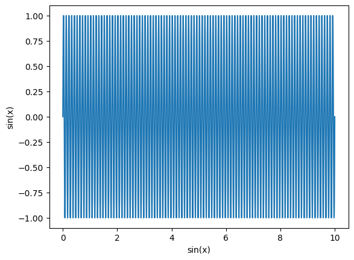
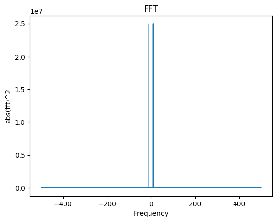
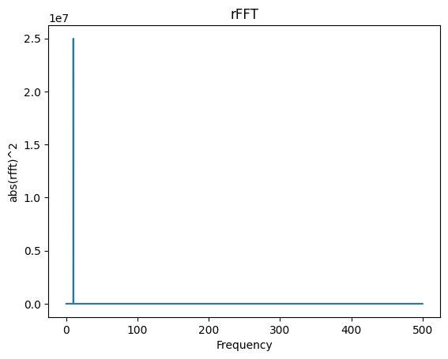
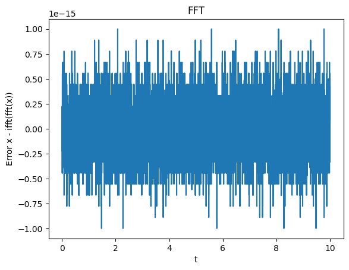
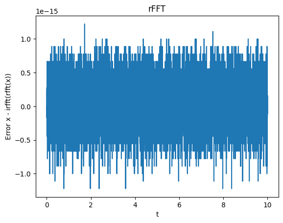

# [FFT](https://numpy.org/doc/stable/reference/routines.fft.html)
{:.no_toc}

<nav markdown="1" class="toc-class">
* TOC
{:toc}
</nav>

## The goal

Fouriert transformations are an important part of data analysis. 

Questions to [David Rotermund](mailto:davrot@uni-bremen.de)

## [Numpy](https://numpy.org/doc/stable/reference/routines.fft.html) vs  [scipy](https://docs.scipy.org/doc/scipy/tutorial/fft.html#fourier-transforms-scipy-fft)

```shell
pip install scipy
```

Numpy says [itself](https://numpy.org/doc/stable/reference/routines.fft.html#discrete-fourier-transform-numpy-fft): 
> The SciPy module scipy.fft is a more comprehensive superset of numpy.fft, which includes only a basic set of routines.

## fft vs rfft

### [numpy.fft.fft](https://numpy.org/doc/stable/reference/generated/numpy.fft.fft.html)

```python
fft.fft(a, n=None, axis=-1, norm=None)[source]
```
> Compute the one-dimensional discrete Fourier Transform.
> 
> This function computes the one-dimensional n-point discrete Fourier Transform (DFT) with the efficient Fast Fourier Transform (FFT) algorithm [CT].

### [numpy.fft.rfft](https://numpy.org/doc/stable/reference/generated/numpy.fft.rfft.html)

```python
fft.rfft(a, n=None, axis=-1, norm=None)[source]
```

> Compute the one-dimensional discrete Fourier Transform for real input.
> 
> This function computes the one-dimensional n-point discrete Fourier Transform (DFT) of a real-valued array by means of an efficient algorithm called the Fast Fourier Transform (FFT).

### Comparison

If the input array is **real-valued** (i.e. no complex numbers) then use **rfft**. Otherwise use **fft**. However, you can always use **fft** if you want but you might need to add extra steps to remove the complex noise from the results. E.g. if x is real-valued ifft(fft(x)) can be complex, due to numerical noise.


The test signal: 

```python
import numpy as np
import matplotlib.pyplot as plt

# Test signal
f: float = 10.0
t = np.linspace(0, 10, 10000)
x = np.sin(t * f * 2 * np.pi)

plt.plot(t, x)
plt.ylabel("sin(x)")
plt.xlabel("t")
plt.show()
```



```python
fft_result = np.fft.fft(x)
print(fft_result.shape) # -> (10000,)
rfft_result = np.fft.rfft(x)
print(rfft_result.shape) # -> (5001,)
```
### [numpy.fft.fftfreq](https://numpy.org/doc/stable/reference/generated/numpy.fft.fftfreq.html#numpy-fft-fftfreq)

```python
fft.fftfreq(n, d=1.0)
```
> Return the Discrete Fourier Transform sample frequencies.
> 
> The returned float array f contains the frequency bin centers in cycles per unit of the sample spacing (with zero at the start). For instance, if the sample spacing is in seconds, then the frequency unit is cycles/second.
> 
> Given a window length n and a sample spacing d:

```python
f = [0, 1, ...,   n/2-1,     -n/2, ..., -1] / (d*n)   if n is even
f = [0, 1, ..., (n-1)/2, -(n-1)/2, ..., -1] / (d*n)   if n is odd
```

### [numpy.fft.rfftfreq](https://numpy.org/doc/stable/reference/generated/numpy.fft.rfftfreq.html#numpy-fft-rfftfreq)

```python
fft.rfftfreq(n, d=1.0)
```

> Return the Discrete Fourier Transform sample frequencies (for usage with rfft, irfft).
>
> The returned float array f contains the frequency bin centers in cycles per unit of the sample spacing (with zero at the start). For instance, if the sample spacing is in seconds, then the frequency unit is cycles/second.
>
> Given a window length n and a sample spacing d:

```python
f = [0, 1, ...,     n/2-1,     n/2] / (d*n)   if n is even
f = [0, 1, ..., (n-1)/2-1, (n-1)/2] / (d*n)   if n is odd
```

> Unlike fftfreq (but like scipy.fftpack.rfftfreq) the Nyquist frequency component is considered to be positive.

### Comparison (fftfreq)

The frequency axes:

```python
dt = t[1] - t[0]
fft_freq = np.fft.fftfreq(x.shape[0],dt)
print(fft_freq.shape) # -> (10000,)

rfft_freq = np.fft.rfftfreq(x.shape[0],dt)
print(rfft_freq.shape) # -> (5001,)
```

```python
plt.plot(fft_freq, np.abs(fft_result) ** 2)
plt.ylabel("abs(fft)^2")
plt.xlabel("Frequency")
plt.title("FFT")
plt.show()
```



```python
plt.plot(rfft_freq, np.abs(rfft_result) ** 2)
plt.ylabel("abs(rfft)^2")
plt.xlabel("Frequency")
plt.title("rFFT")
plt.show()
```



### Comparison (ifft)

```python
plt.plot(t, x - np.real(np.fft.ifft(fft_result)))
plt.ylabel("Error x - ifft(fft(x))")
plt.xlabel("t")
plt.title("FFT")
plt.show()
```



```python
plt.plot(t, x - np.real(np.fft.irfft(rfft_result)))
plt.ylabel("Error x - irfft(rfft(x))")
plt.xlabel("t")
plt.title("rFFT")
plt.show()
```



## [Discrete Fourier Transform (numpy.fft)](https://numpy.org/doc/stable/reference/routines.fft.html#discrete-fourier-transform-numpy-fft)

## [Standard FFTs](https://numpy.org/doc/stable/reference/routines.fft.html#standard-ffts)

|||
|---|---|
|[fft(a[, n, axis, norm])](https://numpy.org/doc/stable/reference/generated/numpy.fft.fft.html#numpy.fft.fft)|Compute the one-dimensional discrete Fourier Transform.|
|[ifft(a[, n, axis, norm])](https://numpy.org/doc/stable/reference/generated/numpy.fft.ifft.html#numpy.fft.ifft)|Compute the one-dimensional inverse discrete Fourier Transform.|
|[fft2(a[, s, axes, norm])](https://numpy.org/doc/stable/reference/generated/numpy.fft.fft2.html#numpy.fft.fft2)|Compute the 2-dimensional discrete Fourier Transform.|
|[ifft2(a[, s, axes, norm])](https://numpy.org/doc/stable/reference/generated/numpy.fft.ifft2.html#numpy.fft.ifft2)|Compute the 2-dimensional inverse discrete Fourier Transform.|
|[fftn(a[, s, axes, norm])](https://numpy.org/doc/stable/reference/generated/numpy.fft.fftn.html#numpy.fft.fftn)|Compute the N-dimensional discrete Fourier Transform.|
|[ifftn(a[, s, axes, norm])](https://numpy.org/doc/stable/reference/generated/numpy.fft.ifftn.html#numpy.fft.ifftn)|Compute the N-dimensional inverse discrete Fourier Transform.|

## [Real FFTs](https://numpy.org/doc/stable/reference/routines.fft.html#real-ffts)

|||
|---|---|
|[rfft(a[, n, axis, norm])](https://numpy.org/doc/stable/reference/generated/numpy.fft.rfft.html#numpy.fft.rfft)|Compute the one-dimensional discrete Fourier Transform for real input.|
|[irfft(a[, n, axis, norm])](https://numpy.org/doc/stable/reference/generated/numpy.fft.irfft.html#numpy.fft.irfft)|Computes the inverse of rfft.|
|[rfft2(a[, s, axes, norm])](https://numpy.org/doc/stable/reference/generated/numpy.fft.rfft2.html#numpy.fft.rfft2)|Compute the 2-dimensional FFT of a real array.|
|[irfft2(a[, s, axes, norm])](https://numpy.org/doc/stable/reference/generated/numpy.fft.irfft2.html#numpy.fft.irfft2)|Computes the inverse of rfft2.|
|[rfftn(a[, s, axes, norm])](https://numpy.org/doc/stable/reference/generated/numpy.fft.rfftn.html#numpy.fft.rfftn)|Compute the N-dimensional discrete Fourier Transform for real input.|
|[irfftn(a[, s, axes, norm])](https://numpy.org/doc/stable/reference/generated/numpy.fft.irfftn.html#numpy.fft.irfftn)|Computes the inverse of rfftn. |

## [Hermitian FFTs](https://numpy.org/doc/stable/reference/routines.fft.html#hermitian-ffts)

|||
|---|---|
|[hfft(a[, n, axis, norm])](https://numpy.org/doc/stable/reference/generated/numpy.fft.hfft.html#numpy.fft.hfft)|Compute the FFT of a signal that has Hermitian symmetry, i.e., a real spectrum.|
|[ihfft(a[, n, axis, norm])](https://numpy.org/doc/stable/reference/generated/numpy.fft.ihfft.html#numpy.fft.ihfft)|Compute the inverse FFT of a signal that has Hermitian symmetry.|

## [Helper routines](https://numpy.org/doc/stable/reference/routines.fft.html#helper-routines)

|||
|---|---|
|[fftfreq(n[, d])](https://numpy.org/doc/stable/reference/generated/numpy.fft.fftfreq.html#numpy.fft.fftfreq)|Return the Discrete Fourier Transform sample frequencies.|
|[rfftfreq(n[, d])](https://numpy.org/doc/stable/reference/generated/numpy.fft.rfftfreq.html#numpy.fft.rfftfreq)|Return the Discrete Fourier Transform sample frequencies (for usage with rfft, irfft).|
|[fftshift(x[, axes])](https://numpy.org/doc/stable/reference/generated/numpy.fft.fftshift.html#numpy.fft.fftshift)|Shift the zero-frequency component to the center of the spectrum.|
|[ifftshift(x[, axes])](https://numpy.org/doc/stable/reference/generated/numpy.fft.ifftshift.html#numpy.fft.ifftshift)|The inverse of fftshift.|

