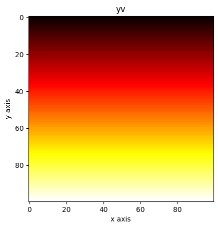
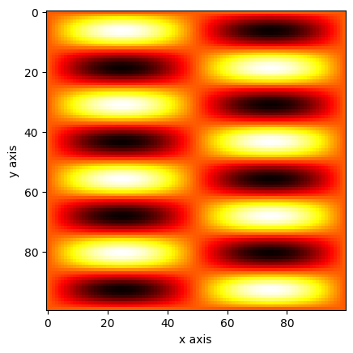

# Meshgrid
{:.no_toc}

<nav markdown="1" class="toc-class">
* TOC
{:toc}
</nav>

## The goal


Questions to [David Rotermund](mailto:davrot@uni-bremen.de)

## [numpy.meshgrid](https://numpy.org/doc/stable/reference/generated/numpy.meshgrid.html)


```python
numpy.meshgrid(*xi, copy=True, sparse=False, indexing='xy')
```

> Return a list of coordinate matrices from coordinate vectors.
> 
> Make N-D coordinate arrays for vectorized evaluations of N-D scalar/vector fields over N-D grids, given one-dimensional coordinate arrays x1, x2,…, xn.

```python
import numpy as np
import matplotlib.pyplot as plt

x = np.linspace(0, 1, 100)
y = np.linspace(0, 1, 100)

xv, yv = np.meshgrid(x, y)

plt.imshow(xv, cmap="hot")
plt.xlabel("x axis")
plt.ylabel("y axis")
plt.title("xv")
plt.show()

plt.imshow(yv, cmap="hot")
plt.xlabel("x axis")
plt.ylabel("y axis")
plt.title("yv")
plt.show()
```




An example:

```python
import numpy as np
import matplotlib.pyplot as plt

x = np.linspace(0, 1, 100)
y = np.linspace(0, 1, 100)

xv, yv = np.meshgrid(x, y)

a = np.sin(xv * 2 * np.pi) * np.sin(yv * 8 * np.pi)

plt.imshow(a, cmap="hot")
plt.xlabel("x axis")
plt.ylabel("y axis")
plt.show()
```



**The question is if you really need a mesh or if just using broadcasting can do the job too.** I guess this depends on your need.

```python
import numpy as np
import matplotlib.pyplot as plt

x = np.linspace(0, 1, 100)[np.newaxis, :]
y = np.linspace(0, 1, 100)[:, np.newaxis]

a = np.sin(x * 2 * np.pi) * np.sin(y * 8 * np.pi)

plt.imshow(a, cmap="hot")
plt.xlabel("x axis")
plt.ylabel("y axis")
plt.show()
```


