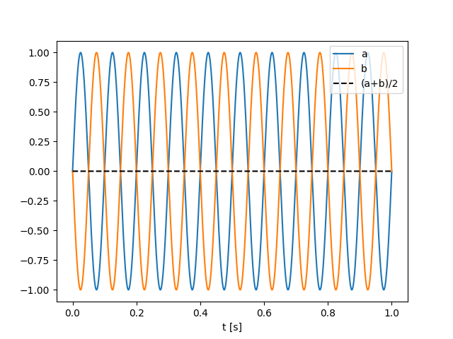
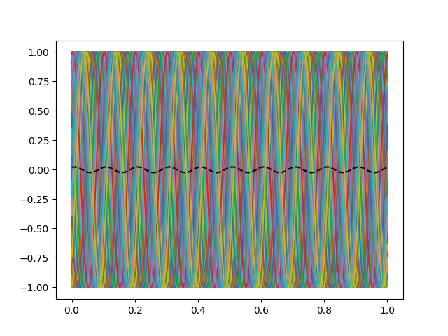
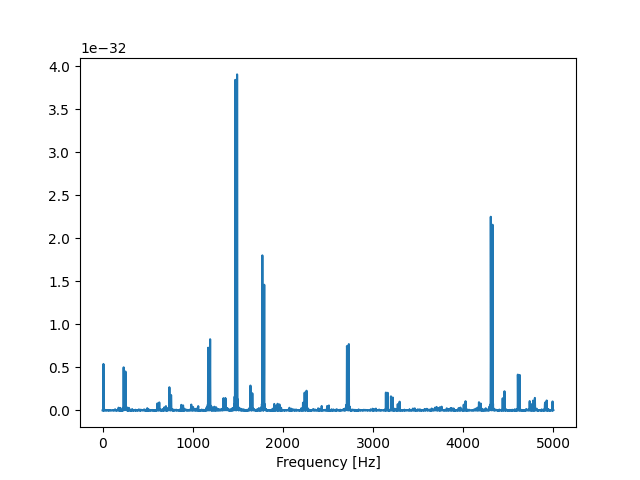

# Power and mean 
{:.no_toc}

<nav markdown="1" class="toc-class">
* TOC
{:toc}
</nav>

## Top

Questions to [David Rotermund](mailto:davrot@uni-bremen.de)

## The order is important 

You are not allowed to average over the trials before calculating the power. This is the same for calculating the fft power as well as the wavelet power. 

The worst case senario would be two waves in anti-phase:

```python
import numpy as np
import matplotlib.pyplot as plt

t: np.ndarray = np.linspace(0, 1.0, 10000)
f: float = 10

sinus_a = np.sin(f * t * 2.0 * np.pi)
sinus_b = np.sin(f * t * 2.0 * np.pi + np.pi)

plt.plot(t, sinus_a, label="a")
plt.plot(t, sinus_b, label="b")
plt.plot(t, (sinus_a + sinus_b) / 2.0, "k--", label="(a+b)/2")
plt.legend()
plt.xlabel("t [s]")
plt.show()
```




However if you have server randomly phase-jittered curves then something similar will happen. 

```python
import numpy as np
import matplotlib.pyplot as plt

t: np.ndarray = np.linspace(0, 1.0, 10000)
f: float = 10
n: int = 1000

rng = np.random.default_rng(1)
sinus = np.sin(f * t[:, np.newaxis] * 2.0 * np.pi + 2.0 * np.pi * rng.random((1, n)))
print(sinus.shape)

plt.plot(t, sinus)
plt.plot(t, sinus.mean(axis=-1), "k--")
plt.show()
```



And please remember the Fourier approach: Every curve can be decomposed in to sin waves.

## Fourier is a linear operation

Since Fourier is a linear operation, it doesn't help you if you shift the averaging after the fft. Same problem:

```python
import numpy as np
import matplotlib.pyplot as plt

t: np.ndarray = np.linspace(0, 1.0, 10000)
f: float = 10

sampling_frequency: float = 1.0 / (t[1] - t[0])

sinus_a = np.sin(f * t * 2.0 * np.pi)
sinus_b = np.sin(f * t * 2.0 * np.pi + np.pi)

sinus_a_fft: np.ndarray = np.fft.rfft(sinus_a)
sinus_b_fft: np.ndarray = np.fft.rfft(sinus_b)
frequency_axis: np.ndarray = np.fft.rfftfreq(sinus_a.shape[0]) * sampling_frequency

y_fft = (sinus_a_fft + sinus_b_fft) / 2.0

y_power: np.ndarray = (1 / (sampling_frequency * sinus_a.shape[0])) * np.abs(y_fft) ** 2
y_power[1:-1] *= 2

if frequency_axis[-1] != (sampling_frequency / 2.0):
    y_power[-1] *= 2

plt.plot(frequency_axis, y_power, label="Power")
plt.xlabel("Frequency [Hz]")
plt.show()
```



## How to do it correctly

First calculate the power and then average: 

```python
import numpy as np
import matplotlib.pyplot as plt

t: np.ndarray = np.linspace(0, 1.0, 10000)
f: float = 10

sampling_frequency: float = 1.0 / (t[1] - t[0])

sinus_a = np.sin(f * t * 2.0 * np.pi)
sinus_b = np.sin(f * t * 2.0 * np.pi + np.pi)

sinus_a_fft: np.ndarray = np.fft.rfft(sinus_a)
sinus_b_fft: np.ndarray = np.fft.rfft(sinus_b)
frequency_axis: np.ndarray = np.fft.rfftfreq(sinus_a.shape[0]) * sampling_frequency

y_power_a: np.ndarray = (1 / (sampling_frequency * sinus_a.shape[0])) * np.abs(
    sinus_a_fft
) ** 2
y_power_a[1:-1] *= 2

y_power_b: np.ndarray = (1 / (sampling_frequency * sinus_b.shape[0])) * np.abs(
    sinus_b_fft
) ** 2
y_power_b[1:-1] *= 2

if frequency_axis[-1] != (sampling_frequency / 2.0):
    y_power_a[-1] *= 2
    y_power_b[-1] *= 2

y_power = (y_power_a + y_power_b) / 2.0

plt.plot(frequency_axis, y_power, label="Power")
plt.xlabel("Frequency [Hz]")
plt.xlim(0, 50)
plt.show()
```


