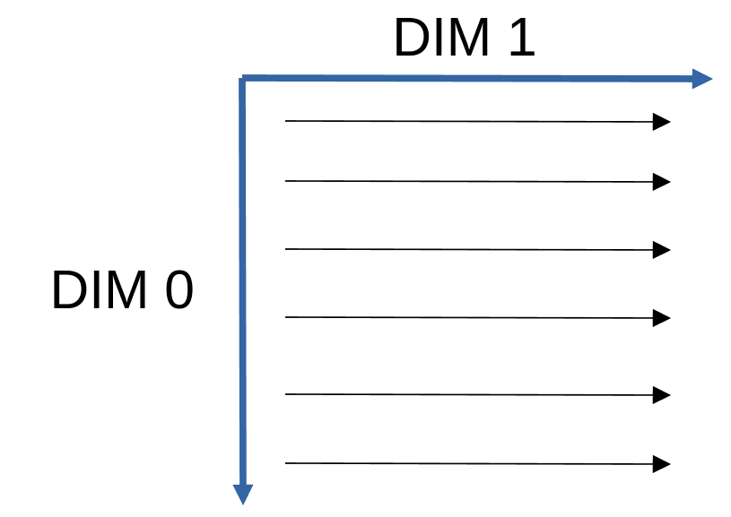

# Reshape and flatten 
{:.no_toc}

<nav markdown="1" class="toc-class">
* TOC
{:toc}
</nav>

## The goal

Sometimes you have to change the shape of a matrix. 

Questions to [David Rotermund](mailto:davrot@uni-bremen.de)

## [Reshape](https://numpy.org/doc/stable/reference/generated/numpy.reshape.html)

```python
numpy.reshape(a, newshape, order='C')
```

> Gives a new shape to an array without changing its data.

> **a** : array_like
>   Array to be reshaped.

> **newshape** : int or tuple of ints
>   The new shape should be compatible with the original shape. If an integer, then the result will be a 1-D array of that length. One shape dimension can be -1. In this case, the value is inferred from the length of the array and remaining dimensions.

> **order** : {‘C’, ‘F’, ‘A’}, **optional**
>   Read the elements of a using this index order, and place the elements into the reshaped array using this index order. ‘C’ means to read / write the elements using C-like index order, with the last axis index changing fastest, back to the first axis index changing slowest. ‘F’ means to read / write the elements using Fortran-like index order, with the first index changing fastest, and the last index changing slowest. Note that the ‘C’ and ‘F’ options take no account of the memory layout of the underlying array, and only refer to the order of indexing. ‘A’ means to read / write the elements in Fortran-like index order if a is Fortran contiguous in memory, C-like order otherwise.

Example:

```python
import numpy as np

a = np.arange(0, 15)

b_2d = np.reshape(a, (5, 3))

print(f"View: {np.may_share_memory(a, b_2d)}") # -> View: True
print(b_2d.shape) # -> (5, 3)
print(b_2d)
```

Output: 
```python
[[ 0  1  2]
 [ 3  4  5]
 [ 6  7  8]
 [ 9 10 11]
 [12 13 14]]
```



**Highest dimension is continuously filled first.**

```python
import numpy as np

a = np.arange(0, 30)

b_3d = np.reshape(a, (5, 3, 2))

print(f"View: {np.may_share_memory(a, b_3d)}")  # -> View: True
print(b_3d.shape)  # -> (5, 3, 2)
print(b_3d)
```

Output: 
```python
[[[ 0  1]
  [ 2  3]
  [ 4  5]]

 [[ 6  7]
  [ 8  9]
  [10 11]]

 [[12 13]
  [14 15]
  [16 17]]

 [[18 19]
  [20 21]
  [22 23]]

 [[24 25]
  [26 27]
  [28 29]]]
```

This is how you can expect the data to be reordered (except the view part...)​

```python
import numpy as np

a = np.arange(0, 30)

b_3d = np.empty((5, 3, 2))

counter = 0
for idx_0 in range(0, b_3d.shape[0]):
    for idx_1 in range(0, b_3d.shape[1]):
        for idx_2 in range(0, b_3d.shape[2]):
            b_3d[idx_0, idx_1, idx_2] = a[counter]
            counter += 1

print(b_3d)
```

Output: 

```python
[[[ 0.  1.]
  [ 2.  3.]
  [ 4.  5.]]

 [[ 6.  7.]
  [ 8.  9.]
  [10. 11.]]

 [[12. 13.]
  [14. 15.]
  [16. 17.]]

 [[18. 19.]
  [20. 21.]
  [22. 23.]]

 [[24. 25.]
  [26. 27.]
  [28. 29.]]]
```

## [.flatten()](https://numpy.org/doc/stable/reference/generated/numpy.ndarray.flatten.html)

**.flatten()** is the "inverse" operation of reshape

```python
ndarray.flatten(order='C')
```

> Return a copy of the array collapsed into one dimension.

> **order** : {‘C’, ‘F’, ‘A’, ‘K’}, **optional**
>   ‘C’ means to flatten in row-major (C-style) order. ‘F’ means to flatten in column-major (Fortran- style) order. ‘A’ means to flatten in column-major order if a is Fortran contiguous in memory, row-major order otherwise. ‘K’ means to flatten a in the order the elements occur in memory. The default is ‘C’.

Example:

```python
import numpy as np

a = np.arange(0, 30)
b_3d = np.reshape(a, (5, 3, 2))

c = b_3d.flatten()
print(f"View: {np.may_share_memory(c, b_3d)}")  # -> View: False
print(c.shape)  # -> (30,)
print(c) # -> [ 0  1  2  3  4  5  6  7  8  9 10 11 12 13 14 15 16 17 18 19 20 21 22 23 24 25 26 27 28 29]
```

**Note: This is not a view!**

If you want a view, you can use reshape too. 

```python
import numpy as np

a = np.arange(0, 30)
b_3d = np.reshape(a, (5, 3, 2))

c = b_3d.reshape((np.prod(b_3d.shape),))
print(f"View: {np.may_share_memory(c, b_3d)}")  # -> View: True
print(c.shape)  # -> (30,)
print(c) # -> [ 0  1  2  3  4  5  6  7  8  9 10 11 12 13 14 15 16 17 18 19 20 21 22 23 24 25 26 27 28 29]
```


