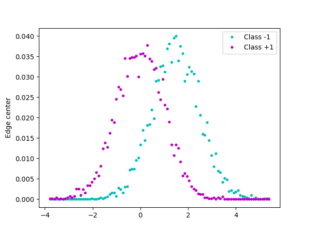

# ROC
{:.no_toc}

<nav markdown="1" class="toc-class">
* TOC
{:toc}
</nav>

## Top

Questions to [David Rotermund](mailto:davrot@uni-bremen.de)

## Test data

```python
import numpy as np
import matplotlib.pyplot as plt

rng = np.random.default_rng(1)

a_x = rng.normal(1.5, 1.0, size=(5000))
b_x = rng.normal(0.0, 1.0, size=(5000))


ab_x = np.concatenate([a_x, b_x])
edges = np.histogram_bin_edges(ab_x, bins=100, range=None, weights=None)

h_a, _ = np.histogram(a_x, bins=edges)
h_b, _ = np.histogram(b_x, bins=edges)

h_a = h_a.astype(np.float32)
h_b = h_b.astype(np.float32)

h_a /= h_a.sum()
h_b /= h_b.sum()

edges = (edges[1:] + edges[:-1]) / 2.0

plt.plot(edges, h_a, "c.", label="Class -1")
plt.plot(edges, h_b, "m.", label="Class +1")
plt.ylabel("Probability of a value")
plt.ylabel("Edge center")
plt.legend()
plt.show()
```



```python
```


```shell
```
