# Data augmentation
{:.no_toc}

<nav markdown="1" class="toc-class">
* TOC
{:toc}
</nav>

## The goal

What is available as data augmentation methods in torchvision?

Questions to [David Rotermund](mailto:davrot@uni-bremen.de)

Initial Image: 


Photo by Udo Ernst

## Loading an example image (with opencv2)

Load it via [cv2.imread( filename[, flags]) -> retval](https://docs.opencv.org/4.5.3/d4/da8/group__imgcodecs.html#ga288b8b3da0892bd651fce07b3bbd3a56)

```python
import cv2
import matplotlib.pyplot as plt

filename: str = "data_augmentation_test_image.jpg"

original_image = cv2.imread(filename)

plt.imshow(original_image)
plt.show()
```


As you can see (not very well I might add) is that the color channels are wrong. But may be we want no color anyway ( options can be found [here](https://docs.opencv.org/4.5.3/d8/d6a/group__imgcodecs__flags.html#ga61d9b0126a3e57d9277ac48327799c80) ):

```python
original_image = cv2.imread(filename, cv2.IMREAD_GRAYSCALE)

plt.imshow(original_image, cmap="gray")
plt.show()
```


```python
import numpy as np

original_image = cv2.imread(filename, cv2.IMREAD_COLOR)

# "Convert" from BlueGreenRed (BGR) to RGB (RedGreenBlue)
# This is a flip in the third dimension.
original_image = np.flip(original_image, axis=2)
plt.imshow(original_image)
plt.show()
```

## Torchvision: A selection of transformations

### Into PyTorch

First we need to convert the np.ndarray into a suitable torch tensor


```python
import torch

torch_image = torch.tensor(
    np.moveaxis(original_image.astype(dtype=np.float32) / 255.0, 2, 0)
)
print(torch_image.shape) # -> torch.Size([3, 1200, 1600])
```

Note: For the following random opertions, we can control the random seed of torch via [torch.manual_seed(seed)](https://pytorch.org/docs/stable/generated/torch.manual_seed.html).


Some example transformations from [torchvision](https://pytorch.org/vision/stable/transforms.html):

### [torchvision.transforms.Pad(padding, fill=0, padding_mode='constant') ](https://pytorch.org/vision/stable/transforms.html#torchvision.transforms.Pad)

```python
import torchvision as tv

pad_transform = tv.transforms.Pad(padding=(50, 100), fill=0.5)
new_image = pad_transform(torch_image)
plt.imshow(np.moveaxis(new_image.detach().numpy(), 0, 2))
plt.show()
```


### [torchvision.transforms.RandomHorizontalFlip(p=0.5)](https://pytorch.org/vision/stable/transforms.html#torchvision.transforms.RandomHorizontalFlip)

Horizontally flip the given image randomly with a given probability. 

### [torchvision.transforms.RandomVerticalFlip(p=0.5)](https://pytorch.org/vision/stable/transforms.html#torchvision.transforms.RandomVerticalFlip)

Vertically flip the given image randomly with a given probability.

### [torchvision.transforms.Resize(size, interpolation=<InterpolationMode.BILINEAR: 'bilinear'>, max_size=None, antialias=None)](https://pytorch.org/vision/stable/transforms.html#torchvision.transforms.Pad)

The Resize transform resizes an image.

```python
resize_transform = tv.transforms.Resize(size=(50, 100))
new_image = resize_transform(torch_image)
plt.imshow(np.moveaxis(new_image.detach().numpy(), 0, 2))
plt.show()
```


### [torchvision.transforms.CenterCrop(size)](https://pytorch.org/vision/stable/transforms.html#torchvision.transforms.CenterCrop)

The CenterCrop transform crops the given image at the center.

```python
center_crop_transform = tv.transforms.CenterCrop(size=(250, 200))
new_image = center_crop_transform(torch_image)
plt.imshow(np.moveaxis(new_image.detach().numpy(), 0, 2))
plt.show()
```


### [torchvision.transforms.FiveCrop(size)](https://pytorch.org/vision/stable/transforms.html#torchvision.transforms.FiveCrop)

The FiveCrop transform crops the given image into four corners and the central crop.

```python
position = (1, 3, 7, 9, 5)
five_crop_transform = tv.transforms.FiveCrop(size=(250, 200))
new_image = five_crop_transform(torch_image)

for i, p in enumerate(position):
    plt.subplot(3, 3, p)
    plt.imshow(np.moveaxis(new_image[i].detach().numpy(), 0, 2))

plt.show()
```


### [torchvision.transforms.TenCrop(size, vertical_flip=False)](https://pytorch.org/vision/stable/transforms.html#torchvision.transforms.Scale)

Crop the given image into four corners and the central crop plus the flipped version of these (horizontal flipping is used by default). 

### [torchvision.transforms.Grayscale(num_output_channels=1)](https://pytorch.org/vision/stable/transforms.html#torchvision.transforms.Grayscale)
The Grayscale transform converts an image to grayscale.

```python
gray_transform = tv.transforms.Grayscale()
new_image = gray_transform(torch_image)
plt.imshow(new_image.squeeze().detach().numpy(), cmap="gray")
plt.show()
```


### [torchvision.transforms.RandomGrayscale(p=0.1)](https://pytorch.org/vision/stable/transforms.html#torchvision.transforms.RandomGrayscale)

Randomly convert image to grayscale with a probability of p (default 0.1).

### [torchvision.transforms.RandomInvert(p=0.5)](https://pytorch.org/vision/stable/transforms.html#torchvision.transforms.RandomInvert)

Inverts the colors of the given image randomly with a given probability. 

```python
random_invert_transform = tv.transforms.RandomInvert(p=0.5)
for i in range(1, 3):
    new_image = random_invert_transform(torch_image)
    plt.subplot(2, 1, i)
    plt.imshow(np.moveaxis(new_image.detach().numpy(), 0, 2))
plt.show()
```


### [torchvision.transforms.Normalize(mean, std, inplace=False)](https://pytorch.org/vision/stable/transforms.html#torchvision.transforms.Normalize)

Normalize a tensor image with mean and standard deviation. 

### [torchvision.transforms.RandomEqualize(p=0.5)](https://pytorch.org/vision/stable/transforms.html#torchvision.transforms.RandomEqualize)

Equalize the histogram of the given image randomly with a given probability. 

### [torchvision.transforms.ColorJitter(brightness=0, contrast=0, saturation=0, hue=0)](https://pytorch.org/vision/stable/transforms.html#torchvision.transforms.ColorJitter)

The ColorJitter transform randomly changes the brightness, saturation, and other properties of an image.

```python
color_jitter_transform = tv.transforms.ColorJitter(brightness=0.75, hue=0.5)
for i in range(1, 10):
    new_image = color_jitter_transform(torch_image)
    plt.subplot(3, 3, i)
    plt.imshow(np.moveaxis(new_image.detach().numpy(), 0, 2))
plt.show()
```


### [torchvision.transforms.GaussianBlur(kernel_size, sigma=(0.1, 2.0))](https://pytorch.org/vision/stable/transforms.html#torchvision.transforms.GaussianBlur)

The GaussianBlur transform performs gaussian blur transform on an image.

Note: Big kernel sizes are slow.  (51,51) is rather big. Kernel size needs to be odd and positive. 

```python
gauss_transform = tv.transforms.GaussianBlur(kernel_size=(101, 101), sigma=(0.1, 10))
new_image = gauss_transform(torch_image)
plt.imshow(np.moveaxis(new_image.detach().numpy(), 0, 2))
plt.show()
```


### [torchvision.transforms.RandomPerspective(distortion_scale=0.5, p=0.5, interpolation=<InterpolationMode.BILINEAR: 'bilinear'>, fill=0)](https://pytorch.org/vision/stable/transforms.html#torchvision.transforms.RandomPerspective)

The RandomPerspective transform performs random perspective transform on an image.

```python
random_perspective_transform = tv.transforms.RandomPerspective(
    distortion_scale=0.6, p=1.0
)
for i in range(1, 10):
    new_image = random_perspective_transform(torch_image)
    plt.subplot(3, 3, i)
    plt.imshow(np.moveaxis(new_image.detach().numpy(), 0, 2))
plt.show()
```


### [torchvision.transforms.RandomRotation(degrees, interpolation=<InterpolationMode.NEAREST: 'nearest'>, expand=False, center=None, fill=0, resample=None)](https://pytorch.org/vision/stable/transforms.html#torchvision.transforms.RandomRotation)

The RandomRotation transform rotates an image with random angle.

```python
random_rotation_transform = tv.transforms.RandomRotation(degrees=(0, 180))
for i in range(1, 10):
    new_image = random_rotation_transform(torch_image)
    plt.subplot(3, 3, i)
    plt.imshow(np.moveaxis(new_image.detach().numpy(), 0, 2))
plt.show()
```

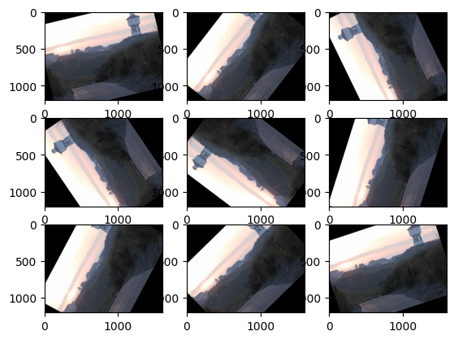

### [torchvision.transforms.RandomAffine(degrees, translate=None, scale=None, shear=None, interpolation=<InterpolationMode.NEAREST: 'nearest'>, fill=0, fillcolor=None, resample=None)](https://pytorch.org/vision/stable/transforms.html#torchvision.transforms.RandomAffine)

The RandomAffine transform performs random affine transform on an image.

```python
random_affine_transform = tv.transforms.RandomAffine(degrees=(0, 180))
for i in range(1, 10):
    new_image = random_affine_transform(torch_image)
    plt.subplot(3, 3, i)
    plt.imshow(np.moveaxis(new_image.detach().numpy(), 0, 2))
plt.show()
```

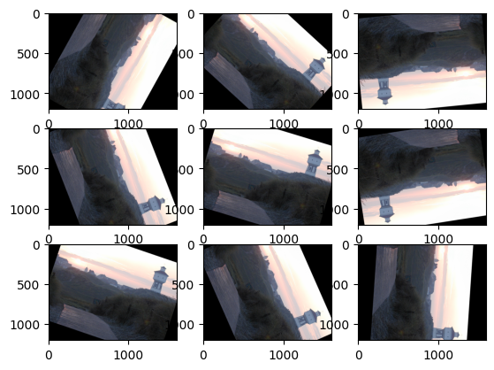

### [torchvision.transforms.RandomCrop(size, padding=None, pad_if_needed=False, fill=0, padding_mode='constant')](https://pytorch.org/vision/stable/transforms.html#torchvision.transforms.RandomCrop)

The RandomCrop transform crops an image at a random location.

```python
random_crop_transform = tv.transforms.RandomCrop(size=(250, 200))
for i in range(1, 10):
    new_image = random_crop_transform(torch_image)
    plt.subplot(3, 3, i)
    plt.imshow(np.moveaxis(new_image.detach().numpy(), 0, 2))
plt.show()
```

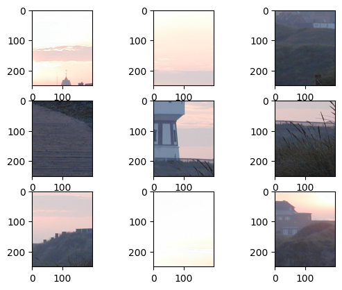

### [torchvision.transforms.RandomResizedCrop(size, scale=(0.08, 1.0), ratio=(0.75, 1.3333333333333333), interpolation=<InterpolationMode.BILINEAR: 'bilinear'>)](https://pytorch.org/vision/stable/transforms.html#torchvision.transforms.RandomResizedCrop)

The RandomResizedCrop transform crops an image at a random location, and then resizes the crop to a given size.

### [torchvision.transforms.RandomPosterize(bits, p=0.5)](https://pytorch.org/vision/stable/transforms.html#torchvision.transforms.RandomPosterize)

Posterize the image randomly with a given probability by reducing the number of bits for each color channel. 

```python
for i in range(1, 5):
    random_posterize_transform = tv.transforms.RandomPosterize(bits=i, p=1.0)
    new_image = random_posterize_transform((torch_image * 255).type(dtype=torch.uint8))
    plt.subplot(2, 2, i)
    plt.imshow(np.moveaxis(new_image.detach().numpy(), 0, 2))
plt.show()
```

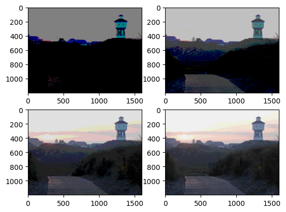


### [torchvision.transforms.RandomSolarize(threshold, p=0.5)](https://pytorch.org/vision/stable/transforms.html#torchvision.transforms.RandomSolarize)

Solarize the image randomly with a given probability by inverting all pixel values above a threshold.

```python
random_solarize_transform = tv.transforms.RandomSolarize(threshold=0.5)
new_image = random_solarize_transform(torch_image)
plt.imshow(np.moveaxis(new_image.detach().numpy(), 0, 2))
plt.show()
```

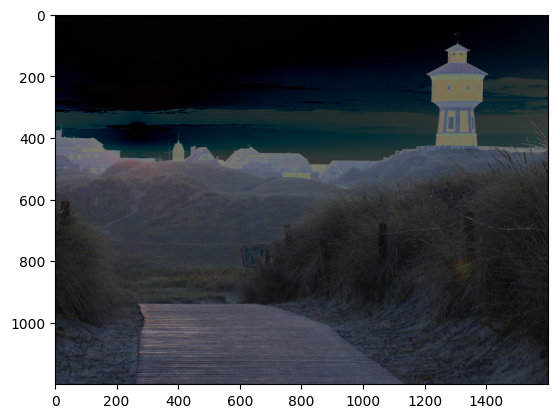


### [torchvision.transforms.RandomAdjustSharpness(sharpness_factor, p=0.5)](https://pytorch.org/vision/stable/transforms.html#torchvision.transforms.RandomAdjustSharpness)

Adjust the sharpness of the image randomly with a given probability.

```python
random_sharpness_transform = tv.transforms.RandomAdjustSharpness(
    sharpness_factor=50, p=1.0
)
new_image = random_sharpness_transform(torch_image)
plt.subplot(1, 2, 1)
plt.imshow(np.moveaxis(torch_image.detach().numpy(), 0, 2))
plt.subplot(1, 2, 2)
plt.imshow(np.moveaxis(new_image.detach().numpy(), 0, 2))
plt.show()
```

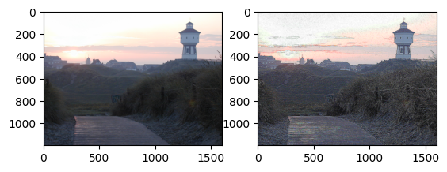

### [torchvision.transforms.RandomAutocontrast(p=0.5)](https://pytorch.org/vision/stable/transforms.html#torchvision.transforms.RandomAutocontrast)

Autocontrast the pixels of the given image randomly with a given probability. 

I don't see any effect. 

```python
random_autocontrast_transform = tv.transforms.RandomAutocontrast(p=1.0)

new_image = random_autocontrast_transform(torch_image)
plt.subplot(1, 2, 1)
plt.imshow(np.moveaxis(torch_image.detach().numpy(), 0, 2))
plt.subplot(1, 2, 2)
plt.imshow(np.moveaxis(new_image.detach().numpy(), 0, 2))
plt.show()
```

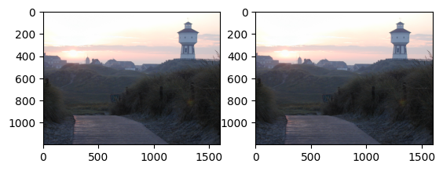

### [torchvision.transforms.RandomErasing(p=0.5, scale=(0.02, 0.33), ratio=(0.3, 3.3), value=0, inplace=False)](https://pytorch.org/vision/stable/transforms.html#torchvision.transforms.RandomErasing)
Randomly selects a rectangle region in an torch Tensor image and erases its pixels.

```python
random_erasing_transform = tv.transforms.RandomErasing(p=1.0)

new_image = random_erasing_transform(torch_image)
plt.imshow(np.moveaxis(new_image.detach().numpy(), 0, 2))
plt.show()
```

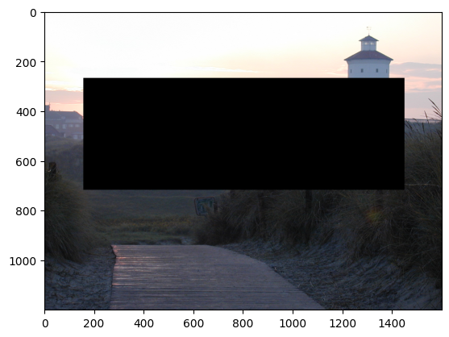

## Predefined processing chains

[torchvision.transforms.AutoAugment(policy: torchvision.transforms.autoaugment.AutoAugmentPolicy = <AutoAugmentPolicy.IMAGENET: 'imagenet'>, interpolation: torchvision.transforms.functional.InterpolationMode = <InterpolationMode.NEAREST: 'nearest'>, fill: Optional[List[float]] = None)](https://pytorch.org/vision/stable/transforms.html#torchvision.transforms.AutoAugment)

AutoAugment data augmentation method based on [“AutoAugment: Learning Augmentation Strategies from Data”](https://arxiv.org/pdf/1805.09501.pdf).

[torchvision.transforms.AutoAugmentPolicy(value)](https://pytorch.org/vision/stable/transforms.html#torchvision.transforms.AutoAugmentPolicy)

AutoAugment policies learned on different datasets. Available policies are IMAGENET, CIFAR10 and SVHN.

#### CIFAR10

```python
random_auto1_transform = tv.transforms.AutoAugment(
    tv.transforms.AutoAugmentPolicy.CIFAR10
)
for i in range(1, 10):
    new_image = random_auto1_transform((torch_image * 255).type(dtype=torch.uint8))
    plt.subplot(3, 3, i)
    plt.imshow(np.moveaxis(new_image.detach().numpy(), 0, 2))
plt.show()
```

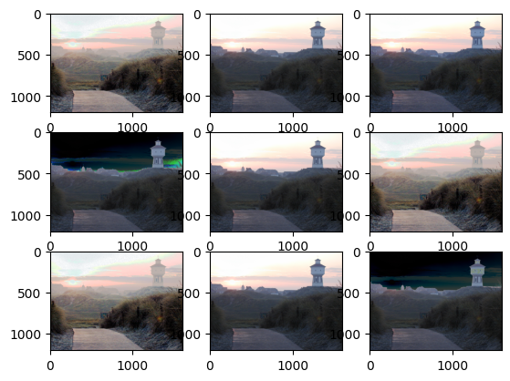

#### IMAGENET
```python
random_auto2_transform = tv.transforms.AutoAugment(
    tv.transforms.AutoAugmentPolicy.IMAGENET
)
for i in range(1, 10):
    new_image = random_auto2_transform((torch_image * 255).type(dtype=torch.uint8))
    plt.subplot(3, 3, i)
    plt.imshow(np.moveaxis(new_image.detach().numpy(), 0, 2))
plt.show()
```

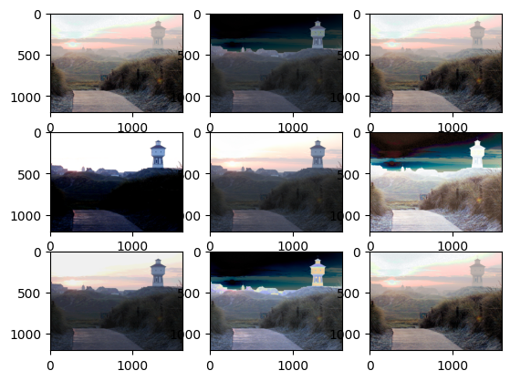

#### SVHN

```python
random_auto3_transform = tv.transforms.AutoAugment(tv.transforms.AutoAugmentPolicy.SVHN)
for i in range(1, 10):
    new_image = random_auto3_transform((torch_image * 255).type(dtype=torch.uint8))
    plt.subplot(3, 3, i)
    plt.imshow(np.moveaxis(new_image.detach().numpy(), 0, 2))
plt.show()
```

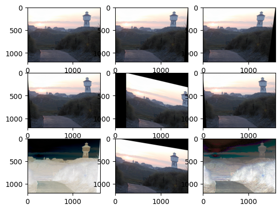

## Building custom processing chains

### [torch.nn.Sequential(*args)](https://pytorch.org/docs/stable/generated/torch.nn.Sequential.html#torch.nn.Sequential)
A sequential container. Modules will be added to it in the order they are passed in the constructor. 

```python
sequential_transform = torch.nn.Sequential(
    tv.transforms.RandomSolarize(threshold=0.5, p=1.0),
    tv.transforms.RandomErasing(p=1.0),
)
new_image = sequential_transform((torch_image * 255).type(dtype=torch.uint8))
plt.imshow(np.moveaxis(new_image.detach().numpy(), 0, 2))
plt.show()
```

Depending on the transformation used, I can be possible to just-in-time (jit) compile it. 

```python
sequential_transform_jit = torch.jit.script(sequential_transform)
```

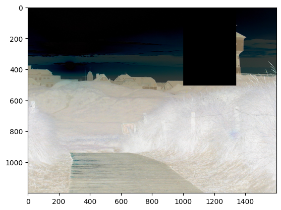

### [torchvision.transforms.Compose(transforms)](https://pytorch.org/vision/stable/transforms.html#torchvision.transforms.Compose)

Composes several transforms together. **This transform does not support torchscript.** 

```python
compose_transform = tv.transforms.Compose(
    [
        tv.transforms.RandomSolarize(threshold=0.5, p=1.0),
        tv.transforms.RandomErasing(p=1.0),
    ]
)
new_image = compose_transform((torch_image * 255).type(dtype=torch.uint8))
plt.imshow(np.moveaxis(new_image.detach().numpy(), 0, 2))
plt.show()
```

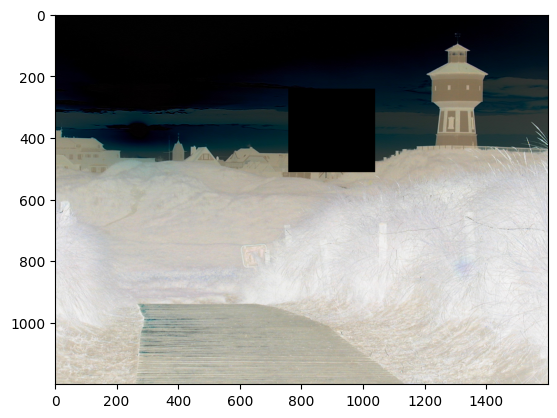


### [torchvision.transforms.RandomApply(transforms, p=0.5)](https://pytorch.org/vision/stable/transforms.html#torchvision.transforms.RandomApply)

Apply randomly a list of transformations with a given probability.

**Note: It randomly applies the whole list of transformation or none. **

```python
randomapply_transform = tv.transforms.RandomApply(
    [
        tv.transforms.RandomSolarize(threshold=0.5, p=1.0),
        tv.transforms.RandomErasing(p=1.0),
    ],
    p=0.5,
)
for i in range(1, 3):
    plt.subplot(2, 1, i)
    new_image = randomapply_transform((torch_image * 255).type(dtype=torch.uint8))
    plt.imshow(np.moveaxis(new_image.detach().numpy(), 0, 2))
plt.show()
```

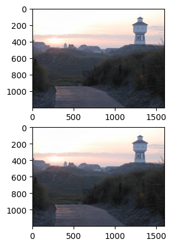
