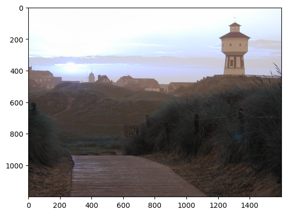
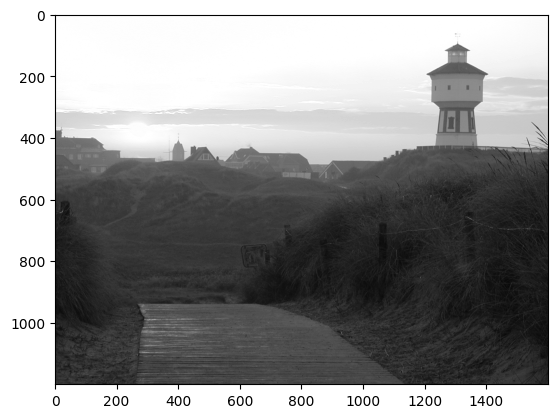
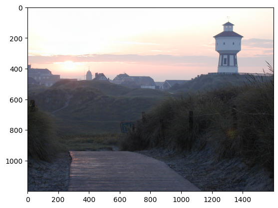
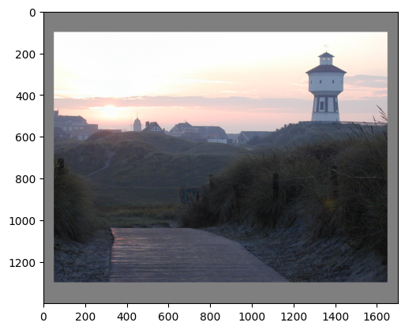
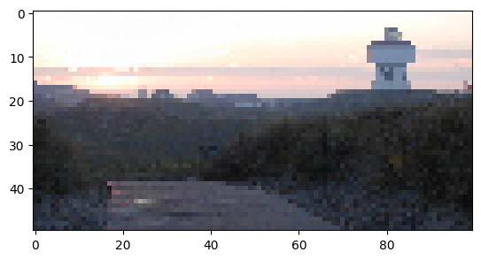
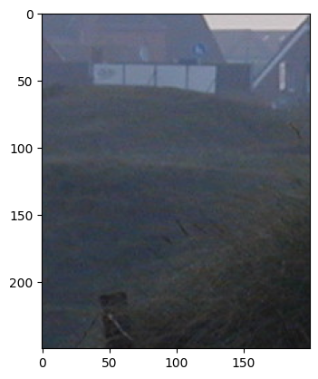
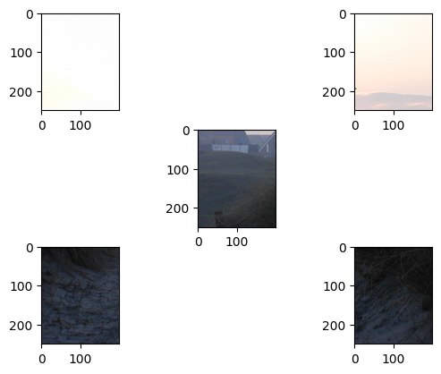
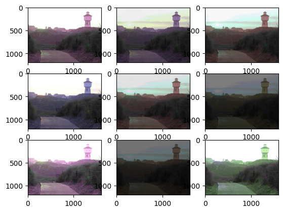
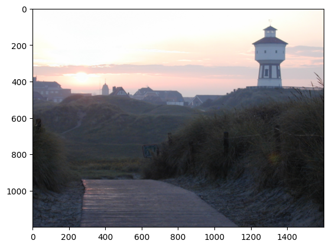
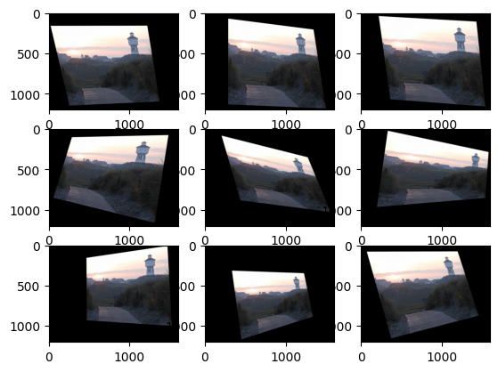

Initial Image: 


```python
import cv2
import matplotlib.pyplot as plt

filename: str = "data_augmentation_test_image.jpg"

original_image = cv2.imread(filename)

plt.imshow(original_image)
plt.show()
```




```python
original_image = cv2.imread(filename, cv2.IMREAD_GRAYSCALE)

plt.imshow(original_image, cmap="gray")
plt.show()
```




```python
import numpy as np

original_image = cv2.imread(filename, cv2.IMREAD_COLOR)

# "Convert" from BlueGreenRed (BGR) to RGB (RedGreenBlue)
# This is a flip in the third dimension.
original_image = np.flip(original_image, axis=2)
plt.imshow(original_image)
plt.show()
```

### Into PyTorch



```python
import torch

torch_image = torch.tensor(
    np.moveaxis(original_image.astype(dtype=np.float32) / 255.0, 2, 0)
)
print(torch_image.shape) # -> torch.Size([3, 1200, 1600])
```

### Pad 

```python
import torchvision as tv

pad_transform = tv.transforms.Pad(padding=(50, 100), fill=0.5)
new_image = pad_transform(torch_image)
plt.imshow(np.moveaxis(new_image.detach().numpy(), 0, 2))
plt.show()
```




### Resize

```python
resize_transform = tv.transforms.Resize(size=(50, 100))
new_image = resize_transform(torch_image)
plt.imshow(np.moveaxis(new_image.detach().numpy(), 0, 2))
plt.show()
```



### CenterCrop

```python
center_crop_transform = tv.transforms.CenterCrop(size=(250, 200))
new_image = center_crop_transform(torch_image)
plt.imshow(np.moveaxis(new_image.detach().numpy(), 0, 2))
plt.show()
```



### FiveCrop

```python
position = (1, 3, 7, 9, 5)
five_crop_transform = tv.transforms.FiveCrop(size=(250, 200))
new_image = five_crop_transform(torch_image)

for i, p in enumerate(position):
    plt.subplot(3, 3, p)
    plt.imshow(np.moveaxis(new_image[i].detach().numpy(), 0, 2))

plt.show()
```




### Grayscale

```python
gray_transform = tv.transforms.Grayscale()
new_image = gray_transform(torch_image)
plt.imshow(new_image.squeeze().detach().numpy(), cmap="gray")
plt.show()
```


### ColorJitter

```python
color_jitter_transform = tv.transforms.ColorJitter(brightness=0.75, hue=0.5)
for i in range(1, 10):
    new_image = color_jitter_transform(torch_image)
    plt.subplot(3, 3, i)
    plt.imshow(np.moveaxis(new_image.detach().numpy(), 0, 2))
plt.show()
```




### Gaussian Blur

```python
gauss_transform = tv.transforms.GaussianBlur(kernel_size=(101, 101), sigma=(0.1, 10))
new_image = gauss_transform(torch_image)
plt.imshow(np.moveaxis(new_image.detach().numpy(), 0, 2))
plt.show()
```



### Random Perspective

```python
random_perspective_transform = tv.transforms.RandomPerspective(
    distortion_scale=0.6, p=1.0
)
for i in range(1, 10):
    new_image = random_perspective_transform(torch_image)
    plt.subplot(3, 3, i)
    plt.imshow(np.moveaxis(new_image.detach().numpy(), 0, 2))
plt.show()
```



```python

```


```python

```


```python

```


```python

```


```python

```


```python

```


# --------------

```python

```


