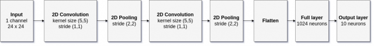

# Creating networks 
{:.no_toc}

<nav markdown="1" class="toc-class">
* TOC
{:toc}
</nav>

## The goal

In these days, building networks is very important. 

Questions to [David Rotermund](mailto:davrot@uni-bremen.de)


## A fast way to build a network with [Sequential](https://pytorch.org/docs/stable/generated/torch.nn.Sequential.html#torch.nn.Sequential) 

```python
CLASS torch.nn.Sequential(*args: Module)
```

> A sequential container. Modules will be added to it in the order they are passed in the constructor.


Example: 



We can just chain the layers together:

```python
import torch

input_number_of_channel: int = 1
input_dim_x: int = 24
input_dim_y: int = 24

number_of_output_channels_conv1: int = 32
number_of_output_channels_conv2: int = 64
number_of_output_channels_flatten1: int
number_of_output_channels_full1: int = 1024
number_of_output_channels_out: int = 10

kernel_size_conv1: tuple[int, int] = (5, 5)
kernel_size_pool1: tuple[int, int] = (2, 2)
kernel_size_conv2: tuple[int, int] = (5, 5)
kernel_size_pool2: tuple[int, int] = (2, 2)

stride_conv1: tuple[int, int] = (1, 1)
stride_pool1: tuple[int, int] = (2, 2)
stride_conv2: tuple[int, int] = (1, 1)
stride_pool2: tuple[int, int] = (2, 2)

padding_conv1: int = 0
padding_pool1: int = 0
padding_conv2: int = 0
padding_pool2: int = 0

number_of_output_channels_flatten1 = 576

network = torch.nn.Sequential(
    torch.nn.Conv2d(
        in_channels=input_number_of_channel,
        out_channels=number_of_output_channels_conv1,
        kernel_size=kernel_size_conv1,
        stride=stride_conv1,
        padding=padding_conv1,
    ),
    torch.nn.ReLU(),
    torch.nn.MaxPool2d(
        kernel_size=kernel_size_pool1, stride=stride_pool1, padding=padding_pool1
    ),
    torch.nn.Conv2d(
        in_channels=number_of_output_channels_conv1,
        out_channels=number_of_output_channels_conv2,
        kernel_size=kernel_size_conv2,
        stride=stride_conv2,
        padding=padding_conv2,
    ),
    torch.nn.ReLU(),
    torch.nn.MaxPool2d(
        kernel_size=kernel_size_pool2, stride=stride_pool2, padding=padding_pool2
    ),
    torch.nn.Flatten(
        start_dim=1,
    ),
    torch.nn.Linear(
        in_features=number_of_output_channels_flatten1,
        out_features=number_of_output_channels_full1,
        bias=True,
    ),
    torch.nn.ReLU(),
    torch.nn.Linear(
        in_features=number_of_output_channels_full1,
        out_features=number_of_output_channels_out,
        bias=True,
    ),
)

print(network)
```

```python
Sequential(
  (0): Conv2d(1, 32, kernel_size=(5, 5), stride=(1, 1))
  (1): ReLU()
  (2): MaxPool2d(kernel_size=(2, 2), stride=(2, 2), padding=0, dilation=1, ceil_mode=False)
  (3): Conv2d(32, 64, kernel_size=(5, 5), stride=(1, 1))
  (4): ReLU()
  (5): MaxPool2d(kernel_size=(2, 2), stride=(2, 2), padding=0, dilation=1, ceil_mode=False)
  (6): Flatten(start_dim=1, end_dim=-1)
  (7): Linear(in_features=576, out_features=1024, bias=True)
  (8): ReLU()
  (9): Linear(in_features=1024, out_features=10, bias=True)
)
```

Congratulations you now have the network you wanted.

## Inspecting the network object

```python
print(network.__dict__)
```

The output is:

```python
{'training': True, 
'_parameters': OrderedDict(), 
'_buffers': OrderedDict(), 
'_non_persistent_buffers_set': set(), 
'_backward_pre_hooks': OrderedDict()
'_backward_hooks': OrderedDict(),
'_is_full_backward_hook': None, 
'_forward_hooks': OrderedDict(), 
'_forward_hooks_with_kwargs': OrderedDict(), 
'_forward_pre_hooks': OrderedDict(), 
'_forward_pre_hooks_with_kwargs': OrderedDict(),
'_state_dict_hooks': OrderedDict(), 
'_state_dict_pre_hooks': OrderedDict(), 
'_load_state_dict_pre_hooks': OrderedDict(), 
'_load_state_dict_post_hooks': OrderedDict(), 
'_modules': OrderedDict([('0', Conv2d(1, 32, kernel_size=(5, 5), stride=(1, 1))), ('1', ReLU()), ('2', MaxPool2d(kernel_size=(2, 2), stride=(2, 2), padding=0, dilation=1, ceil_mode=False)), ('3', Conv2d(32, 64, kernel_size=(5, 5), stride=(1, 1))), ('4', ReLU()), ('5', MaxPool2d(kernel_size=(2, 2), stride=(2, 2), padding=0, dilation=1, ceil_mode=False)), ('6', Flatten(start_dim=1, end_dim=-1)), ('7', Linear(in_features=576, out_features=1024, bias=True)), ('8', ReLU()), ('9', Linear(in_features=1024, out_features=10, bias=True))])}
```

The obvious question is: What does this tell us? We see that the network is set to training mode but more importantly we can see our network architecture:

```python
print(network.__dict__["_modules"])
```python

```python
OrderedDict([
    ('0', Conv2d(1, 32, kernel_size=(5, 5), stride=(1, 1))), 
    ('1', ReLU()), 
    ('2', MaxPool2d(kernel_size=(2, 2), stride=(2, 2), padding=0, dilation=1, ceil_mode=False)), 
    ('3', Conv2d(32, 64, kernel_size=(5, 5), stride=(1, 1))), 
    ('4', ReLU()), 
    ('5', MaxPool2d(kernel_size=(2, 2), stride=(2, 2), padding=0, dilation=1, ceil_mode=False)), 
    ('6', Flatten(start_dim=1, end_dim=-1)), 
    ('7', Linear(in_features=576, out_features=1024, bias=True)), 
    ('8', ReLU()), 
    ('9', Linear(in_features=1024, out_features=10, bias=True))])
```

## Using the network

First we need some input data

```python
input_number_of_channel: int = 1
input_dim_x: int = 24
input_dim_y: int = 24

number_of_pattern: int = 111
fake_input = torch.rand(
    (number_of_pattern, input_number_of_channel, input_dim_x, input_dim_y),
    dtype=torch.float32,
)
```

Output:

```python
output = network(fake_input)
print(fake_input.shape)  # -> torch.Size([111, 1, 24, 24])
print(output.shape)  # -> torch.Size([111, 10])
```

## Flatten -> Linear Problem

If you want to use a linear layer after the flatten layer, you need to know the output dimensions of the flatten layer. If you know, everything is good. If not what to do then? There are two main alternatives:

### [LazyLinear Layer](https://pytorch.org/docs/stable/generated/torch.nn.LazyLinear.html)

```python
CLASS torch.nn.LazyLinear(out_features, bias=True, device=None, dtype=None)
```

> A torch.nn.Linear module where in_features is inferred.
> 
> In this module, the weight and bias are of torch.nn.UninitializedParameter class. They will be initialized after the first call to forward is done and the module will become a regular torch.nn.Linear module. The in_features argument of the Linear is inferred from the input.shape[-1].
> 
> Check the torch.nn.modules.lazy.LazyModuleMixin for [further documentation](https://pytorch.org/docs/stable/generated/torch.nn.modules.lazy.LazyModuleMixin.html#torch.nn.modules.lazy.LazyModuleMixin) on lazy modules and their limitations.

**If you want to manipulate the weights and such of this layer before using it then this can get ugly.** If possible you should try to use alternative 2:

### Building your network iteratively

Let us build the network layer by layer and assume we don't know **number_of_output_channels_flatten1 = 576**. But we know that the input has 1 input channel and 24x24 pixel in the spatial domain. 

```python
import torch

input_number_of_channel: int = 1
input_dim_x: int = 24
input_dim_y: int = 24

number_of_output_channels_conv1: int = 32
number_of_output_channels_conv2: int = 64
number_of_output_channels_flatten1: int
number_of_output_channels_full1: int = 1024
number_of_output_channels_out: int = 10

kernel_size_conv1: tuple[int, int] = (5, 5)
kernel_size_pool1: tuple[int, int] = (2, 2)
kernel_size_conv2: tuple[int, int] = (5, 5)
kernel_size_pool2: tuple[int, int] = (2, 2)

stride_conv1: tuple[int, int] = (1, 1)
stride_pool1: tuple[int, int] = (2, 2)
stride_conv2: tuple[int, int] = (1, 1)
stride_pool2: tuple[int, int] = (2, 2)

padding_conv1: int = 0
padding_pool1: int = 0
padding_conv2: int = 0
padding_pool2: int = 0


fake_input = torch.zeros((1, input_number_of_channel, input_dim_x, input_dim_y))
print(fake_input.shape)  # -> torch.Size([1, 1, 24, 24])

network = torch.nn.Sequential()

network.append(
    torch.nn.Conv2d(
        in_channels=input_number_of_channel,
        out_channels=number_of_output_channels_conv1,
        kernel_size=kernel_size_conv1,
        stride=stride_conv1,
        padding=padding_conv1,
    )
)
fake_input = network[-1](fake_input)
print(fake_input.shape)  # -> torch.Size([1, 32, 20, 20])

network.append(torch.nn.ReLU())
fake_input = network[-1](fake_input)
print(fake_input.shape)  # -> torch.Size([1, 32, 20, 20])

network.append(
    torch.nn.MaxPool2d(
        kernel_size=kernel_size_pool1, stride=stride_pool1, padding=padding_pool1
    )
)
fake_input = network[-1](fake_input)
print(fake_input.shape)  # -> torch.Size([1, 32, 10, 10])


network.append(
    torch.nn.Conv2d(
        in_channels=number_of_output_channels_conv1,
        out_channels=number_of_output_channels_conv2,
        kernel_size=kernel_size_conv2,
        stride=stride_conv2,
        padding=padding_conv2,
    )
)
fake_input = network[-1](fake_input)
print(fake_input.shape)  # -> torch.Size([1, 64, 6, 6])


network.append(torch.nn.ReLU())
fake_input = network[-1](fake_input)
print(fake_input.shape)  # -> torch.Size([1, 64, 6, 6])


network.append(
    torch.nn.MaxPool2d(
        kernel_size=kernel_size_pool2, stride=stride_pool2, padding=padding_pool2
    )
)
fake_input = network[-1](fake_input)
print(fake_input.shape)  # -> torch.Size([1, 64, 3, 3])


network.append(
    torch.nn.Flatten(
        start_dim=1,
    )
)
fake_input = network[-1](fake_input)
print(fake_input.shape)  # torch.Size([1, 576])

number_of_output_channels_flatten1 = fake_input.shape[1]

network.append(
    torch.nn.Linear(
        in_features=number_of_output_channels_flatten1,
        out_features=number_of_output_channels_full1,
        bias=True,
    )
)
fake_input = network[-1](fake_input)
print(fake_input.shape)  # torch.Size([1, 1024])


network.append(torch.nn.ReLU())
fake_input = network[-1](fake_input)
print(fake_input.shape)  # torch.Size([1, 1024])

network.append(
    torch.nn.Linear(
        in_features=number_of_output_channels_full1,
        out_features=number_of_output_channels_out,
        bias=True,
    )
)
fake_input = network[-1](fake_input)
print(fake_input.shape)  # torch.Size([1, 10])


print(network)
```

## [Save and load the network](https://pytorch.org/tutorials/beginner/saving_loading_models.html)

### [TORCH.SAVE](https://pytorch.org/docs/stable/generated/torch.save.html#torch-save)

```python
torch.save(obj, f, pickle_module=pickle, pickle_protocol=DEFAULT_PROTOCOL, _use_new_zipfile_serialization=True)
```

> Saves an object to a disk file.

### [TORCH.LOAD](https://pytorch.org/docs/stable/generated/torch.load.html)

```python
torch.load(f, map_location=None, pickle_module=pickle, *, weights_only=False, mmap=None, **pickle_load_args)
```

> Loads an object saved with torch.save() from a file.

> torch.load() uses Python’s unpickling facilities but treats storages, which underlie tensors, specially. They are first deserialized on the CPU and are then moved to the device they were saved from. If this fails (e.g. because the run time system doesn’t have certain devices), an exception is raised. However, storages can be dynamically remapped to an alternative set of devices using the map_location argument.

> If map_location is a callable, it will be called once for each serialized storage with two arguments: storage and location. The storage argument will be the initial deserialization of the storage, residing on the CPU. Each serialized storage has a location tag associated with it which identifies the device it was saved from, and this tag is the second argument passed to map_location. The builtin location tags are 'cpu' for CPU tensors and 'cuda:device_id' (e.g. 'cuda:2') for CUDA tensors. map_location should return either None or a storage. If map_location returns a storage, it will be used as the final deserialized object, already moved to the right device. Otherwise, torch.load() will fall back to the default behavior, as if map_location wasn’t specified.

> If map_location is a torch.device object or a string containing a device tag, it indicates the location where all tensors should be loaded.

> Otherwise, if map_location is a dict, it will be used to remap location tags appearing in the file (keys), to ones that specify where to put the storages (values).

> User extensions can register their own location tags and tagging and deserialization methods using torch.serialization.register_package().


### Save the whole network 

One way to do it, is like this:

```python
torch.save(network, "torch_network.pt")
```

```python
network = torch.load("torch_network.pt")
network.eval()
```

#### Example:

Save: 

```python
import torch

input_number_of_channel: int = 1
input_dim_x: int = 24
input_dim_y: int = 24

number_of_output_channels_conv1: int = 32
number_of_output_channels_conv2: int = 64
number_of_output_channels_flatten1: int
number_of_output_channels_full1: int = 1024
number_of_output_channels_out: int = 10

kernel_size_conv1: tuple[int, int] = (5, 5)
kernel_size_pool1: tuple[int, int] = (2, 2)
kernel_size_conv2: tuple[int, int] = (5, 5)
kernel_size_pool2: tuple[int, int] = (2, 2)

stride_conv1: tuple[int, int] = (1, 1)
stride_pool1: tuple[int, int] = (2, 2)
stride_conv2: tuple[int, int] = (1, 1)
stride_pool2: tuple[int, int] = (2, 2)

padding_conv1: int = 0
padding_pool1: int = 0
padding_conv2: int = 0
padding_pool2: int = 0

number_of_output_channels_flatten1 = 576

network = torch.nn.Sequential(
    torch.nn.Conv2d(
        in_channels=input_number_of_channel,
        out_channels=number_of_output_channels_conv1,
        kernel_size=kernel_size_conv1,
        stride=stride_conv1,
        padding=padding_conv1,
    ),
    torch.nn.ReLU(),
    torch.nn.MaxPool2d(
        kernel_size=kernel_size_pool1, stride=stride_pool1, padding=padding_pool1
    ),
    torch.nn.Conv2d(
        in_channels=number_of_output_channels_conv1,
        out_channels=number_of_output_channels_conv2,
        kernel_size=kernel_size_conv2,
        stride=stride_conv2,
        padding=padding_conv2,
    ),
    torch.nn.ReLU(),
    torch.nn.MaxPool2d(
        kernel_size=kernel_size_pool2, stride=stride_pool2, padding=padding_pool2
    ),
    torch.nn.Flatten(
        start_dim=1,
    ),
    torch.nn.Linear(
        in_features=number_of_output_channels_flatten1,
        out_features=number_of_output_channels_full1,
        bias=True,
    ),
    torch.nn.ReLU(),
    torch.nn.Linear(
        in_features=number_of_output_channels_full1,
        out_features=number_of_output_channels_out,
        bias=True,
    ),
)
torch.save(network, "torch_network.pt")
```

Load:

```python
import torch

network = torch.load("torch_network.pt")
network.eval()
print(network)
```

Output:

```python
Sequential(
  (0): Conv2d(1, 32, kernel_size=(5, 5), stride=(1, 1))
  (1): ReLU()
  (2): MaxPool2d(kernel_size=(2, 2), stride=(2, 2), padding=0, dilation=1, ceil_mode=False)
  (3): Conv2d(32, 64, kernel_size=(5, 5), stride=(1, 1))
  (4): ReLU()
  (5): MaxPool2d(kernel_size=(2, 2), stride=(2, 2), padding=0, dilation=1, ceil_mode=False)
  (6): Flatten(start_dim=1, end_dim=-1)
  (7): Linear(in_features=576, out_features=1024, bias=True)
  (8): ReLU()
  (9): Linear(in_features=1024, out_features=10, bias=True)
)
```

You will have a bigger file than in approach 2. However, you don't need the definition of the network for loading it. 

### Save the weights of the network

The recommended way by PyTorch would be in our case:

```python
torch.save(network.state_dict(), "torch_network_dict.pt")
```

```python
network.load_state_dict(torch.load("torch_network_dict.pt"))
network.eval()
```

Save:

```python
import torch

input_number_of_channel: int = 1
input_dim_x: int = 24
input_dim_y: int = 24

number_of_output_channels_conv1: int = 32
number_of_output_channels_conv2: int = 64
number_of_output_channels_flatten1: int
number_of_output_channels_full1: int = 1024
number_of_output_channels_out: int = 10

kernel_size_conv1: tuple[int, int] = (5, 5)
kernel_size_pool1: tuple[int, int] = (2, 2)
kernel_size_conv2: tuple[int, int] = (5, 5)
kernel_size_pool2: tuple[int, int] = (2, 2)

stride_conv1: tuple[int, int] = (1, 1)
stride_pool1: tuple[int, int] = (2, 2)
stride_conv2: tuple[int, int] = (1, 1)
stride_pool2: tuple[int, int] = (2, 2)

padding_conv1: int = 0
padding_pool1: int = 0
padding_conv2: int = 0
padding_pool2: int = 0

number_of_output_channels_flatten1 = 576

network = torch.nn.Sequential(
    torch.nn.Conv2d(
        in_channels=input_number_of_channel,
        out_channels=number_of_output_channels_conv1,
        kernel_size=kernel_size_conv1,
        stride=stride_conv1,
        padding=padding_conv1,
    ),
    torch.nn.ReLU(),
    torch.nn.MaxPool2d(
        kernel_size=kernel_size_pool1, stride=stride_pool1, padding=padding_pool1
    ),
    torch.nn.Conv2d(
        in_channels=number_of_output_channels_conv1,
        out_channels=number_of_output_channels_conv2,
        kernel_size=kernel_size_conv2,
        stride=stride_conv2,
        padding=padding_conv2,
    ),
    torch.nn.ReLU(),
    torch.nn.MaxPool2d(
        kernel_size=kernel_size_pool2, stride=stride_pool2, padding=padding_pool2
    ),
    torch.nn.Flatten(
        start_dim=1,
    ),
    torch.nn.Linear(
        in_features=number_of_output_channels_flatten1,
        out_features=number_of_output_channels_full1,
        bias=True,
    ),
    torch.nn.ReLU(),
    torch.nn.Linear(
        in_features=number_of_output_channels_full1,
        out_features=number_of_output_channels_out,
        bias=True,
    ),
)
torch.save(network.state_dict(), "torch_network_dict.pt")
```

Load:

```python
import torch

input_number_of_channel: int = 1
input_dim_x: int = 24
input_dim_y: int = 24

number_of_output_channels_conv1: int = 32
number_of_output_channels_conv2: int = 64
number_of_output_channels_flatten1: int
number_of_output_channels_full1: int = 1024
number_of_output_channels_out: int = 10

kernel_size_conv1: tuple[int, int] = (5, 5)
kernel_size_pool1: tuple[int, int] = (2, 2)
kernel_size_conv2: tuple[int, int] = (5, 5)
kernel_size_pool2: tuple[int, int] = (2, 2)

stride_conv1: tuple[int, int] = (1, 1)
stride_pool1: tuple[int, int] = (2, 2)
stride_conv2: tuple[int, int] = (1, 1)
stride_pool2: tuple[int, int] = (2, 2)

padding_conv1: int = 0
padding_pool1: int = 0
padding_conv2: int = 0
padding_pool2: int = 0

number_of_output_channels_flatten1 = 576

network = torch.nn.Sequential(
    torch.nn.Conv2d(
        in_channels=input_number_of_channel,
        out_channels=number_of_output_channels_conv1,
        kernel_size=kernel_size_conv1,
        stride=stride_conv1,
        padding=padding_conv1,
    ),
    torch.nn.ReLU(),
    torch.nn.MaxPool2d(
        kernel_size=kernel_size_pool1, stride=stride_pool1, padding=padding_pool1
    ),
    torch.nn.Conv2d(
        in_channels=number_of_output_channels_conv1,
        out_channels=number_of_output_channels_conv2,
        kernel_size=kernel_size_conv2,
        stride=stride_conv2,
        padding=padding_conv2,
    ),
    torch.nn.ReLU(),
    torch.nn.MaxPool2d(
        kernel_size=kernel_size_pool2, stride=stride_pool2, padding=padding_pool2
    ),
    torch.nn.Flatten(
        start_dim=1,
    ),
    torch.nn.Linear(
        in_features=number_of_output_channels_flatten1,
        out_features=number_of_output_channels_full1,
        bias=True,
    ),
    torch.nn.ReLU(),
    torch.nn.Linear(
        in_features=number_of_output_channels_full1,
        out_features=number_of_output_channels_out,
        bias=True,
    ),
)
network.load_state_dict(torch.load("torch_network_dict.pt"))
network.eval()
print(network)
```

Output:
```python
Sequential(
  (0): Conv2d(1, 32, kernel_size=(5, 5), stride=(1, 1))
  (1): ReLU()
  (2): MaxPool2d(kernel_size=(2, 2), stride=(2, 2), padding=0, dilation=1, ceil_mode=False)
  (3): Conv2d(32, 64, kernel_size=(5, 5), stride=(1, 1))
  (4): ReLU()
  (5): MaxPool2d(kernel_size=(2, 2), stride=(2, 2), padding=0, dilation=1, ceil_mode=False)
  (6): Flatten(start_dim=1, end_dim=-1)
  (7): Linear(in_features=576, out_features=1024, bias=True)
  (8): ReLU()
  (9): Linear(in_features=1024, out_features=10, bias=True)
)
```

## A closer look into our layers

We can address them like this:

```python
for module_id in range(0, len(network._modules)):
    print(f"Layer ID: {module_id}")
    print(network._modules[str(module_id)])
```


```python
import torch

input_number_of_channel: int = 1
input_dim_x: int = 24
input_dim_y: int = 24

number_of_output_channels_conv1: int = 32
number_of_output_channels_conv2: int = 64
number_of_output_channels_flatten1: int
number_of_output_channels_full1: int = 1024
number_of_output_channels_out: int = 10

kernel_size_conv1: tuple[int, int] = (5, 5)
kernel_size_pool1: tuple[int, int] = (2, 2)
kernel_size_conv2: tuple[int, int] = (5, 5)
kernel_size_pool2: tuple[int, int] = (2, 2)

stride_conv1: tuple[int, int] = (1, 1)
stride_pool1: tuple[int, int] = (2, 2)
stride_conv2: tuple[int, int] = (1, 1)
stride_pool2: tuple[int, int] = (2, 2)

padding_conv1: int = 0
padding_pool1: int = 0
padding_conv2: int = 0
padding_pool2: int = 0

number_of_output_channels_flatten1 = 576

network = torch.nn.Sequential(
    torch.nn.Conv2d(
        in_channels=input_number_of_channel,
        out_channels=number_of_output_channels_conv1,
        kernel_size=kernel_size_conv1,
        stride=stride_conv1,
        padding=padding_conv1,
    ),
    torch.nn.ReLU(),
    torch.nn.MaxPool2d(
        kernel_size=kernel_size_pool1, stride=stride_pool1, padding=padding_pool1
    ),
    torch.nn.Conv2d(
        in_channels=number_of_output_channels_conv1,
        out_channels=number_of_output_channels_conv2,
        kernel_size=kernel_size_conv2,
        stride=stride_conv2,
        padding=padding_conv2,
    ),
    torch.nn.ReLU(),
    torch.nn.MaxPool2d(
        kernel_size=kernel_size_pool2, stride=stride_pool2, padding=padding_pool2
    ),
    torch.nn.Flatten(
        start_dim=1,
    ),
    torch.nn.Linear(
        in_features=number_of_output_channels_flatten1,
        out_features=number_of_output_channels_full1,
        bias=True,
    ),
    torch.nn.ReLU(),
    torch.nn.Linear(
        in_features=number_of_output_channels_full1,
        out_features=number_of_output_channels_out,
        bias=True,
    ),
)

for module_id in range(0, len(network._modules)):
    print(f"Layer ID: {module_id}")
    print(network._modules[str(module_id)])
```

Output:

```python
Layer ID: 0
Conv2d(1, 32, kernel_size=(5, 5), stride=(1, 1))
Layer ID: 1
ReLU()
Layer ID: 2
MaxPool2d(kernel_size=(2, 2), stride=(2, 2), padding=0, dilation=1, ceil_mode=False)
Layer ID: 3
Conv2d(32, 64, kernel_size=(5, 5), stride=(1, 1))
Layer ID: 4
ReLU()
Layer ID: 5
MaxPool2d(kernel_size=(2, 2), stride=(2, 2), padding=0, dilation=1, ceil_mode=False)
Layer ID: 6
Flatten(start_dim=1, end_dim=-1)
Layer ID: 7
Linear(in_features=576, out_features=1024, bias=True)
Layer ID: 8
ReLU()
Layer ID: 9
Linear(in_features=1024, out_features=10, bias=True)
```

## Extracting activations

We can use this to extract the activations in a very easy way

```python
number_of_pattern: int = 111
fake_input = torch.rand(
    (number_of_pattern, input_number_of_channel, input_dim_x, input_dim_y),
    dtype=torch.float32,
)

activity: list[torch.Tensor] = []
activity.append(fake_input)

for module_id in range(0, len(network._modules)):
    temp = network._modules[str(module_id)](activity[-1])
    activity.append(temp)

for id, data in enumerate(activity):
    print(f"ID: {id} Shape:{data.shape}")
```


```python
import torch

input_number_of_channel: int = 1
input_dim_x: int = 24
input_dim_y: int = 24

number_of_output_channels_conv1: int = 32
number_of_output_channels_conv2: int = 64
number_of_output_channels_flatten1: int
number_of_output_channels_full1: int = 1024
number_of_output_channels_out: int = 10

kernel_size_conv1: tuple[int, int] = (5, 5)
kernel_size_pool1: tuple[int, int] = (2, 2)
kernel_size_conv2: tuple[int, int] = (5, 5)
kernel_size_pool2: tuple[int, int] = (2, 2)

stride_conv1: tuple[int, int] = (1, 1)
stride_pool1: tuple[int, int] = (2, 2)
stride_conv2: tuple[int, int] = (1, 1)
stride_pool2: tuple[int, int] = (2, 2)

padding_conv1: int = 0
padding_pool1: int = 0
padding_conv2: int = 0
padding_pool2: int = 0

number_of_output_channels_flatten1 = 576

network = torch.nn.Sequential(
    torch.nn.Conv2d(
        in_channels=input_number_of_channel,
        out_channels=number_of_output_channels_conv1,
        kernel_size=kernel_size_conv1,
        stride=stride_conv1,
        padding=padding_conv1,
    ),
    torch.nn.ReLU(),
    torch.nn.MaxPool2d(
        kernel_size=kernel_size_pool1, stride=stride_pool1, padding=padding_pool1
    ),
    torch.nn.Conv2d(
        in_channels=number_of_output_channels_conv1,
        out_channels=number_of_output_channels_conv2,
        kernel_size=kernel_size_conv2,
        stride=stride_conv2,
        padding=padding_conv2,
    ),
    torch.nn.ReLU(),
    torch.nn.MaxPool2d(
        kernel_size=kernel_size_pool2, stride=stride_pool2, padding=padding_pool2
    ),
    torch.nn.Flatten(
        start_dim=1,
    ),
    torch.nn.Linear(
        in_features=number_of_output_channels_flatten1,
        out_features=number_of_output_channels_full1,
        bias=True,
    ),
    torch.nn.ReLU(),
    torch.nn.Linear(
        in_features=number_of_output_channels_full1,
        out_features=number_of_output_channels_out,
        bias=True,
    ),
)

number_of_pattern: int = 111
fake_input = torch.rand(
    (number_of_pattern, input_number_of_channel, input_dim_x, input_dim_y),
    dtype=torch.float32,
)

activity: list[torch.Tensor] = []
activity.append(fake_input)

for module_id in range(0, len(network._modules)):
    temp = network._modules[str(module_id)](activity[-1])
    activity.append(temp)

for id, data in enumerate(activity):
    print(f"ID: {id} Shape:{data.shape}")
```

Output:

```python
ID: 0 Shape:torch.Size([111, 1, 24, 24])
ID: 1 Shape:torch.Size([111, 32, 20, 20])
ID: 2 Shape:torch.Size([111, 32, 20, 20])
ID: 3 Shape:torch.Size([111, 32, 10, 10])
ID: 4 Shape:torch.Size([111, 64, 6, 6])
ID: 5 Shape:torch.Size([111, 64, 6, 6])
ID: 6 Shape:torch.Size([111, 64, 3, 3])
ID: 7 Shape:torch.Size([111, 576])
ID: 8 Shape:torch.Size([111, 1024])
ID: 9 Shape:torch.Size([111, 1024])
ID: 10 Shape:torch.Size([111, 10])
```

## Accessing the parameters / weights of a layer 

We can look at what is stored about a layer (here as example layer "0") with

```python
print(network._modules["0"].__dict__)
```

And we get a lot of information. Too much information in fact... 

Output: 

```python
{'training': True, '_parameters': OrderedDict([('weight', Parameter containing:
tensor([[[[ 0.0191, -0.0144,  0.1454,  0.0232,  0.0703],
          [-0.1926, -0.0220,  0.1859,  0.0434,  0.1332],
          [-0.0688,  0.0699,  0.0693,  0.0630, -0.1771],
          [-0.1913, -0.1783,  0.1728, -0.0257, -0.1868],
          [-0.0771,  0.1046,  0.0862,  0.1091, -0.0156]]],


        [[[ 0.0717,  0.1716,  0.0488, -0.0746,  0.1527],
          [ 0.1975,  0.0298, -0.0073,  0.1443, -0.1383],
          [-0.1215, -0.0553,  0.1201, -0.0282,  0.1653],
          [-0.0372, -0.1186, -0.1730,  0.1192,  0.0732],
          [ 0.0769,  0.1973, -0.1270, -0.1427, -0.1871]]],
[...]
        [[[-0.0835,  0.1259, -0.0632, -0.1857, -0.1243],
          [-0.1389, -0.1182, -0.1034,  0.1469, -0.0461],
          [ 0.1088,  0.0572, -0.0438, -0.1451, -0.0171],
          [-0.0472,  0.1664, -0.0792, -0.0200, -0.1221],
          [-0.1937,  0.1914,  0.0493,  0.1763,  0.0273]]]], requires_grad=True)), ('bias', Parameter containing:
tensor([ 0.1289, -0.0354,  0.0642, -0.0767,  0.0876, -0.0429,  0.1400,  0.1130,
        -0.0845,  0.0800,  0.1310, -0.0756,  0.0790, -0.1698,  0.1385,  0.1654,
         0.1249, -0.1413, -0.0439,  0.1302, -0.0877,  0.0926,  0.0420,  0.0107,
         0.1039,  0.1675,  0.1516, -0.0741,  0.1934,  0.1042,  0.1118, -0.0692],
       requires_grad=True))]), '_buffers': OrderedDict(), '_non_persistent_buffers_set': set(), '_backward_pre_hooks': OrderedDict(), '_backward_hooks': OrderedDict(), '_is_full_backward_hook': None, '_forward_hooks': OrderedDict(), '_forward_hooks_with_kwargs': OrderedDict(), '_forward_pre_hooks': OrderedDict(), '_forward_pre_hooks_with_kwargs': OrderedDict(), '_state_dict_hooks': OrderedDict(), '_state_dict_pre_hooks': OrderedDict(), '_load_state_dict_pre_hooks': OrderedDict(), '_load_state_dict_post_hooks': OrderedDict(), '_modules': OrderedDict(), 'in_channels': 1, 'out_channels': 32, 'kernel_size': (5, 5), 'stride': (1, 1), 'padding': (0, 0), 'dilation': (1, 1), 'transposed': False, 'output_padding': (0, 0), 'groups': 1, 'padding_mode': 'zeros', '_reversed_padding_repeated_twice': (0, 0, 0, 0)}
```

Let us look at the keys of the dictionary instead:

```python
print(network._modules["0"].__dict__.keys())
```

```python
dict_keys([
'training',
'_parameters',
'_buffers',
'_non_persistent_buffers_set',
'_backward_pre_hooks',
'_backward_hooks',
'_is_full_backward_hook',
'_forward_hooks',
'_forward_hooks_with_kwargs',
'_forward_pre_hooks',
'_forward_pre_hooks_with_kwargs',
'_state_dict_hooks',
'_state_dict_pre_hooks',
'_load_state_dict_pre_hooks',
'_load_state_dict_post_hooks',
'_modules',
'in_channels',
'out_channels',
'kernel_size',
'stride',
'padding',
'dilation',
'transposed',
'output_padding',
'groups',
'padding_mode',
'_reversed_padding_repeated_twice'])
```

Our main interest is located in \_parameters :

```python
print(network._modules["0"].__dict__["_parameters"].keys())
```

And here we find:

```python
odict_keys(['weight', 'bias'])
```

## Who has parameters?

Now we can analyse which of the layers have parameters:

```python
for module_id in range(0, len(network._modules)):
    print(
        f'ID: {module_id}  ==> {network._modules[str(module_id)].__dict__["_parameters"].keys()}'
    )
```

Output:

```python
ID: 0  ==> odict_keys(['weight', 'bias'])
ID: 1  ==> odict_keys([])
ID: 2  ==> odict_keys([])
ID: 3  ==> odict_keys(['weight', 'bias'])
ID: 4  ==> odict_keys([])
ID: 5  ==> odict_keys([])
ID: 6  ==> odict_keys([])
ID: 7  ==> odict_keys(['weight', 'bias'])
ID: 8  ==> odict_keys([])
ID: 9  ==> odict_keys(['weight', 'bias'])
```

## Give me your weights! 


```python
conv1_bias = network._modules["0"].__dict__["_parameters"]["bias"].data
conv1_weights = network._modules["0"].__dict__["_parameters"]["weight"].data

conv2_bias = network._modules["3"].__dict__["_parameters"]["bias"].data
conv2_weights = network._modules["3"].__dict__["_parameters"]["weight"].data

full1_bias = network._modules["7"].__dict__["_parameters"]["bias"].data
full1_weights = network._modules["7"].__dict__["_parameters"]["weight"].data

output_bias = network._modules["9"].__dict__["_parameters"]["bias"].data
output_weights = network._modules["9"].__dict__["_parameters"]["weight"].data


print(conv1_bias.shape)  # -> torch.Size([32])
print(conv1_weights.shape)  # -> torch.Size([32, 1, 5, 5])

print(conv2_bias.shape)  # -> torch.Size([64])
print(conv2_weights.shape)  # -> torch.Size([64, 32, 5, 5])

print(full1_bias.shape)  # -> torch.Size([1024])
print(full1_weights.shape)  # -> torch.Size([1024, 576])

print(output_bias.shape)  # -> torch.Size([10])
print(output_weights.shape)  # -> torch.Size([10, 1024])
```

**Note: The order of the dimensions is strange. It is [Output Channel, Input Channel, Kernel X, Kernel Y] for the 2D convolution layer and  [Output Channel, Input Channel] for the full layer.**

**Note: If you want to interact with the weights, then you have to use .data** If you write directly into e.g. \_\_dict\_\_["_parameters"]["bias"] you might accidently convert it from a parameter into a tensor and/or destroy the connection to the optimizer (which holds only a reference to the weights). 

## Replace weights 

We can now easily replace the weights

```python
network[0].__dict__["_parameters"]["bias"].data = 5 * torch.ones(
    (32), dtype=torch.float32
)
network[0].__dict__["_parameters"]["weight"].data = torch.ones(
    (32, 1, 5, 5), dtype=torch.float32
)


fake_input = torch.ones(
    (1, 1, 24, 24),
    dtype=torch.float32,
)

output = network[0](fake_input)
print(output)
print(output.shape) # -> torch.Size([1, 32, 20, 20])
```

Output:

```python
tensor([[[[30., 30., 30.,  ..., 30., 30., 30.],
          [30., 30., 30.,  ..., 30., 30., 30.],
          [30., 30., 30.,  ..., 30., 30., 30.],
          ...,
          [30., 30., 30.,  ..., 30., 30., 30.],
          [30., 30., 30.,  ..., 30., 30., 30.],
          [30., 30., 30.,  ..., 30., 30., 30.]],
[...]
          [30., 30., 30.,  ..., 30., 30., 30.],
          [30., 30., 30.,  ..., 30., 30., 30.],
          [30., 30., 30.,  ..., 30., 30., 30.]]]],
       grad_fn=<ConvolutionBackward0>)
```
