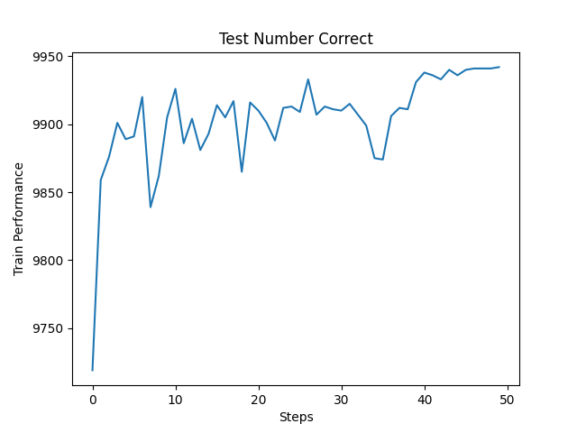

# Your own layer
{:.no_toc}

<nav markdown="1" class="toc-class">
* TOC
{:toc}
</nav>

## Top

Questions to [David Rotermund](mailto:davrot@uni-bremen.de)


## Writing a layer based on linear

I am rewriting the code for [Linear](https://pytorch.org/docs/stable/_modules/torch/nn/modules/linear.html#Linear) as my own layer. 

\_\_init\_\_() : It contains a tensor for the weights and optionally a second tensor for the bias. Both tensors are wrapped within the torch.nn.Parameter class. This is necessary, otherwise the optimizer will not find them. Afterwards the tensors will be initialized via reset_parameters(self).

reset_parameters(): I copied it from the original code. 

forward(): We get an input tensor and need to produce an output tensor. Please remember that dimension 0 contains the batch. Here we just multiply the input with the weights and add the bias to it (if available).

extra_repr(): Prints the information about the layer in a nice fashion. 


```python
import torch
import math


class MyOwnLayer(torch.nn.Module):
    def __init__(
        self,
        in_features: int,
        out_features: int,
        bias: bool = True,
    ) -> None:
        super().__init__()

        assert in_features > 0
        assert out_features > 0

        self.in_features: int = in_features
        self.out_features: int = out_features

        self.weight = torch.nn.Parameter(
            torch.empty(
                (out_features, in_features),
            )
        )
        if bias:
            self.bias = torch.nn.Parameter(
                torch.empty(
                    out_features,
                )
            )
        else:
            self.register_parameter("bias", None)
        self.reset_parameters()

    def reset_parameters(self) -> None:
        torch.nn.init.kaiming_uniform_(self.weight, a=math.sqrt(5))
        if self.bias is not None:
            fan_in, _ = torch.nn.init._calculate_fan_in_and_fan_out(self.weight)
            bound = 1 / math.sqrt(fan_in) if fan_in > 0 else 0
            torch.nn.init.uniform_(self.bias, -bound, bound)

    def forward(
        self,
        input: torch.Tensor,
    ) -> torch.Tensor:
        output = (self.weight.unsqueeze(0) * input.unsqueeze(1)).sum(dim=-1)

        if self.bias is not None:
            output = output + self.bias.unsqueeze(0)

        return output

    def extra_repr(self) -> str:
        return f"in_features={self.in_features}, out_features={self.out_features}, bias={self.bias is not None}"
```

I just add it to the networs as any other layer:

```python
network = torch.nn.Sequential(
    torch.nn.Conv2d(
        in_channels=input_number_of_channel,
        out_channels=number_of_output_channels_conv1,
        kernel_size=kernel_size_conv1,
        stride=stride_conv1,
        padding=padding_conv1,
    ),
    torch.nn.ReLU(),
    torch.nn.MaxPool2d(
        kernel_size=kernel_size_pool1, stride=stride_pool1, padding=padding_pool1
    ),
    torch.nn.Conv2d(
        in_channels=number_of_output_channels_conv1,
        out_channels=number_of_output_channels_conv2,
        kernel_size=kernel_size_conv2,
        stride=stride_conv2,
        padding=padding_conv2,
    ),
    torch.nn.ReLU(),
    torch.nn.MaxPool2d(
        kernel_size=kernel_size_pool2, stride=stride_pool2, padding=padding_pool2
    ),
    torch.nn.Flatten(
        start_dim=1,
    ),
    MyOwnLayer(
        in_features=number_of_output_channels_flatten1,
        out_features=number_of_output_channels_full1,
        bias=True,
    ),
    torch.nn.ReLU(),
    torch.nn.Linear(
        in_features=number_of_output_channels_full1,
        out_features=number_of_output_channels_output,
        bias=True,
    ),
    torch.nn.Softmax(dim=1),
).to(device=device_gpu)
```

We can print information as usual:

```python
print(network[-4])
```

Output: 

```python
MyOwnLayer(in_features=576, out_features=1024, bias=True)
```

We can check the stored parameters:

```python
for parameter in network[-4].parameters():
    print(type(parameter), parameter.shape)

print()

for name, parameter in network[-4].named_parameters():
    print(name, type(parameter), parameter.shape)
```

Output:

```python
<class 'torch.nn.parameter.Parameter'> torch.Size([1024, 576])
<class 'torch.nn.parameter.Parameter'> torch.Size([1024])

weight <class 'torch.nn.parameter.Parameter'> torch.Size([1024, 576])
bias <class 'torch.nn.parameter.Parameter'> torch.Size([1024])
```

And train the network as usual:


