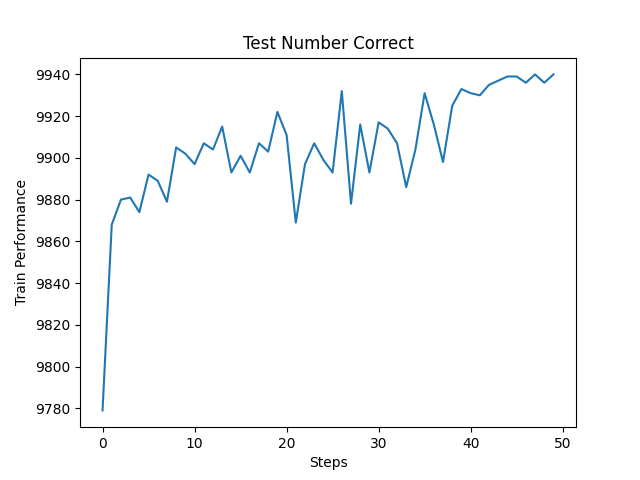

# Replace autograd
{:.no_toc}

<nav markdown="1" class="toc-class">
* TOC
{:toc}
</nav>

## Top

Questions to [David Rotermund](mailto:davrot@uni-bremen.de)

## Example 

```python
class FunctionalLinear(torch.autograd.Function):
    @staticmethod
    def forward(  # type: ignore
        ctx, input: torch.Tensor, weight: torch.Tensor, bias: torch.Tensor
    ) -> torch.Tensor:
        output = (weight.unsqueeze(0) * input.unsqueeze(1)).sum(dim=-1)

        if bias is not None:
            output = output + bias.unsqueeze(0)

        # ###########################################################
        # Save the necessary data for the backward pass
        # ###########################################################
        ctx.save_for_backward(
            input,
            weight,
            bias,
        )

        return output

    @staticmethod
    def backward(  # type: ignore
        ctx, grad_output: torch.Tensor
    ) -> tuple[torch.Tensor | None, torch.Tensor | None, torch.Tensor | None]:
        # ##############################################
        # Get the variables back
        # ##############################################
        (
            input,
            weight,
            bias,
        ) = ctx.saved_tensors

        # ##############################################
        # Default output
        # ##############################################
        grad_input: torch.Tensor | None = None
        grad_weight: torch.Tensor | None = None
        grad_bias: torch.Tensor | None = None

        grad_weight = grad_output.unsqueeze(-1) * input.unsqueeze(-2)

        if bias is not None:
            grad_bias = grad_output.detach().clone()

        grad_input = (grad_output.unsqueeze(-1) * weight.unsqueeze(0)).sum(dim=1)

        return grad_input, grad_weight, grad_bias
```

We can now add it to our own class. First we have to add it to the class via 

```python
self.functional_linear = FunctionalLinear.apply
```

in the \_\_init\_\_() function. Then we have to use it in the forward function:

```python
return self.functional_linear(input, self.weight, self.bias)
```

Here we combine it also with normal autograd operations. **Not everything needs to be in the our own autograd function. In fact, try to put as little as possible into your own autograd function and let the rest handle by torch. Less is more.** 


```python
class MyOwnLayer(torch.nn.Module):
    def __init__(
        self,
        in_features: int,
        out_features: int,
        bias: bool = True,
    ) -> None:
        super().__init__()

        assert in_features > 0
        assert out_features > 0

        self.in_features: int = in_features
        self.out_features: int = out_features

        self.weight = torch.nn.Parameter(
            torch.empty(
                (out_features, in_features),
            )
        )
        if bias:
            self.bias = torch.nn.Parameter(
                torch.empty(
                    out_features,
                )
            )
        else:
            self.register_parameter("bias", None)
        self.reset_parameters()

        self.functional_linear = FunctionalLinear.apply

    def reset_parameters(self) -> None:
        torch.nn.init.kaiming_uniform_(self.weight, a=math.sqrt(5))
        if self.bias is not None:
            fan_in, _ = torch.nn.init._calculate_fan_in_and_fan_out(self.weight)
            bound = 1 / math.sqrt(fan_in) if fan_in > 0 else 0
            torch.nn.init.uniform_(self.bias, -bound, bound)

    def forward(
        self,
        input: torch.Tensor,
    ) -> torch.Tensor:
        return self.functional_linear(input, self.weight, self.bias)

    def extra_repr(self) -> str:
        return f"in_features={self.in_features}, out_features={self.out_features}, bias={self.bias is not None}"
```
        

