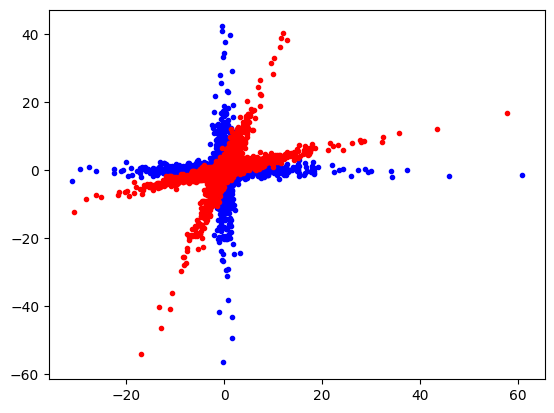
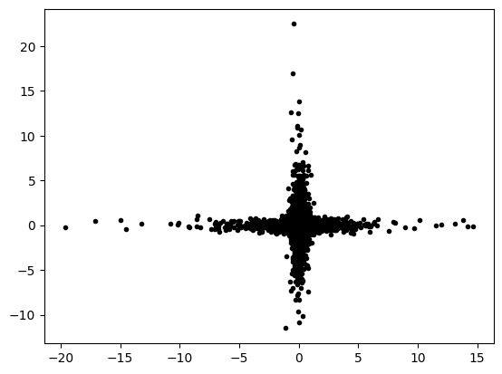
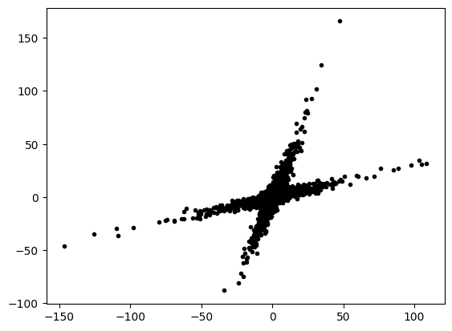

# FastICA
{:.no_toc}

<nav markdown="1" class="toc-class">
* TOC
{:toc}
</nav>

## The goal


Questions to [David Rotermund](mailto:davrot@uni-bremen.de)

## Test data

We rotate the blue dots with ​a non-orthogonal rotation matrix into the red dots.​

```python
import numpy as np
import matplotlib.pyplot as plt

rng = np.random.default_rng(1)

a_x = rng.normal(0.0, 1.0, size=(5000))[:, np.newaxis]
a_y = rng.normal(0.0, 1.0, size=(5000))[:, np.newaxis] ** 3
data_a = np.concatenate((a_x, a_y), axis=1)

b_x = rng.normal(0.0, 1.0, size=(5000))[:, np.newaxis] ** 3
b_y = rng.normal(0.0, 1.0, size=(5000))[:, np.newaxis]
data_b = np.concatenate((b_x, b_y), axis=1)

data = np.concatenate((data_a, data_b), axis=0)

angle_x = -0.3
angle_y = 0.3

roation_matrix = np.array(
    [[np.cos(angle_x), -np.sin(angle_x)], [np.sin(angle_y), np.cos(angle_y)]]
)
data_r = data @ roation_matrix

plt.plot(data[:, 0], data[:, 1], "b.")
plt.plot(data_r[:, 0], data_r[:, 1], "r.")
plt.show()
```



## Train and use [FastICA​](https://scikit-learn.org/stable/modules/generated/sklearn.decomposition.FastICA.html#sklearn.decomposition.FastICA)

```python
class sklearn.decomposition.FastICA(n_components=None, *, algorithm='parallel', whiten='unit-variance', fun='logcosh', fun_args=None, max_iter=200, tol=0.0001, w_init=None, whiten_solver='svd', random_state=None)
```

> FastICA: a fast algorithm for Independent Component Analysis.
> 
> The implementation is based on [1](https://scikit-learn.org/stable/modules/generated/sklearn.decomposition.FastICA.html#r44c805292efc-1).

```python
fit(X, y=None)
```

> Fit the model to X.
>
> **X** : array-like of shape (n_samples, n_features)
> 
> Training data, where n_samples is the number of samples and n_features is the number of features.

```python
transform(X, copy=True)
```

> Recover the sources from X (apply the unmixing matrix).
>
> **X** : array-like of shape (n_samples, n_features)
> 
> Data to transform, where n_samples is the number of samples and n_features is the number of features.

```python
import numpy as np
import matplotlib.pyplot as plt
from sklearn.decomposition import FastICA

rng = np.random.default_rng(1)

a_x = rng.normal(0.0, 1.0, size=(5000))[:, np.newaxis]
a_y = rng.normal(0.0, 1.0, size=(5000))[:, np.newaxis] ** 3
data_a = np.concatenate((a_x, a_y), axis=1)

b_x = rng.normal(0.0, 1.0, size=(5000))[:, np.newaxis] ** 3
b_y = rng.normal(0.0, 1.0, size=(5000))[:, np.newaxis]
data_b = np.concatenate((b_x, b_y), axis=1)

data = np.concatenate((data_a, data_b), axis=0)

angle_x = -0.3
angle_y = 0.3

roation_matrix = np.array(
    [[np.cos(angle_x), -np.sin(angle_x)], [np.sin(angle_y), np.cos(angle_y)]]
)
data_r = data @ roation_matrix

# Train
ica = FastICA(n_components=2)
ica.fit(data_r)

# Use
transformed_data = ica.transform(data_r)

plt.plot(transformed_data[:, 0], transformed_data[:, 1], "k.")
plt.show()
```



## Use FastICA to transform the un-rotated data

```python
inverse_transform(X, copy=True)
```

> Transform the sources back to the mixed data (apply mixing matrix).
> **X** : array-like of shape (n_samples, n_components)
> 
> Sources, where n_samples is the number of samples and n_components is the number of components.


```python
import numpy as np
import matplotlib.pyplot as plt
from sklearn.decomposition import FastICA

rng = np.random.default_rng(1)

a_x = rng.normal(0.0, 1.0, size=(5000))[:, np.newaxis]
a_y = rng.normal(0.0, 1.0, size=(5000))[:, np.newaxis] ** 3
data_a = np.concatenate((a_x, a_y), axis=1)

b_x = rng.normal(0.0, 1.0, size=(5000))[:, np.newaxis] ** 3
b_y = rng.normal(0.0, 1.0, size=(5000))[:, np.newaxis]
data_b = np.concatenate((b_x, b_y), axis=1)

data = np.concatenate((data_a, data_b), axis=0)

angle_x = -0.3
angle_y = 0.3

roation_matrix = np.array(
    [[np.cos(angle_x), -np.sin(angle_x)], [np.sin(angle_y), np.cos(angle_y)]]
)
data_r = data @ roation_matrix

# Train
ica = FastICA(n_components=2)
ica.fit(data_r)

# Use
transformed_data = ica.inverse_transform(data)

plt.plot(transformed_data[:, 0], transformed_data[:, 1], "k.")
plt.show()
```



## Fast ICA Methods

|||
|---|---|
|[fit](https://scikit-learn.org/stable/modules/generated/sklearn.decomposition.FastICA.html#sklearn.decomposition.FastICA.fit)(X[, y])|Fit the model to X.|
|[fit_transform](https://scikit-learn.org/stable/modules/generated/sklearn.decomposition.FastICA.html#sklearn.decomposition.FastICA.fit_transform)(X[, y])|Fit the model and recover the sources from X.|
|[get_feature_names_out](https://scikit-learn.org/stable/modules/generated/sklearn.decomposition.FastICA.html#sklearn.decomposition.FastICA.get_feature_names_out)([input_features])|Get output feature names for transformation.|
|[get_metadata_routing](https://scikit-learn.org/stable/modules/generated/sklearn.decomposition.FastICA.html#sklearn.decomposition.FastICA.get_metadata_routing)()|Get metadata routing of this object.|
|[get_params](https://scikit-learn.org/stable/modules/generated/sklearn.decomposition.FastICA.html#sklearn.decomposition.FastICA.get_params)([deep])|Get parameters for this estimator.|
|[inverse_transform](https://scikit-learn.org/stable/modules/generated/sklearn.decomposition.FastICA.html#sklearn.decomposition.FastICA.inverse_transform)(X[, copy])|Transform the sources back to the mixed data (apply mixing matrix).|
|[set_inverse_transform_request](https://scikit-learn.org/stable/modules/generated/sklearn.decomposition.FastICA.html#sklearn.decomposition.FastICA.set_inverse_transform_request)(*[, copy])|Request metadata passed to the inverse_transform method.|
|[set_output](https://scikit-learn.org/stable/modules/generated/sklearn.decomposition.FastICA.html#sklearn.decomposition.FastICA.set_output)(*[, transform])|Set output container.|
|[set_params](https://scikit-learn.org/stable/modules/generated/sklearn.decomposition.FastICA.html#sklearn.decomposition.FastICA.set_params)(**params)|Set the parameters of this estimator.|
|[set_transform_request](https://scikit-learn.org/stable/modules/generated/sklearn.decomposition.FastICA.html#sklearn.decomposition.FastICA.set_transform_request)(*[, copy])|Request metadata passed to the transform method.|
|[transform](https://scikit-learn.org/stable/modules/generated/sklearn.decomposition.FastICA.html#sklearn.decomposition.FastICA.transform)(X[, copy])|Recover the sources from X (apply the unmixing matrix).|


## Fast ICA Attributes

> **components_** : ndarray of shape (n_components, n_features)
> 
> The linear operator to apply to the data to get the independent sources. This is equal to the unmixing matrix when whiten is False, and equal to np.dot(unmixing_matrix, self.whitening_) when whiten is True.

> **mixing_** : ndarray of shape (n_features, n_components)
>
> The pseudo-inverse of components_. It is the linear operator that maps independent sources to the data.

> **mean_** : ndarray of shape(n_features,)
> 
> The mean over features. Only set if self.whiten is True.

> **n_features_in_** : int
> 
> Number of features seen during fit.

> **feature_names_in_** : ndarray of shape (n_features_in_,)
> 
> Names of features seen during fit. Defined only when X has feature names that are all strings.

> **n_iter_** : int
> 
> If the algorithm is “deflation”, n_iter is the maximum number of iterations run across all components. Else they are just the number of iterations taken to converge.

> **whitening_** : ndarray of shape (n_components, n_features)
> 
> Only set if whiten is ‘True’. This is the pre-whitening matrix that projects data onto the first n_components principal components.
