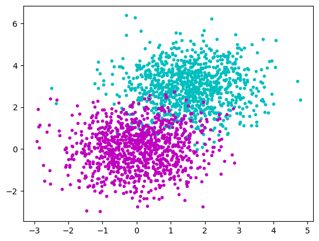
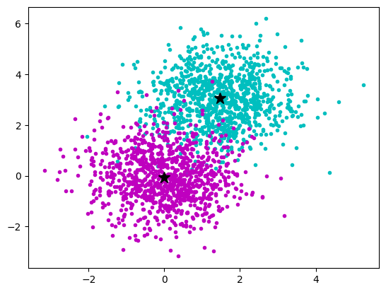
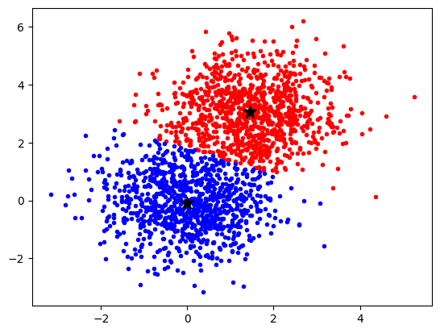
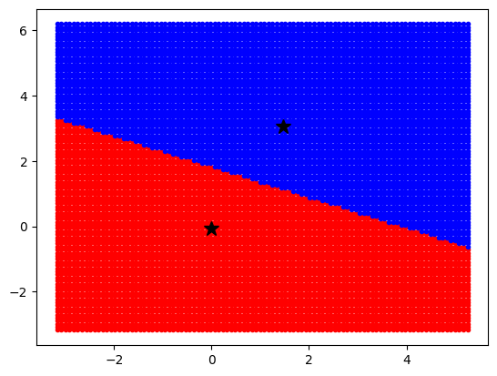

# KMeans
{:.no_toc}

<nav markdown="1" class="toc-class">
* TOC
{:toc}
</nav>

## The goal

KMeans allows to find clusters in a data set. 

Questions to [David Rotermund](mailto:davrot@uni-bremen.de)

## Test data

```python
import numpy as np
import matplotlib.pyplot as plt

rng = np.random.default_rng(1)

rng = np.random.default_rng()

a_x = rng.normal(1.5, 1.0, size=(1000))
a_y = rng.normal(3.0, 1.0, size=(1000))

b_x = rng.normal(0.0, 1.0, size=(1000))
b_y = rng.normal(0.0, 1.0, size=(1000))

plt.plot(a_x, a_y, "c.")
plt.plot(b_x, b_y, "m.")
plt.show()
```


## [sklearn.cluster.KMeans](https://scikit-learn.org/stable/modules/generated/sklearn.cluster.KMeans.html) and its [fit](https://scikit-learn.org/stable/modules/generated/sklearn.cluster.KMeans.html#sklearn.cluster.KMeans.fit)

```python
class sklearn.cluster.KMeans(n_clusters=8, *, init='k-means++', n_init='warn', max_iter=300, tol=0.0001, verbose=0, random_state=None, copy_x=True, algorithm='lloyd')
```

> K-Means clustering.


Attribute:
> **cluster_centers_** : ndarray of shape (n_clusters, n_features)
>    Coordinates of cluster centers. If the algorithm stops before fully converging (see tol and max_iter), these will not be consistent with labels_.

Method: 
```python
fit(X, y=None, sample_weight=None)
```

> Compute k-means clustering
>   **X**: {array-like, sparse matrix} of shape (n_samples, n_features)
>    Training instances to cluster. It must be noted that the data will be converted to C ordering, which will cause a memory copy if the given data is not C-contiguous. If a sparse matrix is passed, a copy will be made if it’s not in CSR format.

```python
import numpy as np
import matplotlib.pyplot as plt
from sklearn.cluster import KMeans

rng = np.random.default_rng(1)

a_x = rng.normal(1.5, 1.0, size=(1000))[:, np.newaxis]
a_y = rng.normal(3.0, 1.0, size=(1000))[:, np.newaxis]
data_a = np.concatenate((a_x, a_y), axis=1)

b_x = rng.normal(0.0, 1.0, size=(1000))[:, np.newaxis]
b_y = rng.normal(0.0, 1.0, size=(1000))[:, np.newaxis]
data_b = np.concatenate((b_x, b_y), axis=1)

data = np.concatenate((data_a, data_b), axis=0)

kmeans = KMeans(n_clusters=2, n_init = 10)
kmeans.fit(data)


plt.plot(a_x, a_y, "c.")
plt.plot(b_x, b_y, "m.")
plt.plot(
    kmeans.cluster_centers_[0, 0], kmeans.cluster_centers_[0, 1], "k*", markersize=12
)
plt.plot(
    kmeans.cluster_centers_[1, 0], kmeans.cluster_centers_[1, 1], "k*", markersize=12
)

plt.show()
```



> **labels_** : ndarray of shape (n_samples,)
>     Labels of each point

## What does the algorithm „think“ where the data points belong?​

```python
import numpy as np
import matplotlib.pyplot as plt
from sklearn.cluster import KMeans

rng = np.random.default_rng(1)

a_x = rng.normal(1.5, 1.0, size=(1000))[:, np.newaxis]
a_y = rng.normal(3.0, 1.0, size=(1000))[:, np.newaxis]
data_a = np.concatenate((a_x, a_y), axis=1)

b_x = rng.normal(0.0, 1.0, size=(1000))[:, np.newaxis]
b_y = rng.normal(0.0, 1.0, size=(1000))[:, np.newaxis]
data_b = np.concatenate((b_x, b_y), axis=1)

data = np.concatenate((data_a, data_b), axis=0)

kmeans = KMeans(n_clusters=2, n_init = 10)
kmeans.fit(data)

labels = kmeans.labels_
idx_0 = np.where(labels == 0)[0]
idx_1 = np.where(labels == 1)[0]

plt.plot(data[idx_0, 0], data[idx_0, 1], "r.")
plt.plot(data[idx_1, 0], data[idx_1, 1], "b.")
plt.plot(
    kmeans.cluster_centers_[0, 0], kmeans.cluster_centers_[0, 1], "k*", markersize=12
)
plt.plot(
    kmeans.cluster_centers_[1, 0], kmeans.cluster_centers_[1, 1], "k*", markersize=12
)

plt.show()
```




## [predict](https://scikit-learn.org/stable/modules/generated/sklearn.cluster.KMeans.html#sklearn.cluster.KMeans.predict)

```python
predict(X, sample_weight='deprecated')
```

> Predict the closest cluster each sample in X belongs to.
> 
> In the vector quantization literature, cluster\_centers\_ is called the code book and each value returned by predict is the index of the closest code in the code book.

```python
import numpy as np
import matplotlib.pyplot as plt
from sklearn.cluster import KMeans

rng = np.random.default_rng(1)

a_x = rng.normal(1.5, 1.0, size=(1000))[:, np.newaxis]
a_y = rng.normal(3.0, 1.0, size=(1000))[:, np.newaxis]
data_a = np.concatenate((a_x, a_y), axis=1)

b_x = rng.normal(0.0, 1.0, size=(1000))[:, np.newaxis]
b_y = rng.normal(0.0, 1.0, size=(1000))[:, np.newaxis]
data_b = np.concatenate((b_x, b_y), axis=1)

data = np.concatenate((data_a, data_b), axis=0)

kmeans = KMeans(n_clusters=2, n_init=10)
kmeans.fit(data)


x = np.linspace(data[:, 0].min(), data[:, 0].max(), 100)
y = np.linspace(data[:, 1].min(), data[:, 1].max(), 100)
xx, yy = np.meshgrid(x, y)

xx_r = xx.ravel()[:, np.newaxis]
yy_r = yy.ravel()[:, np.newaxis]

print(xx.shape)  # -> (100, 100)
print(xx_r.shape)  # -> (10000, 1)
print(yy.shape)  # -> (100, 100)
print(yy_r.shape)  # -> (10000, 1)

coordinates = np.concatenate((xx_r, yy_r), axis=1)
print(coordinates.shape)  # -> (10000, 2)

labels = kmeans.predict(coordinates)
idx_0 = np.where(labels == 0)[0]
idx_1 = np.where(labels == 1)[0]


plt.plot(coordinates[idx_0, 0], coordinates[idx_0, 1], "r.")
plt.plot(coordinates[idx_1, 0], coordinates[idx_1, 1], "b.")
plt.plot(
    kmeans.cluster_centers_[0, 0], kmeans.cluster_centers_[0, 1], "k*", markersize=12
)
plt.plot(
    kmeans.cluster_centers_[1, 0], kmeans.cluster_centers_[1, 1], "k*", markersize=12
)

plt.show()
```



## KMeans methods

|||
|---|---|
|[fit](https://scikit-learn.org/stable/modules/generated/sklearn.cluster.KMeans.html#sklearn.cluster.KMeans.fit)(X[, y, sample_weight])|Compute k-means clustering.|
|[fit_predict](https://scikit-learn.org/stable/modules/generated/sklearn.cluster.KMeans.html#sklearn.cluster.KMeans.fit_predict)(X[, y, sample_weight])|Compute cluster centers and predict cluster index for each sample.|
|[fit_transform](https://scikit-learn.org/stable/modules/generated/sklearn.cluster.KMeans.html#sklearn.cluster.KMeans.fit_transform)(X[, y, sample_weight])|Compute clustering and transform X to cluster-distance space.|
|[get_feature_names_out](https://scikit-learn.org/stable/modules/generated/sklearn.cluster.KMeans.html#sklearn.cluster.KMeans.get_feature_names_out)([input_features])|Get output feature names for transformation.|
|[get_metadata_routing](https://scikit-learn.org/stable/modules/generated/sklearn.cluster.KMeans.html#sklearn.cluster.KMeans.get_metadata_routing)()|Get metadata routing of this object.|
|[get_params](https://scikit-learn.org/stable/modules/generated/sklearn.cluster.KMeans.html#sklearn.cluster.KMeans.get_params)([deep])|Get parameters for this estimator.|
|[predict](https://scikit-learn.org/stable/modules/generated/sklearn.cluster.KMeans.html#sklearn.cluster.KMeans.predict)(X[, sample_weight])|Predict the closest cluster each sample in X belongs to.|
|[score](https://scikit-learn.org/stable/modules/generated/sklearn.cluster.KMeans.html#sklearn.cluster.KMeans.score)(X[, y, sample_weight])|Opposite of the value of X on the K-means objective.|
|[set_fit_request](https://scikit-learn.org/stable/modules/generated/sklearn.cluster.KMeans.html#sklearn.cluster.KMeans.set_fit_request)(*[, sample_weight])|Request metadata passed to the fit method.|
|[set_output](https://scikit-learn.org/stable/modules/generated/sklearn.cluster.KMeans.html#sklearn.cluster.KMeans.set_output)(*[, transform])|Set output container.|
|[set_params](https://scikit-learn.org/stable/modules/generated/sklearn.cluster.KMeans.html#sklearn.cluster.KMeans.set_params)(**params)|Set the parameters of this estimator.|
|[set_predict_request](https://scikit-learn.org/stable/modules/generated/sklearn.cluster.KMeans.html#sklearn.cluster.KMeans.set_predict_request)(*[, sample_weight])|Request metadata passed to the predict method.|
|[set_score_request](https://scikit-learn.org/stable/modules/generated/sklearn.cluster.KMeans.html#sklearn.cluster.KMeans.set_score_request)(*[, sample_weight])|Request metadata passed to the score method.|
|[transform](https://scikit-learn.org/stable/modules/generated/sklearn.cluster.KMeans.html#sklearn.cluster.KMeans.transform)(X)|Transform X to a cluster-distance space.|

## KMeans Attributes

> **cluster_centers_** : ndarray of shape (n_clusters, n_features)
> 
> Coordinates of cluster centers. If the algorithm stops before fully converging (see tol and max_iter), these will not be consistent with labels_.

> **labels_** ndarray of shape (n_samples,)
> 
> Labels of each point

> **inertia_** : float
> 
> Sum of squared distances of samples to their closest cluster center, weighted by the sample weights if provided.

> **n_iter_** : int
> 
> Number of iterations run.

> **n_features_in_** : int
>
> Number of features seen during fit.

> **feature_names_in_** : ndarray of shape (n_features_in_,)
> 
> Names of features seen during fit. Defined only when X has feature names that are all strings.

