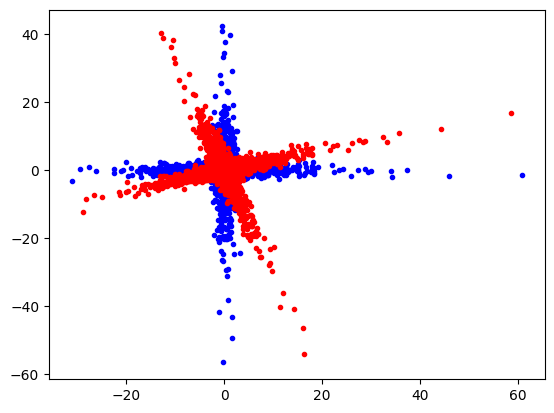
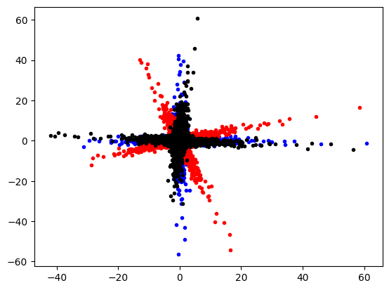

# PCA
{:.no_toc}

<nav markdown="1" class="toc-class">
* TOC
{:toc}
</nav>

## The goal


Questions to [David Rotermund](mailto:davrot@uni-bremen.de)

## Test data

```python
import numpy as np
import matplotlib.pyplot as plt

rng = np.random.default_rng(1)

a_x = rng.normal(0.0, 1.0, size=(5000))[:, np.newaxis]
a_y = rng.normal(0.0, 1.0, size=(5000))[:, np.newaxis] ** 3
data_a = np.concatenate((a_x, a_y), axis=1)

b_x = rng.normal(0.0, 1.0, size=(5000))[:, np.newaxis] ** 3
b_y = rng.normal(0.0, 1.0, size=(5000))[:, np.newaxis]
data_b = np.concatenate((b_x, b_y), axis=1)

data = np.concatenate((data_a, data_b), axis=0)

angle = -0.3

roation_matrix = np.array(
    [[np.cos(angle), -np.sin(angle)], [np.sin(angle), np.cos(angle)]]
)
data_r = data @ roation_matrix

plt.plot(data[:, 0], data[:, 1], "b.")
plt.plot(data_r[:, 0], data_r[:, 1], "r.")
plt.show()
```



## Train and use PCA​ [sklearn.decomposition.PCA](https://scikit-learn.org/stable/modules/generated/sklearn.decomposition.PCA.html#sklearn.decomposition.PCA)

```python
class sklearn.decomposition.PCA(n_components=None, *, copy=True, whiten=False, svd_solver='auto', tol=0.0, iterated_power='auto', n_oversamples=10, power_iteration_normalizer='auto', random_state=None)
```

> Principal component analysis (PCA).
> 
> Linear dimensionality reduction using Singular Value Decomposition of the data to project it to a lower dimensional space. The input data is centered but not scaled for each feature before applying the SVD.
> 
> It uses the LAPACK implementation of the full SVD or a randomized truncated SVD by the method of Halko et al. 2009, depending on the shape of the input data and the number of components to extract.
> 
> It can also use the scipy.sparse.linalg ARPACK implementation of the truncated SVD.
> 
> Notice that this class does not support sparse input. See TruncatedSVD for an alternative with sparse data.

Attributes

> **explained_variance_** : ndarray of shape (n_components,)
> The amount of variance explained by each of the selected components. The variance estimation uses n_samples - 1 degrees of freedom.
> 
> Equal to n_components largest eigenvalues of the covariance matrix of X.

> **singular_values_** : ndarray of shape (n_components,)
> The singular values corresponding to each of the selected components. The singular values are equal to the 2-norms of the n_components variables in the lower-dimensional space.

Methods:

```python
fit(X, y=None)
```

> **X** : array-like of shape (n_samples, n_features)
> 
> Training data, where n_samples is the number of samples and n_features is the number of features.

```python
transform(X)
```

> Apply dimensionality reduction to X.
> 
> X is projected on the first principal components previously extracted from a training set.

> **X** : array-like of shape (n_samples, n_features)
> 
> New data, where n_samples is the number of samples and n_features is the number of features.


We rotate the red cloud back. This creates the black cloud. ​This fits nicely with the original data (blue cloud).

**Be aware that the sign of an ​individual axis can switch!!!​**

```python
import numpy as np
import matplotlib.pyplot as plt
from sklearn.decomposition import PCA

rng = np.random.default_rng(1)

a_x = rng.normal(0.0, 1.0, size=(5000))[:, np.newaxis]
a_y = rng.normal(0.0, 1.0, size=(5000))[:, np.newaxis] ** 3
data_a = np.concatenate((a_x, a_y), axis=1)

b_x = rng.normal(0.0, 1.0, size=(5000))[:, np.newaxis] ** 3
b_y = rng.normal(0.0, 1.0, size=(5000))[:, np.newaxis]
data_b = np.concatenate((b_x, b_y), axis=1)

data = np.concatenate((data_a, data_b), axis=0)

angle = -0.3

roation_matrix = np.array(
    [[np.cos(angle), -np.sin(angle)], [np.sin(angle), np.cos(angle)]]
)
data_r = data @ roation_matrix


pca = PCA(n_components=2)

# Train
pca.fit(data_r)

print(pca.explained_variance_ratio_)  # -> [0.52996112 0.47003888]
print(pca.singular_values_)  # -> [287.55360494 270.80938189]

# Use
transformed_data = pca.transform(data_r)


plt.plot(data[:, 0], data[:, 1], "b.")
plt.plot(data_r[:, 0], data_r[:, 1], "r.")
plt.plot(transformed_data[:, 0], transformed_data[:, 1], "k.")
plt.show()
```


