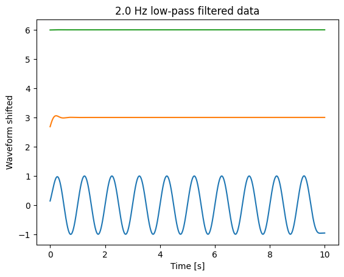

# [scipy.signal](https://docs.scipy.org/doc/scipy/reference/signal.html) -- Butterworth low, high and band-pass
{:.no_toc}

* TOC
{:toc}

## Goal

Sometimes we need to remove of frequency range from a time series. For this we can use a Butterworth filter [scipy.signal.butter](https://docs.scipy.org/doc/scipy/reference/generated/scipy.signal.butter.html) and the [scipy.signal.filtfilt](https://docs.scipy.org/doc/scipy/reference/generated/scipy.signal.filtfilt.html) command. 

Questions to [David Rotermund](mailto:davrot@uni-bremen.de)

| | |
| ------------- |:-------------:|
| [scipy.signal.filtfilt](https://docs.scipy.org/doc/scipy/reference/generated/scipy.signal.filtfilt.html) | Apply a digital filter forward and backward to a signal. |
| [scipy.signal.butter](https://docs.scipy.org/doc/scipy/reference/generated/scipy.signal.butter.html)  | Butterworth digital and analog filter design. |

## Example data 

```python
import numpy as np
import matplotlib.pyplot as plt

samples_per_second: int = 1000
dt: float = 1.0 / samples_per_second

# 10 secs
t: np.ndarray = np.arange(0, int(10 * samples_per_second)) * dt

f_low: float = 1  # Hz
f_mid: float = 10  # Hz
f_high: float = 100  # Hz

sin_low = np.sin(2 * np.pi * t * f_low)
sin_mid = np.sin(2 * np.pi * t * f_mid)
sin_high = np.sin(2 * np.pi * t * f_high)

plt.figure(1)
plt.plot(t, sin_low)
plt.plot(t, sin_mid + 3)
plt.plot(t, sin_high + 6)
plt.xlabel("Time [s]")
plt.ylabel("Waveform shifted")
plt.title("unfiltered data")
plt.show()
```


## Low pass

```python
from scipy import signal

lowpass_frequency: float = 2.0  # Hz

# Nint : The order of the filter.
# Wn : The critical frequency or frequencies. For lowpass and highpass filters, Wn is a scalar; for bandpass and bandstop filters, Wn is a length-2 sequence.
# For a Butterworth filter, this is the point at which the gain drops to 1/sqrt(2) that of the passband (the “-3 dB point”).
# For digital filters, if fs is not specified, Wn units are normalized from 0 to 1, where 1 is the Nyquist frequency (Wn is thus in half cycles / sample and defined as 2*critical frequencies / fs). If fs is specified, Wn is in the same units as fs.
# For analog filters, Wn is an angular frequency (e.g. rad/s).
# btype{‘lowpass’, ‘highpass’, ‘bandpass’, ‘bandstop’}, optional
# fs float, optional : The sampling frequency of the digital system.
b_low, a_low = signal.butter(
    N=4, Wn=lowpass_frequency, btype="lowpass", fs=samples_per_second
)
sin_low_lp = signal.filtfilt(b_low, a_low, sin_low)
sin_mid_lp = signal.filtfilt(b_low, a_low, sin_mid)
sin_high_lp = signal.filtfilt(b_low, a_low, sin_high)

plt.figure(2)
plt.plot(t, sin_low_lp)
plt.plot(t, sin_mid_lp + 3)
plt.plot(t, sin_high_lp + 6)
plt.xlabel("Time [s]")
plt.ylabel("Waveform shifted")
plt.title(f"{lowpass_frequency} Hz low-pass filtered data")
plt.show()
```


## High pass

```python
from scipy import signal

highpass_frequency: float = 20.0  # Hz

b_high, a_high = signal.butter(
    N=4, Wn=highpass_frequency, btype="highpass", fs=samples_per_second
)
sin_low_hp = signal.filtfilt(b_high, a_high, sin_low)
sin_mid_hp = signal.filtfilt(b_high, a_high, sin_mid)
sin_high_hp = signal.filtfilt(b_high, a_high, sin_high)

plt.figure(3)
plt.plot(t, sin_low_hp)
plt.plot(t, sin_mid_hp + 3)
plt.plot(t, sin_high_hp + 6)
plt.xlabel("Time [s]")
plt.ylabel("Waveform shifted")
plt.title(f"{highpass_frequency} Hz high-pass filtered data")
plt.show()
```


## Band pass

```python
from scipy import signal

lowpass_frequency: float = 2.0  # Hz
highpass_frequency: float = 20.0  # Hz

b_band, a_band = signal.butter(
    N=4,
    Wn=(lowpass_frequency, highpass_frequency),
    btype="bandpass",
    fs=samples_per_second,
)
sin_low_bp = signal.filtfilt(b_band, a_band, sin_low)
sin_mid_bp = signal.filtfilt(b_band, a_band, sin_mid)
sin_high_bp = signal.filtfilt(b_band, a_band, sin_high)

plt.figure(4)
plt.plot(t, sin_low_bp)
plt.plot(t, sin_mid_bp + 3)
plt.plot(t, sin_high_bp + 6)
plt.xlabel("Time [s]")
plt.ylabel("Waveform shifted")
plt.title(f"({lowpass_frequency} Hz, {highpass_frequency} Hz) band-pass filtered data")
plt.show()
```

