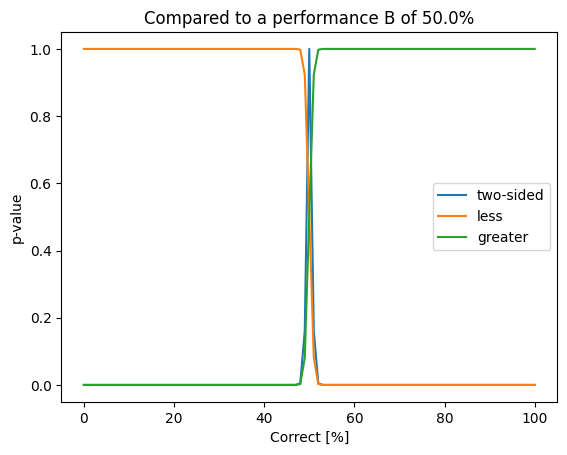
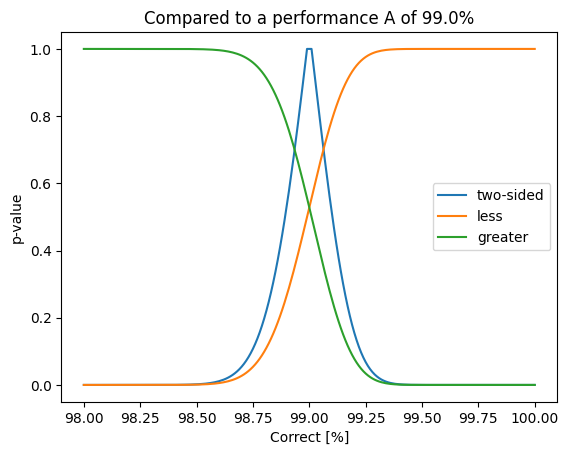

# Fisher Exact Test
{:.no_toc}

<nav markdown="1" class="toc-class">
* TOC
{:toc}
</nav>

## Top


Questions to [David Rotermund](mailto:davrot@uni-bremen.de)


## [scipy.stats.fisher_exact](https://docs.scipy.org/doc/scipy/reference/generated/scipy.stats.fisher_exact.html)

```python
scipy.stats.fisher_exact(table, alternative='two-sided')
```

> Perform a Fisher exact test on a 2x2 contingency table.
> 
> The null hypothesis is that the true odds ratio of the populations underlying the observations is one, and the observations were sampled from these populations under a condition: the marginals of the resulting table must equal those of the observed table. The statistic returned is the unconditional maximum likelihood estimate of the odds ratio, and the p-value is the probability under the null hypothesis of obtaining a table at least as extreme as the one that was actually observed. There are other possible choices of statistic and two-sided p-value definition associated with Fisher’s exact test; please see the Notes for more information.

> Parameters:
>
> **alternative** : {‘two-sided’, ‘less’, ‘greater’}, optional
> Defines the alternative hypothesis. The following options are available (default is ‘two-sided’):
> 
> * ‘two-sided’: the odds ratio of the underlying population is not one (The two-sided p-value is the probability that, under the null hypothesis, a random table would have a probability equal to or less than the probability of the input table.)
> * ‘less’: the odds ratio of the underlying population is less than one 
> * ‘greater’: the odds ratio of the underlying population is greater than one

> Returns:
> 
> **res** : SignificanceResult
> 
> An object containing attributes:
> 
> **statistic** : float
> 
> This is the prior odds ratio, not a posterior estimate.
> 
> **pvalue** : float
> 
> The probability under the null hypothesis of obtaining a table at least as extreme as the one that was actually observed.

The input table is [[a, b], [c, d]]. 

|||
|---|---|
|a| b |
|c|d|

Where $N_A = a + c$ for the elements in group A (performance values of network A with $N_A$ as number of test pattern) and $N_B = b + d$ for the elements in group B (performance values of network B with $N_B$ as number of test pattern). 

|||
|---|---|
|$N_A - c$| $N_B-d$ |
|c|d|


If network architectures are tested, typically, the same data set is used in both conditions and such $N = N_A = N_B$. 

|||
|---|---|
|$N - c$| $N - d$ |
|c|d|


## [Example](https://docs.scipy.org/doc/scipy/reference/generated/scipy.stats.fisher_exact.html)

||Group A|Group B|
|---|---|---|
|Yes| 7 | 17 |
|No| 15| 5|

This translates in to the table: [[7, 17], [15, 5]]

```python
from scipy.stats import fisher_exact

res = fisher_exact([[7, 17], [15, 5]], alternative="less")
print(res.statistic) # -> 0.13725490196078433
print(res.pvalue) # -> 0.0028841933752349743
```

## Network performance analysis



```python
from scipy.stats import fisher_exact
import numpy as np
import matplotlib.pyplot as plt

N: int = 10000
correct_a: int = N // 2

values = np.arange(0, N + 1, 100)
results_less = np.zeros((values.shape[0]))
results_greater = np.zeros((values.shape[0]))
results_two_sided = np.zeros((values.shape[0]))


for i in range(0, values.shape[0]):
    correct_b: int = int(values[i])
    res = fisher_exact(
        [[N - correct_a, N - correct_b], [correct_a, correct_b]], alternative="less"
    )
    results_less[i] = res.pvalue

for i in range(0, values.shape[0]):
    correct_b = int(values[i])
    res = fisher_exact(
        [[N - correct_a, N - correct_b], [correct_a, correct_b]], alternative="greater"
    )
    results_greater[i] = res.pvalue

for i in range(0, values.shape[0]):
    correct_b = int(values[i])
    res = fisher_exact(
        [[N - correct_a, N - correct_b], [correct_a, correct_b]],
        alternative="two-sided",
    )
    results_two_sided[i] = res.pvalue


plt.plot(100.0 * values / N, results_two_sided, label="two-sided")
plt.plot(100.0 * values / N, results_less, label="less")
plt.plot(100.0 * values / N, results_greater, label="greater")

plt.title(f"Compared to a performance A of {100.0 * correct_a /N}%")
plt.ylabel("p-value")
plt.xlabel("Correct [%]")
plt.legend()
plt.show()
```



```python
from scipy.stats import fisher_exact
import numpy as np
import matplotlib.pyplot as plt

N: int = 10000
correct_a: int = int(N * 0.99)

values = np.arange(int(N * 0.98), N + 1)
results_less = np.zeros((values.shape[0]))
results_greater = np.zeros((values.shape[0]))
results_two_sided = np.zeros((values.shape[0]))


for i in range(0, values.shape[0]):
    correct_b: int = int(values[i])
    res = fisher_exact(
        [[N - correct_a, N - correct_b], [correct_a, correct_b]], alternative="less"
    )
    results_less[i] = res.pvalue

for i in range(0, values.shape[0]):
    correct_b = int(values[i])
    res = fisher_exact(
        [[N - correct_a, N - correct_b], [correct_a, correct_b]], alternative="greater"
    )
    results_greater[i] = res.pvalue

for i in range(0, values.shape[0]):
    correct_b = int(values[i])
    res = fisher_exact(
        [[N - correct_a, N - correct_b], [correct_a, correct_b]],
        alternative="two-sided",
    )
    results_two_sided[i] = res.pvalue


plt.plot(100.0 * values / N, results_two_sided, label="two-sided")
plt.plot(100.0 * values / N, results_less, label="less")
plt.plot(100.0 * values / N, results_greater, label="greater")

plt.title(f"Compared to a performance A of {100.0 * correct_a /N}%")
plt.ylabel("p-value")
plt.xlabel("Correct [%]")
plt.legend()
plt.show()
```
