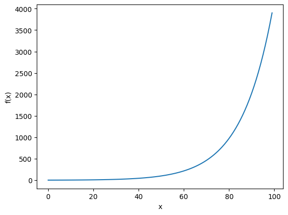

# Symbolic Computation
{:.no_toc}

<nav markdown="1" class="toc-class">
* TOC
{:toc}
</nav>

## Top

Questions to [David Rotermund](mailto:davrot@uni-bremen.de)

```shell
pip install sympy
```

### Overview tutorials

||
|---|
|[Basic Operations](https://docs.sympy.org/latest/tutorials/intro-tutorial/basic_operations.html)|
|[Printing](https://docs.sympy.org/latest/tutorials/intro-tutorial/printing.html)|
|[Simplification](https://docs.sympy.org/latest/tutorials/intro-tutorial/simplification.html)|
|[Calculus](https://docs.sympy.org/latest/tutorials/intro-tutorial/calculus.html) |
|[Solvers](https://docs.sympy.org/latest/tutorials/intro-tutorial/solvers.html)|
|[Matrices](https://docs.sympy.org/latest/tutorials/intro-tutorial/matrices.html)|

### [API Reference](https://docs.sympy.org/latest/reference/index.html)

|||
|---|---|
|[Basics](https://docs.sympy.org/latest/reference/public/basics/index.html#basic-modules)|Contains a description of operations for the basic modules. Subcategories include: absolute basics, manipulation, assumptions, functions, simplification, calculus, solvers, and some other subcategories.|
|[Code Generation](https://docs.sympy.org/latest/reference/public/codegeneration/index.html#codegen-module)|Contains a description of methods for the generation of compilable and executable code.|
|[Logic](https://docs.sympy.org/latest/reference/public/logic/index.html#logic)|Contains method details for the logic and sets modules.|
|[Matrices](https://docs.sympy.org/latest/reference/public/matrices/index.html#matrices-modules)|Discusses methods for the matrices, tensor and vector modules.|
|[Number Theory](https://docs.sympy.org/latest/reference/public/numbertheory/index.html#numtheory-module)|Documents methods for the Number theory module.|
|[Physics](https://docs.sympy.org/latest/reference/public/physics/index.html#physics-docs)|Contains documentation for Physics methods.|
|[Utilities](https://docs.sympy.org/latest/reference/public/utilities/index.html#utilities)|Contains docstrings for methods of several utility modules. Subcategories include: Interactive, Parsing, Printing, Testing, Utilities.|
|[Topics](https://docs.sympy.org/latest/reference/public/topics/index.html#topics)|Contains method docstrings for several modules. Subcategories include : Plotting, Polynomials, Geometry, Category Theory, Cryptography, Differential, Holonomic, Lie Algebra, and Stats.|


### [Basics](https://docs.sympy.org/latest/reference/public/basics/index.html#basic-modules)

||
|---|
|[Assumptions](https://docs.sympy.org/latest/modules/assumptions/index.html)|
|[Calculus](https://docs.sympy.org/latest/modules/calculus/index.html)|
|[Combinatorics](https://docs.sympy.org/latest/modules/combinatorics/index.html)|
|[Functions](https://docs.sympy.org/latest/modules/functions/index.html)|
|[Integrals](https://docs.sympy.org/latest/modules/integrals/index.html)|
|[Series](https://docs.sympy.org/latest/modules/series/index.html)|
|[Simplify](https://docs.sympy.org/latest/modules/simplify/index.html)|
|[Solvers](https://docs.sympy.org/latest/modules/solvers/index.html)|
|[abc](https://docs.sympy.org/latest/modules/abc.html)|
|[Algebras](https://docs.sympy.org/latest/modules/algebras.html)|
|[Concrete](https://docs.sympy.org/latest/modules/concrete.html)|
|[Core](https://docs.sympy.org/latest/modules/core.html)|
|[Discrete](https://docs.sympy.org/latest/modules/discrete.html)|
|[Numerical Evaluation](https://docs.sympy.org/latest/modules/evalf.html)|
|[Numeric Computation](https://docs.sympy.org/latest/modules/numeric-computation.html)|
|[Term Rewriting](https://docs.sympy.org/latest/modules/rewriting.html)|


## [Some examples](https://docs.sympy.org/latest/tutorials/intro-tutorial/intro.html#a-more-interesting-example)

## [Substitution](https://docs.sympy.org/latest/tutorials/intro-tutorial/basic_operations.html#substitution)
```python
import sympy

x, y = sympy.symbols("x y")

expr = sympy.cos(x) + 1
z = expr.subs(x, y**2)
print(z) # -> cos(y**2) + 1
```

### [Derivatives](https://docs.sympy.org/latest/tutorials/intro-tutorial/calculus.html#derivatives)

```python
import sympy

x, y = sympy.symbols("x y")

y = sympy.diff(sympy.sin(x) * sympy.exp(x), x)
print(y) # -> exp(x)*sin(x) + exp(x)*cos(x)
```

### [Integrals](https://docs.sympy.org/latest/tutorials/intro-tutorial/calculus.html#integrals)

```python
import sympy

x, y = sympy.symbols("x y")

y = sympy.integrate(sympy.cos(x), x)
print(y)  # -> sin(x)
```


### [(Taylor) Series Expansion](https://docs.sympy.org/latest/tutorials/intro-tutorial/calculus.html#series-expansion)

```python
import sympy

x, y, z = sympy.symbols("x y z")
y = sympy.cos(x)
z = y.series(x, 0, 8) # around x = 0 , up order 7

print(z)  # -> 1 - x**2/2 + x**4/24 - x**6/720 + O(x**8)
```

### [simplify](https://docs.sympy.org/latest/tutorials/intro-tutorial/simplification.html#simplify)

```python
import sympy

x, y, z = sympy.symbols("x y z")
y = sympy.simplify(sympy.sin(x) ** 2 + sympy.cos(x) ** 2)

print(y)  # -> 1
```

### [Solving Equations Algebraically](https://docs.sympy.org/latest/tutorials/intro-tutorial/solvers.html)

```python
solveset(equation, variable=None, domain=S.Complexes)
```

> Recall from the [gotchas section](https://docs.sympy.org/latest/tutorials/intro-tutorial/gotchas.html#tutorial-gotchas-equals) of this tutorial that symbolic equations in SymPy are not represented by = or ==, but by Eq.

```python
import sympy

x, y, z = sympy.symbols("x y z")

z = sympy.Eq(x, y)
```

Output:

$$x=y$$


```python
import sympy

x, y, z = sympy.symbols("x y z")

y = sympy.Eq(x**2 - x, 0)
z = sympy.solveset(y, x)
print(z) # -> {0, 1}
```

### [Solving Differential Equations](https://docs.sympy.org/latest/tutorials/intro-tutorial/solvers.html#solving-differential-equations)

```python
import sympy

# Undefined functions
f = sympy.symbols("f", cls=sympy.Function)

x = sympy.symbols("x")


diffeq = sympy.Eq(f(x).diff(x, x) - 2 * f(x).diff(x) + f(x), sympy.sin(x))

print(diffeq)  # -> Eq(f(x) - 2*Derivative(f(x), x) + Derivative(f(x), (x, 2)), sin(x))

result = sympy.dsolve(diffeq, f(x))
print(result)  # -> Eq(f(x), (C1 + C2*x)*exp(x) + cos(x)/2)
```

## [Numerical Evaluation](https://docs.sympy.org/latest/modules/evalf.html)

```python
import sympy

x, y = sympy.symbols("x y")

expr = sympy.cos(x) + 1
print(expr)  # -> cos(x) + 1
expr = expr.subs(x, 0.333 * sympy.pi)
print(expr)  # -> cos(0.333*pi) + 1
print(sympy.N(expr)) # -> 1.50090662536071
```

## Plot your function


```python
import sympy
import inspect
import numpy as np
import matplotlib.pyplot as plt

f = sympy.symbols("f", cls=sympy.Function)
x = sympy.symbols("x")
diffeq = sympy.Eq(f(x).diff(x, x) - 2 * f(x).diff(x) + f(x), sympy.sin(x))
result = sympy.dsolve(diffeq, f(x))

symbols = list(result.rhs.free_symbols)

f = sympy.lambdify(symbols, result.rhs, "numpy")


print("The arguments of the result:")
print(inspect.getfullargspec(f).args)
print("The source code behind f:")
print(inspect.getsource(f))

np_x = np.linspace(0, 2 * np.pi, 100)

plt.plot(f(x=np_x, C1=1.0, C2=1.0))
plt.xlabel("x")
plt.ylabel("f(x)")
plt.show()
```




## Assumptions about the symbols

```python
C1 = sympy.symbols('C1', positive=True)
```

|||
|---|---|
|real=True| The symbol represents a real number.|
|positive=True| The symbol represents a positive number.|
|negative=True| The symbol represents a negative number.|
|integer=True| The symbol represents an integer.|
|prime=True| The symbol represents a prime number.|
|odd=True| The symbol represents an odd number.|
|even=True| The symbol represents an even number.|


