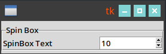

# tk
{:.no_toc}

<nav markdown="1" class="toc-class">
* TOC
{:toc}
</nav>

## Top

Questions to [David Rotermund](mailto:davrot@uni-bremen.de)

{: .topic-optional}
This is an optional topic!


```python
```


```shell
```

### ttk.Spinbox



```python
# %%
import tkinter as tk
from tkinter import ttk

root = tk.Tk()

number_of_patches: int = 10
width_label: int = 20
width_element: int = 10

row_id: int = 0
column_id: int = 0

frame = ttk.LabelFrame(root, text="Spin Box")
frame.grid(row=row_id, column=column_id, sticky="nw", pady=5)

label_number_of_patches = ttk.Label(frame, text="SpinBox Text", width=width_label)
label_number_of_patches.grid(row=0, column=0, sticky="w")

spinbox_number_of_patches = ttk.Spinbox(
    frame,
    values=list(f"{x:d}" for x in range(1, 301)),
    width=width_element,
)
spinbox_number_of_patches.grid(row=0, column=1, sticky="w")
spinbox_number_of_patches.set(number_of_patches)

root.mainloop()

del root
```

## [tk.Canvas](https://tkinter-docs.readthedocs.io/en/latest/widgets/canvas.html)

```python
class Canvas(master=None, cnf={}, **kw)
```

Widget options:

|||
|---|---|
|background=|Specifies the normal background colour to use when displaying the widget. The given value may be any valid Tk colour. The default value is the platform default background colour.|
|borderwidth=|Specifies a non-negative value indicating the width of the 3-D border to draw around the outside of the widget (if such a border is being drawn; the relief option typically determines this). The value may also be used when drawing 3-D effects in the interior of the widget. The value may be any valid Tk length. The default value is 0.|
|closeenough=|Specifies a floating-point value indicating how close the mouse cursor must be to an item before it is considered to be “inside” the item. Defaults to 1.0.|
|confine=|Specifies a boolean value that indicates whether or not it should be allowable to set the canvas’s view outside the region defined by the scrollRegion argument. If the value is True, the view will be constrained within the scroll region. The default value is True.|
|cursor=|Specifies the mouse cursor to be used for the widget. The value may be any valid Tk cursor. If an empty string is given, the widget should defer to its parent for cursor specification. The default value is to defer.|
|height=|Specifies a desired height that the canvas widget should request from its geometry manager. The value may be in any of the forms described in the coordinates section below. The default value is “7c”.|
|highlightbackground=|Specifies the colour to use as a border highlight when the widget does not have focus. The given value may be any valid Tk colour. The default value is the platform default background colour.|
|highlightcolor=|Specifies the colour to use as a border highlight when the widget has focus. The given value may be any valid Tk colour.|
|highlightthickness=|Specifies a non-negative value indicating the width of the highlight rectangle to draw around the outside of the widget when it has focus. The value may be any valid Tk length. If the value is zero, no focus highlight is drawn around the widget.|
|insertbackground=|Specifies the colour to use as background in the area covered by the insertion cursor. The given value may be any valid Tk colour. This colour will normally override either the normal background for the widget (or the selection background if the insertion cursor happens to fall in the selection).|
|insertborderwidth=|Specifies a non-negative value indicating the width of the 3-D border to draw around the insertion cursor. The value may be any valid Tk length. The default value is 0.|
|insertontime=|Specifies a non-negative integer value indicating the number of milliseconds the insertion cursor should remain “off” in each blink cycle. If this option is zero then the cursor does not blink: it is on all the time. The default value is 300.|
|insertontime=|Specifies a non-negative integer value indicating the number of milliseconds the insertion cursor should remain “on” in each blink cycle. The default value is 600.|
|insertwidth=|Specifies a value indicating the total width of the insertion cursor. The value may be any valid Tk length. If a border has been specified for the insertion cursor (using the insertborderwidth option), the border will be drawn inside the width specified by the insertwidth option. The default value is 2.|
|relief=|Specifies the 3-D effect desired for the widget. The value may be any valid Tk relief. The value indicates how the interior of the widget should appear relative to its exterior; for example, raised means the interior of the widget should appear to protrude from the screen, relative to the exterior of the widget. The default value is “flat”.|
|scrollregion=|Specifies a list with four coordinates describing the left, top, right and bottom coordinates of a rectangular region. This region is used for scrolling purposes and is considered to be the boundary of the information in the canvas. Each of the coordinates may be in any of the forms described in the coordinates section below. An empty string will make the scrollregion match the width and height of the canvas. The default value is an empty string.|
|selectbackground=|Specifies the background colour to use when displaying selected items. The given value may be any valid Tk colour.|
|selectborderwidth=|Specifies a non-negative value indicating the width of the 3-D border to draw around selected items. The value may be any valid Tk length. The default value is 0.|
|selectforeground=|Specifies the foreground colour to use when displaying selected items. The given value may be any valid Tk colour.|
|state=|Modifies the default state of the canvas where state may be set to one of: normal, disabled, or hidden. Individual canvas objects all have their own state option which may override the default state. Many options can take separate specifications such that the appearance of the item can be different in different situations. The options that start with “active” control the appearance when the mouse pointer is over it, while the options starting with “disabled” control the appearance when the state is disabled. Canvas items which are disabled will not react to canvas bindings. The default value is normal.|
|takefocus=|Determines whether the window accepts the focus during keyboard traversal (e.g., Tab and Shift-Tab). Before setting the focus to a window, the traversal scripts consult the value of the takefocus option. A value of False means that the window should be skipped entirely during keyboard traversal. True means that the window should receive the input focus as long as it is viewable (it and all of its ancestors are mapped). An empty string for the option means that the traversal scripts make the decision about whether or not to focus on the window: the current algorithm is to skip the window if it is disabled, if it has no key bindings, or if it is not viewable.|
|width=|Specifies a desired width that the canvas widget should request from its geometry manager. The value may be in any of the forms described in the coordinates section below. The default value is “10c”.|
|xscrollcommand=|Specifies the command used to communicate with horizontal scrollbars. When the view in the widget’s window changes (or whenever anything else occurs that could change the display in a scrollbar, such as a change in the total size of the widget’s contents), the widget will call the function with two numbers as arguments.|
|xscrollincrement=|Specifies an increment for horizontal scrolling, in the form of any valid Tk length. If the value of this option is greater than zero, the horizontal view in the window will be constrained so that the canvas x coordinate at the left edge of the window is always an even multiple of xscrollincrement; furthermore, the units for scrolling (e.g., the change in view when the left and right arrows of a scrollbar are selected) will also be xscrollincrement. If the value of this option is less than or equal to zero, then horizontal scrolling is unconstrained. The default value is 0.|
|yscrollcommand=|Specifies the prefix for a command used to communicate with vertical scrollbars. This option is treated in the same way as the xscrollcommand option, except that it is used for vertical scrollbars and is provided by widgets that support vertical scrolling. See the description of xscrollcommand for details on how this option is used. The default value is to call no function.|
|yscrollincrement=|Specifies an increment for vertical scrolling, in the form of any valid Tk length. If the value of this option is greater than zero, the vertical view in the window will be constrained so that the canvas y coordinate at the top edge of the window is always an even multiple of yscrollincrement; furthermore, the units for scrolling (e.g., the change in view when the top and bottom arrows of a scrollbar are selected) will also be yscrollincrement. If the value of this option is less than or equal to zero, then vertical scrolling is unconstrained. The default value is 0.|


```python
import tkinter as tk

from PIL import Image, ImageTk
import os


class GUILogoGUI:
    logo: tk.Canvas
    logo_image: int
    my_tk_root: tk.Tk

    pic_path: str = os.path.join("gui", "logo")

    def __init__(self, tk_root: tk.Tk):
        self.my_tk_root = tk_root

        logo_filename: str = os.path.join(self.pic_path, "ISee2.png")
        pil_image = Image.open(logo_filename)
        self.pil_imagetk = ImageTk.PhotoImage(pil_image)
        canvas_width: int = pil_image.width
        canvas_height: int = pil_image.height

        self.logo = tk.Canvas(self.my_tk_root, width=canvas_width, height=canvas_height)
        self.logo.pack()

        self.logo_image = self.logo.create_image(
            0,
            0,
            anchor=tk.NW,
            image=self.pil_imagetk,
        )
```


        
