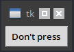
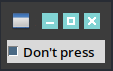
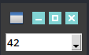
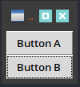
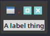
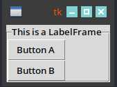
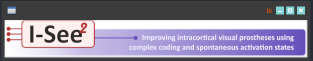

# tk/ttk
{:.no_toc}

<nav markdown="1" class="toc-class">
* TOC
{:toc}
</nav>

## Top

Questions to [David Rotermund](mailto:davrot@uni-bremen.de)

{: .topic-optional}
This is an optional topic!


```python
```


```shell
```

## [Control variables](https://anzeljg.github.io/rin2/book2/2405/docs/tkinter/control-variables.html)

```python
v = tk.BooleanVar()     # Holds a boolean
v = tk.DoubleVar()   # Holds a float; default value 0.0
v = tk.IntVar()      # Holds an int; default value 0
v = tk.StringVar()   # Holds a string; default value ''
```

> All control variables have these two methods:

|Method|Description|
|---|---|
|.get()|Returns the current value of the variable.|
|.set(value)|Changes the current value of the variable. If any widget options are slaved to this variable, those widgets will be updated when the main loop next idles|


## [ttk.Button](https://anzeljg.github.io/rin2/book2/2405/docs/tkinter/ttk-Button.html)

```python
w = ttk.Button(parent, option=value, ...)
```

|Option|Description|
|---|---|
|command|	A function to be called when the button is pressed.|
|compound|If you provide both image and text options, the compound option specifies the position of the image relative to the text. The value may be tk.TOP (image above text), tk.BOTTOM (image below text), tk.LEFT (image to the left of the text), or tk.RIGHT (image to the right of the text). When you provide both image and text options but don't specify a compound option, the image will appear and the text will not.|
|cursor|	The cursor that will appear when the mouse is over the button; see Section 5.8, “Cursors”.|
|image|	An image to appear on the button; see Section 5.9, “Images”.|
|style|	The style to be used in rendering this button; see Section 49, “Using and customizing ttk styles”.|
|takefocus|	By default, a ttk.Button will be included in focus traversal; see Section 53, “Focus: routing keyboard input”. To remove the widget from focus traversal, use takefocus=False.|
|text|	The text to appear on the button, as a string.|
|textvariable|	A variable that controls the text that appears on the button; see Section 52, “Control variables: the values behind the widgets”.|
|underline|	If this option has a nonnegative value n, an underline will appear under the character at position n.|
|width|	If the label is text, this option specifies the absolute width of the text area on the button, as a number of characters; the actual width is that number multiplied by the average width of a character in the current font. For image labels, this option is ignored. The option may also be configured in a style.|





```python
import tkinter as tk
from tkinter import ttk


def changed() -> None:
    print("Changed")


root = tk.Tk()

width_element: int = 10


my_object = ttk.Button(
    root,
    text="Don't press",
    width=width_element,
    command=changed,
)
my_object.grid(row=0, column=0, sticky="w")


root.mainloop()

del root
```


## [ttk.Checkbutton](https://anzeljg.github.io/rin2/book2/2405/docs/tkinter/ttk-Checkbutton.html)

```python
w = ttk.Checkbutton(parent, option=value, ...)
```

|Option|Description|
|---|---|
|command|	A function to be called whenever the state of this checkbutton changes.|
|compound|	This option specifies the relative position of the image relative to the text when you specify both. The value may be tk.TOP (image above text), tk.BOTTOM (image below text), tk.LEFT (image to the left of the text), or tk.RIGHT (image to the right of the text). If you provide both image and text options but do not specify a value for compound, only the image will appear.|
|cursor|	The cursor that will appear when the mouse is over the checkbutton|
|image|	An image to appear on the checkbutton|
|offvalue|	By default, when a checkbutton is in the off (unchecked) state, the value of the associated variable is 0. You can use the offvalue option to specify a different value for the off state.|
|onvalue|	By default, when a checkbutton is in the on (checked) state, the value of the associated variable is 1. You can use the onvalue option to specify a different value for the on state.|
|style|	The style to be used in rendering this checkbutton|
|takefocus|	By default, a ttk.Checkbutton will be included in focus traversal. To remove the widget from focus traversal, use takefocus=False.|
|text|	The text to appear on the checkbutton, as a string.|
|textvariable|	A variable that controls the text that appears on the checkbutton|
|underline|	If this option has a nonnegative value n, an underline will appear under the text character at position n.|
|variable|	A control variable that tracks the current state of the checkbutton|
|width	|Use this option to specify a fixed width or a minimum width. The value is specified in characters; a positive value sets a fixed width of that many average characters, while a negative width sets a minimum width.|




```python
import tkinter as tk
from tkinter import ttk


def changed() -> None:
    global variable
    print(f"Changed: Now it is set to {variable.get()}")


root = tk.Tk()

width_element: int = 10
InitialValue: bool = True

variable = tk.BooleanVar()
variable.set(InitialValue)

my_object = ttk.Checkbutton(
    root, text="Don't press", width=width_element, command=changed, variable=variable
)
my_object.grid(row=0, column=0, sticky="w")


root.mainloop()

del root
```

## [ttk.Combobox](https://anzeljg.github.io/rin2/book2/2405/docs/tkinter/ttk-Combobox.html)

```python
w = ttk.Combobox(parent, option=value, ...)
```

|Option|Description|
|---|---|
|cursor|	The cursor that will appear when the mouse is over the checkbutton|
|exportselection|	By default, if you select text within an Entry widget, it is automatically exported to the clipboard. To avoid this exportation, use exportselection=0.|
|height|	Use this option to specify a maximum number of rows that will appear in the drop-down menu; the default is 20. If there are more values than this number, the drop-down menu will automatically include a vertical scrollbar.|
|justify|	This option specifies how the text will be positioned within the entry area when it does not completely fill the area. Values may be tk.LEFT to left-justify; tk.CENTER to center; or tk.RIGHT to right-justify.|
|postcommand|	You may use this option to supply a callback function that will be invoked when the user clicks on the down-arrow. This callback may change the values option; if so, the changes will appear in the drop-down menu.|
|style|	The style to be used in rendering this checkbutton|
|takefocus|	By default, a ttk.Checkbutton will be included in focus traversal To remove the widget from focus traversal, use takefocus=False.|
|textvariable|	A variable that controls the text that appears in the entry area|
|validate|	You may use this option to request dynamic validation of the widget's text content. |
|validatecommand|	You may use this option to specify a callback function that dynamically validates the widget's text content. |
|values|	The choices that will appear in the drop-down menu, as a sequence of strings.|
|width|	This option specifies the width of the entry area as a number of characters. The actual width will be this number times the average width of a character in the effective font. The default value is 20.|
|xscrollcommand|	If the widget has an associated horizontal scrollbar, set this option to the .set method of that scrollbar.|




```python
import tkinter as tk
from tkinter import ttk


def command() -> bool:
    global variable
    print(f"Command {variable.get()}")
    return True


root = tk.Tk()

width_element: int = 10
height_element: int = 100

values = list(f"{x:d}" for x in range(1, 301))

InitialValueID: int = 41
variable = tk.StringVar()


my_object = ttk.Combobox(
    root,
    width=width_element,
    height=height_element,
    values=values,
    textvariable=variable,
    validate="all",
    validatecommand=command,
)
my_object.current(InitialValueID)
my_object.grid(row=0, column=0, sticky="w")


root.mainloop()

print(f"Selection: {variable.get()}")

del root
```

## [ttk.Entry](https://anzeljg.github.io/rin2/book2/2405/docs/tkinter/ttk-Entry.html)

## [ttk.Frame](https://anzeljg.github.io/rin2/book2/2405/docs/tkinter/ttk-Frame.html)

```python
w = ttk.Frame(parent, option=value, ...)
```

|Option|Description|
|---|---|
|borderwidth|	Use this option to specify the width of the border element; the default is zero.|
|cursor| Use this option to specify the appearance of the mouse cursor when it is over the widget|
|height| This option is a dimension that sets the height of the frame. If you want to force the frame to have a specific height, call the .grid_propagate(0) on the widget|
|padding| To create an empty area inside the frame and outside of the contained widgets, set this option to the desired dimension. For example, padding='0.5i' would clear a half-inch-wide area inside the frame and around the outside of the widgets inside it.|
|relief| Specifies the relief style for the border; see Section 5.6, “Relief styles”. This has no effect unless you also increase the borderwidth.|
|style| Use this option to specify a custom widget style name; see Section 47, “Customizing and creating ttk themes and styles”.|
|takefocus |Use this option to specify whether a widget is visited during focus traversal|
|width| This option is a dimension that sets the width of the frame. If you want to force the frame to have a specific width, call the .grid_propagate(0) on the widget|



```python
import tkinter as tk
from tkinter import ttk

root = tk.Tk()

width_element: int = 10
height_element: int = 100


my_frame = ttk.Frame(
    root,
    width=width_element,
    height=height_element,
)
my_frame.grid(row=0, column=0, sticky="w")

my_object_1 = ttk.Button(my_frame, text="Button A")
my_object_1.grid(row=0, column=0, sticky="w")
my_object_2 = ttk.Button(my_frame, text="Button B")
my_object_2.grid(row=1, column=0, sticky="w")

root.mainloop()
del root
```

## [ttk.Label](https://anzeljg.github.io/rin2/book2/2405/docs/tkinter/ttk-Label.html)

```python
w = ttk.Label(parent, option=value, ...)
```

|Option|Description|
|---|---|
|anchor |	If the text and/or image are smaller than the specified width, you can use the anchor option to specify where to position them: tk.W, tk.CENTER, or tk.E for left, centered, or right alignment, respectively. You may also specify this option using a style.|
|background|	Use this option to set the background color. You may also specify this option using a style.|
|borderwidth|	To add a border around the label, set this option to the width dimension. You may also specify this option using a style.|
|compound|If you provide both text and image options, the compound option specifies how to display them.|
|cursor|	Use this option to specify the appearance of the mouse cursor when it is over the widget|
|font|	Use this option to specify the font style for the displayed text. You may also specify this option using a style.|
|foreground|	Use this option to specify the color of the displayed text. You may also specify this option using a style.|
|image	|This option specifies an image or images to be displayed either in addition to or instead of text. |
|justify|	If the text you provide contains newline ('\n') characters, this option specifies how each line will be positioned horizontally: tk.LEFT to left-justify; tk.CENTER to center; or tk.RIGHT to right-justify each line. You may also specify this option using a style.|
|padding|	To add more space around all four sides of the text and/or image, set this option to the desired dimension. You may also specify this option using a style.|
|relief|	Set this option to a relief style to create a 3-d effect. You will need to increase the borderwidth to make this effect appear. You may also specify this option using a style.|
|style|	Use this option to specify a custom widget style name|
|takefocus|Use this option to specify whether the widget is visited during focus traversal|
|text|	A string of text to be displayed in the widget.|
|textvariable|	A StringVar instance; the text displayed on the widget will be its value. If both text and textvariable are specified, the text option will be ignored.|
|underline	|You can request that one of the letters in the text string be underline by setting this option to the position of that letter. For example, the options text='Quit' and underline=0 would underline the Q.|
|width	|To specify a fixed width, set this option to the number of characters. To specify a minimum width, set this option to minus the number of characters. If you don't specify this option, the size of the label area will be just enough to accommodate the current text and/or image.|
|wraplength|	If you set this option to some dimension, all the text will be chopped into lines no longer than this dimension. This option may also be specified through a style.|




```python
import tkinter as tk
from tkinter import ttk


root = tk.Tk()

width_element: int = 10

my_frame = ttk.Label(
    root,
    width=width_element,
    text="A label thing",
)
my_frame.grid(row=0, column=0, sticky="w")


root.mainloop()
del root
```


## [ttk.LabelFrame](https://anzeljg.github.io/rin2/book2/2405/docs/tkinter/ttk-LabelFrame.html)

```python
w = ttk.LabelFrame(parent, option=value, ...)
```

|Option|Description|
|---|---|
|borderwidth|	Use this option to set the width of the border around the widget to a given dimension. This option may also be configured using a style.|
|cursor|	Use this option to specify the appearance of the mouse cursor when it is over the widget|
|height|	This option can be set to some dimension to specify the height of the frame. If you don't call the .grid_propagate(0) method, this option will be ignored|
|labelanchor|Use this option to specify the position of the label on the widget's border. The default position is 'nw', which places the label at the left end of the top border. |
|labelwidget|Instead of a text label, you can use any widget as the label in a ttk.LabelFrame. Create some widget w but do not register it with the .grid() method. Then create the LabelFrame with labelwidget=w. If you specify this option as well as the text option, the latter is ignored.|
|padding|	To add extra clear area around the contents of this widget, set this option to a dimension. This option may also be specified by a style.|
|relief|	Use this option to specify a 3-d border style|
|style|	Use this option to specify a custom widget style name|
|takefocus|Use this option to specify whether the widget is visited during focus traversal|
|text|	The value of this option is a string that will appear as part of the border.|
|underline	|You can request that one of the letters in the text string be underline by setting this option to the position of that letter. For example, if you specified text='Panic' and underline=2, an underline would appear under the 'n'.|
|width|	This option can be set to some dimension to specify the width of the frame. If you don't call the .grid_propagate(0) method, this option will be ignored|



```python
import tkinter as tk
from tkinter import ttk

root = tk.Tk()

width_element: int = 10
height_element: int = 100


my_frame = ttk.LabelFrame(
    root, width=width_element, height=height_element, text="This is a LabelFrame"
)
my_frame.grid(row=0, column=0, sticky="w")

my_object_1 = ttk.Button(my_frame, text="Button A")
my_object_1.grid(row=0, column=0, sticky="w")
my_object_2 = ttk.Button(my_frame, text="Button B")
my_object_2.grid(row=1, column=0, sticky="w")

root.mainloop()
del root
```


## [ttk.Menubutton](https://anzeljg.github.io/rin2/book2/2405/docs/tkinter/ttk-Menubutton.html)

## [ttk.Notebook](https://anzeljg.github.io/rin2/book2/2405/docs/tkinter/ttk-Notebook.html)

## [ttk.PanedWindow](https://anzeljg.github.io/rin2/book2/2405/docs/tkinter/ttk-PanedWindow.html)

## [ttk.Progressbar](https://anzeljg.github.io/rin2/book2/2405/docs/tkinter/ttk-Progressbar.html)

## [ttk.Radiobutton](https://anzeljg.github.io/rin2/book2/2405/docs/tkinter/ttk-Radiobutton.html)

## [ttk.Scale](https://anzeljg.github.io/rin2/book2/2405/docs/tkinter/ttk-Scale.html)

## [ttk.Scrollbar](https://anzeljg.github.io/rin2/book2/2405/docs/tkinter/ttk-Scrollbar.html)

## [ttk.Separator](https://anzeljg.github.io/rin2/book2/2405/docs/tkinter/ttk-Separator.html)

## [ttk.Sizegrip](https://anzeljg.github.io/rin2/book2/2405/docs/tkinter/ttk-Sizegrip.html)

## [ttk.Treeview](https://anzeljg.github.io/rin2/book2/2405/docs/tkinter/ttk-Treeview.html)


## [ttk.Spinbox](https://anzeljg.github.io/rin2/book2/2405/docs/tkinter/spinbox.html)

```python
class tkinter.ttk.Spinbox
```

> **get()**
> Returns the current value of the spinbox.
> 
> **set(value)**
> 
> Sets the value of the spinbox to value.

> Virtual events
> 
> The spinbox widget generates an <<Increment>> virtual event when the user presses <Up>, and a <<Decrement>> virtual event when the user presses <Down>.

|Option|Description|
|---|---|
|from|Float value. If set, this is the minimum value to which the decrement button will decrement. Must be spelled as from_ when used as an argument, since from is a Python keyword.|
|to|Float value. If set, this is the maximum value to which the increment button will increment.|
|increment|Float value. Specifies the amount which the increment/decrement buttons change the value. Defaults to 1.0.|
|values|Sequence of string or float values. If specified, the increment/decrement buttons will cycle through the items in this sequence rather than incrementing or decrementing numbers.|
|wrap|Boolean value. If True, increment and decrement buttons will cycle from the to value to the from value or the from value to the to value, respectively.|
|format|String value. This specifies the format of numbers set by the increment/decrement buttons. It must be in the form “%W.Pf”, where W is the padded width of the value, P is the precision, and ‘%’ and ‘f’ are literal.|
|command|Python callable. Will be called with no arguments whenever either of the increment or decrement buttons are pressed.|


```python
import tkinter as tk
from tkinter import ttk


def changed() -> None:
    global my_frame

    print(f"Changed {my_frame.get()}")


root = tk.Tk()

width_element: int = 10
height_element: int = 100

InitialIndex: int = 10

values: list = list(f"{x:d}" for x in range(1, 301))

my_frame = ttk.Spinbox(
    root,
    width=width_element,
    values=values,
    command=changed,
)
my_frame.grid(row=0, column=0, sticky="w")
my_frame.set(InitialIndex)

root.mainloop()
del root
```

## [tk.Canvas](https://tkinter-docs.readthedocs.io/en/latest/widgets/canvas.html)

```python
class Canvas(master=None, cnf={}, **kw)
```

Widget options:

|||
|---|---|
|background=|Specifies the normal background colour to use when displaying the widget. The given value may be any valid Tk colour. The default value is the platform default background colour.|
|borderwidth=|Specifies a non-negative value indicating the width of the 3-D border to draw around the outside of the widget (if such a border is being drawn; the relief option typically determines this). The value may also be used when drawing 3-D effects in the interior of the widget. The value may be any valid Tk length. The default value is 0.|
|closeenough=|Specifies a floating-point value indicating how close the mouse cursor must be to an item before it is considered to be “inside” the item. Defaults to 1.0.|
|confine=|Specifies a boolean value that indicates whether or not it should be allowable to set the canvas’s view outside the region defined by the scrollRegion argument. If the value is True, the view will be constrained within the scroll region. The default value is True.|
|cursor=|Specifies the mouse cursor to be used for the widget. The value may be any valid Tk cursor. If an empty string is given, the widget should defer to its parent for cursor specification. The default value is to defer.|
|height=|Specifies a desired height that the canvas widget should request from its geometry manager. The value may be in any of the forms described in the coordinates section below. The default value is “7c”.|
|highlightbackground=|Specifies the colour to use as a border highlight when the widget does not have focus. The given value may be any valid Tk colour. The default value is the platform default background colour.|
|highlightcolor=|Specifies the colour to use as a border highlight when the widget has focus. The given value may be any valid Tk colour.|
|highlightthickness=|Specifies a non-negative value indicating the width of the highlight rectangle to draw around the outside of the widget when it has focus. The value may be any valid Tk length. If the value is zero, no focus highlight is drawn around the widget.|
|insertbackground=|Specifies the colour to use as background in the area covered by the insertion cursor. The given value may be any valid Tk colour. This colour will normally override either the normal background for the widget (or the selection background if the insertion cursor happens to fall in the selection).|
|insertborderwidth=|Specifies a non-negative value indicating the width of the 3-D border to draw around the insertion cursor. The value may be any valid Tk length. The default value is 0.|
|insertontime=|Specifies a non-negative integer value indicating the number of milliseconds the insertion cursor should remain “off” in each blink cycle. If this option is zero then the cursor does not blink: it is on all the time. The default value is 300.|
|insertontime=|Specifies a non-negative integer value indicating the number of milliseconds the insertion cursor should remain “on” in each blink cycle. The default value is 600.|
|insertwidth=|Specifies a value indicating the total width of the insertion cursor. The value may be any valid Tk length. If a border has been specified for the insertion cursor (using the insertborderwidth option), the border will be drawn inside the width specified by the insertwidth option. The default value is 2.|
|relief=|Specifies the 3-D effect desired for the widget. The value may be any valid Tk relief. The value indicates how the interior of the widget should appear relative to its exterior; for example, raised means the interior of the widget should appear to protrude from the screen, relative to the exterior of the widget. The default value is “flat”.|
|scrollregion=|Specifies a list with four coordinates describing the left, top, right and bottom coordinates of a rectangular region. This region is used for scrolling purposes and is considered to be the boundary of the information in the canvas. Each of the coordinates may be in any of the forms described in the coordinates section below. An empty string will make the scrollregion match the width and height of the canvas. The default value is an empty string.|
|selectbackground=|Specifies the background colour to use when displaying selected items. The given value may be any valid Tk colour.|
|selectborderwidth=|Specifies a non-negative value indicating the width of the 3-D border to draw around selected items. The value may be any valid Tk length. The default value is 0.|
|selectforeground=|Specifies the foreground colour to use when displaying selected items. The given value may be any valid Tk colour.|
|state=|Modifies the default state of the canvas where state may be set to one of: normal, disabled, or hidden. Individual canvas objects all have their own state option which may override the default state. Many options can take separate specifications such that the appearance of the item can be different in different situations. The options that start with “active” control the appearance when the mouse pointer is over it, while the options starting with “disabled” control the appearance when the state is disabled. Canvas items which are disabled will not react to canvas bindings. The default value is normal.|
|takefocus=|Determines whether the window accepts the focus during keyboard traversal (e.g., Tab and Shift-Tab). Before setting the focus to a window, the traversal scripts consult the value of the takefocus option. A value of False means that the window should be skipped entirely during keyboard traversal. True means that the window should receive the input focus as long as it is viewable (it and all of its ancestors are mapped). An empty string for the option means that the traversal scripts make the decision about whether or not to focus on the window: the current algorithm is to skip the window if it is disabled, if it has no key bindings, or if it is not viewable.|
|width=|Specifies a desired width that the canvas widget should request from its geometry manager. The value may be in any of the forms described in the coordinates section below. The default value is “10c”.|
|xscrollcommand=|Specifies the command used to communicate with horizontal scrollbars. When the view in the widget’s window changes (or whenever anything else occurs that could change the display in a scrollbar, such as a change in the total size of the widget’s contents), the widget will call the function with two numbers as arguments.|
|xscrollincrement=|Specifies an increment for horizontal scrolling, in the form of any valid Tk length. If the value of this option is greater than zero, the horizontal view in the window will be constrained so that the canvas x coordinate at the left edge of the window is always an even multiple of xscrollincrement; furthermore, the units for scrolling (e.g., the change in view when the left and right arrows of a scrollbar are selected) will also be xscrollincrement. If the value of this option is less than or equal to zero, then horizontal scrolling is unconstrained. The default value is 0.|
|yscrollcommand=|Specifies the prefix for a command used to communicate with vertical scrollbars. This option is treated in the same way as the xscrollcommand option, except that it is used for vertical scrollbars and is provided by widgets that support vertical scrolling. See the description of xscrollcommand for details on how this option is used. The default value is to call no function.|
|yscrollincrement=|Specifies an increment for vertical scrolling, in the form of any valid Tk length. If the value of this option is greater than zero, the vertical view in the window will be constrained so that the canvas y coordinate at the top edge of the window is always an even multiple of yscrollincrement; furthermore, the units for scrolling (e.g., the change in view when the top and bottom arrows of a scrollbar are selected) will also be yscrollincrement. If the value of this option is less than or equal to zero, then vertical scrolling is unconstrained. The default value is 0.|



[Test image](ISee2.png)

```python
import tkinter as tk

from PIL import Image, ImageTk
import os

root = tk.Tk()

logo_filename: str = os.path.join("ISee2.png")
pil_image = Image.open(logo_filename)
pil_imagetk = ImageTk.PhotoImage(pil_image)
canvas_width: int = pil_image.width
canvas_height: int = pil_image.height

logo = tk.Canvas(root, width=canvas_width, height=canvas_height)
logo.pack()

logo_image = logo.create_image(
    0,
    0,
    anchor=tk.NW,
    image=pil_imagetk,
)

root.mainloop()

del root
```

### Movie

```python
import tkinter as tk
from PIL import Image, ImageTk
import numpy as np
import time


# Create a window
window = tk.Tk()

# Create a canvas
canvas = tk.Canvas(window, width=500, height=500)
canvas.pack()

# Put an initial image into the canvas
image_array = np.full((500, 500, 3), 0, dtype=np.uint8)
img = ImageTk.PhotoImage(image=Image.fromarray(image_array))
image_item = canvas.create_image(0, 0, anchor=tk.NW, image=img)


i = 0
start_time = time.perf_counter()
end_time = start_time


def update_image():
    global i
    global start_time
    global end_time
    global image_item
    global image_array
    global canvas

    image_array[:] = int(i)

    # Convert the Image object into a TkPhoto object
    img = ImageTk.PhotoImage(image=Image.fromarray(image_array))

    # Update the image
    canvas.itemconfig(image_item, image=img)

    # Save a reference to the image (Tkinter needs this to prevent the image from being garbage collected)
    canvas.img = img

    # Changing the brightness
    i += 1
    if i > 255:
        i = 0

    # Measuring time
    end_time = start_time
    start_time = time.perf_counter()
    print(f"{i}: {(start_time - end_time) * 1000.0:.2f}ms")

    # Schedule the next update
    window.after(1, update_image)


# Start the update process
update_image()

# Start the main loop
window.mainloop()
```
        
