# VS Code installation
{:.no_toc}

<nav markdown="1" class="toc-class">
* TOC
{:toc}
</nav>

## The goal

Install VS Code as editor for Python.

Questions to [David Rotermund](mailto:davrot@uni-bremen.de)

**I assume that you have installed Python.**

## Download and installation

You need to download VS Code before you install it... 

[https://code.visualstudio.com](https://code.visualstudio.com)

Obviously you want to use the version suitable for your OS. 

Then install it. So far not very eventful.

## Extensions 

### Python 

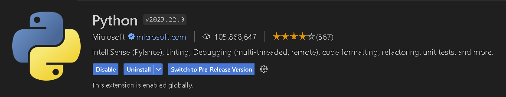

Which also installs:

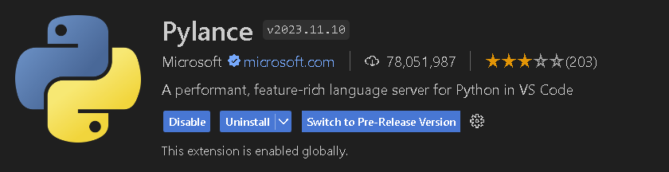

### Jupyter

Which also installs:

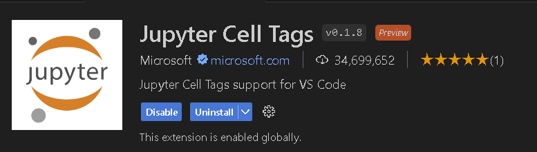

### Flake8

### Black Formater

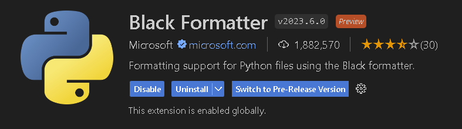

### MyPy Type Checker

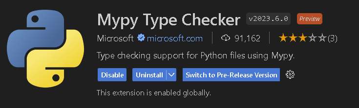

### Indent Rainbow

### Todo Tree

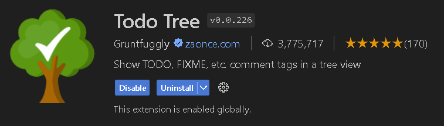

### Do not copy empty

### Error Lens

### One Dark Pro Theme (has a minimap)

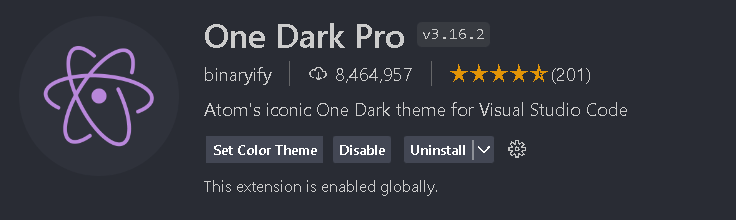

### Remote ssh (For our Cluster)

Which also installs:

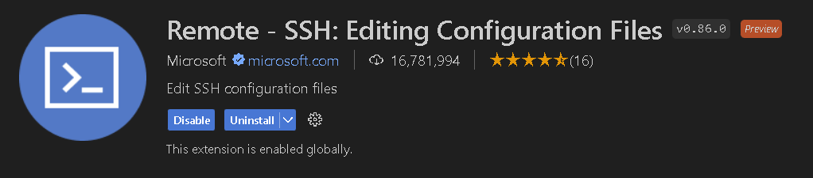

### C/C++ (C++ development / PyBind11)

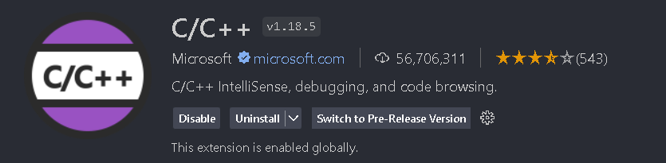

### C/C++ Extension Pack (C++ development / PyBind11)

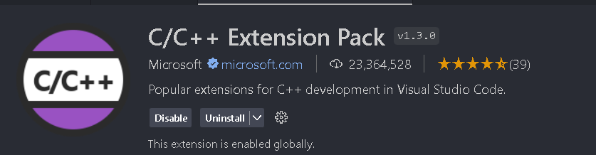

Which also installs:

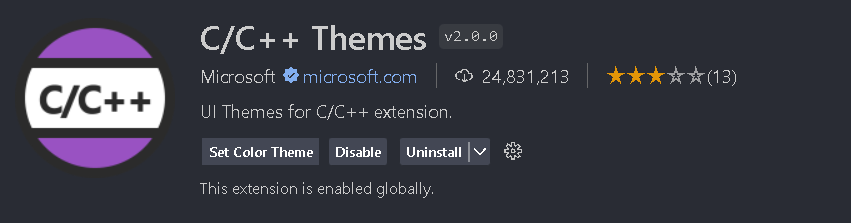

(I don't know who installs CMake and CMake tools)

### C/C++ Include Guard (C++ development / PyBind11)

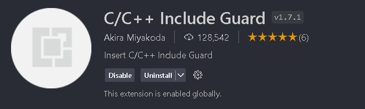

### Arduino (Arduino)

Which also installs:

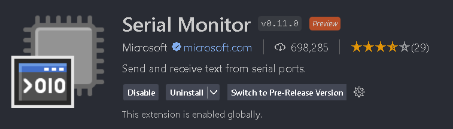

