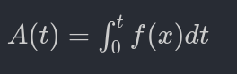
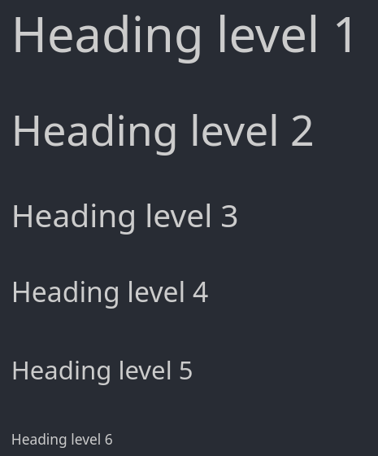
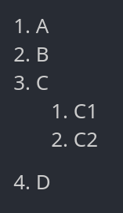
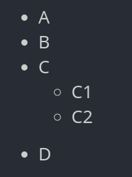

## Markdown

The VS Code Python cell have [markdown](https://www.markdownguide.org/basic-syntax/)!​

## Equations

```python
# %% [markdown]
# $A(t) = \int_0^t f(x) dt$
```



## Heading level 

```python
# %% [markdown]
# # Heading level 1
# ## Heading level 2
# ### Heading level 3
# #### Heading level 4
# ##### Heading level 5
# ###### Heading level 6
```



## Italic and Bold 

```python
# %% [markdown]
# *italic*
# **bold**
# ***both***
```


## List with numbers 

```python
# %% [markdown]
# 1. A
# 2. B
# 3. C
#       1. C1
#       2. C2
# 4. D
```



## List without numbers 

```python
# %% [markdown]
# * A
# * B
# * C
#   * C1
#   * C2
# * D
```



## Quotes

```python
# %% [markdown]
# > Quote level 1
# > > Quote level 2
```


