# Working remotely via ssh
{:.no_toc}

<nav markdown="1" class="toc-class">
* TOC
{:toc}
</nav>

## Top

Develop your code with [VS code remotely via a ssh connection](https://code.visualstudio.com/docs/remote/ssh).

Questions to [David Rotermund](mailto:davrot@uni-bremen.de)

## Installation

We need to install the Remote ssh extension


and these one too:


However, the second one should be installed automatically. 

## Configuration


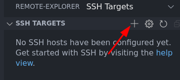

Now you can enter your user and computer name / ip address of the ssh target:


It asks where to store the information (i.e. ssh key). Select the one in your home directory: 

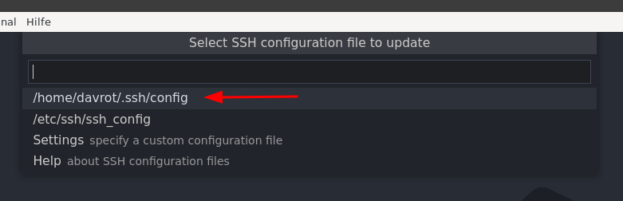

Now we can review the settings by clicking on "Open Config": 

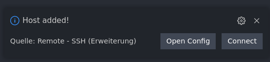

Or later by clicking here

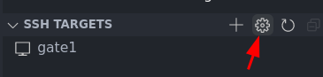

and then here

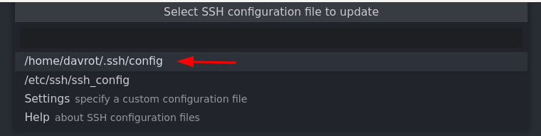

In the moment my configuration looks like:

```python
Host gate1
  HostName gate1
  User sshtest
```

Typical options:

* HostName gate1: Can the the name or the IP of your ssh target
* User sshtest : Well, here you need to put your user name in.
* ForwardX11 yes : Allows you to view graphical from the other side
* Port 22 : This is the default port for the ssh connection. This can be also something else.
* XAuthLocation C:\Progra~1/VcXSrv/xauth.exe : In the case of a Windows 10/11, you need a X Window Server if you need to stream graphical windows to your local machine. Under Linux this is typically included and can be ignored. Under Windows you need a X Server. I tested the [VcXsrv Windows X Server](https://sourceforge.net/projects/vcxsrv/) sucessfully. 

Notes about the Windows 10/11 X Window Server: Last time I tested it, I had to add two Windows environment variables (you find the button "Environment Variables..." under system properties). Add under the User Variable section (The upper box under Environment Variables)

**DISPLAY**

with

127.0.0.1:0.0

and 

**TMPDIR** 

will it with the value of variable TMP

Also also the X Server needs to run. Means you have to start it if you want to use it... I used Multi Window Mode.

## Using it

Select the connection you want:

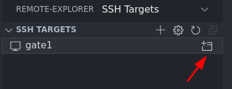

Enter your password:

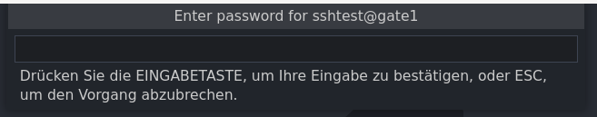

Be connected:

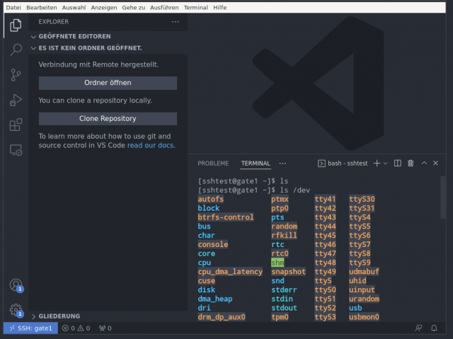

The first time you make a connection to a system, you need to check if all extensions are there. Typically they are not. Just scroll through the list of "installed" extensions and click on install... again...  

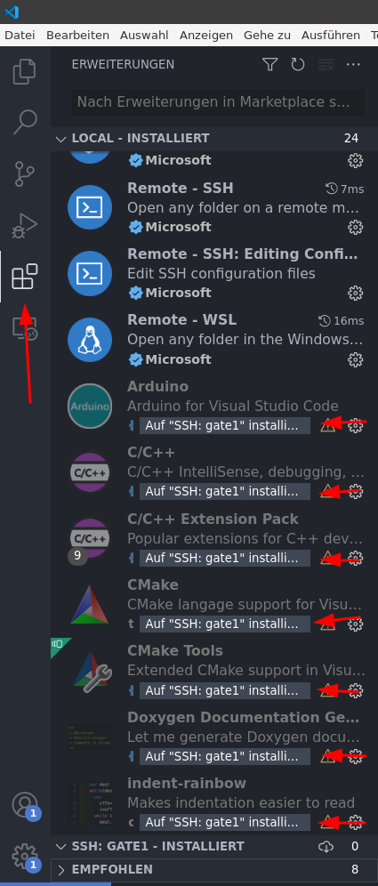

Side note: You can use the terminal under VS code as a terminal running on the ssh target computer. Or in other word: You can use the terminal to create directories via mkdir and move files around. Or even more complicated programs: 

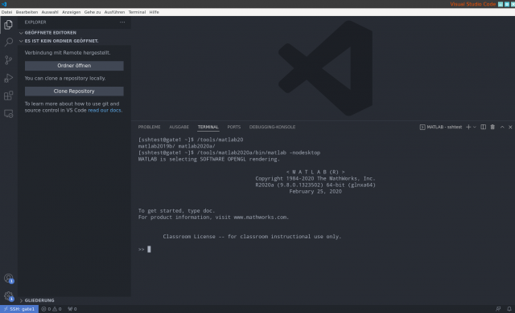

## Exchanging files between computers

There are many options to exchange files via ssh between computers. However [filezilla **client**](https://filezilla-project.org/download.php?type=client)!!! is a nice too that is available for Windows and Linux alike. Many Linux distributions have Filezilla already in their package repositories. 

First time you start it, you want to got into the connection settings:

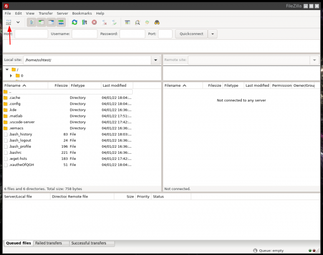

Create a new connection and name the parameter setting accordingly:

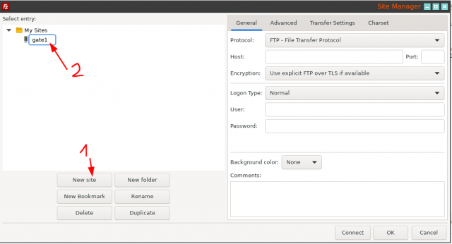

Now you need to put in the information about your ssh connection:

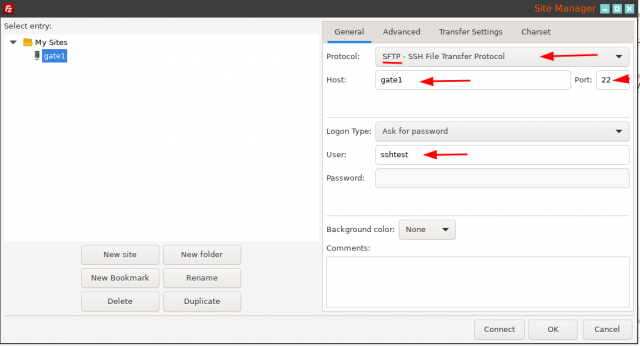

* Switch to SFTP
* Enter the hostname or ip
* Enter the port (default is 22)
* Enter your user name
* Add you password or better set to ask for password
 
Press OK to save the information.

Now the configured connection is available:

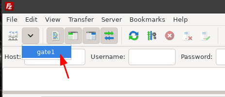

It will ask you for your password:

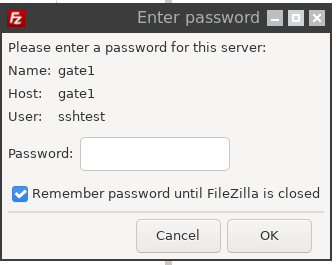

And the first time you connect to the ssh server (or in the case the server was replaced by the admin) you will get this message:

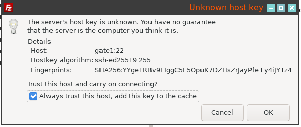

After OK you can shove files / directories from one side to the other.

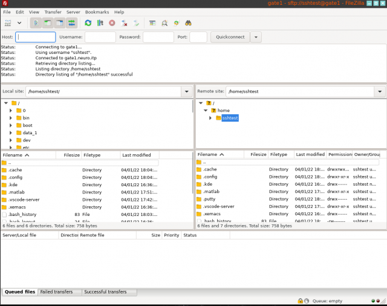

