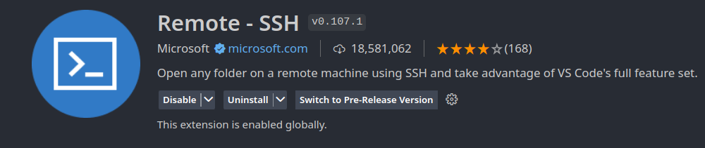
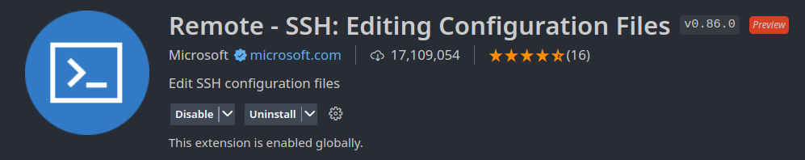

# Working remotely via ssh
{:.no_toc}

<nav markdown="1" class="toc-class">
* TOC
{:toc}
</nav>

## Top

Develop your code with [VS code remotely via a ssh connection](https://code.visualstudio.com/docs/remote/ssh).

Questions to [David Rotermund](mailto:davrot@uni-bremen.de)

## Installation

We need to install the Remote ssh extension



and these one too:



However, the second one should be installed automatically. 


```python
```
